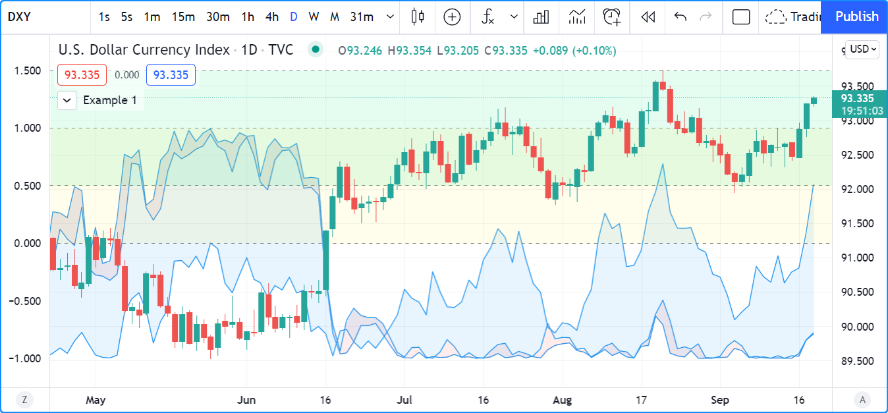
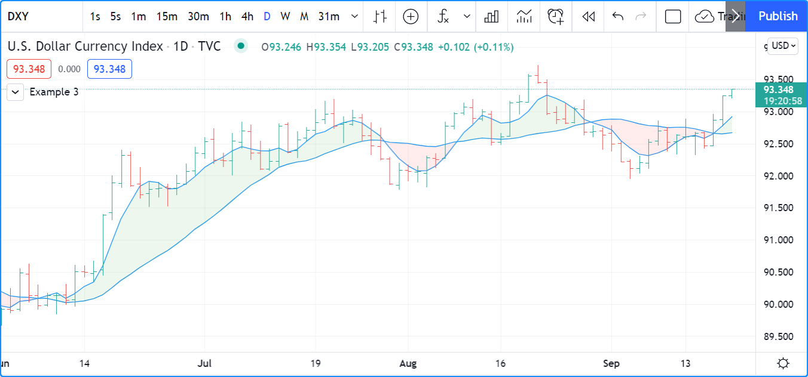
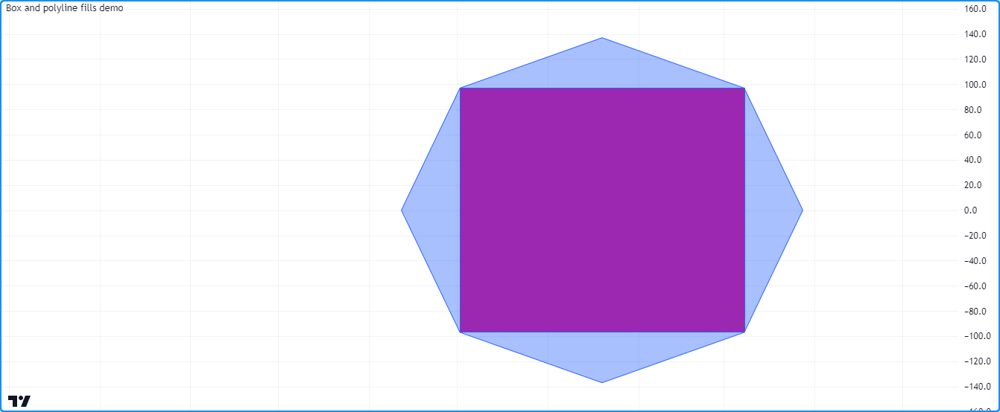

.. image:: /images/logo/Pine_Script_logo.svg
   :alt: Pine Script™ logo
   :target: https://www.tradingview.com/pine-script-docs/en/v5/Introduction.html
   :align: right
   :width: 100
   :height: 100

.. _PageFills:

Fills
=====

.. contents:: :local:
    :depth: 3

Introduction
------------

Some of Pine Script's visual outputs, including :ref:`plots <PageTypeSystem_Types_PlotAndHline>`, 
:ref:`hlines <PageTypeSystem_Types_PlotAndHline>`, :ref:`lines <PageLinesAndBoxes_Lines>`, 
:ref:`boxes <PageLinesAndBoxes_Boxes>`, and :ref:`polylines <PageLinesAndBoxes_Polylines>`, allow 
one to fill the chart space they occupy with colors. Three different mechanisms facilitate filling 
the space between such outputs:

- The `fill() <https://www.tradingview.com/pine-script-reference/v5/#fun_fill>`__ function fills the 
  space between two plots from `plot() <https://www.tradingview.com/pine-script-reference/v5/#fun_plot>`__ 
  calls or two horizontal lines (hlines) from `hline() <https://www.tradingview.com/pine-script-reference/v5/#fun_hline>`__ 
  calls with a specified color. 
- Objects of the `linefill <https://www.tradingview.com/pine-script-reference/v5/#type_linefill>`__ type fill 
  the space between `line <https://www.tradingview.com/pine-script-reference/v5/#type_line>`__ instances created with 
  `line.new() <https://www.tradingview.com/pine-script-reference/v5/#fun_line.new>`__.
- Other drawing types, namely :ref:`boxes <PageLinesAndBoxes_Boxes>` and :ref:`polylines <PageLinesAndBoxes_Polylines>`, 
  have built-in properties that allow the drawings to fill the visual spaces they occupy. 

.. _PageFills_PlotAndHlineFills:

\`plot()\` and \`hline()\` fills
--------------------------------

The `fill() <https://www.tradingview.com/pine-script-reference/v5/#fun_fill>`__ function fills the space between 
two plots or horizontal lines. It has the following two signatures:

.. code-block:: text

    fill(plot1, plot2, color, title, editable, show_last, fillgaps) → void
    fill(hline1, hline2, color, title, editable, fillgaps) → void

The ``plot1``, ``plot2``, ``hline1``, and ``hline2`` parameters accept :ref:`plot <PageTypeSystem_Types_PlotAndHline>` 
or :ref:`hline <PageTypeSystem_Types_PlotAndHline>` IDs returned by 
`plot() <https://www.tradingview.com/pine-script-reference/v5/#fun_plot>`__ and 
`hline() <https://www.tradingview.com/pine-script-reference/v5/#fun_hline>`__ function calls. 
The `fill() <https://www.tradingview.com/pine-script-reference/v5/#fun_fill>`__ function is the only built-in that 
can use these IDs. 

This simple example demonstrates how the `fill() <https://www.tradingview.com/pine-script-reference/v5/#fun_fill>`__ 
function works with :ref:`plot and hline <PageTypeSystem_Types_PlotAndHline>` IDs. It calls 
`plot() <https://www.tradingview.com/pine-script-reference/v5/#fun_plot>`__ and 
`hline() <https://www.tradingview.com/pine-script-reference/v5/#fun_hline>`__ three times to display arbitrary 
values on the chart. Each of these calls returns an ID, which the script assigns to variables for use in the 
`fill() <https://www.tradingview.com/pine-script-reference/v5/#fun_fill>`__ function. The values of ``p1``, 
``p2``, and ``p3`` are "plot" IDs, whereas ``h1``, ``h2``, and ``h3`` reference "hline" IDs:

.. code-block:: pine

    //@version=5
    indicator("Example 1")

    // Assign "plot" IDs to the `p1`, `p2`, and `p3` variables.
    p1 = plot(math.sin(high), "Sine of `high`")
    p2 = plot(math.cos(low), "Cosine of `low`")
    p3 = plot(math.sin(close), "Sine of `close`")
    // Fill the space between `p1` and `p2` with 90% transparent red.
    fill(p1, p3, color.new(color.red, 90), "`p1`-`p3` fill")
    // Fill the space between `p2` and `p3` with 90% transparent blue.
    fill(p2, p3, color.new(color.blue, 90), "`p2`-`p3` fill")

    // Assign "hline" IDs to the `h1`, `h2`, and `h3` variables.
    h1 = hline(0, "First level")
    h2 = hline(1.0, "Second level")
    h3 = hline(0.5, "Third level")
    h4 = hline(1.5, "Fourth level")
    // Fill the space between `h1` and `h2` with 90% transparent yellow.
    fill(h1, h2, color.new(color.yellow, 90), "`h1`-`h2` fill")
    // Fill the space between `h3` and `h4` with 90% transparent lime.
    fill(h3, h4, color.new(color.lime, 90), "`h3`-`h4` fill")

It's important to note that the `fill() <https://www.tradingview.com/pine-script-reference/v5/#fun_fill>`__ 
function requires *either* two "plot" IDs or two "hline" IDs. One *cannot* mix and match these types in the 
function call. Consequently, programmers will sometimes need to use 
`plot() <https://www.tradingview.com/pine-script-reference/v5/#fun_plot>`__ where they otherwise might have used 
`hline() <https://www.tradingview.com/pine-script-reference/v5/#fun_hline>`__ if they want to fill the space between 
a consistent level and a fluctuating series.

For example, this script calculates an ``oscillator`` based on the percentage distance between the chart's 
`close <https://www.tradingview.com/pine-script-reference/v5/#var_close>`__ price and a 10-bar 
`SMA <https://www.tradingview.com/pine-script-reference/v5/#fun_ta.sma>`__, then plots it on the chart pane. 
In this case, we wanted to fill the area between the ``oscillator`` and zero. Although we can display the zero level with 
`hline() <https://www.tradingview.com/pine-script-reference/v5/#fun_hline>`__ since its value does not change, we cannot 
pass a "plot" and "hline" ID to the `fill() <https://www.tradingview.com/pine-script-reference/v5/#fun_fill>`__ function. 
Therefore, we must use a `plot() <https://www.tradingview.com/pine-script-reference/v5/#fun_plot>`__ call for the level to 
allow the script to fill the space:

.. image:: images/Fills-Fill-2.png

.. code-block:: pine

    //@version=5
    indicator("Example 2")

    //@variable The 10-bar moving average of `close` prices.
    float ma = ta.sma(close, 10)
    //@variable The distance from the `ma` to the `close` price, as a percentage of the `ma`.
    float oscillator = 100 * (ma - close) / ma

    //@variable The ID of the `oscillator` plot for use in the `fill()` function.
    oscPlotID = plot(oscillator, "Oscillator")
    //@variable The ID of the zero level plot for use in the `fill()` function. 
    //          Requires a "plot" ID since the `fill()` function can't use "plot" and "hline" IDs at the same time.
    zeroPlotID = plot(0, "Zero level", color.silver, 1, plot.style_circles)

    // Filll the space between the `oscPlotID` and `zeroPlotID` with 90% transparent blue. 
    fill(oscPlotID, zeroPlotID, color.new(color.blue, 90), "Oscillator fill")

The ``color`` parameter of the `fill() <https://www.tradingview.com/pine-script-reference/v5/#fun_fill>`__ 
function accepts a "series color" argument, meaning the fill's color can change across chart bars. For example, 
this code fills the space between two moving average plots with 90% transparent green or red colors based on 
whether ``ma1`` is above ``ma2``:

.. code-block:: pine

    //@version=5
    indicator("Example 3", overlay = true)

    //@variable The 5-bar moving average of `close` prices.
    float ma1 = ta.sma(close, 5)
    //@variable The 20-bar moving average of `close` prices.
    float ma2 = ta.sma(close, 20)

    //@variable The 90% transparent color of the space between MA plots. Green if `ma1 > ma2`, red otherwise. 
    color fillColor = ma1 > ma2 ? color.new(color.green, 90) : color.new(color.red, 90) 

    //@variable The ID of the `ma1` plot for use in the `fill()` function.
    ma1PlotID = plot(ma1, "5-bar SMA")
    //@variable The ID of the `ma2` plot for use in the `fill()` function.
    ma2PlotID = plot(ma2, "20-bar SMA")

    // Fill the space between the `ma1PlotID` and `ma2PlotID` using the `fillColor`.
    fill(ma1PlotID, ma2PlotID, fillColor, "SMA plot fill")

.. _PageFills_LineFills:

Line fills
----------

While the `fill() <https://www.tradingview.com/pine-script-reference/v5/#fun_fill>`__ function allows a script 
to fill the space between two :ref:`plots or hlines <PageTypeSystem_Types_PlotAndHline>`, it does not work with 
`line <https://www.tradingview.com/pine-script-reference/v5/#type_line>`__ objects. When a script needs to fill 
the space between :ref:`lines <PageLinesAndBoxes_Lines>`, it requires a 
`linefill <https://www.tradingview.com/pine-script-reference/v5/#type_linefill>`__ object created by the 
`linefill.new() <https://www.tradingview.com/pine-script-reference/v5/#fun_linefill.new>`__ function. 
The function has the following signature:

.. code-block:: text

    linefill.new(line1, line2, color) → series linefill

The ``line1`` and ``line2`` parameters accept `line <https://www.tradingview.com/pine-script-reference/v5/#type_line>`__ IDs. 
These IDs determine the chart region that the `linefill <https://www.tradingview.com/pine-script-reference/v5/#type_linefill>`__ 
object will fill with its specified ``color``. A script can update the ``color`` property of a 
`linefill <https://www.tradingview.com/pine-script-reference/v5/#type_linefill>`__ ID returned by this function by calling 
`linefill.set_color() <https://www.tradingview.com/pine-script-reference/v5/#fun_linefill.set_color>`__ with the ID as its 
``id`` argument. 

The behavior of linefills depends on the lines they reference. Scripts cannot move linefills directly, as the lines that a 
linefill uses determine the space it will fill. To retrieve the IDs of the :ref:`lines <PageLinesAndBoxes_Lines>` 
referenced by a `linefill <https://www.tradingview.com/pine-script-reference/v5/#type_linefill>`__ object, use the 
`linefill.get_line1() <https://www.tradingview.com/pine-script-reference/v5/#fun_linefill.get_line1>`__ and 
`linefill.get_line2() <https://www.tradingview.com/pine-script-reference/v5/#fun_linefill.get_line2>`__ functions. 

Any pair of `line <https://www.tradingview.com/pine-script-reference/v5/#type_line>`__ instances can only have *one* 
`linefill <https://www.tradingview.com/pine-script-reference/v5/#type_linefill>`__ between them. Successive calls to 
`linefill.new() <https://www.tradingview.com/pine-script-reference/v5/#fun_linefill.new>`__ using the same ``line1`` and 
``line2`` arguments will create a new `linefill <https://www.tradingview.com/pine-script-reference/v5/#type_linefill>`__ ID 
that *replaces* the previous one associated with them.

The example below demonstrates a simple use case for linefills. The script calculates a ``pivotHigh`` and ``pivotLow`` 
series using the built-in `ta.pivothigh() <https://www.tradingview.com/pine-script-reference/v5/#fun_ta.pivothigh>`__ and 
`ta.pivotlow() <https://www.tradingview.com/pine-script-reference/v5/#fun_ta.pivotlow>`__ functions with constant ``leftbars`` 
and ``rightbars`` arguments. On the last confirmed historical bar, the script draws two extended lines. The first line connects 
the two most recent non-na ``pivotHigh`` values, and the second connects the most recent non-na ``pivotLow`` values. 

To emphasize the "channel" formed by these lines, the script fills the space between them using 
`linefill.new() <https://www.tradingview.com/pine-script-reference/v5/#fun_linefill.new>`__:

.. image:: images/Fills-Linefill-01.png

.. code-block:: pine

    //@version=5
    indicator("Linefill demo", "Channel", true)

    //@variable The number bars to the left of a detected pivot.
    int LEFT_BARS = 15
    //@variable The number bars to the right for pivot confirmation. 
    int RIGHT_BARS = 5

    //@variable The price of the pivot high point.
    float pivotHigh = ta.pivothigh(LEFT_BARS, RIGHT_BARS)
    //@variable The price of the pivot low point.
    float pivotLow = ta.pivotlow(LEFT_BARS, RIGHT_BARS)

    // Initialize the chart points the lines will use.
    var firstHighPoint  = chart.point.new(na, na, na)
    var secondHighPoint = chart.point.new(na, na, na)
    var firstLowPoint   = chart.point.new(na, na, na)
    var secondLowPoint  = chart.point.new(na, na, na)

    // Update the `firstHighPoint` and `secondHighPoint` when `pivotHigh` is not `na`.
    if not na(pivotHigh)
        firstHighPoint  := secondHighPoint
        secondHighPoint := chart.point.from_index(bar_index - RIGHT_BARS, pivotHigh)
    // Update the `firstLowPoint` and `secondLowPoint` when `pivotlow` is not `na`.
    if not na(pivotLow)
        firstLowPoint  := secondLowPoint
        secondLowPoint := chart.point.from_index(bar_index - RIGHT_BARS, pivotLow)

    if barstate.islastconfirmedhistory
        //@variable An extended line that passes through the `firstHighPoint` and `secondHighPoint`.
        line pivotHighLine = line.new(firstHighPoint, secondHighPoint, extend = extend.right)
        //@variable An extended line that passes through the `firstLowPoint` and `secondLowPoint`.
        line pivotLowLine = line.new(firstLowPoint, secondLowPoint, extend = extend.right)
        //@variable The color of the space between the lines.
        color fillColor = switch
            secondHighPoint.price > firstHighPoint.price and secondLowPoint.price > firstLowPoint.price => color.lime
            secondHighPoint.price < firstHighPoint.price and secondLowPoint.price < firstLowPoint.price => color.red
            =>                                                                                             color.silver
        //@variable A linefill that colors the space between the `pivotHighLine` and `pivotLowLine`.
        linefill channelFill = linefill.new(pivotHighLine, pivotLowLine, color.new(fillColor, 90))

.. _PageFills_BoxAndPolylineFills:

Box and polyline fills
----------------------

The `box <https://www.tradingview.com/pine-script-reference/v5/#type_box>`__ and 
`polyline <https://www.tradingview.com/pine-script-reference/v5/#type_polyline>`__ types allow scripts to draw 
geometric shapes and other formations on the chart. Scripts create :ref:`boxes <PageLinesAndBoxes_Boxes>` and 
:ref:`polylines <PageLinesAndBoxes_Polylines>` with the `box.new() <https://www.tradingview.com/pine-script-reference/v5/#fun_box.new>`__ 
and `polyline.new() <https://www.tradingview.com/pine-script-reference/v5/#fun_polyline.new>`__ functions, which include 
parameters that allow the drawings to fill their visual spaces. 

To fill the space inside the borders of a `box <https://www.tradingview.com/pine-script-reference/v5/#type_box>`__ with a 
specified color, include a ``bgcolor`` argument in the `box.new() <https://www.tradingview.com/pine-script-reference/v5/#fun_box.new>`__ 
function. To fill a polyline's visual space, pass a ``fill_color`` argument to the 
`polyline.new() <https://www.tradingview.com/pine-script-reference/v5/#fun_polyline.new>`__ function.

For example, this script draws an octagon with a `polyline <https://www.tradingview.com/pine-script-reference/v5/#type_polyline>`__ 
and an inscribed rectangle with a `box <https://www.tradingview.com/pine-script-reference/v5/#type_box>`__ on the last confirmed 
historical bar. It determines the size of the drawings using the value from the ``radius`` variable, which corresponds to 
approximately one-fourth of the number of bars visible on the chart. We included ``fill_color = color.new(color.blue, 60)`` 
in the `polyline.new() <https://www.tradingview.com/pine-script-reference/v5/#fun_polyline.new>`__ call to fill the octagon with a 
translucent blue color, and we used ``bgcolor = color.purple`` in the 
`box.new() <https://www.tradingview.com/pine-script-reference/v5/#fun_box.new>`__ call to fill the inscribed rectangle 
with opaque purple:

.. code-block:: pine

    //@version=5
    indicator("Box and polyline fills demo")

    //@variable The number of visible chart bars, excluding the leftmost and rightmost bars.
    var int barCount = 0
    if time > chart.left_visible_bar_time and time < chart.right_visible_bar_time
        barCount += 1

    //@variable The approximate radius used to calculate the octagon and rectangle coordinates.
    int radius = math.ceil(barCount / 4)
    
    if barstate.islastconfirmedhistory
        //@variable An array of chart points. The polyline uses all points in this array, but the box only needs two.
        array<chart.point> points = array.new<chart.point>()
        //@variable The counterclockwise angle of each point, in radians. Updates on each loop iteration. 
        float angle = 0.0
        //@variable The radians to add to the `angle` on each loop iteration.
        float increment = 0.25 * math.pi
        // Loop 8 times to calculate octagonal points.
        for i = 0 to 7
            //@variable The point's x-coordinate (bar offset).
            int x = int(math.round(math.cos(angle) * radius))
            //@variable The point's y-coordinate.
            float y = math.round(math.sin(angle) * radius)
            // Push a new chart point into the `points` array and increase the `angle`.
            points.push(chart.point.from_index(bar_index - radius + x, y))
            angle += increment
        // Create a closed polyline to draw the octagon and fill it with translucent blue. 
        polyline.new(points, closed = true, fill_color = color.new(color.blue, 60))
        // Create a box for the rectangle using index 3 and 7 for the top-left and bottom-right corners, 
        // and fill it with opaque purple. 
        box.new(points.get(3), points.get(7), bgcolor = color.purple)

See this manual's :ref:`Lines and boxes <PageLinesAndBoxes>` page to learn more about working with these types. 

.. image:: /images/logo/TradingView_Logo_Block.svg
    :width: 200px
    :align: center
    :target: https://www.tradingview.com/
