.. image:: /images/logo/Pine_Script_logo.svg
   :alt: Pine Script™ logo
   :target: https://www.tradingview.com/pine-script-docs/en/v5/Introduction.html
   :align: right
   :width: 100
   :height: 100

.. _PageOtherTimeframesAndData:

Other timeframes and data
=========================

.. contents:: :local:
    :depth: 3

Introduction
------------

Pine Script™ allows users to request data from sources and contexts other than those their charts use. 
The functions we present on this page can fetch data from a variety of alternative sources:

- :ref:`request.security() <PageOtherTimeframesAndData_RequestSecurity>` 
  retrieves data from another symbol, timeframe, or other context.
- :ref:`request.security_lower_tf() <PageOtherTimeframesAndData_RequestSecurityLowerTf>` 
  retrieves *intrabar* data, i.e., data from a timeframe lower than the chart timeframe.
- :ref:`request.currency_rate() <PageOtherTimeframesAndData_RequestCurrencyRate>` 
  requests a *daily rate* to convert a value expressed in one currency to another.
- :ref:`request.dividends(), request.splits(), and request.earnings() <PageOtherTimeframesAndData_RequestDividendsRequestSplitsAndRequestEarnings>`
  respectively retrieve information about an issuing company's dividends, splits, and earnings.
- :ref:`request.quandl() <PageOtherTimeframesAndData_RequestQuandl>` retrieves information 
  from `NASDAQ Data Link <https://data.nasdaq.com/>`__ (formerly Quandl).
- :ref:`request.financial() <PageOtherTimeframesAndData_RequestFinancial>` retrieves 
  financial data from `FactSet <https://www.factset.com/>`__.
- :ref:`request.economic() <PageOtherTimeframesAndData_RequestEconomic>` retrieves 
  economic and industry data.
- :ref:`request.seed() <PageOtherTimeframesAndData_RequestSeed>` retrieves data from a 
  *user-maintained* GitHub repository.

.. note::
   Throughout this page, and in other parts of our documentation that discuss ``request.*()`` functions, 
   we often use the term *"context"* to describe the ticker ID, timeframe, and any modifications (price 
   adjustments, session settings, non-standard chart types, etc.) that apply to a chart or 
   the data retrieved by a script.

These are the signatures of the functions in the ``request.*`` namespace:

.. code-block:: text

    request.security(symbol, timeframe, expression, gaps, lookahead, ignore_invalid_symbol, currency) → series <type>

    request.security_lower_tf(symbol, timeframe, expression, ignore_invalid_symbol, currency, ignore_invalid_timeframe) → array<type>

    request.currency_rate(from, to, ignore_invalid_currency) → series float

    request.dividends(ticker, field, gaps, lookahead, ignore_invalid_symbol, currency) → series float

    request.splits(ticker, field, gaps, lookahead, ignore_invalid_symbol) → series float

    request.earnings(ticker, field, gaps, lookahead, ignore_invalid_symbol, currency) → series float

    request.quandl(ticker, gaps, index, ignore_invalid_symbol) → series float

    request.financial(symbol, financial_id, period, gaps, ignore_invalid_symbol, currency) → series float

    request.economic(country_code, field, gaps, ignore_invalid_symbol) → series float

    request.seed(source, symbol, expression, ignore_invalid_symbol) → series <type>

The ``request.*()`` family of functions has numerous potential applications. Throughout this page, we will discuss in detail 
these functions and some of their typical use cases.

.. note::
   Users can also allow compatible scripts to evaluate their scopes in other contexts without requiring 
   ``request.*()`` functions by using the ``timeframe`` parameter of the 
   `indicator() <https://www.tradingview.com/pine-script-reference/v5/#fun_indicator>`__ declaration statement. 

.. _PageOtherTimeframesAndData_CommonCharacteristics:

Common characteristics
----------------------

Many functions in the ``request.*()`` namespace share some common properties and parameters. 
Before we explore each function in depth, let's familiarize ourselves with these characteristics.

.. _PageOtherTimeframesAndData_CommonCharacteristics_Usage:

Usage
^^^^^

All ``request.*()`` functions return "series" results, which means they can produce different values on 
every bar. However, most ``request.*()`` function parameters require "const", "input", or "simple" arguments.

In essence, Pine Script™ must determine the values of most arguments passed into a ``request.*()`` function 
upon compilation of the script or on the first chart bar, depending on the :ref:`qualified type <PageTypeSystem_Qualifiers>` 
that each parameter accepts, and these values cannot change throughout the execution of the script. 
The only exception is the ``expression`` parameter in 
`request.security() <https://www.tradingview.com/pine-script-reference/v5/#fun_request.security>`__, 
`request.security_lower_tf() <https://www.tradingview.com/pine-script-reference/v5/#fun_request.security_lower_tf>`__, 
and `request.seed() <https://www.tradingview.com/pine-script-reference/v5/#fun_request.seed>`__, 
which accepts "series" arguments.

Calls to ``request.*()`` functions execute on every chart bar, and scripts cannot selectively deactivate them 
throughout their execution. Scripts cannot call ``request.*()`` functions within the local scopes of 
:ref:`conditional structures <PageConditionalStructures>`, :ref:`loops <PageLoops>`, or functions and 
methods exported by :ref:`Libraries <PageLibraries>`, but they can use such 
function calls within the bodies of non-exported :ref:`user-defined functions <PageUserDefinedFunctions>` and 
:ref:`methods <PageMethods_UserDefinedMethods>`.

When using any ``request.*()`` functions within a script, runtime performance is an important consideration.  
These functions can have a sizable impact on script performance. While scripts can contain a maximum of 40 
calls to the ``request.*()`` namespace, users should strive to minimize the number of calls in their scripts 
to keep resource consumption as low as possible. For more information on the limitations of these functions, see 
:ref:`this <PageLimitations_RequestCalls>` section of our User Manual's page on Pine's :ref:`limitations <PageLimitations>`.

.. _PageOtherTimeframesAndData_CommonCharacteristics_Gaps:

\`gaps\`
^^^^^^^^

When using a ``request.*()`` function to retrieve data from another context, the data may not come in on each 
new bar as it would with the current chart. The ``gaps`` parameter of a ``request.*()`` function allows 
users to control how the function responds to nonexistent values in the requested series.

.. note::
   When using the `indicator() <https://www.tradingview.com/pine-script-reference/v5/#fun_indicator>`__ function 
   to evaluate a script in another context, the ``timeframe_gaps`` parameter specifies how it handles nonexistent 
   values. The parameter is similar to the ``gaps`` parameter for ``request.*()`` functions. 

Suppose we have a script that requests hourly data for the chart's symbol with 
`request.security() <https://www.tradingview.com/pine-script-reference/v5/#fun_request.security>`__ executing on 
an 1-minute chart. In this case, the function call will only return new values on the 1-minute bars that cover the 
opening/closing times of the symbol's hourly bars. On other chart bars, we can decide whether the function will 
return `na <https://www.tradingview.com/pine-script-reference/v5/#var_na>`__ values or the last available values 
via the ``gaps`` parameter.

When the ``gaps`` parameter uses `barmerge.gaps_on <https://www.tradingview.com/pine-script-reference/v5/#var_barmerge.gaps_on>`__, 
the function will return `na <https://www.tradingview.com/pine-script-reference/v5/#var_na>`__ results on all chart bars 
where new data isn't yet confirmed from the requested context. Otherwise, when the parameter uses 
`barmerge.gaps_off <https://www.tradingview.com/pine-script-reference/v5/#var_barmerge.gaps_off>`__, the function 
will fill the gaps in the requested data with the last confirmed values on historical bars and the most recent developing 
values on realtime bars. 

The script below demonstrates the difference in behavior by :ref:`plotting <PagePlots>` the results from two 
`request.security() <https://www.tradingview.com/pine-script-reference/v5/#fun_request.security>`__ calls that 
fetch the `close <https://www.tradingview.com/pine-script-reference/v5/#var_close>`__ price of the current symbol 
from the hourly timeframe on a 1-minute chart. The first call uses ``gaps = barmerge.gaps_off`` and the second 
uses ``gaps = barmerge.gaps_on``: 

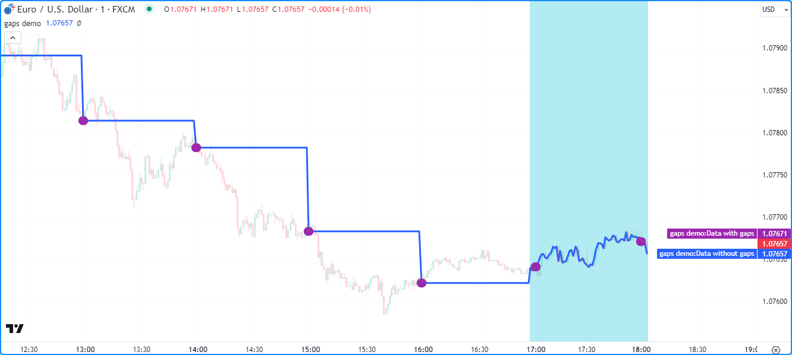

.. code-block:: pine

    //@version=5
    indicator("gaps demo", overlay = true)

    //@variable The `close` requested from the hourly timeframe without gaps.
    float dataWithoutGaps = request.security(syminfo.tickerid, "60", close, gaps = barmerge.gaps_off)
    //@variable The `close` requested from the hourly timeframe with gaps.
    float dataWithGaps = request.security(syminfo.tickerid, "60", close, gaps = barmerge.gaps_on)

    // Plot the requested data.
    plot(dataWithoutGaps, "Data without gaps", color.blue, 3, plot.style_linebr)
    plot(dataWithGaps, "Data with gaps", color.purple, 15, plot.style_linebr)

    // Highlight the background for realtime bars.
    bgcolor(barstate.isrealtime ? color.new(color.aqua, 70) : na, title = "Realtime bar highlight")

Note that:
 - `barmerge.gaps_off <https://www.tradingview.com/pine-script-reference/v5/#var_barmerge.gaps_off>`__ 
   is the default value for the ``gaps`` parameter in all applicable ``request.*()`` functions.
 - The script plots the requested series as lines with breaks 
   (`plot.style_linebr <https://www.tradingview.com/pine-script-reference/v5/#var_plot.style_linebr>`__), 
   which don't bridge over `na <https://www.tradingview.com/pine-script-reference/v5/#var_na>`__ values as 
   the default style (`plot.style_line <https://www.tradingview.com/pine-script-reference/v5/#var_plot.style_line>`__) does.
 - When using `barmerge.gaps_off <https://www.tradingview.com/pine-script-reference/v5/#var_barmerge.gaps_off>`__, 
   the `request.security() <https://www.tradingview.com/pine-script-reference/v5/#fun_request.security>`__ function returns 
   the last confirmed `close <https://www.tradingview.com/pine-script-reference/v5/#var_close>`__ from the hourly timeframe 
   on all historical bars. When running on *realtime bars* (the bars with the 
   `color.aqua <https://www.tradingview.com/pine-script-reference/v5/#var_color.aqua>`__ background in this example), 
   it returns the symbol's current `close <https://www.tradingview.com/pine-script-reference/v5/#var_close>`__ value, 
   regardless of confirmation. For more information, see the 
   :ref:`Historical and realtime behavior <PageOtherTimeframesAndData_HistoricalAndRealtimeBehavior>` section of this page.

.. _PageOtherTimeframesAndData_CommonCharacteristics_IgnoreInvalidSymbol:

\`ignore_invalid_symbol\`
^^^^^^^^^^^^^^^^^^^^^^^^^

The ``ignore_invalid_symbol`` parameter of ``request.*()`` functions determines how a function will handle 
invalid data requests, e.g.:

- Using a ``request.*()`` function with a nonexistent ticker ID as the ``symbol/ticker`` parameter.
- Using `request.financial() <https://www.tradingview.com/pine-script-reference/v5/#fun_request.financial>`__ 
  to retrieve information that does not exist for the specified ``symbol`` or ``period``.
- Using `request.economic() <https://www.tradingview.com/pine-script-reference/v5/#fun_request.economic>`__ 
  to request a ``field`` that doesn't exist for a ``country_code``.

A ``request.*()`` function call will produce a *runtime error* and halt the execution of the script when making 
an erroneous request if its ``ignore_invalid_symbol`` parameter is ``false``. When this parameter's value is 
``true``, the function will return `na <https://www.tradingview.com/pine-script-reference/v5/#var_na>`__ values 
in such a case instead of raising an error.

This example uses ``request.*()`` calls within a :ref:`user-defined function <PageUserDefinedFunctions>` to 
retrieve data for estimating an instrument's market capitalization (market cap). The user-defined ``calcMarketCap()`` 
function calls `request.financial() <https://www.tradingview.com/pine-script-reference/v5/#fun_request.financial>`__ 
to retrieve the total shares outstanding for a symbol and 
`request.security() <https://www.tradingview.com/pine-script-reference/v5/#fun_request.security>`__ to retrieve a tuple 
containing the symbol's `close <https://www.tradingview.com/pine-script-reference/v5/#var_close>`__ price and 
`currency <https://www.tradingview.com/pine-script-reference/v5/#var_syminfo.currency>`__. We've included 
``ignore_invalid_symbol = true`` in both of these ``request.*()`` calls to prevent runtime errors for invalid requests.

The script displays a `formatted string <https://www.tradingview.com/pine-script-reference/v5/#fun_str.format>`__ 
representing the symbol's estimated market cap value and currency in a 
`table <https://www.tradingview.com/pine-script-reference/v5/#type_table>`__ on the chart and uses a 
`plot <https://www.tradingview.com/pine-script-reference/v5/#fun_plot>`__ to visualize the ``marketCap`` history:

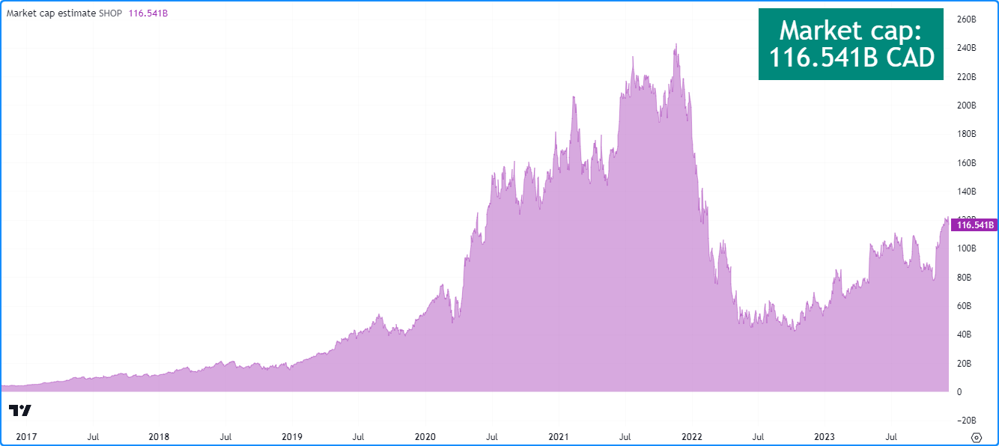

.. code-block:: pine

    //@version=5
    indicator("ignore_invalid_symbol demo", "Market cap estimate", format = format.volume)

    //@variable The symbol to request data from.
    string symbol = input.symbol("TSX:SHOP", "Symbol")

    //@function Estimates the market capitalization of the specified `tickerID` if the data exists.
    calcMarketCap(simple string tickerID) =>
        //@variable The quarterly total shares outstanding for the `tickerID`. Returns `na` when the data isn't available.
        float tso = request.financial(tickerID, "TOTAL_SHARES_OUTSTANDING", "FQ", ignore_invalid_symbol = true)
        //@variable The `close` price and currency for the `tickerID`. Returns `[na, na]` when the `tickerID` is invalid.
        [price, currency] = request.security(
             tickerID, timeframe.period, [close, syminfo.currency], ignore_invalid_symbol = true
         )
        // Return a tuple containing the market cap estimate and the quote currency.
        [tso * price, currency]

    //@variable A `table` object with a single cell that displays the `marketCap` and `quoteCurrency`.
    var table infoTable = table.new(position.top_right, 1, 1)
    // Initialize the table's cell on the first bar.
    if barstate.isfirst
        table.cell(infoTable, 0, 0, "", text_color = color.white, text_size = size.huge, bgcolor = color.teal)

    // Get the market cap estimate and quote currency for the `symbol`.
    [marketCap, quoteCurrency] = calcMarketCap(symbol)

    //@variable The formatted text displayed inside the `infoTable`.
    string tableText = str.format("Market cap:\n{0} {1}", str.tostring(marketCap, format.volume), quoteCurrency)
    // Update the `infoTable`.
    table.cell_set_text(infoTable, 0, 0, tableText)

    // Plot the `marketCap` value.
    plot(marketCap, "Market cap", color.new(color.purple, 60), style = plot.style_area)

Note that:
 - The ``calcMarketCap()`` function will only return values on valid instruments with total shares outstanding data, 
   such as the one we've selected for this example. It will return a market cap value of 
   `na <https://www.tradingview.com/pine-script-reference/v5/#var_na>`__ on others that don't have financial data, 
   including forex, crypto, and derivatives.
 - Not all issuing companies publish quarterly financial reports. If the ``symbol``'s issuing company doesn't report on 
   a quarterly basis, change the "FQ" value in this script to the company's minimum reporting period. See the 
   :ref:`request.financial() <PageOtherTimeframesAndData_RequestFinancial>` section for more information.
 - We've used `format.volume <https://www.tradingview.com/pine-script-reference/v5/#var_format.volume>`__ in the 
   `indicator() <https://www.tradingview.com/pine-script-reference/v5/#fun_indicator>`__ and 
   `str.tostring() <https://www.tradingview.com/pine-script-reference/v5/#fun_str.tostring>`__ calls, which specify that 
   the y-axis of the chart pane represents volume-formatted values and the "string" representation of the ``marketCap`` value 
   shows as volume-formatted text.
 - This script creates a `table <https://www.tradingview.com/pine-script-reference/v5/#type_table>`__ and initializes its 
   cell on the `first chart bar <https://www.tradingview.com/pine-script-reference/v5/#var_barstate.isfirst>`__, then 
   `updates the cell's text <https://www.tradingview.com/pine-script-reference/v5/#fun_table.cell_set_text>`__ on subsequent 
   bars. To learn more about working with tables, see the :ref:`Tables <PageTables>` page of our User Manual.

.. _PageOtherTimeframesAndData_CommonCharacteristics_Currency:

\`currency\`
^^^^^^^^^^^^

The ``currency`` parameter of a ``request.*()`` function allows users to specify the currency of the requested data. 
When this parameter's value differs from the `syminfo.currency <https://www.tradingview.com/pine-script-reference/v5/#var_syminfo.currency>`__ 
of the requested context, the function will convert the requested values to express them in the specified ``currency``. 
This parameter can accept a built-in variable from the ``currency.*`` namespace, such as 
`currency.JPY <https://www.tradingview.com/pine-script-reference/v5/#var_currency.JPY>`__, or a "string" representing the 
`ISO 4217 currency code <https://en.wikipedia.org/wiki/ISO_4217#Active_codes>`__ (e.g., "JPY").

The conversion rate between the `syminfo.currency <https://www.tradingview.com/pine-script-reference/v5/#var_syminfo.currency>`__ 
of the requested data and the specified ``currency`` depends on the corresponding *"FX_IDC"* daily rate from the previous day. 
If no available instrument provides the conversion rate directly, the function will use the value from a 
`spread symbol <https://www.tradingview.com/support/solutions/43000502298/>`__ to derive the rate.

.. note::
   Not all ``request.*()`` function calls return values expressed as a currency amount. Therefore, currency conversion is *not* 
   always necessary. For example, some series returned by 
   `request.financial() <https://www.tradingview.com/pine-script-reference/v5/#fun_request.financial>`__ are expressed in units 
   other than currency, such as the "PIOTROSKI_F_SCORE" and "NUMBER_OF_EMPLOYEES" metrics. It is up to programmers to determine 
   when currency conversion is appropriate in their data requests. 

.. _PageOtherTimeframesAndData_CommonCharacteristics_Lookahead:

\`lookahead\`
^^^^^^^^^^^^^

The ``lookahead`` parameter in `request.security() <https://www.tradingview.com/pine-script-reference/v5/#fun_request.security>`__, 
`request.dividends() <https://www.tradingview.com/pine-script-reference/v5/#fun_request.dividends>`__, 
`request.splits() <https://www.tradingview.com/pine-script-reference/v5/#fun_request.splits>`__, and 
`request.earnings() <https://www.tradingview.com/pine-script-reference/v5/#fun_request.earnings>`__ specifies the lookahead behavior 
of the function call. Its default value is `barmerge.lookahead_off <https://www.tradingview.com/pine-script-reference/v5/#var_barmerge.lookahead_off>`__.

When requesting data from a higher-timeframe (HTF) context, the ``lookahead`` value determines whether the function can request 
values from times *beyond* those of the historical bars it executes on. In other words, the ``lookahead`` value determines whether 
the requested data may contain *lookahead bias* on historical bars.

When requesting data from a lower-timeframe (LTF) context, the ``lookahead`` parameter determines whether the function requests 
values from the first or last *intrabar* (LTF bar) on each chart bar.

**Programmers should exercise extreme caution when using lookahead in their scripts, namely when requesting data from higher timeframes.** 
When using `barmerge.lookahead_on <https://www.tradingview.com/pine-script-reference/v5/#var_barmerge.lookahead_on>`__ as the ``lookahead`` 
value, ensure that it does not compromise the integrity of the script's logic by leaking *future* data into historical chart bars.

The following scenarios are cases where enabling lookahead is acceptable in a ``request.*()`` call:

- The ``expression`` in `request.security() <https://www.tradingview.com/pine-script-reference/v5/#fun_request.security>`__ 
  references a series with a *historical offset* (e.g., ``close[1]``), which prevents the function from requesting future 
  values that it would *not* have access to on a realtime basis.
- The specified ``timeframe`` in the call is the same as the chart the script executes on, i.e., 
  `timeframe.period <https://www.tradingview.com/pine-script-reference/v5/#var_timeframe.period>`__.
- The function call requests data from an intrabar timeframe, i.e., a timeframe smaller than the 
  `timeframe.period <https://www.tradingview.com/pine-script-reference/v5/#var_timeframe.period>`__. 
  See :ref:`this section <PageOtherTimeframesAndData_RequestSecurity_Timeframes_LowerTimeframes>` for more information.

.. note::
   Using `request.security() <https://www.tradingview.com/pine-script-reference/v5/#fun_request.security>`__ to leak 
   future data into the past is **misleading** and **not allowed** in script publications. While your script's results 
   on historical bars may look great due to its seemingly "magical" acquisition of prescience (which it will not be 
   able to reproduce on realtime bars), you will be misleading yourself and the users of your script. If you 
   :ref:`publish your script <PagePublishing>` to share it with others, ensure you **do not mislead users** by 
   accessing future information on historical bars. 

This example demonstrates how the ``lookahead`` parameter affects the behavior of higher-timeframe data requests and why enabling 
lookahead in `request.security() <https://www.tradingview.com/pine-script-reference/v5/#fun_request.security>`__ without offsetting 
the ``expression`` is misleading. The script calls `request.security() <https://www.tradingview.com/pine-script-reference/v5/#fun_request.security>`__ 
to get the HTF `high <https://www.tradingview.com/pine-script-reference/v5/#var_high>`__ price for the current chart's symbol in 
three different ways and :ref:`plots <PagePlots>` the resulting series on the chart for comparison.

The first call uses `barmerge.lookahead_off <https://www.tradingview.com/pine-script-reference/v5/#var_barmerge.lookahead_off>`__ 
(default), and the others use `barmerge.lookahead_on <https://www.tradingview.com/pine-script-reference/v5/#var_barmerge.lookahead_on>`__. 
However, the third `request.security() <https://www.tradingview.com/pine-script-reference/v5/#fun_request.security>`__ call also 
*offsets* its ``expression`` using the history-referencing operator `[] <https://www.tradingview.com/pine-script-reference/v5/#op_[]>`__ 
to avoid leaking future data into the past. 

As we see on the chart, the `plot <https://www.tradingview.com/pine-script-reference/v5/#fun_plot>`__ of the series requested using 
`barmerge.lookahead_on <https://www.tradingview.com/pine-script-reference/v5/#var_barmerge.lookahead_on>`__ without an offset 
(`fuchsia <https://www.tradingview.com/pine-script-reference/v5/#var_color.fuchsia>`__ line) shows final HTF 
`high <https://www.tradingview.com/pine-script-reference/v5/#var_high>`__ prices *before* they're actually available on historical 
bars, whereas the other two calls do not:

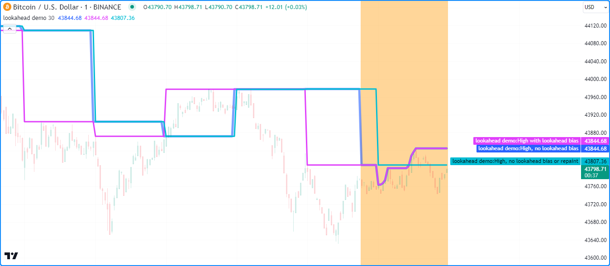

.. code-block:: pine

    //@version=5
    indicator("lookahead demo", overlay = true)

    //@variable The timeframe to request the data from.
    string timeframe = input.timeframe("30", "Timeframe")

    //@variable The requested `high` price from the current symbol on the `timeframe` without lookahead bias.
    //          On realtime bars, it returns the current `high` of the `timeframe`.
    float lookaheadOff = request.security(syminfo.tickerid, timeframe, high, lookahead = barmerge.lookahead_off)

    //@variable The requested `high` price from the current symbol on the `timeframe` with lookahead bias.
    //          Returns values that should NOT be accessible yet on historical bars.
    float lookaheadOn = request.security(syminfo.tickerid, timeframe, high, lookahead = barmerge.lookahead_on)

    //@variable The requested `high` price from the current symbol on the `timeframe` without lookahead bias or repainting.
    //          Behaves the same on historical and realtime bars.
    float lookaheadOnOffset = request.security(syminfo.tickerid, timeframe, high[1], lookahead = barmerge.lookahead_on)

    // Plot the values.
    plot(lookaheadOff, "High, no lookahead bias", color.new(color.blue, 40), 5)
    plot(lookaheadOn, "High with lookahead bias", color.fuchsia, 3)
    plot(lookaheadOnOffset, "High, no lookahead bias or repaint", color.aqua, 3)
    // Highlight the background on realtime bars.
    bgcolor(barstate.isrealtime ? color.new(color.orange, 60) : na, title = "Realtime bar highlight")

Note that:
 - The series requested using `barmerge.lookahead_off <https://www.tradingview.com/pine-script-reference/v5/#var_barmerge.lookahead_off>`__ 
   has a new historical value at the *end* of each HTF period, and both series requested using 
   `barmerge.lookahead_on <https://www.tradingview.com/pine-script-reference/v5/#var_barmerge.lookahead_on>`__ have new 
   historical data at the *start* of each period. 
 - On realtime bars, the plot of the series without lookahead (`blue <https://www.tradingview.com/pine-script-reference/v5/#var_color.blue>`__) 
   and the series with lookahead and no historical offset (`fuchsia <https://www.tradingview.com/pine-script-reference/v5/#var_color.fuchsia>`__) 
   show the *same value* (i.e., the HTF period's unconfirmed `high <https://www.tradingview.com/pine-script-reference/v5/#var_high>`__ 
   price), as no data exists beyond those points to leak into the past. Both of these plots will *repaint* their results 
   after restarting the script's execution, as `realtime <https://www.tradingview.com/pine-script-reference/v5/#var_barstate.isrealtime>`__ 
   bars will become `historical <https://www.tradingview.com/pine-script-reference/v5/#var_barstate.ishistory>`__ bars. 
 - The series that uses lookahead and a historical offset (`aqua <https://www.tradingview.com/pine-script-reference/v5/#var_color.aqua>`__) 
   does not repaint its values, as it always references the last *confirmed* value from the higher timeframe. 
   See the :ref:`Avoiding repainting <PageOtherTimeframesAndData_HistoricalAndRealtimeBehavior_AvoidingRepainting>` 
   section of this page for more information. 

.. note::
   In Pine Script™ v1 and v2, the ``security()`` function did not include a ``lookahead`` parameter, but it behaved as 
   it does in later versions of Pine with ``lookahead = barmerge.lookahead_on``, meaning that it systematically used data 
   from the future HTF context on historical bars. Therefore, users should *exercise caution* with Pine v1 or v2 scripts 
   that use HTF ``security()`` calls unless the function calls contain historical offsets.

.. _PageOtherTimeframesAndData_DataFeeds:

Data feeds
----------

TradingView's data providers supply different data feeds that scripts can access to retrieve information about an 
instrument, including:

- Intraday historical data (for timeframes < 1D)
- End-of-day (EOD) historical data (for timeframes >= 1D)
- Realtime data (which may be delayed, depending on your account type and extra data services)
- Extended hours data

Not all of these data feed types exist for every instrument. For example, the symbol "BNC:BLX" only has EOD data available.

For some instruments with intraday and EOD historical feeds, volume data may not be the same since some trades 
(block trades, OTC trades, etc.) may only be available at the *end* of the trading day. Consequently, the EOD feed 
will include this volume data, but the intraday feed will not. Differences between EOD and intraday volume feeds 
are almost nonexistent for instruments such as cryptocurrencies, but they are commonplace in stocks. 

Slight price discrepancies may also occur between EOD and intraday feeds. For example, the high value on one EOD bar 
may not match any intraday high values supplied by the data provider for that day.

Another distinction between EOD and intraday data feeds is that EOD feeds do not contain information from *extended hours*. 

When retrieving information on realtime bars with ``request.*()`` functions, it's important to note that historical and 
realtime data reported for an instrument often rely on *different* data feeds. A broker/exchange may retroactively modify 
values reported on realtime bars, which the data will only reflect after refreshing the chart or restarting the execution 
of the script. 

Another important consideration is that the chart's data feeds and feeds requested from providers by the script are managed 
by *independent*, concurrent processes. Consequently, in some *rare* cases, it's possible for races to occur where requested 
results temporarily fall out of synch with the chart on a realtime bar, which a script retroactively adjusts after restarting 
its execution. 

These points may account for variations in the values retrieved by ``request.*()`` functions when requesting data from other 
contexts. They may also result in discrepancies between data received on realtime bars and historical bars. There are no 
steadfast rules about the variations one may encounter in their requested data feeds.

.. note::
   As a rule, TradingView *does not* generate data; it relies on its data providers for the information displayed on charts 
   and accessed by scripts.

When using data feeds requested from other contexts, it's also crucial to consider the *time axis* differences between the 
chart the script executes on and the requested feeds since ``request.*()`` functions adapt the returned series to the chart's 
time axis. For example, requesting "BTCUSD" data on the "SPY" chart with 
`request.security() <https://www.tradingview.com/pine-script-reference/v5/#fun_request.security>`__ will only show new values 
when the "SPY" chart has new data as well. Since "SPY" is not a 24-hour symbol, the "BTCUSD" data returned will contain gaps 
that are otherwise not present when viewing its chart directly.  

.. _PageOtherTimeframesAndData_RequestSecurity:

\`request.security()\`
----------------------

The `request.security() <https://www.tradingview.com/pine-script-reference/v5/#fun_request.security>`__ function allows 
scripts to request data from other contexts than the chart the script executes on, such as:

- Other symbols, including `spread symbols <https://www.tradingview.com/support/solutions/43000502298/>`__
- Other timeframes (see our User Manual's page on :ref:`Timeframes <PageTimeframes>` to learn about timeframe specifications in Pine Script™)
- :ref:`Custom contexts <PageOtherTimeframesAndData_CustomContexts>`, including alternative sessions, price adjustments, chart types, etc. 
  using ``ticker.*()`` functions

This is the function's signature:

.. code-block:: text

    request.security(symbol, timeframe, expression, gaps, lookahead, ignore_invalid_symbol, currency) → series <type>

The ``symbol`` value is the ticker identifier representing the symbol to fetch data from. This parameter accepts 
values in any of the following formats:

- A "string" representing a symbol (e.g., "IBM" or "EURUSD") or an *"Exchange:Symbol" pair* (e.g., "NYSE:IBM" or "OANDA:EURUSD"). 
  When the value does not contain an exchange prefix, the function selects the exchange automatically. We recommend specifying 
  the exchange prefix when possible for consistent results. Users can also pass an empty string to this parameter, which prompts 
  the function to use the current chart's symbol.
- A "string" representing a `spread symbol <https://www.tradingview.com/support/solutions/43000502298/>`__ (e.g., "AMD/INTC"). 
  Note that "Bar Replay" mode does not work with these symbols.
- The `syminfo.ticker <https://www.tradingview.com/pine-script-reference/v5/#var_syminfo.ticker>`__ or 
  `syminfo.tickerid <https://www.tradingview.com/pine-script-reference/v5/#var_syminfo.tickerid>`__ built-in variables, 
  which return the symbol or the "Exchange:Symbol" pair that the current chart references. We recommend using 
  `syminfo.tickerid <https://www.tradingview.com/pine-script-reference/v5/#var_syminfo.tickerid>`__ to avoid ambiguity 
  unless the exchange information does not matter in the data request. For more information on ``syminfo.*`` variables, 
  see :ref:`this <PageChartInformation_SymbolInformation>` section of our :ref:`Chart information <PageChartInformation>` page. 
- A custom ticker identifier created using ``ticker.*()`` functions. Ticker IDs constructed from these functions may contain 
  additional settings for requesting data using :ref:`non-standard chart <PageNonStandardChartsData>` calculations, alternative 
  sessions, and other contexts. See the :ref:`Custom contexts <PageOtherTimeframesAndData_CustomContexts>` 
  section for more information.

The ``timeframe`` value specifies the timeframe of the requested data. This parameter accepts "string" values in our 
:ref:`timeframe specification <PageTimeframes_TimeframeStringSpecifications>` format (e.g., a value of "1D" represents 
the daily timeframe). To request data from the same timeframe as the chart the script executes on, use the 
`timeframe.period <https://www.tradingview.com/pine-script-reference/v5/#var_timeframe.period>`__ variable or an empty string. 

The ``expression`` parameter of the `request.security() <https://www.tradingview.com/pine-script-reference/v5/#fun_request.security>`__ 
function determines the data it retrieves from the specified context. This versatile parameter accepts "series" values of 
:ref:`int <PageTypeSystem_Types_Int>`, :ref:`float <PageTypeSystem_Types_Float>`, :ref:`bool <PageTypeSystem_Types_Bool>`, 
:ref:`color <PageTypeSystem_Types_Color>`, :ref:`string <PageTypeSystem_Types_String>`, and 
:ref:`chart.point <PageTypeSystem_Types_ChartPoints>` types. It can also accept :ref:`tuples <PageTypeSystem_Tuples>`, 
:ref:`collections <PageTypeSystem_Types_Collections>`, :ref:`user-defined types <PageTypeSystem_UserDefinedTypes>`, 
and the outputs of function and :ref:`method <PageMethods>` calls. For more details on the data one can retrieve, 
see the :ref:`Requestable data <PageOtherTimeframesAndData_RequestSecurity_RequestableData>` section below.

.. note::
   When using the value from an `input.source() <https://www.tradingview.com/pine-script-reference/v5/#fun_input.source>`__ 
   call in the ``expression`` argument and the input references a series from another indicator, ``request.*()`` functions 
   calculate that value's results using the **chart's symbol**, regardless of the ``symbol`` argument supplied, 
   since they cannot evaluate the scopes required by an external series. We therefore do not recommend attempting to request 
   external source input data from other contexts. 

.. _PageOtherTimeframesAndData_RequestSecurity_Timeframes:

Timeframes
^^^^^^^^^^

The `request.security() <https://www.tradingview.com/pine-script-reference/v5/#fun_request.security>`__ function can request 
data from any available timeframe, regardless of the chart the script executes on. The timeframe of the data retrieved 
depends on the ``timeframe`` argument in the function call, which may represent a higher timeframe (e.g., using "1D" 
as the ``timeframe`` value while running the script on an intraday chart) or the chart's timeframe (i.e., using 
`timeframe.period <https://www.tradingview.com/pine-script-reference/v5/#var_timeframe.period>`__ or an empty string as the 
``timeframe`` argument).

Scripts can also request *limited* data from lower timeframes with 
`request.security() <https://www.tradingview.com/pine-script-reference/v5/#fun_request.security>`__ (e.g., using "1" as the 
``timeframe`` argument while running the script on a 60-minute chart). However, we don't typically recommend using this 
function for LTF data requests. The `request.security_lower_tf() <https://www.tradingview.com/pine-script-reference/v5/#fun_request.security_lower_tf>`__ 
function is more optimal for such cases. 

.. _PageOtherTimeframesAndData_RequestSecurity_Timeframes_HigherTimeframes:

Higher timeframes
~~~~~~~~~~~~~~~~~

Most use cases of `request.security() <https://www.tradingview.com/pine-script-reference/v5/#fun_request.security>`__ involve 
requesting data from a timeframe higher than or the same as the chart timeframe. For example, this script retrieves the 
`hl2 <https://www.tradingview.com/pine-script-reference/v5/#var_hl2>`__ price from a requested ``higherTimeframe``. 
It :ref:`plots <PagePlots>` the resulting series on the chart alongside the current chart's 
`hl2 <https://www.tradingview.com/pine-script-reference/v5/#var_hl2>`__ for comparison:

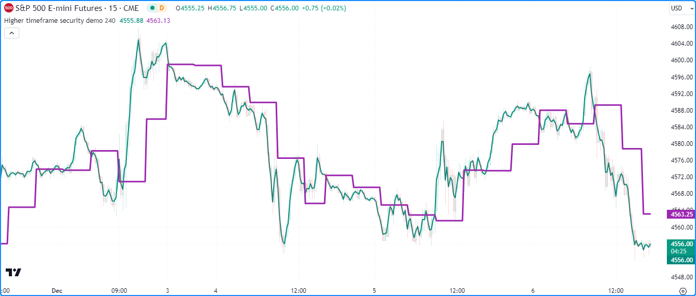

.. code-block:: pine

    //@version=5
    indicator("Higher timeframe security demo", overlay = true)

    //@variable The higher timeframe to request data from.
    string higherTimeframe = input.timeframe("240", "Higher timeframe")

    //@variable The `hl2` value from the `higherTimeframe`. Combines lookahead with an offset to avoid repainting.
    float htfPrice = request.security(syminfo.tickerid, higherTimeframe, hl2[1], lookahead = barmerge.lookahead_on)

    // Plot the `hl2` from the chart timeframe and the `higherTimeframe`.
    plot(hl2, "Current timeframe HL2", color.teal, 2)
    plot(htfPrice, "Higher timeframe HL2", color.purple, 3)

Note that:
 - We've included an offset to the ``expression`` argument and used 
   `barmerge.lookahead_on <https://www.tradingview.com/pine-script-reference/v5/#var_barmerge.lookahead_on>`__ 
   in `request.security() <https://www.tradingview.com/pine-script-reference/v5/#fun_request.security>`__ to ensure the series 
   returned behaves the same on historical and realtime bars. See the 
   :ref:`Avoiding repainting <PageOtherTimeframesAndData_HistoricalAndRealtimeBehavior_AvoidingRepainting>` section for more information.

Notice that in the above example, it is possible to select a ``higherTimeframe`` value that actually represents a *lower timeframe* 
than the one the chart uses, as the code does not prevent it. When designing a script to work specifically with higher timeframes, 
we recommend including conditions to prevent it from accessing lower timeframes, especially if you intend to 
:ref:`publish <PagePublishing>` it.

Below, we've added an `if <https://www.tradingview.com/pine-script-reference/v5/#kw_if>`__ structure to our previous example 
that raises a `runtime error <https://www.tradingview.com/pine-script-reference/v5/#fun_runtime.error>`__ when the 
``higherTimeframe`` input represents a timeframe smaller than the chart timeframe, effectively preventing the script from 
requesting LTF data:

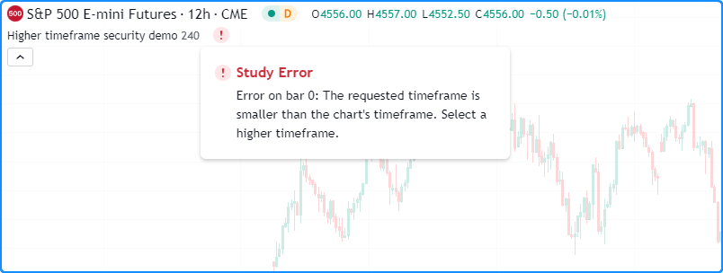

.. code-block:: pine

    //@version=5
    indicator("Higher timeframe security demo", overlay = true)

    //@variable The higher timeframe to request data from.
    string higherTimeframe = input.timeframe("240", "Higher timeframe")

    // Raise a runtime error when the `higherTimeframe` is smaller than the chart's timeframe.
    if timeframe.in_seconds() > timeframe.in_seconds(higherTimeframe)
        runtime.error("The requested timeframe is smaller than the chart's timeframe. Select a higher timeframe.")

    //@variable The `hl2` value from the `higherTimeframe`. Combines lookahead with an offset to avoid repainting.
    float htfPrice = request.security(syminfo.tickerid, higherTimeframe, hl2[1], lookahead = barmerge.lookahead_on)

    // Plot the `hl2` from the chart timeframe and the `higherTimeframe`.
    plot(hl2, "Current timeframe HL2", color.teal, 2)
    plot(htfPrice, "Higher timeframe HL2", color.purple, 3)

.. _PageOtherTimeframesAndData_RequestSecurity_Timeframes_LowerTimeframes:

Lower timeframes
~~~~~~~~~~~~~~~~

Although the `request.security() <https://www.tradingview.com/pine-script-reference/v5/#fun_request.security>`__ 
function is intended to operate on timeframes greater than or equal to the chart timeframe, it *can* request data 
from lower timeframes as well, with limitations. When calling this function to access a lower timeframe, 
it will evaluate the ``expression`` from the LTF context. However, it can only return the results from a *single* 
intrabar (LTF bar) on each chart bar.

The intrabar that the function returns data from on each historical chart bar depends on the ``lookahead`` value 
in the function call. When using `barmerge.lookahead_on <https://www.tradingview.com/pine-script-reference/v5/#var_barmerge.lookahead_on>`__, 
it will return the *first* available intrabar from the chart period. When using 
`barmerge.lookahead_off <https://www.tradingview.com/pine-script-reference/v5/#var_barmerge.lookahead_off>`__, 
it will return the *last* intrabar from the chart period. On realtime bars, it returns the last available value 
of the ``expression`` from the timeframe, regardless of the ``lookahead`` value, as the realtime intrabar information 
retrieved by the function is not yet sorted.

This script retrieves `close <https://www.tradingview.com/pine-script-reference/v5/#var_close>`__ data from the valid 
timeframe closest to a fourth of the size of the chart timeframe. It makes two calls to 
`request.security() <https://www.tradingview.com/pine-script-reference/v5/#fun_request.security>`__ with 
different ``lookahead`` values. The first call uses 
`barmerge.lookahead_on <https://www.tradingview.com/pine-script-reference/v5/#var_barmerge.lookahead_on>`__ to access the 
first intrabar value in each chart bar. The second uses the default ``lookahead`` value 
(`barmerge.lookahead_off <https://www.tradingview.com/pine-script-reference/v5/#var_barmerge.lookahead_off>`__), which 
requests the last intrabar value assigned to each chart bar. The script :ref:`plots <PagePlots>` the outputs of both 
calls on the chart to compare the difference:

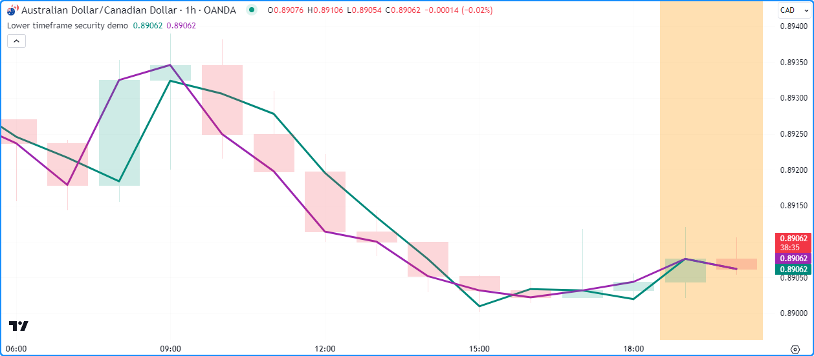

.. code-block:: pine

    //@version=5
    indicator("Lower timeframe security demo", overlay = true)

    //@variable The valid timeframe closest to 1/4 the size of the chart timeframe.
    string lowerTimeframe = timeframe.from_seconds(int(timeframe.in_seconds() / 4))

    //@variable The `close` value on the `lowerTimeframe`. Represents the first intrabar value on each chart bar.
    float firstLTFClose = request.security(syminfo.tickerid, lowerTimeframe, close, lookahead = barmerge.lookahead_on)
    //@variable The `close` value on the `lowerTimeframe`. Represents the last intrabar value on each chart bar.
    float lastLTFClose = request.security(syminfo.tickerid, lowerTimeframe, close)

    // Plot the values.
    plot(firstLTFClose, "First intrabar close", color.teal, 3)
    plot(lastLTFClose, "Last intrabar close", color.purple, 3)
    // Highlight the background on realtime bars.
    bgcolor(barstate.isrealtime ? color.new(color.orange, 70) : na, title = "Realtime background highlight")

Note that:
 - The script determines the value of the ``lowerTimeframe`` by calculating the number of seconds in the chart timeframe 
   with `timeframe.in_seconds() <https://www.tradingview.com/pine-script-reference/v5/#fun_timeframe.in_seconds>`__, 
   then dividing by four and converting the result to a :ref:`valid timeframe string <PageTimeframes_TimeframeStringSpecifications>` 
   via `timeframe.from_seconds() <https://www.tradingview.com/pine-script-reference/v5/#fun_timeframe.from_seconds>`__.
 - The plot of the series without lookahead (`purple <https://www.tradingview.com/pine-script-reference/v5/#var_color.purple>`__) 
   aligns with the `close <https://www.tradingview.com/pine-script-reference/v5/#var_close>`__ value on the chart timeframe, 
   as this is the last intrabar value in the chart bar.
 - Both `request.security() <https://www.tradingview.com/pine-script-reference/v5/#fun_request.security>`__ calls return the 
   *same* value (the current `close <https://www.tradingview.com/pine-script-reference/v5/#var_close>`__) on each 
   `realtime <https://www.tradingview.com/pine-script-reference/v5/#var_barstate.isrealtime>`__ bar, as shown on the bars 
   with the `orange <https://www.tradingview.com/pine-script-reference/v5/#var_color.orange>`__ background.
 - Scripts can retrieve up to 100,000 intrabars from a lower-timeframe context. See :ref:`this <PageLimitations_RequestCalls_Intrabars>` 
   section of the :ref:`Limitations <PageLimitations>` page.

.. note::
   While scripts can use `request.security() <https://www.tradingview.com/pine-script-reference/v5/#fun_request.security>`__ 
   to retrieve the values from a *single* intrabar on each chart bar, which might provide utility in some unique cases, 
   we recommend using the `request.security_lower_tf() <https://www.tradingview.com/pine-script-reference/v5/#fun_request.security_lower_tf>`__ 
   function for intrabar analysis when possible, as it returns an `array <https://www.tradingview.com/pine-script-reference/v5/#type_array>`__ 
   containing data from *all* available intrabars within a chart bar. See :ref:`this section <PageOtherTimeframesAndData_RequestSecurityLowerTf>` 
   to learn more. 

.. _PageOtherTimeframesAndData_RequestSecurity_RequestableData:

Requestable data
^^^^^^^^^^^^^^^^

The `request.security() <https://www.tradingview.com/pine-script-reference/v5/#fun_request.security>`__ function is quite 
versatile, as it can retrieve values of any fundamental type (:ref:`int <PageTypeSystem_Types_Int>`, :ref:`float <PageTypeSystem_Types_Float>`, 
:ref:`bool <PageTypeSystem_Types_Bool>`, :ref:`color <PageTypeSystem_Types_Color>`, or :ref:`string <PageTypeSystem_Types_String>`). 
It can also request the IDs of data structures and built-in or :ref:`user-defined types <PageTypeSystem_UserDefinedTypes>` 
that reference fundamental types. The data this function requests depends on its ``expression`` parameter, which accepts 
any of the following arguments:

- :ref:`Built-in variables and function calls <PageOtherTimeframesAndData_RequestSecurity_RequestableData_BuiltInVariablesAndFunctions>`
- :ref:`Variables calculated by the script <PageOtherTimeframesAndData_RequestSecurity_RequestableData_CalculatedVariables>`
- :ref:`Tuples <PageOtherTimeframesAndData_RequestSecurity_RequestableData_Tuples>`
- :ref:`Calls to user-defined functions <PageOtherTimeframesAndData_RequestSecurity_RequestableData_UserDefinedFunctions>`
- :ref:`Chart points <PageOtherTimeframesAndData_RequestSecurity_RequestableData_ChartPoints>`
- :ref:`Collections <PageOtherTimeframesAndData_RequestSecurity_RequestableData_Collections>`
- :ref:`User-defined types <PageOtherTimeframesAndData_RequestSecurity_RequestableData_UserDefinedTypes>`

.. note::
   The `request.security() <https://www.tradingview.com/pine-script-reference/v5/#fun_request.security>`__ function 
   duplicates the scopes and operations required by the ``expression`` to calculate its requested values in another context, 
   which elevates runtime memory consumption. Additionally, the extra scopes produced by each call to 
   `request.security() <https://www.tradingview.com/pine-script-reference/v5/#fun_request.security>`__ count toward the script's 
   *compilation limits*. See the :ref:`Scope count <PageLimitations_ScriptSizeAndMemory_ScopeCount>` section of the 
   :ref:`Limitations <PageLimitations>` page for more information.

.. _PageOtherTimeframesAndData_RequestSecurity_RequestableData_BuiltInVariablesAndFunctions:

Built-in variables and functions
~~~~~~~~~~~~~~~~~~~~~~~~~~~~~~~~

A frequent use case of `request.security() <https://www.tradingview.com/pine-script-reference/v5/#fun_request.security>`__ 
is requesting the output of a built-in variable or function/:ref:`method <PageMethods>` call from another symbol or timeframe.

For example, suppose we want to calculate the 20-bar `SMA <https://www.tradingview.com/pine-script-reference/v5/#fun_ta.sma>`__ 
of a symbol's `ohlc4 <https://www.tradingview.com/pine-script-reference/v5/#var_ohlc4>`__ price from the daily timeframe 
while on an intraday chart. We can accomplish this with a single line of code:

.. code-block:: pine

    float ma = request.security(syminfo.tickerid, "1D", ta.sma(ohlc4, 20))

The above line calculates the value of `ta.sma(ohlc4, 20) <https://www.tradingview.com/pine-script-reference/v5/#fun_ta.sma>`__ 
on the current symbol from the daily timeframe.

It's important to note that newcomers to Pine may sometimes confuse the above line of code as being equivalent to the following:

.. code-block:: pine

    float ma = ta.sma(request.security(syminfo.tickerid, "1D", ohlc4), 20)

However, this line will return an entirely *different* result. Rather than requesting a 20-bar SMA from the 
daily timeframe, it requests the `ohlc4 <https://www.tradingview.com/pine-script-reference/v5/#var_ohlc4>`__ 
price from the daily timeframe and calclates the `ta.sma() <https://www.tradingview.com/pine-script-reference/v5/#fun_ta.sma>`__ 
of the results over 20 **chart bars**.

In essence, when the intention is to request the results of an expression from other contexts, pass the expression 
*directly* to the ``expression`` parameter in the `request.security() <https://www.tradingview.com/pine-script-reference/v5/#fun_request.security>`__ 
call, as demonstrated in the initial example.

Let's expand on this concept. The script below calculates a multi-timeframe (MTF) ribbon of moving averages, 
where each moving average in the ribbon calculates over the same number of bars on its respective timeframe. 
Each `request.security() <https://www.tradingview.com/pine-script-reference/v5/#fun_request.security>`__ call uses 
`ta.sma(close, length) <https://www.tradingview.com/pine-script-reference/v5/#fun_ta.sma>`__ as its ``expression`` argument 
to return a ``length``-bar SMA from the specified timeframe:

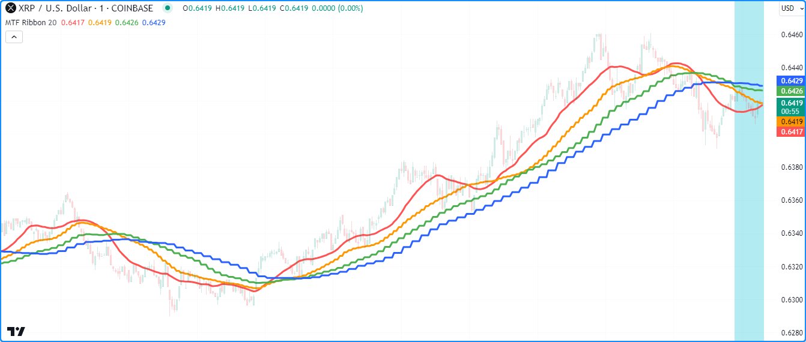

.. code-block:: pine

    //@version=5
    indicator("Requesting built-ins demo", "MTF Ribbon", true)

    //@variable The length of each moving average.
    int length = input.int(20, "Length", 1)

    //@variable The number of seconds in the chart timeframe.
    int chartSeconds = timeframe.in_seconds()

    // Calculate the higher timeframes closest to 2, 3, and 4 times the size of the chart timeframe.
    string htf1 = timeframe.from_seconds(chartSeconds * 2)
    string htf2 = timeframe.from_seconds(chartSeconds * 3)
    string htf3 = timeframe.from_seconds(chartSeconds * 4)

    // Calculate the `length`-bar moving averages from each timeframe.
    float chartAvg = ta.sma(ohlc4, length)
    float htfAvg1  = request.security(syminfo.tickerid, htf1, ta.sma(ohlc4, length))
    float htfAvg2  = request.security(syminfo.tickerid, htf2, ta.sma(ohlc4, length))
    float htfAvg3  = request.security(syminfo.tickerid, htf3, ta.sma(ohlc4, length))

    // Plot the results.
    plot(chartAvg, "Chart timeframe SMA", color.red, 3)
    plot(htfAvg1, "Double timeframe SMA", color.orange, 3)
    plot(htfAvg2, "Triple timeframe SMA", color.green, 3)
    plot(htfAvg3, "Quadruple timeframe SMA", color.blue, 3)

    // Highlight the background on realtime bars.
    bgcolor(barstate.isrealtime ? color.new(color.aqua, 70) : na, title = "Realtime highlight")

Note that:
 - The script calculates the ribbon's higher timeframes by multiplying the chart's 
   `timeframe.in_seconds() <https://www.tradingview.com/pine-script-reference/v5/#fun_timeframe.in_seconds>`__ 
   value by 2, 3, and 4, then converting each result into a 
   :ref:`valid timeframe string <PageTimeframes_TimeframeStringSpecifications>` using 
   `timeframe.from_seconds() <https://www.tradingview.com/pine-script-reference/v5/#fun_timeframe.from_seconds>`__.
 - Instead of calling `ta.sma() <https://www.tradingview.com/pine-script-reference/v5/#fun_ta.sma>`__ within each 
   `request.security() <https://www.tradingview.com/pine-script-reference/v5/#fun_request.security>`__ call, one 
   could use the ``chartAvg`` variable as the ``expression`` in each call to achieve the same result. See the 
   :ref:`next section <PageOtherTimeframesAndData_RequestSecurity_RequestableData_CalculatedVariables>` for more information. 
 - On realtime bars, this script also tracks *unconfirmed* SMA values from each higher timeframe. See the 
   :ref:`Historical and realtime behavior <PageOtherTimeframesAndData_HistoricalAndRealtimeBehavior>` section to learn more.

.. _PageOtherTimeframesAndData_RequestSecurity_RequestableData_CalculatedVariables:

Calculated variables
~~~~~~~~~~~~~~~~~~~~

The ``expression`` parameter of `request.security() <https://www.tradingview.com/pine-script-reference/v5/#fun_request.security>`__ 
accepts variables declared in the global scope, allowing scripts to evaluate their variables' calculations from other 
contexts without redundantly listing the operations in each function call.

For example, one can declare the following variable:

.. code-block:: pine

    priceReturn = (close - close[1]) / close[1]

and execute the variable's calculation from another context with 
`request.security() <https://www.tradingview.com/pine-script-reference/v5/#fun_request.security>`__:

.. code-block:: pine

    requestedReturn = request.security(symbol, timeframe.period, priceReturn)

The function call in the line above will return the result of the ``priceReturn`` calculation on another ``symbol``'s 
data as a series adapted to the current chart, which the script can display directly on the chart or utilize in 
additional operations.

The following example compares the price returns of the current chart's symbol and another specified ``symbol``. 
The script declares the ``priceReturn`` variable from the chart's context, then uses that variable in 
`request.security() <https://www.tradingview.com/pine-script-reference/v5/#fun_request.security>`__ to evaluate 
its calculation on another ``symbol``. It then calculates the 
`correlation <https://www.tradingview.com/pine-script-reference/v5/#fun_ta.correlation>`__ between the 
``priceReturn`` and ``requestedReturn`` and :ref:`plots <PagePlots>` the result on the chart:

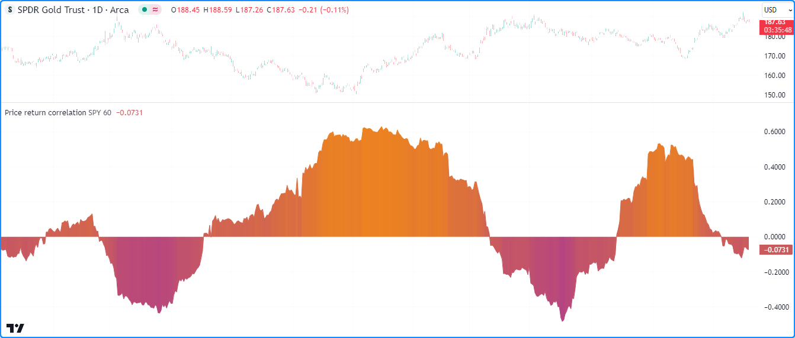

.. code-block:: pine

    //@version=5
    indicator("Requesting calculated variables demo", "Price return correlation")

    //@variable The symbol to compare to the chart symbol.
    string symbol = input.symbol("SPY", "Symbol to compare")
    //@variable The number of bars in the calculation window.
    int length = input.int(60, "Length", 1)

    //@variable The close-to-close price return.
    float priceReturn = (close - close[1]) / close[1]
    //@variable The close-to-close price return calculated on another `symbol`.
    float requestedReturn = request.security(symbol, timeframe.period, priceReturn)

    //@variable The correlation between the `priceReturn` and `requestedReturn` over `length` bars.
    float correlation = ta.correlation(priceReturn, requestedReturn, length)
    //@variable The color of the correlation plot.
    color plotColor = color.from_gradient(correlation, -1, 1, color.purple, color.orange)

    // Plot the correlation value.
    plot(correlation, "Correlation", plotColor, style = plot.style_area)

Note that:
 - The `request.security() <https://www.tradingview.com/pine-script-reference/v5/#fun_request.security>`__ 
   call executes the same calculation used in the ``priceReturn`` declaration, except it uses the 
   `close <https://www.tradingview.com/pine-script-reference/v5/#var_close>`__ values fetched from the input ``symbol``.
 - The script colors the plot with a `gradient <https://www.tradingview.com/pine-script-reference/v5/#fun_color.from_gradient>`__ 
   based on the ``correlation`` value. To learn more about color gradients in Pine, see 
   :ref:`this <PageColors_CalculatedColors_ColorFromGradient>` section of our User Manual's page on 
   :ref:`colors <PageColors>`.

.. _PageOtherTimeframesAndData_RequestSecurity_RequestableData_Tuples:

Tuples
~~~~~~

:ref:`Tuples <PageTypeSystem_Tuples>` in Pine Script™ are comma-separated sets of expressions enclosed in brackets 
that can hold multiple values of any available type. We use tuples when creating functions or other local blocks 
that return more than one value. 

The `request.security() <https://www.tradingview.com/pine-script-reference/v5/#fun_request.security>`__ function 
can accept a tuple as its ``expression`` argument, allowing scripts to request multiple series of different types 
using a single function call. The expressions within requested tuples can be of any type outlined throughout the 
:ref:`Requestable data <PageOtherTimeframesAndData_RequestSecurity_RequestableData>` section of this page, 
excluding other tuples.

.. note::
   The combined size of all tuples returned by ``request.*()`` calls in a 
   script cannot exceed 127 elements. See :ref:`this <PageLimitations_RequestCalls_TupleElementLimit>` section of the 
   :ref:`Limitations <PageLimitations>` page for more information.

Tuples are particularly handy when a script needs to retrieve more than one value from a specific context. 

For example, this script calculates the `percent rank <https://www.tradingview.com/pine-script-reference/v5/#fun_ta.percentrank>`__ 
of the `close <https://www.tradingview.com/pine-script-reference/v5/#var_close>`__ price over ``length`` bars and 
assigns the expression to the ``rank`` variable. It then calls 
`request.security() <https://www.tradingview.com/pine-script-reference/v5/#fun_request.security>`__ to request a tuple 
containing the ``rank``, `ta.crossover(rank, 50) <https://www.tradingview.com/pine-script-reference/v5/#fun_ta.crossover>`__, 
and `ta.crossunder(rank, 50) <https://www.tradingview.com/pine-script-reference/v5/#fun_ta.crossunder>`__ values from 
the specified ``timeframe``. The script :ref:`plots <PagePlots>` the ``requestedRank`` and uses the ``crossOver`` 
and ``crossUnder`` "bool" values within `bgcolor() <https://www.tradingview.com/pine-script-reference/v5/#fun_bgcolor>`__ 
to conditionally highlight the chart pane's background:

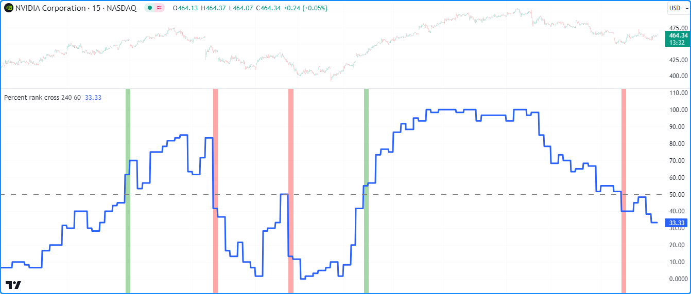

.. code-block:: pine

    //@version=5
    indicator("Requesting tuples demo", "Percent rank cross")

    //@variable The timeframe of the request.
    string timeframe = input.timeframe("240", "Timeframe")
    //@variable The number of bars in the calculation.
    int length = input.int(20, "Length")

    //@variable The previous bar's percent rank of the `close` price over `length` bars.
    float rank = ta.percentrank(close, length)[1]

    // Request the `rank` value from another `timeframe`, and two "bool" values indicating the `rank` from the `timeframe`
    // crossed over or under 50.
    [requestedRank, crossOver, crossUnder] = request.security(
         syminfo.tickerid, timeframe, [rank, ta.crossover(rank, 50), ta.crossunder(rank, 50)],
         lookahead = barmerge.lookahead_on
     )

    // Plot the `requestedRank` and create a horizontal line at 50.
    plot(requestedRank, "Percent Rank", linewidth = 3)
    hline(50, "Cross line", linewidth = 2)
    // Highlight the background of all bars where the `timeframe`'s `crossOver` or `crossUnder` value is `true`.
    bgcolor(crossOver ? color.new(color.green, 50) : crossUnder ? color.new(color.red, 50) : na)

Note that:
 - We've offset the ``rank`` variable's expression by one bar using the history-referencing operator 
   `[] <https://www.tradingview.com/pine-script-reference/v5/#op_[]>`__ and included 
   `barmerge.lookahead_on <https://www.tradingview.com/pine-script-reference/v5/#var_barmerge.lookahead_on>`__ 
   in the `request.security() <https://www.tradingview.com/pine-script-reference/v5/#fun_request.security>`__ call 
   to ensure the values on realtime bars do not repaint after becoming historical bars. See the 
   :ref:`Avoiding repainting <PageOtherTimeframesAndData_HistoricalAndRealtimeBehavior_AvoidingRepainting>` 
   section for more information.
 - The `request.security() <https://www.tradingview.com/pine-script-reference/v5/#fun_request.security>`__ call 
   returns a tuple, so we use a *tuple declaration* to declare the ``requestedRank``, ``crossOver``, and ``crossUnder`` 
   variables. To learn more about using tuples, see :ref:`this section <PageTypeSystem_Tuples>` of our User Manual's 
   :ref:`Type system <PageTypeSystem>` page.

.. _PageOtherTimeframesAndData_RequestSecurity_RequestableData_UserDefinedFunctions:

User-defined functions
~~~~~~~~~~~~~~~~~~~~~~

:ref:`User-defined functions <PageUserDefinedFunctions>` and :ref:`methods <PageMethods_UserDefinedMethods>` are custom functions 
written by users. They allow users to define sequences of operations associated with an identifier that scripts 
can conveniently call throughout their execution (e.g., ``myUDF()``). 

The `request.security() <https://www.tradingview.com/pine-script-reference/v5/#fun_request.security>`__ function 
can request the results of :ref:`user-defined functions <PageUserDefinedFunctions>` and :ref:`methods <PageMethods_UserDefinedMethods>` 
whose scopes consist of any types outlined throughout this page's 
:ref:`Requestable data <PageOtherTimeframesAndData_RequestSecurity_RequestableData>` section.

For example, this script contains a user-defined ``weightedBB()`` function that calculates Bollinger Bands with the basis 
average weighted by a specified ``weight`` series. The function returns a :ref:`tuple <PageTypeSystem_Tuples>` of custom 
band values. The script calls the ``weightedBB()`` as the ``expression`` argument in 
`request.security() <https://www.tradingview.com/pine-script-reference/v5/#fun_request.security>`__ to retrieve a 
:ref:`tuple <PageOtherTimeframesAndData_RequestSecurity_RequestableData_Tuples>` of band values calculated on the specified 
``timeframe`` and :ref:`plots <PagePlots>` the results on the chart:

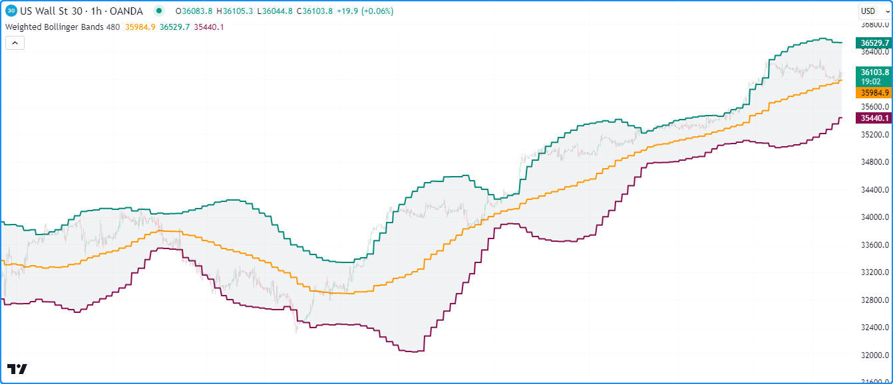

.. code-block:: pine

    //@version=5
    indicator("Requesting user-defined functions demo", "Weighted Bollinger Bands", true)

    //@variable The timeframe of the request.
    string timeframe = input.timeframe("480", "Timeframe")

    //@function     Calculates Bollinger Bands with a custom weighted basis.
    //@param source The series of values to process.
    //@param length The number of bars in the calculation.
    //@param mult   The standard deviation multiplier.
    //@param weight The series of weights corresponding to each `source` value.
    //@returns      A tuple containing the basis, upper band, and lower band respectively.
    weightedBB(float source, int length, float mult = 2.0, float weight = 1.0) =>
        //@variable The basis of the bands.
        float ma = math.sum(source * weight, length) / math.sum(weight, length)
        //@variable The standard deviation from the `ma`.
        float dev = 0.0
        // Loop to accumulate squared error.
        for i = 0 to length - 1
            difference = source[i] - ma
            dev += difference * difference
        // Divide `dev` by the `length`, take the square root, and multiply by the `mult`.
        dev := math.sqrt(dev / length) * mult
        // Return the bands.
        [ma, ma + dev, ma - dev]

    // Request weighted bands calculated on the chart symbol's prices over 20 bars from the
    // last confirmed bar on the `timeframe`.
    [basis, highBand, lowBand] = request.security(
         syminfo.tickerid, timeframe, weightedBB(close[1], 20, 2.0, (high - low)[1]), lookahead = barmerge.lookahead_on
     )

    // Plot the values.
    basisPlot = plot(basis, "Basis", color.orange, 2)
    upperPlot = plot(highBand, "Upper", color.teal, 2)
    lowerPlot = plot(lowBand, "Lower", color.maroon, 2)
    fill(upperPlot, lowerPlot, color.new(color.gray, 90), "Background")

Note that:
 - We offset the ``source`` and ``weight`` arguments in the ``weightedBB()`` call used as the ``expression`` in 
   `request.security() <https://www.tradingview.com/pine-script-reference/v5/#fun_request.security>`__ and used 
   `barmerge.lookahead_on <https://www.tradingview.com/pine-script-reference/v5/#var_barmerge.lookahead_on>`__ 
   to ensure the requested results reflect the last confirmed values from the ``timeframe`` on realtime bars. 
   See :ref:`this section <PageOtherTimeframesAndData_HistoricalAndRealtimeBehavior_AvoidingRepainting>` to learn more.

.. _PageOtherTimeframesAndData_RequestSecurity_RequestableData_ChartPoints:

Chart points
~~~~~~~~~~~~

:ref:`Chart points <PageTypeSystem_Types_ChartPoints>` are reference types that represent coordinates on the chart. 
:ref:`Lines <PageLinesAndBoxes_Lines>`, :ref:`boxes <PageLinesAndBoxes_Boxes>`, 
:ref:`polylines <PageLinesAndBoxes_Polylines>`, and :ref:`labels <PageTextAndShapes_Labels>` use 
`chart.point <https://www.tradingview.com/pine-script-reference/v5/#type_chart.point>`__ objects to set their display locations.

The `request.security() <https://www.tradingview.com/pine-script-reference/v5/#fun_request.security>`__ function can use 
the ID of a `chart.point <https://www.tradingview.com/pine-script-reference/v5/#type_chart.point>`__ instance in its ``expression`` 
argument, allowing scripts to retrieve chart coordinates from other contexts. 

The example below requests a tuple of historical :ref:`chart points <PageTypeSystem_Types_ChartPoints>` from a higher timeframe 
and uses them to draw :ref:`boxes <PageLinesAndBoxes_Boxes>` on the chart. The script declares the ``topLeft`` and 
``bottomRight`` variables that reference `chart.point <https://www.tradingview.com/pine-script-reference/v5/#type_chart.point>`__ 
IDs from the last confirmed bar. It then uses 
`request.security() <https://www.tradingview.com/pine-script-reference/v5/#fun_request.security>`__ to request a 
:ref:`tuple <PageOtherTimeframesAndData_RequestSecurity_RequestableData_Tuples>` containing the IDs of 
:ref:`chart points <PageTypeSystem_Types_ChartPoints>` representing the ``topLeft`` and ``bottomRight`` from a ``higherTimeframe``. 

When a new bar starts on the ``higherTimeframe``, the script draws a 
`new box <https://www.tradingview.com/pine-script-reference/v5/#fun_box.new>`__ using the ``time`` and ``price`` coordinates 
from the ``requestedTopLeft`` and ``requestedBottomRight`` chart points:

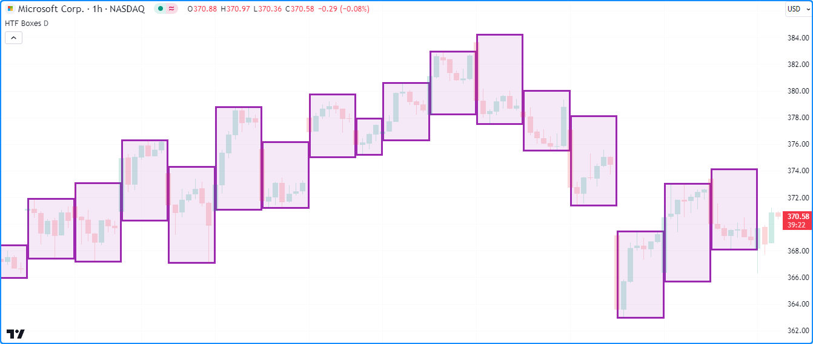

.. code-block:: pine

    //@version=5
    indicator("Requesting chart points demo", "HTF Boxes", true, max_boxes_count = 500)

    //@variable The timeframe to request data from.
    string higherTimeframe = input.timeframe("1D", "Timeframe")

    // Raise a runtime error if the `higherTimeframe` is smaller than the chart's timeframe.
    if timeframe.in_seconds(higherTimeframe) < timeframe.in_seconds(timeframe.period)
        runtime.error("The selected timeframe is too small. Choose a higher timeframe.")

    //@variable A `chart.point` containing top-left coordinates from the last confirmed bar.
    topLeft = chart.point.now(high)[1]
    //@variable A `chart.point` containing bottom-right coordinates from the last confirmed bar.
    bottomRight = chart.point.from_time(time_close, low)[1]

    // Request the last confirmed `topLeft` and `bottomRight` chart points from the `higherTimeframe`.
    [requestedTopLeft, requestedBottomRight] = request.security(
         syminfo.tickerid, higherTimeframe, [topLeft, bottomRight], lookahead = barmerge.lookahead_on
     )

    // Draw a new box when a new `higherTimeframe` bar starts.
    // The box uses the `time` fields from the `requestedTopLeft` and `requestedBottomRight` as x-coordinates.
    if timeframe.change(higherTimeframe)
        box.new(
             requestedTopLeft, requestedBottomRight, color.purple, 3, 
             xloc = xloc.bar_time, bgcolor = color.new(color.purple, 90)
         )

Note that:
 - Since this example is designed specifically for higher timeframes, we've included a custom 
   `runtime error <https://www.tradingview.com/pine-script-reference/v5/#fun_runtime.error>`__ that the script 
   raises when the `timeframe.in_seconds() <https://www.tradingview.com/pine-script-reference/v5/#fun_timeframe.in_seconds>`__ 
   of the ``higherTimeframe`` is smaller than that of the 
   `chart's timeframe <https://www.tradingview.com/pine-script-reference/v5/#var_timeframe.period>`__. 

.. _PageOtherTimeframesAndData_RequestSecurity_RequestableData_Collections:

Collections
~~~~~~~~~~~

Pine Script™ *collections* (:ref:`arrays <PageArrays>`, :ref:`matrices <PageMatrices>`, and :ref:`maps <PageMaps>`) 
are data structures that contain an arbitrary number of elements with specified types. The 
`request.security() <https://www.tradingview.com/pine-script-reference/v5/#fun_request.security>`__ function can 
retrieve the IDs of :ref:`collections <PageTypeSystem_Types_Collections>` whose elements consist of:

- Fundamental types
- :ref:`Chart points <PageTypeSystem_Types_ChartPoints>`
- :ref:`User-defined types <PageTypeSystem_UserDefinedTypes>` that satisfy the criteria listed in the 
  :ref:`section below <PageOtherTimeframesAndData_RequestSecurity_RequestableData_UserDefinedTypes>`

This example calculates the ratio of a confirmed bar's high-low range to the range between the 
`highest <https://www.tradingview.com/pine-script-reference/v5/#fun_ta.highest>`__ and 
`lowest <https://www.tradingview.com/pine-script-reference/v5/#fun_ta.lowest>`__ values over 10 bars 
from a specified ``symbol`` and ``timeframe``. It uses :ref:`maps <PageMaps>` to hold the values used 
in the calculations. 

The script creates a ``data`` map with "string" keys and "float" values to hold 
`high <https://www.tradingview.com/pine-script-reference/v5/#var_high>`__, 
`low <https://www.tradingview.com/pine-script-reference/v5/#var_low>`__, 
`highest <https://www.tradingview.com/pine-script-reference/v5/#fun_ta.highest>`__, and 
`lowest <https://www.tradingview.com/pine-script-reference/v5/#fun_ta.lowest>`__ price values on each bar, 
which it uses as the ``expression`` in `request.security() <https://www.tradingview.com/pine-script-reference/v5/#fun_request.security>`__ 
to calculate an ``otherData`` map representing the ``data`` from the specified context. It uses the values 
associated with the "High", "Low", "Highest", and "Lowest" keys of the ``otherData`` map to calculate the 
``ratio`` that it :ref:`plots <PagePlots>` in the chart pane:

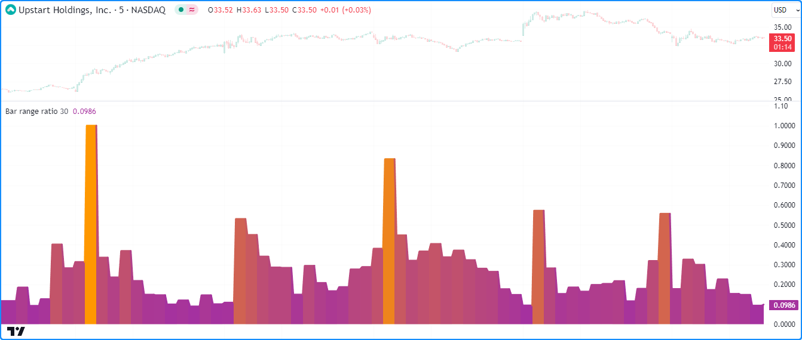

.. code-block:: pine

    //@version=5
    indicator("Requesting collections demo", "Bar range ratio")

    //@variable The ticker ID to request data from.
    string symbol = input.symbol("", "Symbol")
    //@variable The timeframe of the request.
    string timeframe = input.timeframe("30", "Timeframe")

    //@variable A map with "string" keys and "float" values.
    var map<string, float> data = map.new<string, float>()

    // Put key-value pairs into the `data` map.
    map.put(data, "High", high)
    map.put(data, "Low", low)
    map.put(data, "Highest", ta.highest(10))
    map.put(data, "Lowest", ta.lowest(10))

    //@variable A new `map` whose data is calculated from the last confirmed bar of the requested context.
    map<string, float> otherData = request.security(symbol, timeframe, data[1], lookahead = barmerge.lookahead_on)

    //@variable The ratio of the context's bar range to the max range over 10 bars. Returns `na` if no data is available.
    float ratio = na
    if not na(otherData)
        ratio := (otherData.get("High") - otherData.get("Low")) / (otherData.get("Highest") - otherData.get("Lowest"))

    //@variable A gradient color for the plot of the `ratio`.
    color ratioColor = color.from_gradient(ratio, 0, 1, color.purple, color.orange)

    // Plot the `ratio`.
    plot(ratio, "Range Ratio", ratioColor, 3, plot.style_area)

Note that:
 - The `request.security() <https://www.tradingview.com/pine-script-reference/v5/#fun_request.security>`__ call in this 
   script can return `na <https://www.tradingview.com/pine-script-reference/v5/#var_na>`__ if no data is available from 
   the specified context. Since one cannot call :ref:`methods <PageMethods>` on a 
   `map <https://www.tradingview.com/pine-script-reference/v5/#type_map>`__ variable when its value is 
   `na <https://www.tradingview.com/pine-script-reference/v5/#var_na>`__, we've added an 
   `if <https://www.tradingview.com/pine-script-reference/v5/#kw_if>`__ structure to only calculate a new ``ratio`` 
   value when ``otherData`` references a valid `map <https://www.tradingview.com/pine-script-reference/v5/#type_map>`__ ID.

.. _PageOtherTimeframesAndData_RequestSecurity_RequestableData_UserDefinedTypes:

User-defined types
~~~~~~~~~~~~~~~~~~

:ref:`User-defined types (UDTs) <PageTypeSystem_UserDefinedTypes>` are *composite types* containing an arbitrary number 
of *fields*, which can be of any available type, including other :ref:`user-defined types <PageTypeSystem_UserDefinedTypes>`.

The `request.security() <https://www.tradingview.com/pine-script-reference/v5/#fun_request.security>`__ function can 
retrieve the IDs of :ref:`objects <PageObjects>` produced by :ref:`UDTs <PageTypeSystem_UserDefinedTypes>` from other 
contexts if their fields consist of:

- Fundamental types
- :ref:`Chart points <PageTypeSystem_Types_ChartPoints>`
- :ref:`Collections <PageTypeSystem_Types_Collections>` that satisfy the criteria listed in the 
  :ref:`section above <PageOtherTimeframesAndData_RequestSecurity_RequestableData_Collections>`
- Other :ref:`UDTs <PageTypeSystem_UserDefinedTypes>` whose fields consist of any of these types

The following example requests an :ref:`object <PageObjects>` ID using a specified ``symbol`` and 
displays its field values on a chart pane. 

The script contains a ``TickerInfo`` UDT with "string" fields for ``syminfo.*`` values, an 
`array <https://www.tradingview.com/pine-script-reference/v5/#type_array>`__ field to store recent "float" price data, 
and an "int" field to hold the requested ticker's `bar_index <https://www.tradingview.com/pine-script-reference/v5/#var_bar_index>`__ 
value. It assigns a new ``TickerInfo`` ID to an ``info`` variable on every bar and uses the variable as the ``expression`` in 
`request.security() <https://www.tradingview.com/pine-script-reference/v5/#fun_request.security>`__ to retrieve the ID of an 
:ref:`object <PageObjects>` representing the calculated ``info`` from the specified ``symbol``.

The script displays the ``requestedInfo`` object's ``description``, ``tickerType``, ``currency``, and ``barIndex`` values in a 
`label <https://www.tradingview.com/pine-script-reference/v5/#type_label>`__ and uses 
`plotcandle() <https://www.tradingview.com/pine-script-reference/v5/#fun_plotcandle>`__ to display the values 
from its ``prices`` array:

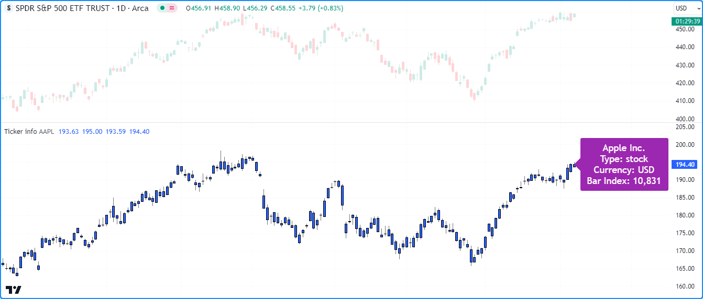

.. code-block:: pine

    //@version=5
    indicator("Requesting user-defined types demo", "Ticker info")

    //@variable The symbol to request information from.
    string symbol = input.symbol("NASDAQ:AAPL", "Symbol")

    //@type               A custom type containing information about a ticker.
    //@field description  The symbol's description.
    //@field tickerType   The type of ticker.
    //@field currency     The symbol's currency.
    //@field prices       An array of the symbol's current prices.
    //@field barIndex     The ticker's `bar_index`.
    type TickerInfo
        string       description
        string       tickerType
        string       currency
        array<float> prices
        int          barIndex

    //@variable A `TickerInfo` object containing current data.
    info = TickerInfo.new(
         syminfo.description, syminfo.type, syminfo.currency, array.from(open, high, low, close), bar_index
     )
    //@variable The `info` requested from the specified `symbol`.
    TickerInfo requestedInfo = request.security(symbol, timeframe.period, info)
    // Assign a new `TickerInfo` instance to `requestedInfo` if one wasn't retrieved.
    if na(requestedInfo)
        requestedInfo := TickerInfo.new(prices = array.new<float>(4))

    //@variable A label displaying information from the `requestedInfo` object.
    var infoLabel = label.new(
         na, na, "", color = color.purple, style = label.style_label_left, textcolor = color.white, size = size.large
     )
    //@variable The text to display inside the `infoLabel`.
    string infoText = na(requestedInfo) ? "" : str.format(
         "{0}\nType: {1}\nCurrency: {2}\nBar Index: {3}",
         requestedInfo.description, requestedInfo.tickerType, requestedInfo.currency, requestedInfo.barIndex
     )

    // Set the `point` and `text` of the `infoLabel`.
    label.set_point(infoLabel, chart.point.now(array.last(requestedInfo.prices)))
    label.set_text(infoLabel, infoText)
    // Plot candles using the values from the `prices` array of the `requestedInfo`.
    plotcandle(
         requestedInfo.prices.get(0), requestedInfo.prices.get(1), requestedInfo.prices.get(2), requestedInfo.prices.get(3),
         "Requested Prices"
     )

Note that:
 - The ``syminfo.*`` variables used in this script all return "simple string" qualified types. However, 
   :ref:`objects <PageObjects>` in Pine are *always* qualified as "series". Consequently, all values assigned 
   to the ``info`` object's fields automatically adopt the "series" :ref:`qualifier <PageTypeSystem_Qualifiers>`.
 - It is possible for the `request.security() <https://www.tradingview.com/pine-script-reference/v5/#fun_request.security>`__ 
   call to return `na <https://www.tradingview.com/pine-script-reference/v5/#var_na>`__ due to differences between 
   the data requested from the ``symbol`` and the main chart. This script assigns a new ``TickerInfo`` object to the 
   ``requestedInfo`` in that case to prevent runtime errors.

.. _PageOtherTimeframesAndData_RequestSecurityLowerTf:

\`request.security_lower_tf()\`
-------------------------------

The `request.security_lower_tf() <https://www.tradingview.com/pine-script-reference/v5/#fun_request.security_lower_tf>`__ 
function is an alternative to `request.security() <https://www.tradingview.com/pine-script-reference/v5/#fun_request.security>`__ 
designed for reliably requesting information from lower-timeframe (LTF) contexts. 

While `request.security() <https://www.tradingview.com/pine-script-reference/v5/#fun_request.security>`__ can retrieve 
data from a *single* intrabar (LTF bar) in each chart bar, 
`request.security_lower_tf() <https://www.tradingview.com/pine-script-reference/v5/#fun_request.security_lower_tf>`__ 
retrieves data from *all* available intrabars in each chart bar, which the script can access and use in additional calculations. 
Each `request.security_lower_tf() <https://www.tradingview.com/pine-script-reference/v5/#fun_request.security_lower_tf>`__ 
call can retrieve up to 100,000 intrabars from a lower timeframe. See :ref:`this <PageLimitations_RequestCalls>` section 
of our :ref:`Limitations <PageLimitations>` page for more information.

.. note::
   Working with `request.security_lower_tf() <https://www.tradingview.com/pine-script-reference/v5/#fun_request.security_lower_tf>`__ 
   involves frequent usage of :ref:`arrays <PageArrays>` since it always returns `array <https://www.tradingview.com/pine-script-reference/v5/#type_array>`__ 
   results. We therefore recommend you familiarize yourself with :ref:`arrays <PageArrays>` to make the most of this function in your scripts. 

Below is the function's signature, which is similar to 
`request.security() <https://www.tradingview.com/pine-script-reference/v5/#fun_request.security>`__:

.. code-block:: text

    request.security_lower_tf(symbol, timeframe, expression, ignore_invalid_symbol, currency, ignore_invalid_timeframe) → array<type>

This function **only** requests data from timeframes less than or equal to the chart's timeframe. If the ``timeframe`` 
of the request represents a higher timeframe than the `chart's timeframe <https://www.tradingview.com/pine-script-reference/v5/#var_timeframe.period>`__, 
the function will either raise a runtime error or return `na <https://www.tradingview.com/pine-script-reference/v5/#var_na>`__ values 
depending on the ``ignore_invalid_timeframe`` argument in the call. The default value for this parameter is ``false``, meaning it will 
raise an error and halt the script's execution when attempting to request HTF data. 

.. _PageOtherTimeframesAndData_RequestSecurityLowerTf_RequestingIntrabarData:

Requesting intrabar data
^^^^^^^^^^^^^^^^^^^^^^^^

Intrabar data can provide a script with additional information that may not be obvious or accessible from solely analyzing 
data sampled on the chart's timerframe. The 
`request.security_lower_tf() <https://www.tradingview.com/pine-script-reference/v5/#fun_request.security_lower_tf>`__ 
function can retrieve many data types from an intrabar context. 

Before you venture further in this section, we recommend exploring the 
:ref:`Requestable data <PageOtherTimeframesAndData_RequestSecurity_RequestableData>` portion of the 
:ref:`request.security() <PageOtherTimeframesAndData_RequestSecurity>` section above, which provides foundational information 
about the types of data one can request. The ``expression`` parameter in 
`request.security_lower_tf() <https://www.tradingview.com/pine-script-reference/v5/#fun_request.security_lower_tf>`__ 
accepts most of the same arguments discussed in that section, excluding direct references to :ref:`collections <PageTypeSystem_Types_Collections>` 
and mutable variables declared in the script's main scope. Although it accepts many of the same types of arguments, 
this function returns `array <https://www.tradingview.com/pine-script-reference/v5/#type_array>`__ results, 
which comes with some differences in interpretation and handling, as explained below.

.. note::
   As with `request.security() <https://www.tradingview.com/pine-script-reference/v5/#fun_request.security>`__, 
   `request.security_lower_tf() <https://www.tradingview.com/pine-script-reference/v5/#fun_request.security_lower_tf>`__ 
   duplicates the scopes and operations required to calculate the ``expression`` from another context. The scopes from 
   `request.security_lower_tf() <https://www.tradingview.com/pine-script-reference/v5/#fun_request.security_lower_tf>`__ 
   increase runtime memory consumption and count toward the script's compilation limits. 
   See the :ref:`Scope count <PageLimitations_ScriptSizeAndMemory_ScopeCount>` section of the 
   :ref:`Limitations <PageLimitations>` page to learn more. 

.. _PageOtherTimeframesAndData_RequestSecurityLowerTf_IntrabarDataArrays:

Intrabar data arrays
^^^^^^^^^^^^^^^^^^^^

Lower timeframes contain more data points than higher timeframes, as new values come in at a *higher frequency*. 
For example, when comparing a 1-minute chart to an hourly chart, the 1-minute chart will have up to 60 times the 
number of bars per hour, depending on the available data. 

To address the fact that multiple intrabars exist within a chart bar, 
`request.security_lower_tf() <https://www.tradingview.com/pine-script-reference/v5/#fun_request.security_lower_tf>`__ 
always returns its results as :ref:`arrays <PageArrays>`. The elements in the returned :ref:`arrays <PageArrays>` 
represent the ``expression`` values retrieved from the lower timeframe sorted in ascending order based on each intrabar's timestamp.

The :ref:`type template <PageTypeSystem_TypeTemplates>` assigned to the returned :ref:`arrays <PageArrays>` corresponds 
to the value types passed in the `request.security_lower_tf() <https://www.tradingview.com/pine-script-reference/v5/#fun_request.security_lower_tf>`__ 
call. For example, using an "int" as the ``expression`` will produce an ``array<int>`` instance, a "bool" as the ``expression`` 
will produce an ``array<bool>`` instance, etc. 

The following script uses intrabar information to decompose the chart's close-to-close price changes into positive 
and negative parts. It calls `request.security_lower_tf() <https://www.tradingview.com/pine-script-reference/v5/#fun_request.security_lower_tf>`__ 
to fetch a "float" `array <https://www.tradingview.com/pine-script-reference/v5/#type_array>`__ of 
`ta.change(close) <https://www.tradingview.com/pine-script-reference/v5/#fun_ta.change>`__ values from the 
``lowerTimeframe`` on each chart bar, then accesses all the array's elements using a 
`for...in <https://www.tradingview.com/pine-script-reference/v5/#kw_for...in>`__ loop to accumulate ``positiveChange`` 
and ``negativeChange`` sums. The script adds the accumulated values to calculate the ``netChange``, then 
:ref:`plots <PagePlots>` the results on the chart alongside the ``priceChange`` for comparison:

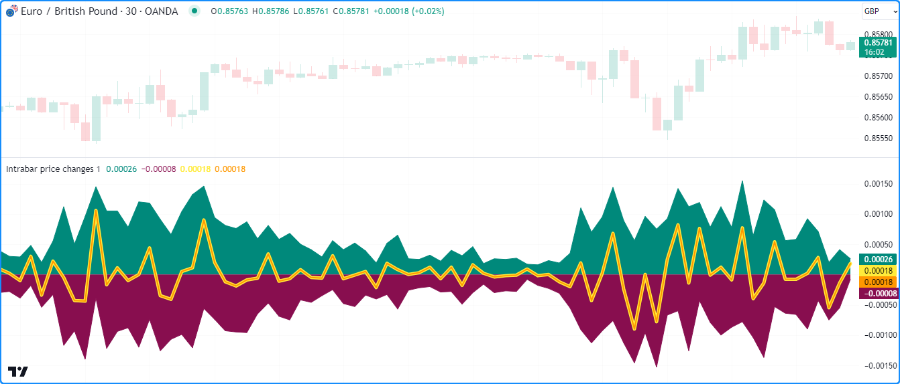

.. code-block:: pine

    //@version=5
    indicator("Intrabar arrays demo", "Intrabar price changes")

    //@variable The lower timeframe of the requested data.
    string lowerTimeframe = input.timeframe("1", "Timeframe")
    
    //@variable The close-to-close price change.
    float priceChange = ta.change(close)

    //@variable An array of `close` values from available intrabars on the `lowerTimeframe`.
    array<float> intrabarChanges = request.security_lower_tf(syminfo.tickerid, lowerTimeframe, priceChange)

    //@variable The total positive intrabar `close` movement on the chart bar.
    float positiveChange = 0.0
    //@variable The total negative intrabar `close` movement on the chart bar.
    float negativeChange = 0.0

    // Loop to calculate totals, starting from the chart bar's first available intrabar.
    for change in intrabarChanges
        // Add the `change` to `positiveChange` if its sign is 1, and add to `negativeChange` if its sign is -1.
        switch math.sign(change)
            1  => positiveChange += change
            -1 => negativeChange += change

    //@variable The sum of `positiveChange` and `negativeChange`. Equals the `priceChange` on bars with available intrabars.
    float netChange = positiveChange + negativeChange

    // Plot the `positiveChange`, `negativeChange`, and `netChange`.
    plot(positiveChange, "Positive intrabar change", color.teal, style = plot.style_area)
    plot(negativeChange, "Negative intrabar change", color.maroon, style = plot.style_area)
    plot(netChange, "Net intrabar change", color.yellow, 5)
    // Plot the `priceChange` to compare.
    plot(priceChange, "Chart price change", color.orange, 2)

Note that:
 - The :ref:`plots <PagePlots>` based on intrabar data may not appear on all available chart bars, as 
   `request.security_lower_tf() <https://www.tradingview.com/pine-script-reference/v5/#fun_request.security_lower_tf>`__ 
   can only access up to the most recent 100,000 intrabars available from the requested context. When executing this 
   function on a chart bar that doesn't have accessible intrabar data, it will return an *empty array*.
 - The number of intrabars per chart bar may vary depending on the data available from the context and the chart 
   the script executes on. For example, a provider's 1-minute data feed may not include data for every minute within 
   the 60-minute timeframe due to a lack of trading activity over some 1-minute intervals. To check the number of intrabars 
   retrieved for a chart bar, one can use `array.size() <https://www.tradingview.com/pine-script-reference/v5/#fun_array.size>`__ 
   on the resulting `array <https://www.tradingview.com/pine-script-reference/v5/#type_array>`__. 
 - If the ``lowerTimeframe`` value is greater than the chart's timeframe, the script will raise a *runtime error*, 
   as we have not supplied an ``ignore_invalid_timeframe`` argument in the 
   `request.security_lower_tf() <https://www.tradingview.com/pine-script-reference/v5/#fun_request.security_lower_tf>`__ call. 

.. _PageOtherTimeframesAndData_RequestSecurityLowerTf_TuplesOfIntrabarData:

Tuples of intrabar data
^^^^^^^^^^^^^^^^^^^^^^^

When passing a tuple or a function call that returns a tuple as the ``expression`` argument in 
`request.security_lower_tf() <https://www.tradingview.com/pine-script-reference/v5/#fun_request.security_lower_tf>`__, 
the result is a tuple of :ref:`arrays <PageArrays>` with :ref:`type templates <PageTypeSystem_TypeTemplates>` 
corresponding to the types within the argument. For example, using a ``[float, string, color]`` tuple as the 
``expression`` will result in ``[array<float>, array<string>, array<color>]`` data returned by the function. 
Using a tuple ``expression`` allows a script to fetch several :ref:`arrays <PageArrays>` of intrabar data with 
a single `request.security_lower_tf() <https://www.tradingview.com/pine-script-reference/v5/#fun_request.security_lower_tf>`__ 
function call.

.. note::
   The combined size of all tuples returned by ``request.*()`` calls in a script is limited to 127 elements. 
   See :ref:`this <PageLimitations_RequestCalls_TupleElementLimit>` section of the :ref:`Limitations <PageLimitations>` 
   page for more information.

The following example requests OHLC data from a lower timeframe and visualizes the current bar's intrabars on 
the chart using :ref:`lines and boxes <PageLinesAndBoxes>`. The script calls 
`request.security_lower_tf() <https://www.tradingview.com/pine-script-reference/v5/#fun_request.security_lower_tf>`__ 
with the ``[open, high, low, close]`` tuple as its ``expression`` to retrieve a tuple of :ref:`arrays <PageArrays>` 
representing OHLC information from a calculated ``lowerTimeframe``. It then uses a 
`for <https://www.tradingview.com/pine-script-reference/v5/#kw_for>`__ loop to set line coordinates with the retrieved 
data and current bar indices to display the results next to the current chart bar, providing a "magnified view" of the 
price movement within the latest candle. It also draws a `box <https://www.tradingview.com/pine-script-reference/v5/#type_box>`__ 
around the :ref:`lines <PageLinesAndBoxes_Lines>` to indicate the chart region occupied by intrabar drawings:

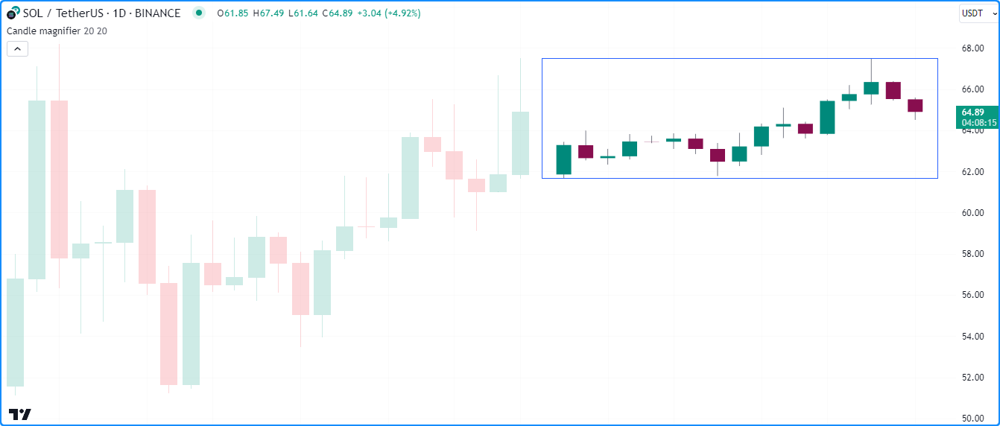

.. code-block:: pine

    //@version=5
    indicator("Tuples of intrabar data demo", "Candle magnifier", max_lines_count = 500)

    //@variable The maximum number of intrabars to display.
    int maxIntrabars = input.int(20, "Max intrabars", 1, 250)
    //@variable The width of the drawn candle bodies.
    int candleWidth = input.int(20, "Candle width", 2)

    //@variable The largest valid timeframe closest to `maxIntrabars` times smaller than the chart timeframe.
    string lowerTimeframe = timeframe.from_seconds(math.ceil(timeframe.in_seconds() / maxIntrabars))

    //@variable An array of lines to represent intrabar wicks.
    var array<line> wicks  = array.new<line>()
    //@variable An array of lines to represent intrabar bodies.
    var array<line> bodies = array.new<line>()
    //@variable A box that surrounds the displayed intrabars.
    var box magnifierBox = box.new(na, na, na, na, bgcolor = na)

    // Fill the `wicks` and `bodies` arrays with blank lines on the first bar.
    if barstate.isfirst
        for i = 1 to maxIntrabars
            array.push(wicks, line.new(na, na, na, na, color = color.gray))
            array.push(bodies, line.new(na, na, na, na, width = candleWidth))

    //@variable A tuple of "float" arrays containing `open`, `high`, `low`, and `close` prices from the `lowerTimeframe`.
    [oData, hData, lData, cData] = request.security_lower_tf(syminfo.tickerid, lowerTimeframe, [open, high, low, close])
    //@variable The number of intrabars retrieved from the `lowerTimeframe` on the chart bar.
    int numIntrabars = array.size(oData)

    if numIntrabars > 0
        // Define the start and end bar index values for intrabar display.
        int startIndex = bar_index + 2
        int endIndex = startIndex + numIntrabars
        // Loop to update lines.
        for i = 0 to maxIntrabars - 1
            line wickLine = array.get(wicks, i)
            line bodyLine = array.get(bodies, i)
            if i < numIntrabars
                //@variable The `bar_index` of the drawing.
                int candleIndex = startIndex + i
                // Update the properties of the `wickLine` and `bodyLine`.
                line.set_xy1(wickLine, startIndex + i, array.get(hData, i))
                line.set_xy2(wickLine, startIndex + i, array.get(lData, i))
                line.set_xy1(bodyLine, startIndex + i, array.get(oData, i))
                line.set_xy2(bodyLine, startIndex + i, array.get(cData, i))
                line.set_color(bodyLine, bodyLine.get_y2() > bodyLine.get_y1() ? color.teal : color.maroon)
                continue
            // Set the coordinates of the `wickLine` and `bodyLine` to `na` if no intrabar data is available at the index.
            line.set_xy1(wickLine, na, na)
            line.set_xy2(wickLine, na, na)
            line.set_xy1(bodyLine, na, na)
            line.set_xy2(bodyLine, na, na)
        // Set the coordinates of the `magnifierBox`.
        box.set_lefttop(magnifierBox, startIndex - 1, array.max(hData))
        box.set_rightbottom(magnifierBox, endIndex, array.min(lData))

Note that:
 - The script draws each candle using two :ref:`lines <PageLinesAndBoxes_Lines>`: one to represent wicks and the 
   other to represent the body. Since the script can display up to 500 lines on the chart, we've limited the ``maxIntrabars`` input to 250. 
 - The ``lowerTimeframe`` value is the result of calculating the `math.ceil() <https://www.tradingview.com/pine-script-reference/v5/#fun_math.ceil>`__ 
   of the `timeframe.in_seconds() <https://www.tradingview.com/pine-script-reference/v5/#fun_timeframe.in_seconds>`__ divided by the 
   ``maxIntrabars`` and converting to a :ref:`valid timeframe string <PageTimeframes_TimeframeStringSpecifications>` with 
   `timeframe.from_seconds() <https://www.tradingview.com/pine-script-reference/v5/#fun_timeframe.from_seconds>`__. 
 - The script sets the top of the box drawing using the `array.max() <https://www.tradingview.com/pine-script-reference/v5/#fun_array.max>`__ 
   of the requested ``hData`` array, and it sets the box's bottom using the `array.min() <https://www.tradingview.com/pine-script-reference/v5/#fun_array.min>`__ 
   of the requested ``lData`` array. As we see on the chart, these values correspond to the 
   `high <https://www.tradingview.com/pine-script-reference/v5/#var_high>`__ and 
   `low <https://www.tradingview.com/pine-script-reference/v5/#var_low>`__ of the chart bar. 

.. _PageOtherTimeframesAndData_RequestSecurityLowerTf_RequestingCollections:

Requesting collections
^^^^^^^^^^^^^^^^^^^^^^

In some cases, a script may need to request the IDs of :ref:`collections <PageTypeSystem_Types_Collections>` 
from an intrabar context. However, unlike `request.security() <https://www.tradingview.com/pine-script-reference/v5/#fun_request.security>`__, 
one cannot pass :ref:`collections <PageTypeSystem_Types_Collections>` or calls to functions that return them as the 
``expression`` argument in a `request.security_lower_tf() <https://www.tradingview.com/pine-script-reference/v5/#fun_request.security_lower_tf>`__ 
call, as :ref:`arrays <PageArrays>` cannot directly reference other :ref:`collections <PageTypeSystem_Types_Collections>`.

Despite these limitations, it is possible to request :ref:`collections <PageTypeSystem_Types_Collections>` 
from lower timeframes, if needed, with the help of *wrapper* types. 

.. note::
   The use case described below is **advanced** and **not** recommended for beginners. Before exploring this approach, 
   we recommend understanding how :ref:`user-defined types <PageTypeSystem_UserDefinedTypes>` and 
   :ref:`collections <PageTypeSystem_Types_Collections>` work in Pine Script™. When possible, we recommend using 
   *simpler* methods to manage LTF requests, and only using this approach when *nothing else* will suffice. 

To make :ref:`collections <PageTypeSystem_Types_Collections>` requestable with 
`request.security_lower_tf() <https://www.tradingview.com/pine-script-reference/v5/#fun_request.security_lower_tf>`__, 
we must create a :ref:`UDT <PageTypeSystem_UserDefinedTypes>` with a field to reference a collection ID. This step is 
necessary since :ref:`arrays <PageArrays>` cannot reference other :ref:`collections <PageTypeSystem_Types_Collections>` 
directly but *can* reference UDTs with collection fields:

.. code-block:: pine

    //@type A "wrapper" type to hold an `array<float>` instance.
    type Wrapper
        array<float> collection

With our ``Wrapper`` UDT defined, we can now pass the IDs of :ref:`objects <PageObjects>` of the UDT to the 
``expression`` parameter in `request.security_lower_tf() <https://www.tradingview.com/pine-script-reference/v5/#fun_request.security_lower_tf>`__.

A straightforward approach is to call the built-in ``*.new()`` function as the ``expression``. For example, this line of code 
calls ``Wrapper.new()`` with `array.from(close) <https://www.tradingview.com/pine-script-reference/v5/#fun_array.from>`__ as 
its ``collection`` within 
`request.security_lower_tf() <https://www.tradingview.com/pine-script-reference/v5/#fun_request.security_lower_tf>`__:

.. code-block:: pine

    //@variable An array of `Wrapper` IDs requested from the 1-minute timeframe.
    array<Wrapper> wrappers = request.security_lower_tf(syminfo.tickerid, "1", Wrapper.new(array.from(close)))

Alternatively, we can create a :ref:`user-defined function <PageUserDefinedFunctions>` or :ref:`method <PageMethods_UserDefinedMethods>` 
that returns an :ref:`object <PageObjects>` of the :ref:`UDT <PageTypeSystem_UserDefinedTypes>` and call that function 
within `request.security_lower_tf() <https://www.tradingview.com/pine-script-reference/v5/#fun_request.security_lower_tf>`__. 
For instance, this code calls a custom ``newWrapper()`` function that returns a ``Wrapper`` ID as the ``expression`` argument:

.. code-block:: pine

    //@function Creates a new `Wrapper` instance to wrap the specified `collection`.
    newWrapper(array<float> collection) =>
        Wrapper.new(collection)

    //@variable An array of `Wrapper` IDs requested from the 1-minute timeframe.
    array<Wrapper> wrappers = request.security_lower_tf(syminfo.tickerid, "1", newWrapper(array.from(close)))

The result with either of the above is an `array <https://www.tradingview.com/pine-script-reference/v5/#type_array>`__ 
containing ``Wrapper`` IDs from all available intrabars in the chart bar, which the script can use to reference ``Wrapper`` 
instances from specific intrabars and use their ``collection`` fields in additional operations. 

The script below utilizes this approach to collect :ref:`arrays <PageArrays>` of intrabar data from a ``lowerTimeframe`` 
and uses them to display data from a specific intrabar. Its custom ``Prices`` type contains a single ``data`` 
field to reference ``array<float>`` instances that hold price data, and the user-defined ``newPrices()`` function 
returns the ID of a ``Prices`` object. 

The script calls `request.security_lower_tf() <https://www.tradingview.com/pine-script-reference/v5/#fun_request.security_lower_tf>`__ 
with a ``newPrices()`` call as its ``expression`` argument to retrieve an `array <https://www.tradingview.com/pine-script-reference/v5/#type_array>`__ 
of ``Prices`` IDs from each intrabar in the chart bar, then uses `array.get() <https://www.tradingview.com/pine-script-reference/v5/#fun_array.get>`__ 
to get the ID from a specified available intrabar, if it exists. Lastly, it uses 
`array.get() <https://www.tradingview.com/pine-script-reference/v5/#fun_array.get>`__ on the ``data`` array assigned to 
that instance and calls `plotcandle() <https://www.tradingview.com/pine-script-reference/v5/#fun_plotcandle>`__ 
to display its values on the chart:

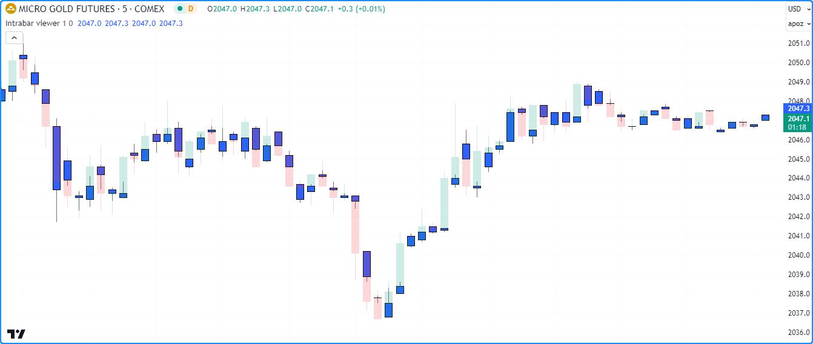

.. code-block:: pine

    //@version=5
    indicator("Requesting LTF collections demo", "Intrabar viewer", true)

    //@variable The timeframe of the LTF data request.
    string lowerTimeframe = input.timeframe("1", "Timeframe")
    //@variable The index of the intrabar to show on each chart bar. 0 is the first available intrabar.
    int intrabarIndex = input.int(0, "Intrabar to show", 0)

    //@variable A custom type to hold an array of price `data`.
    type Prices
        array<float> data

    //@function Returns a new `Prices` instance containing current `open`, `high`, `low`, and `close` prices.
    newPrices() =>
        Prices.new(array.from(open, high, low, close))

    //@variable An array of `Prices` requested from the `lowerTimeframe`.
    array<Prices> requestedPrices = request.security_lower_tf(syminfo.tickerid, lowerTimeframe, newPrices())

    //@variable The `Prices` ID from the `requestedPrices` array at the `intrabarIndex`, or `na` if not available.
    Prices intrabarPrices = array.size(requestedPrices) > intrabarIndex ? array.get(requestedPrices, intrabarIndex) : na
    //@variable The `data` array from the `intrabarPrices`, or an array of `na` values if `intrabarPrices` is `na`.
    array<float> intrabarData = na(intrabarPrices) ? array.new<float>(4, na) : intrabarPrices.data

    // Plot the `intrabarData` values as candles.
    plotcandle(intrabarData.get(0), intrabarData.get(1), intrabarData.get(2), intrabarData.get(3))

Note that:
 - The ``intrabarPrices`` variable only references a ``Prices`` ID if the 
   `size <https://www.tradingview.com/pine-script-reference/v5/#fun_array.size>`__ of the ``requestedPrices`` 
   array is greater than the ``intrabarIndex``, as attempting to use 
   `array.get() <https://www.tradingview.com/pine-script-reference/v5/#fun_array.get>`__ to get an element 
   that doesn't exist will result in an :ref:`out of bounds error <PageArrays_ErrorHandling_IndexIsOutOfBounds>`.
 - The ``intrabarData`` variable only references the ``data`` field from ``intrabarPrices`` if a valid ``Prices`` 
   ID exists since a script cannot reference fields of an `na <https://www.tradingview.com/pine-script-reference/v5/#var_na>`__ value. 
 - The process used in this example is *not* necessary to achieve the intended result. We could instead avoid using 
   :ref:`UDTs <PageTypeSystem_UserDefinedTypes>` and pass an ``[open, high, low, close]`` tuple to the ``expression`` 
   parameter to retrieve a tuple of :ref:`arrays <PageArrays>` for further operations, as explained in the 
   :ref:`previous section <PageOtherTimeframesAndData_RequestSecurityLowerTf_TuplesOfIntrabarData>`. 

.. _PageOtherTimeframesAndData_CustomContexts:

Custom contexts
---------------

Pine Script™ includes multiple ``ticker.*()`` functions that allow scripts to construct *custom* ticker IDs 
that specify additional settings for data requests when used as a ``symbol`` argument in 
`request.security() <https://www.tradingview.com/pine-script-reference/v5/#fun_request.security>`__ 
and `request.security_lower_tf() <https://www.tradingview.com/pine-script-reference/v5/#fun_request.security_lower_tf>`__:

- `ticker.new() <https://www.tradingview.com/pine-script-reference/v5/#fun_ticker.new>`__ constructs a custom 
  ticker ID from a specified ``prefix`` and ``ticker`` with additional ``session`` and ``adjustment`` settings.
- `ticker.modify() <https://www.tradingview.com/pine-script-reference/v5/#fun_ticker.modify>`__ constructs a 
  modified form of a specified ``tickerid`` with additional ``session`` and ``adjustment`` settings.
- `ticker.heikinashi() <https://www.tradingview.com/pine-script-reference/v5/#fun_ticker.heikinashi>`__, 
  `ticker.renko() <https://www.tradingview.com/pine-script-reference/v5/#fun_ticker.renko>`__, 
  `ticker.pointfigure() <https://www.tradingview.com/pine-script-reference/v5/#fun_ticker.pointfigure>`__, 
  `ticker.kagi() <https://www.tradingview.com/pine-script-reference/v5/#fun_ticker.kagi>`__, and 
  `ticker.linebreak() <https://www.tradingview.com/pine-script-reference/v5/#fun_ticker.linebreak>`__ construct 
  a modified form a ``symbol`` with :ref:`non-standard chart <PageNonStandardChartsData>` settings.
- `ticker.inherit() <https://www.tradingview.com/pine-script-reference/v5/#fun_ticker.inherit>`__ constructs a 
  new ticker ID for a ``symbol`` with additional parameters inherited from the ``from_tickerid`` specified in 
  the function call, allowing scripts to request the ``symbol`` data with the same modifiers as the 
  ``from_tickerid``, including session, dividend adjustment, currency conversion, non-standard chart type, 
  back-adjustment, settlement-as-close, etc.
- `ticker.standard() <https://www.tradingview.com/pine-script-reference/v5/#fun_ticker.standard>`__ constructs a 
  standard ticker ID representing the ``symbol`` *without* additional modifiers.

Let's explore some practical examples of applying ``ticker.*()`` functions to request data from custom contexts. 

Suppose we want to include dividend adjustment in a stock symbol's prices without enabling the "Adjust data for dividends" 
option in the "Symbol" section of the chart's settings. We can achieve this in a script by constructing a custom ticker ID 
for the instrument using `ticker.new() <https://www.tradingview.com/pine-script-reference/v5/#fun_ticker.new>`__ 
or `ticker.modify() <https://www.tradingview.com/pine-script-reference/v5/#fun_ticker.modify>`__ with an ``adjustment`` 
value of `adjustment.dividends <https://www.tradingview.com/pine-script-reference/v5/#var_adjustment.dividends>`__.

This script creates an ``adjustedTickerID`` using 
`ticker.modify() <https://www.tradingview.com/pine-script-reference/v5/#fun_ticker.modify>`__, uses that ticker ID 
as the ``symbol`` in `request.security() <https://www.tradingview.com/pine-script-reference/v5/#fun_request.security>`__ 
to retrieve a :ref:`tuple <PageOtherTimeframesAndData_RequestSecurity_RequestableData_Tuples>` of adjusted price values,
then plots the result as `candles <https://www.tradingview.com/pine-script-reference/v5/#fun_plotcandle>`__ on the chart. 
It also highlights the background when the requested prices differ from the prices without dividend adjustment. 

As we see on the "NYSE:XOM" chart below, enabling dividend adjustment results in different historical values before the 
date of the latest dividend:

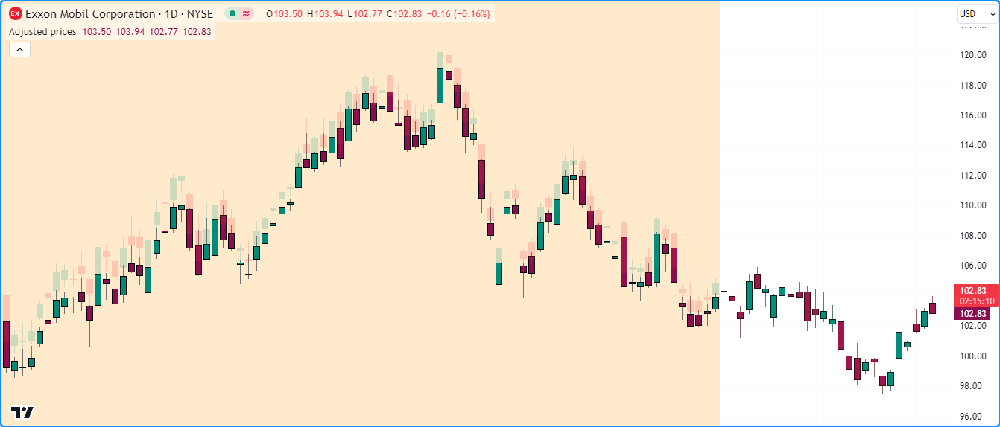

.. code-block:: pine

    //@version=5
    indicator("Custom contexts demo 1", "Adjusted prices", true)

    //@variable A custom ticker ID representing the chart's symbol with the dividend adjustment modifier.
    string adjustedTickerID = ticker.modify(syminfo.tickerid, adjustment = adjustment.dividends)

    // Request the adjusted prices for the chart's symbol.
    [o, h, l, c] = request.security(adjustedTickerID, timeframe.period, [open, high, low, close])

    //@variable The color of the candles on the chart.
    color candleColor = c > o ? color.teal : color.maroon

    // Plot the adjusted prices.
    plotcandle(o, h, l, c, "Adjusted Prices", candleColor)
    // Highlight the background when `c` is different from `close`.
    bgcolor(c != close ? color.new(color.orange, 80) : na)

Note that:
 - If a modifier included in a constructed ticker ID does not apply to the symbol, the script will *ignore* 
   that modifier when requesting data. For instance, this script will display the same values as the main chart 
   on forex symbols such as "EURUSD".

While the example above demonstrates a simple way to modify the chart's symbol, a more frequent use case for ``ticker.*()`` functions 
is applying custom modifiers to another symbol while requesting data. If a ticker ID referenced in a script already has the 
modifiers one would like to apply (e.g., adjustment settings, session type, etc.), they can use 
`ticker.inherit() <https://www.tradingview.com/pine-script-reference/v5/#fun_ticker.inherit>`__ to quickly and efficiently add those 
modifiers to another symbol.

In the example below, we've edited the previous script to request data for a ``symbolInput`` using modifiers inherited 
from the ``adjustedTickerID``. This script calls `ticker.inherit() <https://www.tradingview.com/pine-script-reference/v5/#fun_ticker.inherit>`__ 
to construct an ``inheritedTickerID`` and uses that ticker ID in a 
`request.security() <https://www.tradingview.com/pine-script-reference/v5/#fun_request.security>`__ call. It also requests data 
for the ``symbolInput`` without additional modifiers and plots `candles <https://www.tradingview.com/pine-script-reference/v5/#fun_plotcandle>`__ 
for both ticker IDs in a separate chart pane to compare the difference. 

As shown on the chart, the data requested using the ``inheritedTickerID`` includes dividend adjustment, whereas the data requested 
using the ``symbolInput`` directly does not:

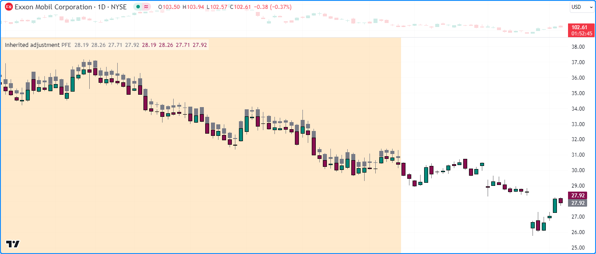

.. code-block:: pine

    //@version=5
    indicator("Custom contexts demo 2", "Inherited adjustment")

    //@variable The symbol to request data from.
    string symbolInput = input.symbol("NYSE:PFE", "Symbol")

    //@variable A custom ticker ID representing the chart's symbol with the dividend adjustment modifier.
    string adjustedTickerID = ticker.modify(syminfo.tickerid, adjustment = adjustment.dividends)
    //@variable A custom ticker ID representing the `symbolInput` with modifiers inherited from the `adjustedTickerID`.
    string inheritedTickerID = ticker.inherit(adjustedTickerID, symbolInput)

    // Request prices using the `symbolInput`.
    [o1, h1, l1, c1] = request.security(symbolInput, timeframe.period, [open, high, low, close])
    // Request prices using the `inheritedTickerID`.
    [o2, h2, l2, c2] = request.security(inheritedTickerID, timeframe.period, [open, high, low, close])

    //@variable The color of the candles that use the `inheritedTickerID` prices.
    color candleColor = c2 > o2 ? color.teal : color.maroon

    // Plot the `symbol` prices.
    plotcandle(o1, h1, l1, c1, "Symbol", color.gray, color.gray, bordercolor = color.gray)
    // Plot the `inheritedTickerID` prices.
    plotcandle(o2, h2, l2, c2, "Symbol With Modifiers", candleColor)
    // Highlight the background when `c1` is different from `c2`.
    bgcolor(c1 != c2 ? color.new(color.orange, 80) : na)

Note that:
 - Since the ``adjustedTickerID`` represents a modified form of the 
   `syminfo.tickerid <https://www.tradingview.com/pine-script-reference/v5/#var_syminfo.tickerid>`__, if we modify the chart's 
   context in other ways, such as changing the chart type or enabling extended trading hours in the chart's settings, those 
   modifiers will also apply to the ``adjustedTickerID`` and ``inheritedTickerID``. However, they will *not* apply to the 
   ``symbolInput`` since it represents a *standard* ticker ID. 

Another frequent use case for requesting custom contexts is retrieving data that uses :ref:`non-standard chart <PageNonStandardChartsData>` 
calculations. For example, suppose we want to use `Renko <https://www.tradingview.com/support/solutions/43000502284-renko-charts/>`__ 
price values to calculate trade signals in a `strategy() <https://www.tradingview.com/pine-script-reference/v5/#fun_strategy>`__ script. 
If we simply change the chart type to "Renko" to get the prices, the :ref:`strategy <PageStrategies>` will also simulate its trades 
based on those synthetic prices, producing `misleading results <https://www.tradingview.com/support/solutions/43000481029/>`__:

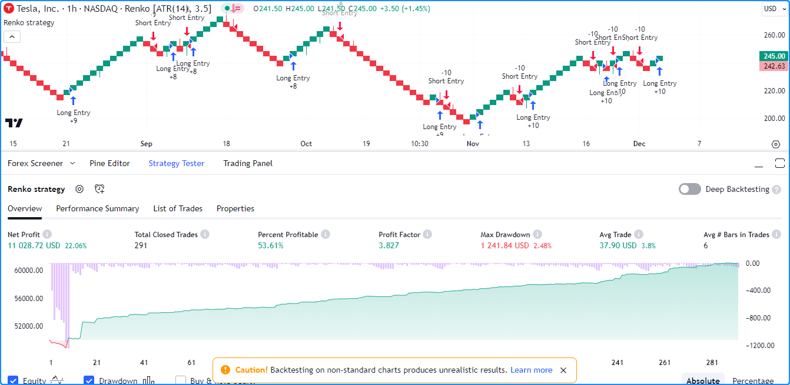

.. code-block:: pine

    //@version=5
    strategy(
         "Custom contexts demo 3", "Renko strategy", true, default_qty_type = strategy.percent_of_equity,
         default_qty_value = 2, initial_capital = 50000, slippage = 2,
         commission_type = strategy.commission.cash_per_contract, commission_value = 1, margin_long = 100,
         margin_short = 100
     )

    //@variable When `true`, the strategy places a long market order.
    bool longEntry = ta.crossover(close, open)
    //@variable When `true`, the strategy places a short market order.
    bool shortEntry = ta.crossunder(close, open)

    if longEntry
        strategy.entry("Long Entry", strategy.long)
    if shortEntry
        strategy.entry("Short Entry", strategy.short)

To ensure our strategy shows results based on *actual* prices, we can create a Renko ticker ID using 
`ticker.renko() <https://www.tradingview.com/pine-script-reference/v5/#fun_ticker.renko>`__ while 
keeping the chart on a *standard type*, allowing the script to request and use 
`Renko <https://www.tradingview.com/support/solutions/43000502284-renko-charts/>`__ prices to 
calculate its signals without calculating the strategy results on them:

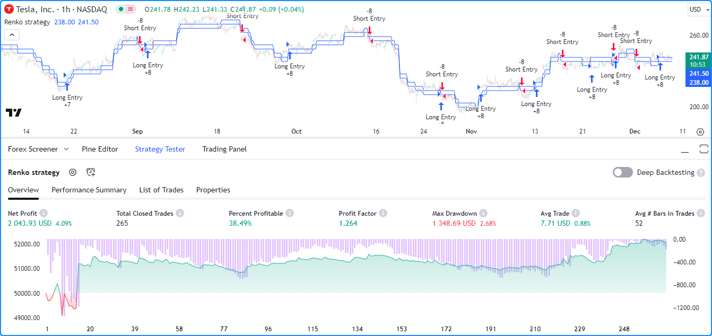

.. code-block:: pine

    //@version=5
    strategy(
         "Custom contexts demo 3", "Renko strategy", true, default_qty_type = strategy.percent_of_equity,
         default_qty_value = 2, initial_capital = 50000, slippage = 1,
         commission_type = strategy.commission.cash_per_contract, commission_value = 1, margin_long = 100,
         margin_short = 100
     )

    //@variable A Renko ticker ID.
    string renkoTickerID = ticker.renko(syminfo.tickerid, "ATR", 14)
    // Request the `open` and `close` prices using the `renkoTickerID`.
    [renkoOpen, renkoClose] = request.security(renkoTickerID, timeframe.period, [open, close])

    //@variable When `true`, the strategy places a long market order.
    bool longEntry = ta.crossover(renkoClose, renkoOpen)
    //@variable When `true`, the strategy places a short market order.
    bool shortEntry = ta.crossunder(renkoClose, renkoOpen)

    if longEntry
        strategy.entry("Long Entry", strategy.long)
    if shortEntry
        strategy.entry("Short Entry", strategy.short)

    plot(renkoOpen)
    plot(renkoClose)

.. _PageOtherTimeframesAndData_HistoricalAndRealtimeBehavior:

Historical and realtime behavior
--------------------------------

Functions in the ``request.*()`` namespace can behave differently on historical and realtime bars. 
This behavior is closely related to Pine's :ref:`Execution model <PageExecutionModel>`. 

Consider how a script behaves within the main context. Throughout the chart's history, the script calculates 
its required values once and *commits* them to that bar so their states are accessible later in the execution. 
On an unconfirmed bar, however, the script recalculates its values on *each update* to the bar's data to align 
with realtime changes. Before recalculating the values on that bar, it reverts calculated values to their last 
committed states, otherwise known as *rollback*, and it only commits values to that bar once the bar closes. 

Now consider the behavior of data requests from other contexts with 
`request.security() <https://www.tradingview.com/pine-script-reference/v5/#fun_request.security>`__. 
As when evaluating historical bars in the main context, 
`request.security() <https://www.tradingview.com/pine-script-reference/v5/#fun_request.security>`__ only returns 
new historical values when it confirms a bar in its specified context. When executing on realtime bars, it returns 
recalculated values on each chart bar, similar to how a script recalculates values in the main context on the open 
chart bar. 

However, the function only *confirms* the requested values when a bar from its context closes. When the script 
restarts its execution, what were previously considered *realtime* bars become *historical* bars. Therefore, 
`request.security() <https://www.tradingview.com/pine-script-reference/v5/#fun_request.security>`__ will only 
return the values it confirmed on those bars. In essence, this behavior means that requested 
data may *repaint* when its values fluctuate on realtime bars without confirmation from the context. 

.. note::
   It's often helpful to distinguish historical bars from realtime bars when working with ``request.*()`` functions. 
   Scripts can determine whether bars have historical or realtime states via the 
   `barstate.ishistory <https://www.tradingview.com/pine-script-reference/v5/#var_barstate.ishistory>`__ and 
   `barstate.isrealtime <https://www.tradingview.com/pine-script-reference/v5/#var_barstate.isrealtime>`__ variables. 

In most circumstances where a script requests data from a broader context, one will typically require confirmed, 
stable values that *do not* fluctuate on realtime bars. The 
:ref:`section below <PageOtherTimeframesAndData_HistoricalAndRealtimeBehavior_AvoidingRepainting>` 
explains how to achieve such a result and avoid repainting data requests.

.. _PageOtherTimeframesAndData_HistoricalAndRealtimeBehavior_AvoidingRepainting:

Avoiding Repainting
^^^^^^^^^^^^^^^^^^^

.. _PageOtherTimeframesAndData_HistoricalAndRealtimeBehavior_AvoidingRepainting_HigherTimeframeData:

Higher-timeframe data
~~~~~~~~~~~~~~~~~~~~~

When requesting values from a higher timeframe, they are subject to repainting since realtime bars 
can contain *unconfirmed* information from developing HTF bars, and the script may adjust the times that 
new values come in on historical bars. To avoid repainting HTF data, one must ensure that the function only 
returns confirmed values with consistent timing on all bars, regardless of bar state.

The most reliable approach to achieve non-repainting results is to use an ``expression`` argument that only 
references past bars (e.g., ``close[1]``) while using 
`barmerge.lookahead_on <https://www.tradingview.com/pine-script-reference/v5/#var_barmerge.lookahead_on>`__ 
as the ``lookahead`` value.

Using `barmerge.lookahead_on <https://www.tradingview.com/pine-script-reference/v5/#var_barmerge.lookahead_on>`__ 
with non-offset HTF data requests is discouraged since it prompts 
`request.security() <https://www.tradingview.com/pine-script-reference/v5/#fun_request.security>`__ to "look ahead" 
to the final values of an HTF bar, retrieving confirmed values *before* they're actually available in the script's 
history. However, if the values used in the ``expression`` are offset by at least one bar, the "future" data the 
function retrieves is no longer from the future. Instead, the data represents confirmed values from established, 
*available* HTF bars. In other words, applying an offset to the ``expression`` effectively prevents the requested 
data from repainting when the script restarts its execution and eliminates lookahead bias in the historical series. 

The following example demonstrates a repainting HTF data request. The script uses 
`request.security() <https://www.tradingview.com/pine-script-reference/v5/#fun_request.security>`__ without offset 
modifications or additional arguments to retrieve the results of a 
`ta.wma() <https://www.tradingview.com/pine-script-reference/v5/#fun_ta.wma>`__ call from a higher timeframe. 
It also highlights the background to indicate which bars were in a realtime state during its calculations. 

As shown on the chart below, the `plot <https://www.tradingview.com/pine-script-reference/v5/#fun_plot>`__ of the 
requested WMA only changes on historical bars when HTF bars close, whereas it fluctuates on all realtime bars since 
the data includes unconfirmed values from the higher timeframe:

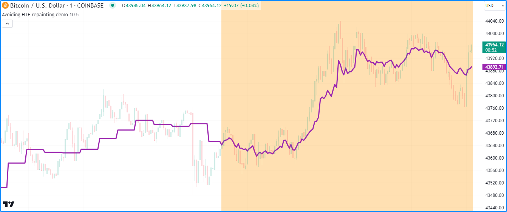

.. code-block:: pine

    //@version=5
    indicator("Avoiding HTF repainting demo", overlay = true)

    //@variable The multiplier applied to the chart's timeframe.
    int tfMultiplier = input.int(10, "Timeframe multiplier", 1)
    //@variable The number of bars in the moving average.
    int length = input.int(5, "WMA smoothing length")

    //@variable The valid timeframe string closest to `tfMultiplier` times larger than the chart timeframe.
    string timeframe = timeframe.from_seconds(timeframe.in_seconds() * tfMultiplier)

    //@variable The weighted MA of `close` prices over `length` bars on the `timeframe`.
    //          This request repaints because it includes unconfirmed HTF data on realtime bars and it may offset the
    //          times of its historical results.
    float requestedWMA = request.security(syminfo.tickerid, timeframe, ta.wma(close, length))

    // Plot the requested series.
    plot(requestedWMA, "HTF WMA", color.purple, 3)
    // Highlight the background on realtime bars.
    bgcolor(barstate.isrealtime ? color.new(color.orange, 70) : na, title = "Realtime bar highlight")

To avoid repainting in this script, we can add ``lookahead = barmerge.lookahead_on`` to the 
`request.security() <https://www.tradingview.com/pine-script-reference/v5/#fun_request.security>`__ call and 
offset the call history of `ta.wma() <https://www.tradingview.com/pine-script-reference/v5/#fun_ta.wma>`__ by 
one bar with the history-referencing operator `[] <https://www.tradingview.com/pine-script-reference/v5/#op_[]>`__, 
ensuring the request always retrieves the last confirmed HTF bar's WMA at the start of each new ``timeframe``. 
Unlike the previous script, this version has consistent behavior on historical and realtime bar states, as we see below:

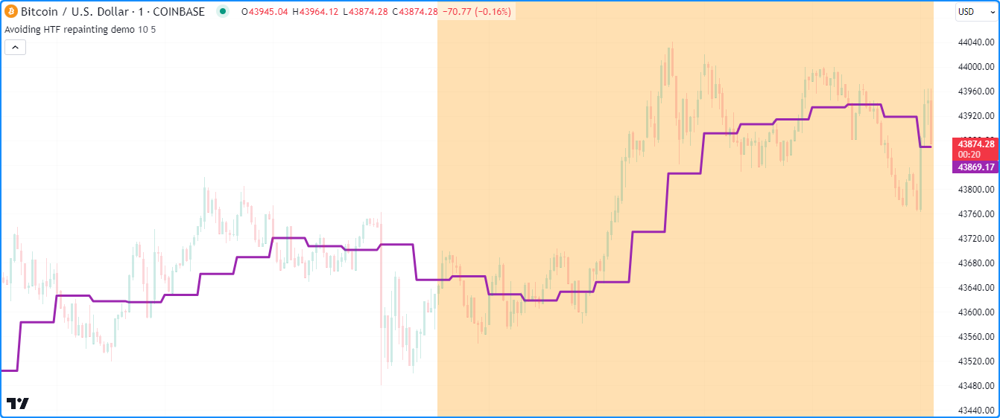

.. code-block:: pine

    //@version=5
    indicator("Avoiding HTF repainting demo", overlay = true)

    //@variable The multiplier applied to the chart's timeframe.
    int tfMultiplier = input.int(10, "Timeframe multiplier", 1)
    //@variable The number of bars in the moving average.
    int length = input.int(5, "WMA smoothing length")

    //@variable The valid timeframe string closest to `tfMultiplier` times larger than the chart timeframe.
    string timeframe = timeframe.from_seconds(timeframe.in_seconds() * tfMultiplier)

    //@variable The weighted MA of `close` prices over `length` bars on the `timeframe`.
    //          This request does not repaint, as it always references the last confirmed WMA value on all bars.
    float requestedWMA = request.security(
         syminfo.tickerid, timeframe, ta.wma(close, length)[1], lookahead = barmerge.lookahead_on
     )
    
    // Plot the requested value.
    plot(requestedWMA, "HTF WMA", color.purple, 3)
    // Highlight the background on realtime bars.
    bgcolor(barstate.isrealtime ? color.new(color.orange, 70) : na, title = "Realtime bar highlight")

.. _PageOtherTimeframesAndData_HistoricalAndRealtimeBehavior_AvoidingRepainting_LowerTimeframeData:

Lower-timeframe data
~~~~~~~~~~~~~~~~~~~~

The `request.security() <https://www.tradingview.com/pine-script-reference/v5/#fun_request.security>`__ and 
`request.security_lower_tf() <https://www.tradingview.com/pine-script-reference/v5/#fun_request.security_lower_tf>`__ 
functions can retrieve data from lower-timeframe contexts. The 
`request.security() <https://www.tradingview.com/pine-script-reference/v5/#fun_request.security>`__ function can 
only retrieve data from a *single* intrabar in each chart bar, and 
`request.security_lower_tf() <https://www.tradingview.com/pine-script-reference/v5/#fun_request.security_lower_tf>`__ 
retrieves data from *all* available intrabars. 

When using these functions to retrieve intrabar data, it's important to note that such requests are **not** immune 
to repainting behavior. Historical and realtime series often rely on *separate* data feeds. Data providers may 
retroactively modify realtime data, and it's possible for races to occur in realtime data feeds, as explained in the 
:ref:`Data feeds <PageOtherTimeframesAndData_DataFeeds>` section of this page. Either case may result in intrabar 
data retrieved on realtime bars repainting after the script restarts its execution. 

Additionally, a particular case that *will* cause repainting LTF requests is using 
`request.security() <https://www.tradingview.com/pine-script-reference/v5/#fun_request.security>`__ with 
`barmerge.lookahead_on <https://www.tradingview.com/pine-script-reference/v5/#var_barmerge.lookahead_on>`__ to 
retrieve data from the first intrabar in each chart bar. While it will generally work as expected on historical bars, 
it will track only the most recent intrabar on realtime bars, as 
`request.security() <https://www.tradingview.com/pine-script-reference/v5/#fun_request.security>`__ does not retain 
all intrabar information, and the intrabars retrieved by the function on realtime bars are unsorted until restarting 
the script's execution:

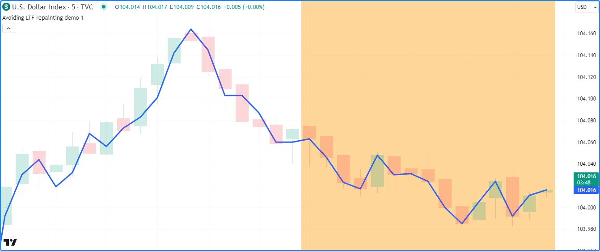

.. code-block:: pine

    //@version=5
    indicator("Avoiding LTF repainting demo", overlay = true)

    //@variable The lower timeframe of the requested data.
    string lowerTimeframe = input.timeframe("1", "Timeframe")

    //@variable The first intrabar `close` requested from the `lowerTimeframe` on each bar.
    //          Only works as intended on historical bars.
    float requestedClose = request.security(syminfo.tickerid, lowerTimeframe, close, lookahead = barmerge.lookahead_on)

    // Plot the `requestedClose`.
    plot(requestedClose, "First intrabar close", linewidth = 3)
    // Highlight the background on realtime bars.
    bgcolor(barstate.isrealtime ? color.new(color.orange, 60) : na, title = "Realtime bar Highlight")

One can mitigate this behavior and track the values from the first intrabar, or any available intrabar in the chart bar, 
by using `request.security_lower_tf() <https://www.tradingview.com/pine-script-reference/v5/#fun_request.security_lower_tf>`__ 
since it maintains an `array <https://www.tradingview.com/pine-script-reference/v5/#type_array>`__ of intrabar values ordered 
by the times they come in. Here, we call `array.first() <https://www.tradingview.com/pine-script-reference/v5/#fun_array.first>`__ 
on a requested `array <https://www.tradingview.com/pine-script-reference/v5/#type_array>`__ of intrabar data to retrieve the 
`close <https://www.tradingview.com/pine-script-reference/v5/#var_close>`__ price from the first available intrabar in each chart bar:

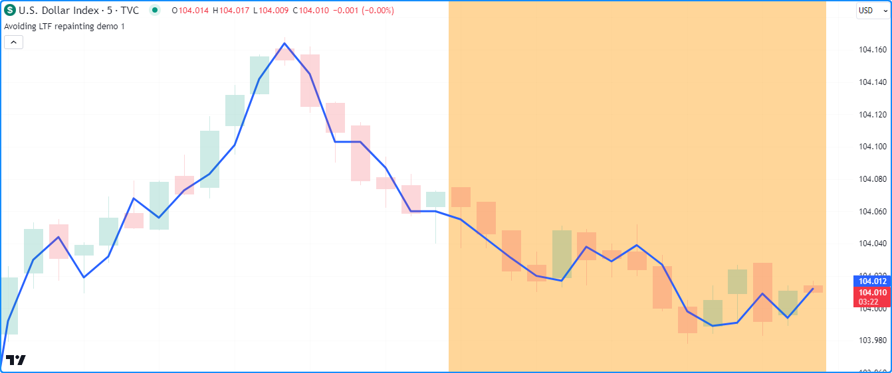

.. code-block:: pine

    //@version=5
    indicator("Avoiding LTF repainting demo", overlay = true)

    //@variable The lower timeframe of the requested data.
    string lowerTimeframe = input.timeframe("1", "Timeframe")

    //@variable An array of intrabar `close` values requested from the `lowerTimeframe` on each bar.
    array<float> requestedCloses = request.security_lower_tf(syminfo.tickerid, lowerTimeframe, close)

    //@variable The first intrabar `close` on each bar with available data.
    float firstClose = requestedCloses.size() > 0 ? requestedCloses.first() : na

    // Plot the `firstClose`.
    plot(firstClose, "First intrabar close", linewidth = 3)
    // Highlight the background on realtime bars.
    bgcolor(barstate.isrealtime ? color.new(color.orange, 60) : na, title = "Realtime bar Highlight")

Note that:
 - While `request.security_lower_tf() <https://www.tradingview.com/pine-script-reference/v5/#fun_request.security_lower_tf>`__ 
   is more optimized for handling historical and realtime intrabars, it's still possible in some cases for minor repainting to 
   occur due to data differences from the provider, as outlined above.
 - This code may not show intrabar data on all available chart bars, depending on how many intrabars each chart bar contains, 
   as ``request.*()`` functions can retrieve up to 100,000 intrabars from an LTF context. See :ref:`this <PageLimitations_RequestCalls>` 
   section of the :ref:`Limitations <PageLimitations>` page for more information.

.. _PageOtherTimeframesAndData_RequestCurrencyRate:

\`request.currency_rate()\`
---------------------------

When a script needs to convert values expressed in one currency to another, one can use 
`request.currency_rate() <https://www.tradingview.com/pine-script-reference/v5/#fun_request.currency_rate>`__. 
This function requests a *daily rate* for currency conversion calculations based on "FX_IDC" data, providing a 
simpler alternative to fetching specific pairs or `spreads <https://www.tradingview.com/support/solutions/43000502298/>`__ 
with `request.security() <https://www.tradingview.com/pine-script-reference/v5/#fun_request.security>`__.

While one can use `request.security() <https://www.tradingview.com/pine-script-reference/v5/#fun_request.security>`__ to 
retrieve daily currency rates, its use case is more involved than 
`request.currency_rate() <https://www.tradingview.com/pine-script-reference/v5/#fun_request.currency_rate>`__, as one needs to 
supply a valid *ticker ID* for a currency pair or spread to request the rate. Additionally, a historical offset and 
`barmerge.lookahead_on <https://www.tradingview.com/pine-script-reference/v5/#var_barmerge.lookahead_on>`__ are necessary to 
prevent the results from repainting, as explained in :ref:`this section <PageOtherTimeframesAndData_HistoricalAndRealtimeBehavior_AvoidingRepainting>`.

The `request.currency_rate() <https://www.tradingview.com/pine-script-reference/v5/#fun_request.currency_rate>`__ function, on the 
other hand, only requires *currency codes*. No ticker ID is needed when requesting rates with this function, and it ensures 
non-repainting results without requiring additional specification. 

The function's signature is as follows:

.. code-block:: text

    request.currency_rate(from, to, ignore_invalid_currency) → series float

The ``from`` parameter specifies the currency to convert, and the ``to`` parameter specifies the target currency. Both parameters 
accept "string" values in the `ISO 4217 <https://en.wikipedia.org/wiki/ISO_4217#Active_codes>`__ format (e.g., "USD") or any built-in 
``currency.*`` variable (e.g., `currency.USD <https://www.tradingview.com/pine-script-reference/v5/#var_currency.USD>`__). 

When the function cannot calculate a valid conversion rate between the ``from`` and ``to`` currencies supplied in the call, one can 
decide whether it will raise a runtime error or return `na <https://www.tradingview.com/pine-script-reference/v5/#var_na>`__ via the 
``ignore_invalid_currency`` parameter. The default value is ``false``, meaning the function will raise a runtime error and halt the 
script's execution. 

The following example demonstrates a simple use case for 
`request.currency_rate() <https://www.tradingview.com/pine-script-reference/v5/#fun_request.currency_rate>`__. 
Suppose we want to convert values expressed in Turkish lira (`currency.TRY <https://www.tradingview.com/pine-script-reference/v5/#var_currency.TRY>`__) 
to South Korean won (`currency.KRW <https://www.tradingview.com/pine-script-reference/v5/#var_currency.KRW>`__) using a daily conversion rate. 
If we use `request.security() <https://www.tradingview.com/pine-script-reference/v5/#fun_request.security>`__ to retrieve the rate, 
we must supply a valid ticker ID and request the last confirmed `close <https://www.tradingview.com/pine-script-reference/v5/#var_close>`__ 
from the previous day. 

In this case, no "FX_IDC" symbol exists that would allow us to retrieve a conversion rate directly with 
`request.security() <https://www.tradingview.com/pine-script-reference/v5/#fun_request.security>`__. Therefore, we first need a ticker ID 
for a `spread <https://www.tradingview.com/support/solutions/43000502298/>`__ that converts TRY to an intermediate currency, such as USD, 
then converts the intermediate currency to KRW. We can then use that ticker ID within 
`request.security() <https://www.tradingview.com/pine-script-reference/v5/#fun_request.security>`__ with ``close[1]`` as the ``expression`` 
and `barmerge.lookahead_on <https://www.tradingview.com/pine-script-reference/v5/#var_barmerge.lookahead_on>`__ as the ``lookahead`` value 
to request a non-repainting daily rate. 

Alternatively, we can achieve the same result more simply by calling 
`request.currency_rate() <https://www.tradingview.com/pine-script-reference/v5/#fun_request.currency_rate>`__. This function does all the 
heavy lifting for us, only requiring ``from`` and ``to`` currency arguments to perform its calculation.

As we see below, both approaches return the same daily rate:

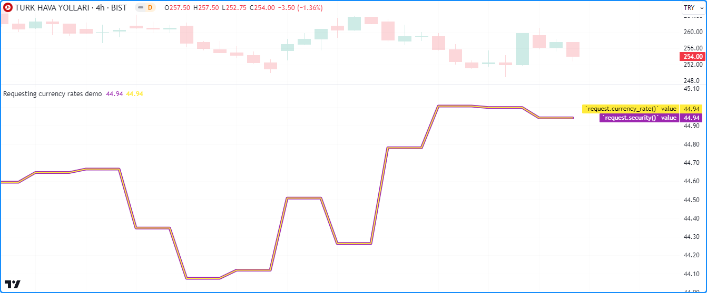

.. code-block:: pine

    //@version=5
    indicator("Requesting currency rates demo")

    //@variable The currency to convert.
    simple string fromCurrency = currency.TRY
    //@variable The resulting currency.
    simple string toCurrency = currency.KRW

    //@variable The spread symbol to request. Required in `request.security()` since no direct "FX_IDC" rate exists.
    simple string spreadSymbol = str.format("FX_IDC:{0}{2} * FX_IDC:{2}{1}", fromCurrency, toCurrency, currency.USD)

    //@variable The non-repainting conversion rate from `request.security()` using the `spreadSymbol`.
    float securityRequestedRate = request.security(spreadSymbol, "1D", close[1], lookahead = barmerge.lookahead_on)
    //@variable The non-repainting conversion rate from `request.currency_rate()`.
    float nonSecurityRequestedRate = request.currency_rate(fromCurrency, toCurrency)

    // Plot the requested rates. We can multiply TRY values by these rates to convert them to KRW.
    plot(securityRequestedRate, "`request.security()` value", color.purple, 5)
    plot(nonSecurityRequestedRate, "`request.currency_rate()` value", color.yellow, 2)

.. _PageOtherTimeframesAndData_RequestDividendsRequestSplitsAndRequestEarnings:

\`request.dividends()\`, \`request.splits()\`, and \`request.earnings()\`
-------------------------------------------------------------------------

Analyzing a stock's earnings data and corporate actions provides helpful insights into its underlying financial strength. 
Pine Script™ provides the ability to retrieve essential information about applicable stocks via 
`request.dividends() <https://www.tradingview.com/pine-script-reference/v5/#fun_request.dividends>`__, 
`request.splits() <https://www.tradingview.com/pine-script-reference/v5/#fun_request.splits>`__, and 
`request.earnings() <https://www.tradingview.com/pine-script-reference/v5/#fun_request.earnings>`__. 

These are the functions' signatures:

.. code-block:: text

    request.dividends(ticker, field, gaps, lookahead, ignore_invalid_symbol, currency) → series float

    request.splits(ticker, field, gaps, lookahead, ignore_invalid_symbol) → series float

    request.earnings(ticker, field, gaps, lookahead, ignore_invalid_symbol, currency) → series float

Each function has the same parameters in its signature, with the exception of 
`request.splits() <https://www.tradingview.com/pine-script-reference/v5/#fun_request.splits>`__, which doesn't have a 
``currency`` paramter. 

Note that unlike the ``symbol`` parameter in other ``request.*()`` functions, the ``ticker`` parameter in these functions 
only accepts an *"Exchange:Symbol" pair*, such as "NASDAQ:AAPL". The built-in 
`syminfo.ticker <https://www.tradingview.com/pine-script-reference/v5/#var_syminfo.ticker>`__ variable does not work with 
these functions since it does not contain exchange information. Instead, one must use 
`syminfo.tickerid <https://www.tradingview.com/pine-script-reference/v5/#var_syminfo.tickerid>`__ for such cases. 

The ``field`` parameter determines the data the function will retrieve. Each of these functions accepts different built-in 
variables as the ``field`` argument since each requests different information about a stock:

- The `request.dividends() <https://www.tradingview.com/pine-script-reference/v5/#fun_request.dividends>`__ function retrieves current 
  dividend information for a stock, i.e., the amount per share the issuing company paid out to investors who purchased shares before 
  the ex-dividend date. Passing the built-in `dividends.gross <https://www.tradingview.com/pine-script-reference/v5/#var_dividends.gross>`__ 
  or `dividends.net <https://www.tradingview.com/pine-script-reference/v5/#var_dividends.net>`__ variables to the ``field`` parameter 
  specifies whether the returned value represents dividends before or after factoring in expenses the company deducts from its payouts.
- The `request.splits() <https://www.tradingview.com/pine-script-reference/v5/#fun_request.splits>`__ function retrieves current split 
  and reverse split information for a stock. A split occurs when a company increases its outstanding shares to promote liquidity. A reverse 
  split occurs when a company consolidates its shares and offers them at a higher price to attract specific investors or maintain their 
  listing on a market that has a minimum per-share price. Companies express their split information as *ratios*. For example, a 5:1 split 
  means the company issued additional shares to its shareholders so that they have five times the number of shares they had before the split, 
  and the raw price of each share becomes one-fifth of the previous price. Passing 
  `splits.numerator <https://www.tradingview.com/pine-script-reference/v5/#var_splits.numerator>`__ or 
  `splits.denominator <https://www.tradingview.com/pine-script-reference/v5/#var_splits.denominator>`__ to the ``field`` parameter of 
  `request.splits() <https://www.tradingview.com/pine-script-reference/v5/#fun_request.splits>`__ determines whether it returns the numerator 
  or denominator of the split ratio.
- The `request.earnings() <https://www.tradingview.com/pine-script-reference/v5/#fun_request.earnings>`__ function retrieves the earnings per 
  share (EPS) information for a stock ``ticker``'s issuing company. The EPS value is the ratio of a company's net income to the number of 
  outstanding stock shares, which investors consider an indicator of the company's profitability. Passing 
  `earnings.actual <https://www.tradingview.com/pine-script-reference/v5/#var_earnings.actual>`__, 
  `earnings.estimate <https://www.tradingview.com/pine-script-reference/v5/#var_earnings.estimate>`__, or 
  `earnings.standardized <https://www.tradingview.com/pine-script-reference/v5/#var_earnings.standardized>`__ as the ``field`` argument 
  in `request.earnings() <https://www.tradingview.com/pine-script-reference/v5/#fun_request.earnings>`__ respectively determines whether 
  the function requests the actual, estimated, or standardized EPS value.

For a detailed explanation of the ``gaps``, ``lookahead``, and ``ignore_invalid_symbol`` parameters of these functions, see the 
:ref:`Common characteristics <PageOtherTimeframesAndData_CommonCharacteristics>` section at the top of this page. 

It's important to note that the values returned by these functions reflect the data available as it comes in. This behavior differs from 
financial data originating from a `request.financial() <https://www.tradingview.com/pine-script-reference/v5/#fun_request.financial>`__ call 
in that the underlying data from such calls becomes available according to a company's fiscal reporting period.

.. note::
   Scripts can also retrieve information about upcoming earnings and dividends for an instrument via the 
   ``earnings.future_*`` and ``dividends.future_*`` built-in variables.

Here, we've included an example that displays a handy `table <https://www.tradingview.com/pine-script-reference/v5/#type_table>`__ containing 
the most recent dividend, split, and EPS data. The script calls the ``request.*()`` functions discussed in this section to retrieve the data, 
then converts the values to "strings" with ``str.*()`` functions and displays the results in the ``infoTable`` with 
`table.cell() <https://www.tradingview.com/pine-script-reference/v5/#fun_table.cell>`__:

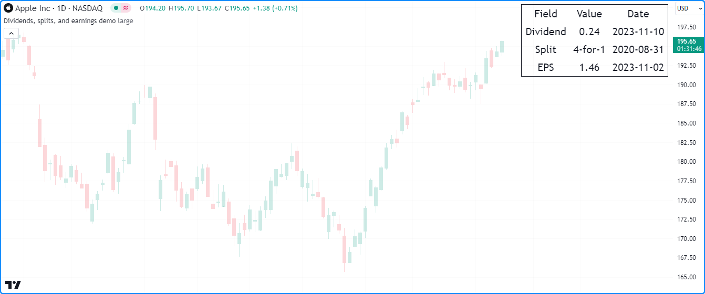

.. code-block:: pine

    //@version=5
    indicator("Dividends, splits, and earnings demo", overlay = true)
    
    //@variable The size of the table's text.
    string tableSize = input.string(
         size.large, "Table size", [size.auto, size.tiny, size.small, size.normal, size.large, size.huge]
     )

    //@variable The color of the table's text and frame.
    var color tableColor = chart.fg_color
    //@variable A `table` displaying the latest dividend, split, and EPS information.
    var table infoTable = table.new(position.top_right, 3, 4, frame_color = tableColor, frame_width = 1)

    // Add header cells on the first bar.
    if barstate.isfirst
        table.cell(infoTable, 0, 0, "Field", text_color = tableColor, text_size = tableSize)
        table.cell(infoTable, 1, 0, "Value", text_color = tableColor, text_size = tableSize)
        table.cell(infoTable, 2, 0, "Date", text_color = tableColor, text_size = tableSize)
        table.cell(infoTable, 0, 1, "Dividend", text_color = tableColor, text_size = tableSize)
        table.cell(infoTable, 0, 2, "Split", text_color = tableColor, text_size = tableSize)
        table.cell(infoTable, 0, 3, "EPS", text_color = tableColor, text_size = tableSize)

    //@variable The amount of the last reported dividend as of the current bar.
    float latestDividend = request.dividends(syminfo.tickerid, dividends.gross, barmerge.gaps_on)
    //@variable The numerator of that last reported split ratio as of the current bar.
    float latestSplitNum = request.splits(syminfo.tickerid, splits.numerator, barmerge.gaps_on)
    //@variable The denominator of the last reported split ratio as of the current bar.
    float latestSplitDen = request.splits(syminfo.tickerid, splits.denominator, barmerge.gaps_on)
    //@variable The last reported earnings per share as of the current bar.
    float latestEPS = request.earnings(syminfo.tickerid, earnings.actual, barmerge.gaps_on)

    // Update the "Value" and "Date" columns when new values come in.
    if not na(latestDividend)
        table.cell(
             infoTable, 1, 1, str.tostring(math.round(latestDividend, 3)), text_color = tableColor, text_size = tableSize
         )
        table.cell(infoTable, 2, 1, str.format_time(time, "yyyy-MM-dd"), text_color = tableColor, text_size = tableSize)
    if not na(latestSplitNum)
        table.cell(
             infoTable, 1, 2, str.format("{0}-for-{1}", latestSplitNum, latestSplitDen), text_color = tableColor,
             text_size = tableSize
         )
        table.cell(infoTable, 2, 2, str.format_time(time, "yyyy-MM-dd"), text_color = tableColor, text_size = tableSize)
    if not na(latestEPS)
        table.cell(infoTable, 1, 3, str.tostring(latestEPS), text_color = tableColor, text_size = tableSize)
        table.cell(infoTable, 2, 3, str.format_time(time, "yyyy-MM-dd"), text_color = tableColor, text_size = tableSize)

Note that:
 - We've included `barmerge.gaps_on <https://www.tradingview.com/pine-script-reference/v5/#var_barmerge.gaps_on>`__ in the 
   ``request.*()`` calls, so they only return values when new data is available. Otherwise, they return 
   `na <https://www.tradingview.com/pine-script-reference/v5/#var_na>`__.
 - The script assigns a `table <https://www.tradingview.com/pine-script-reference/v5/#type_table>`__ ID to the ``infoTable`` 
   variable on the first chart bar. On subsequent bars, it updates necessary cells with new information whenever data is available. 
 - If no information is available from any of the ``request.*()`` calls throughout the chart's history (e.g., if the ``ticker`` 
   has no dividend information), the script does not initialize the corresponding cells since it's unnecessary. 

.. _PageOtherTimeframesAndData_RequestQuandl:

\`request.quandl()\`
--------------------

TradingView forms partnerships with many fintech companies to provide users access to extensive information on financial 
instruments, economic data, and more. One of our many partners is `Nasdaq Data Link <https://data.nasdaq.com/>`__ (formerly 
Quandl), which provides multiple *external* data feeds that scripts can access via the 
`request.quandl() <https://www.tradingview.com/pine-script-reference/v5/#fun_request.quandl>`__ function. 

Here is the function's signature:

.. code-block:: text

    request.quandl(ticker, gaps, index, ignore_invalid_symbol) → series float

The ``ticker`` parameter accepts a "simple string" representing the ID of the database published on Nasdaq Data Link and its 
time series code, separated by the "/" delimiter. For example, the code "FRED/DFF" represents the "Effective Federal Funds Rate" 
time series from the "Federal Reserve Economic Data" database.

The ``index`` parameter accepts a "simple int" representing the *column index* of the requested data, where 0 is the first 
available column. Consult the database's documentaion on Nasdaq Data Link's website to see available columns. 

For details on the ``gaps`` and ``ignore_invalid_symbol`` parameters, see the 
:ref:`Common characteristics <PageOtherTimeframesAndData_CommonCharacteristics>` section of this page.

.. note::
   The `request.quandl() <https://www.tradingview.com/pine-script-reference/v5/#fun_request.quandl>`__ function can only request 
   **free** data from Nasdaq Data Link. No data that requires a paid subscription to their services is accessible with this function. 
   Nasdaq Data Link may change the data it provides over time, and they may not update available datasets regularly. Therefore, it's 
   up to programmers to research the supported data available for request and review the documentation provided for each dataset. 
   You can search for free data `here <https://data.nasdaq.com/search?filters=%5B%22Free%22%5D>`__. 

This script requests Bitcoin hash rate ("HRATE") information from the "Bitcoin Data Insights" ("BCHAIN") database and 
:ref:`plots <PagePlots>` the retrieved time series data on the chart. It uses 
`color.from_gradient() <https://www.tradingview.com/pine-script-reference/v5/#fun_color.from_gradient>`__ to color the 
`area <https://www.tradingview.com/pine-script-reference/v5/#var_plot.style_area>`__ plot based on the distance from the current 
hash rate to its `all-time high <https://www.tradingview.com/pine-script-reference/v5/#fun_ta.max>`__:

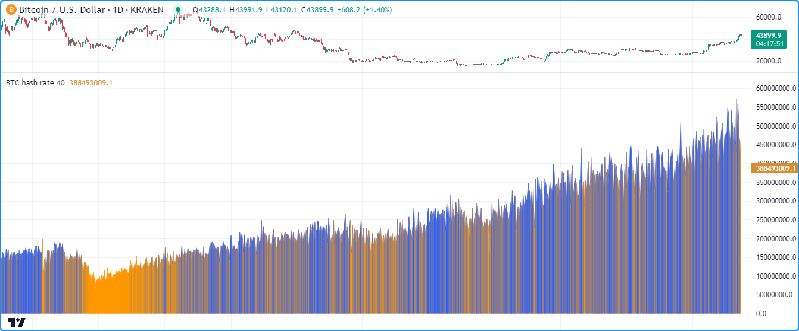

.. code-block:: pine

    //@version=5
    indicator("Quandl demo", "BTC hash rate")

    //@variable The estimated hash rate for the Bitcoin network.
    float hashRate = request.quandl("BCHAIN/HRATE", barmerge.gaps_off, 0)
    //@variable The percentage threshold from the all-time highest `hashRate`.
    float dropThreshold = input.int(40, "Drop threshold", 0, 100)

    //@variable The all-time highest `hashRate`.
    float maxHashRate = ta.max(hashRate)
    //@variable The value `dropThreshold` percent below the `maxHashRate`.
    float minHashRate = maxHashRate * (100 - dropThreshold) / 100
    //@variable The color of the plot based on the `minHashRate` and `maxHashRate`.
    color plotColor = color.from_gradient(hashRate, minHashRate, maxHashRate, color.orange, color.blue)

    // Plot the `hashRate`.
    plot(hashRate, "Hash Rate Estimate", plotColor, style = plot.style_area)

.. _PageOtherTimeframesAndData_RequestFinancial:

\`request.financial()\`
-----------------------

Financial metrics provide investors with insights about a company's economic and financial health that are not tangible 
from solely analyzing its stock prices. TradingView offers a wide variety of financial metrics from `FactSet <https://www.factset.com/>`__ 
that traders can access via the "Financials" tab in the "Indicators" menu of the chart. Scripts can access available metrics 
for an instrument directly via the `request.financial() <https://www.tradingview.com/pine-script-reference/v5/#fun_request.financial>`__ 
function.

This is the function's signature:

.. code-block:: text

    request.financial(symbol, financial_id, period, gaps, ignore_invalid_symbol, currency) → series float

As with the first parameter in `request.dividends() <https://www.tradingview.com/pine-script-reference/v5/#fun_request.dividends>`__, 
`request.splits() <https://www.tradingview.com/pine-script-reference/v5/#fun_request.splits>`__, and 
`request.earnings() <https://www.tradingview.com/pine-script-reference/v5/#fun_request.earnings>`__, the ``symbol`` parameter in 
`request.financial() <https://www.tradingview.com/pine-script-reference/v5/#fun_request.financial>`__ requires an *"Exchange:Symbol" pair*. 
To request financial information for the chart's ticker ID, use 
`syminfo.tickerid <https://www.tradingview.com/pine-script-reference/v5/#var_syminfo.tickerid>`__, as 
`syminfo.ticker <https://www.tradingview.com/pine-script-reference/v5/#var_syminfo.ticker>`__ will not work. 

The ``financial_id`` parameter accepts a "simple string" representing the ID of the requested financial metric. TradingView has 
numerous financial metrics to choose from. See the :ref:`Financial IDs <PageOtherTimeframesAndData_RequestFinancial_FinancialIDs>` 
section below for an overview of all accessible metrics and their "string" identifiers. 

The ``period`` parameter specifies the fiscal period for which new requested data comes in. It accepts one of the following arguments: 
**"FQ" (quarterly), "FH" (semiannual), "FY" (annual), or "TTM" (trailing twelve months)**. Not all fiscal periods are available for 
all metrics or instruments. To confirm which periods are available for specific metrics, see the second column of the tables in the 
:ref:`Financial IDs <PageOtherTimeframesAndData_RequestFinancial_FinancialIDs>` section.

See this page's :ref:`Common characteristics <PageOtherTimeframesAndData_CommonCharacteristics>` section for a detailed explanation of 
this function's ``gaps``, ``ignore_invalid_symbol``, and ``currency`` parameters. 

It's important to note that the data retrieved from this function comes in at a *fixed frequency*, independent of the precise date on 
which the data is made available within a fiscal period. For a company's dividends, splits, and earnings per share (EPS) information, 
one can request data reported on exact dates via `request.dividends() <https://www.tradingview.com/pine-script-reference/v5/#fun_request.dividends>`__, 
`request.splits() <https://www.tradingview.com/pine-script-reference/v5/#fun_request.splits>`__, and 
`request.earnings() <https://www.tradingview.com/pine-script-reference/v5/#fun_request.earnings>`__.

This script uses `request.financial() <https://www.tradingview.com/pine-script-reference/v5/#fun_request.financial>`__ to retrieve information 
about the income and expenses of a stock's issuing company and visualize the profitability of its typical business operations. It requests the 
"OPER_INCOME", "TOTAL_REVENUE", and "TOTAL_OPER_EXPENSE" :ref:`financial IDs <PageOtherTimeframesAndData_RequestFinancial_FinancialIDs>` for 
the `syminfo.tickerid <https://www.tradingview.com/pine-script-reference/v5/#var_syminfo.tickerid>`__ over the latest ``fiscalPeriod``, then 
:ref:`plots <PagePlots>` the results on the chart:

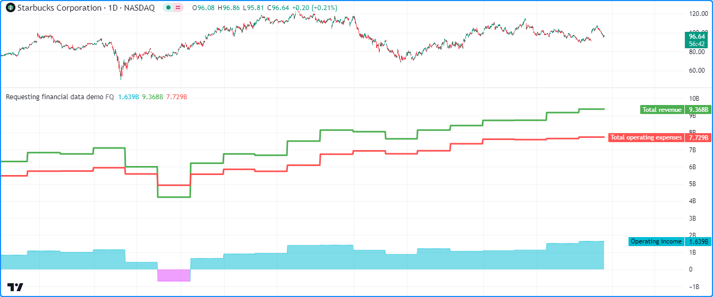

.. code-block:: pine

    //@version=5
    indicator("Requesting financial data demo", format = format.volume)

    //@variable The size of the fiscal reporting period. Some options may not be available, depending on the instrument.
    string fiscalPeriod = input.string("FQ", "Period", ["FQ", "FH", "FY", "TTM"])

    //@variable The operating income after expenses reported for the stock's issuing company.
    float operatingIncome = request.financial(syminfo.tickerid, "OPER_INCOME", fiscalPeriod)
    //@variable The total revenue reported for the stock's issuing company.
    float totalRevenue = request.financial(syminfo.tickerid, "TOTAL_REVENUE", fiscalPeriod)
    //@variable The total operating expenses reported for the stock's issuing company.
    float totalExpenses = request.financial(syminfo.tickerid, "TOTAL_OPER_EXPENSE", fiscalPeriod)

    //@variable Is aqua when the `totalRevenue` exceeds the `totalExpenses`, fuchsia otherwise.
    color incomeColor = operatingIncome > 0 ? color.new(color.aqua, 50) : color.new(color.fuchsia, 50)

    // Display the requested data.
    plot(operatingIncome, "Operating income", incomeColor, 1, plot.style_area)
    plot(totalRevenue, "Total revenue", color.green, 3)
    plot(totalExpenses, "Total operating expenses", color.red, 3)

Note that:
 - Not all ``fiscalPeriod`` options are available for every ticker ID. For example, companies in the US typically publish 
   *quarterly* reports, whereas many European companies publish *semiannual* reports. See 
   `this page <https://www.tradingview.com/support/solutions/43000540147>`__ in our Help Center for more information. 

.. _PageOtherTimeframesAndData_RequestFinancial_CalculatingFinancialMetrics:

Calculating financial metrics
^^^^^^^^^^^^^^^^^^^^^^^^^^^^^

The `request.financial() <https://www.tradingview.com/pine-script-reference/v5/#fun_request.financial>`__ function can provide 
scripts with numerous useful financial metrics that don't require additional calculations. However, some commonly used financial 
estimates require combining an instrument's current market price with requested financial data. Such is the case for:

- Market Capitalization (market price * total shares outstanding)
- Earnings Yield (12-month EPS / market price)
- Price-to-Book Ratio (market price / BVPS)
- Price-to-Earnings Ratio (market price / EPS)
- Price-to-Sales Ratio (market cap / 12-month total revenue)

The following script contains :ref:`user-defined functions <PageUserDefinedFunctions>` that calculate the above financial metrics 
for the `syminfo.tickerid <https://www.tradingview.com/pine-script-reference/v5/#var_syminfo.tickerid>`__. We've created these 
functions so users can easily copy them into their scripts. This example uses them within a 
`str.format() <https://www.tradingview.com/pine-script-reference/v5/#fun_str.format>`__ call to construct a ``tooltipText``, 
which it displays in tooltips on the chart using :ref:`labels <PageTextAndShapes_Labels>`. Hovering over any bar's 
`label <https://www.tradingview.com/pine-script-reference/v5/#type_label>`__ will expose the tooltip containing the metrics 
calculated on that bar:

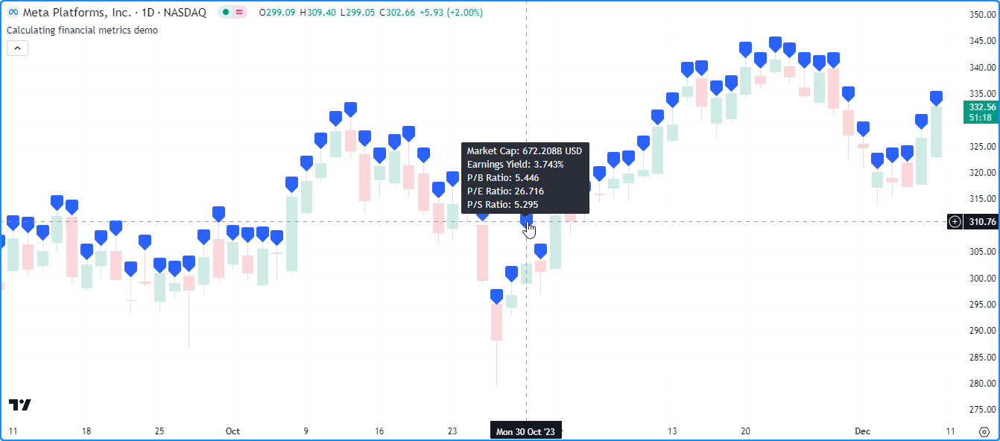

.. code-block:: pine

    //@version=5
    indicator("Calculating financial metrics demo", overlay = true, max_labels_count = 500)

    //@function Calculates the market capitalization (market cap) for the chart's symbol.
    marketCap() =>
        //@variable The most recent number of outstanding shares reported for the symbol.
        float totalSharesOutstanding = request.financial(syminfo.tickerid, "TOTAL_SHARES_OUTSTANDING", "FQ")
        // Return the market cap value.
        totalSharesOutstanding * close

    //@function Calculates the Earnings Yield for the chart's symbol.
    earningsYield() =>
        //@variable The most recent 12-month earnings per share reported for the symbol.
        float eps = request.financial(syminfo.tickerid, "EARNINGS_PER_SHARE", "TTM")
        //Return the Earnings Yield percentage.
        100.0 * eps / close

    //@function Calculates the Price-to-Book (P/B) ratio for the chart's symbol.
    priceBookRatio() =>
        //@variable The most recent Book Value Per Share (BVPS) reported for the symbol.
        float bookValuePerShare = request.financial(syminfo.tickerid, "BOOK_VALUE_PER_SHARE", "FQ")
        // Return the P/B ratio.
        close / bookValuePerShare

    //@function Calculates the Price-to-Earnings (P/E) ratio for the chart's symbol.
    priceEarningsRatio() =>
        //@variable The most recent 12-month earnings per share reported for the symbol.
        float eps = request.financial(syminfo.tickerid, "EARNINGS_PER_SHARE", "TTM")
        // Return the P/E ratio.
        close / eps

    //@function Calculates the Price-to-Sales (P/S) ratio for the chart's symbol.
    priceSalesRatio() =>
        //@variable The most recent number of outstanding shares reported for the symbol.
        float totalSharesOutstanding = request.financial(syminfo.tickerid, "TOTAL_SHARES_OUTSTANDING", "FQ")
        //@variable The most recent 12-month total revenue reported for the symbol.
        float totalRevenue = request.financial(syminfo.tickerid, "TOTAL_REVENUE", "TTM")
        // Return the P/S ratio.
        totalSharesOutstanding * close / totalRevenue

    //@variable The text to display in label tooltips.
    string tooltipText = str.format(
         "Market Cap: {0} {1}\nEarnings Yield: {2}%\nP/B Ratio: {3}\nP/E Ratio: {4}\nP/S Ratio: {5}",
         str.tostring(marketCap(), format.volume), syminfo.currency, earningsYield(), priceBookRatio(),
         priceEarningsRatio(), priceSalesRatio()
     )

    //@variable Displays a blank label with a tooltip containing the `tooltipText`.
    label info = label.new(chart.point.now(high), tooltip = tooltipText)

Note that:
 - Since not all companies publish quarterly financial reports, one may need to change the "FQ" in these functions 
   to match the minimum reporting period for a specific company, as the 
   `request.financial() <https://www.tradingview.com/pine-script-reference/v5/#fun_request.financial>`__ calls will 
   return `na <https://www.tradingview.com/pine-script-reference/v5/#var_na>`__ when "FQ" data isn't available. 

.. _PageOtherTimeframesAndData_RequestFinancial_FinancialIDs:

Financial IDs
^^^^^^^^^^^^^

Below is an overview of all financial metrics one can request via 
`request.financial() <https://www.tradingview.com/pine-script-reference/v5/#fun_request.financial>`__, along with the 
periods in which reports may be available. We've divided this information into four tables corresponding to the categories 
displayed in the "Financials" section of the "Indicators" menu:

- :ref:`Income statements <PageOtherTimeframesAndData_RequestFinancial_FinancialIDs_IncomeStatements>`
- :ref:`Balance sheet <PageOtherTimeframesAndData_RequestFinancial_FinancialIDs_BalanceSheet>`
- :ref:`Cash flow <PageOtherTimeframesAndData_RequestFinancial_FinancialIDs_CashFlow>`
- :ref:`Statistics <PageOtherTimeframesAndData_RequestFinancial_FinancialIDs_Statistics>`

Each table has the following three columns:

- The first column contains descriptions of each metric with links to Help Center pages for additional information. 
- The second column lists the possible ``period`` arguments allowed for the metric. Note that all available values 
  may not be compatible with specific ticker IDs, e.g., while "FQ" may be a possible argument, it will not work if 
  the issuing company does not publish quarterly data.
- The third column lists the "string" IDs for the ``financial_id`` argument in 
  `request.financial() <https://www.tradingview.com/pine-script-reference/v5/#fun_request.financial>`__. 

.. note::
   The tables in these sections are quite lengthy, as there are many ``financial_id`` arguments available. 
   Use the **"Click to show/hide"** option above each table to toggle its visibility.

.. _PageOtherTimeframesAndData_RequestFinancial_FinancialIDs_IncomeStatements:

Income statements
~~~~~~~~~~~~~~~~~

This table lists the available metrics that provide information about a company's income, costs, profits and losses. 

.. raw:: html

   

   
<a>Click to show/hide</a>

+---------------------------------------------------------------------------------------------------------------------+-----------------+------------------------------+
| Financial                                                                                                           | ``period``      | ``financial_id``             |
+=====================================================================================================================+=================+==============================+
| `After tax other income/expense <https://www.tradingview.com/support/solutions/43000563497>`__                      | FQ, FH, FY, TTM | AFTER_TAX_OTHER_INCOME       |
+---------------------------------------------------------------------------------------------------------------------+-----------------+------------------------------+
| `Average basic shares outstanding <https://www.tradingview.com/support/solutions/43000670320>`__                    | FQ, FH, FY      | BASIC_SHARES_OUTSTANDING     |
+---------------------------------------------------------------------------------------------------------------------+-----------------+------------------------------+
| `Basic earnings per share (Basic EPS) <https://www.tradingview.com/support/solutions/43000563520>`__                | FQ, FH, FY, TTM | EARNINGS_PER_SHARE_BASIC     |
+---------------------------------------------------------------------------------------------------------------------+-----------------+------------------------------+
| `Cost of goods sold <https://www.tradingview.com/support/solutions/43000553618>`__                                  | FQ, FH, FY, TTM | COST_OF_GOODS                |
+---------------------------------------------------------------------------------------------------------------------+-----------------+------------------------------+
| `Deprecation and amortization <https://www.tradingview.com/support/solutions/43000563477>`__                        | FQ, FH, FY, TTM | DEP_AMORT_EXP_INCOME_S       |
+---------------------------------------------------------------------------------------------------------------------+-----------------+------------------------------+
| `Diluted earnings per share (Diluted EPS) <https://www.tradingview.com/support/solutions/43000553616>`__            | FQ, FH, FY, TTM | EARNINGS_PER_SHARE_DILUTED   |
+---------------------------------------------------------------------------------------------------------------------+-----------------+------------------------------+
| `Diluted net income available to common stockholders <https://www.tradingview.com/support/solutions/43000563516>`__ | FQ, FH, FY, TTM | DILUTED_NET_INCOME           |
+---------------------------------------------------------------------------------------------------------------------+-----------------+------------------------------+
| `Diluted shares outstanding <https://www.tradingview.com/support/solutions/43000670322>`__                          | FQ, FH, FY      | DILUTED_SHARES_OUTSTANDING   |
+---------------------------------------------------------------------------------------------------------------------+-----------------+------------------------------+
| `Dilution adjustment <https://www.tradingview.com/support/solutions/43000563504>`__                                 | FQ, FH, FY, TTM | DILUTION_ADJUSTMENT          |
+---------------------------------------------------------------------------------------------------------------------+-----------------+------------------------------+
| `Discontinued operations <https://www.tradingview.com/support/solutions/43000563502>`__                             | FQ, FH, FY, TTM | DISCONTINUED_OPERATIONS      |
+---------------------------------------------------------------------------------------------------------------------+-----------------+------------------------------+
| `EBIT <https://www.tradingview.com/support/solutions/43000670329>`__                                                | FQ, FH, FY, TTM | EBIT                         |
+---------------------------------------------------------------------------------------------------------------------+-----------------+------------------------------+
| `EBITDA <https://www.tradingview.com/support/solutions/43000553610>`__                                              | FQ, FH, FY, TTM | EBITDA                       |
+---------------------------------------------------------------------------------------------------------------------+-----------------+------------------------------+
| `Equity in earnings <https://www.tradingview.com/support/solutions/43000563487>`__                                  | FQ, FH, FY, TTM | EQUITY_IN_EARNINGS           |
+---------------------------------------------------------------------------------------------------------------------+-----------------+------------------------------+
| `Gross profit <https://www.tradingview.com/support/solutions/43000553611>`__                                        | FQ, FH, FY, TTM | GROSS_PROFIT                 |
+---------------------------------------------------------------------------------------------------------------------+-----------------+------------------------------+
| `Interest capitalized <https://www.tradingview.com/support/solutions/43000563468>`__                                | FQ, FH, FY, TTM | INTEREST_CAPITALIZED         |
+---------------------------------------------------------------------------------------------------------------------+-----------------+------------------------------+
| `Interest expense on debt <https://www.tradingview.com/support/solutions/43000563467>`__                            | FQ, FH, FY, TTM | INTEREST_EXPENSE_ON_DEBT     |
+---------------------------------------------------------------------------------------------------------------------+-----------------+------------------------------+
| `Interest expense, net of interest capitalized <https://www.tradingview.com/support/solutions/43000563466>`__       | FQ, FH, FY, TTM | NON_OPER_INTEREST_EXP        |
+---------------------------------------------------------------------------------------------------------------------+-----------------+------------------------------+
| `Miscellaneous non-operating expense <https://www.tradingview.com/support/solutions/43000563479>`__                 | FQ, FH, FY, TTM | OTHER_INCOME                 |
+---------------------------------------------------------------------------------------------------------------------+-----------------+------------------------------+
| `Net income <https://www.tradingview.com/support/solutions/43000553617>`__                                          | FQ, FH, FY, TTM | NET_INCOME                   |
+---------------------------------------------------------------------------------------------------------------------+-----------------+------------------------------+
| `Net income before discontinued operations <https://www.tradingview.com/support/solutions/43000563500>`__           | FQ, FH, FY, TTM | NET_INCOME_BEF_DISC_OPER     |
+---------------------------------------------------------------------------------------------------------------------+-----------------+------------------------------+
| `Non-controlling/minority interest <https://www.tradingview.com/support/solutions/43000563495>`__                   | FQ, FH, FY, TTM | MINORITY_INTEREST_EXP        |
+---------------------------------------------------------------------------------------------------------------------+-----------------+------------------------------+
| `Non-operating income, excl. interest expenses <https://www.tradingview.com/support/solutions/43000563471>`__       | FQ, FH, FY, TTM | NON_OPER_INCOME              |
+---------------------------------------------------------------------------------------------------------------------+-----------------+------------------------------+
| `Non-operating income, total <https://www.tradingview.com/support/solutions/43000563465>`__                         | FQ, FH, FY, TTM | TOTAL_NON_OPER_INCOME        |
+---------------------------------------------------------------------------------------------------------------------+-----------------+------------------------------+
| `Non-operating interest income <https://www.tradingview.com/support/solutions/43000563473>`__                       | FQ, FH, FY, TTM | NON_OPER_INTEREST_INCOME     |
+---------------------------------------------------------------------------------------------------------------------+-----------------+------------------------------+
| `Operating expenses (excl. COGS) <https://www.tradingview.com/support/solutions/43000563463>`__                     | FQ, FH, FY, TTM | OPERATING_EXPENSES           |
+---------------------------------------------------------------------------------------------------------------------+-----------------+------------------------------+
| `Operating income <https://www.tradingview.com/support/solutions/43000563464>`__                                    | FQ, FH, FY, TTM | OPER_INCOME                  |
+---------------------------------------------------------------------------------------------------------------------+-----------------+------------------------------+
| `Other cost of goods sold <https://www.tradingview.com/support/solutions/43000563478>`__                            | FQ, FH, FY, TTM | COST_OF_GOODS_EXCL_DEP_AMORT |
+---------------------------------------------------------------------------------------------------------------------+-----------------+------------------------------+
| `Other operating expenses, total <https://www.tradingview.com/support/solutions/43000563483>`__                     | FQ, FH, FY, TTM | OTHER_OPER_EXPENSE_TOTAL     |
+---------------------------------------------------------------------------------------------------------------------+-----------------+------------------------------+
| `Preferred dividends <https://www.tradingview.com/support/solutions/43000563506>`__                                 | FQ, FH, FY, TTM | PREFERRED_DIVIDENDS          |
+---------------------------------------------------------------------------------------------------------------------+-----------------+------------------------------+
| `Pretax equity in earnings <https://www.tradingview.com/support/solutions/43000563474>`__                           | FQ, FH, FY, TTM | PRETAX_EQUITY_IN_EARNINGS    |
+---------------------------------------------------------------------------------------------------------------------+-----------------+------------------------------+
| `Pretax income <https://www.tradingview.com/support/solutions/43000563462>`__                                       | FQ, FH, FY, TTM | PRETAX_INCOME                |
+---------------------------------------------------------------------------------------------------------------------+-----------------+------------------------------+
| `Research & development <https://www.tradingview.com/support/solutions/43000553612>`__                              | FQ, FH, FY, TTM | RESEARCH_AND_DEV             |
+---------------------------------------------------------------------------------------------------------------------+-----------------+------------------------------+
| `Selling/general/admin expenses, other <https://www.tradingview.com/support/solutions/43000553614>`__               | FQ, FH, FY, TTM | SELL_GEN_ADMIN_EXP_OTHER     |
+---------------------------------------------------------------------------------------------------------------------+-----------------+------------------------------+
| `Selling/general/admin expenses, total <https://www.tradingview.com/support/solutions/43000553613>`__               | FQ, FH, FY, TTM | SELL_GEN_ADMIN_EXP_TOTAL     |
+---------------------------------------------------------------------------------------------------------------------+-----------------+------------------------------+
| `Taxes <https://www.tradingview.com/support/solutions/43000563492>`__                                               | FQ, FH, FY, TTM | INCOME_TAX                   |
+---------------------------------------------------------------------------------------------------------------------+-----------------+------------------------------+
| `Total operating expenses <https://www.tradingview.com/support/solutions/43000553615>`__                            | FQ, FH, FY, TTM | TOTAL_OPER_EXPENSE           |
+---------------------------------------------------------------------------------------------------------------------+-----------------+------------------------------+
| `Total revenue <https://www.tradingview.com/support/solutions/43000553619>`__                                       | FQ, FH, FY, TTM | TOTAL_REVENUE                |
+---------------------------------------------------------------------------------------------------------------------+-----------------+------------------------------+
| `Unusual income/expense <https://www.tradingview.com/support/solutions/43000563476>`__                              | FQ, FH, FY, TTM | UNUSUAL_EXPENSE_INC          |
+---------------------------------------------------------------------------------------------------------------------+-----------------+------------------------------+

.. raw:: html

   

.. _PageOtherTimeframesAndData_RequestFinancial_FinancialIDs_BalanceSheet:

Balance sheet
~~~~~~~~~~~~~

This table lists the metrics that provide information about a company's capital structure.

.. raw:: html

   

   
<a>Click to show/hide</a>

+------------------------------------------------------------------------------------------------------------------+------------+-------------------------------------+
| Financial                                                                                                        | ``period`` | ``financial_id``                    |
+==================================================================================================================+============+=====================================+
| `Accounts payable <https://www.tradingview.com/support/solutions/43000563619>`__                                 | FQ, FH, FY | ACCOUNTS_PAYABLE                    |
+------------------------------------------------------------------------------------------------------------------+------------+-------------------------------------+
| `Accounts receivable - trade, net <https://www.tradingview.com/support/solutions/43000563740>`__                 | FQ, FH, FY | ACCOUNTS_RECEIVABLES_NET            |
+------------------------------------------------------------------------------------------------------------------+------------+-------------------------------------+
| `Accrued payroll <https://www.tradingview.com/support/solutions/43000563628>`__                                  | FQ, FH, FY | ACCRUED_PAYROLL                     |
+------------------------------------------------------------------------------------------------------------------+------------+-------------------------------------+
| `Accumulated depreciation, total <https://www.tradingview.com/support/solutions/43000563673>`__                  | FQ, FH, FY | ACCUM_DEPREC_TOTAL                  |
+------------------------------------------------------------------------------------------------------------------+------------+-------------------------------------+
| `Additional paid-in capital/Capital surplus <https://www.tradingview.com/support/solutions/43000563874>`__       | FQ, FH, FY | ADDITIONAL_PAID_IN_CAPITAL          |
+------------------------------------------------------------------------------------------------------------------+------------+-------------------------------------+
| `Book value per share <https://www.tradingview.com/support/solutions/43000670330>`__                             | FQ, FH, FY | BOOK_VALUE_PER_SHARE                |
+------------------------------------------------------------------------------------------------------------------+------------+-------------------------------------+
| `Capital and operating lease obligations <https://www.tradingview.com/support/solutions/43000563522>`__          | FQ, FH, FY | CAPITAL_OPERATING_LEASE_OBLIGATIONS |
+------------------------------------------------------------------------------------------------------------------+------------+-------------------------------------+
| `Capitalized lease obligations <https://www.tradingview.com/support/solutions/43000563527>`__                    | FQ, FH, FY | CAPITAL_LEASE_OBLIGATIONS           |
+------------------------------------------------------------------------------------------------------------------+------------+-------------------------------------+
| `Cash & equivalents <https://www.tradingview.com/support/solutions/43000563709>`__                               | FQ, FH, FY | CASH_N_EQUIVALENTS                  |
+------------------------------------------------------------------------------------------------------------------+------------+-------------------------------------+
| `Cash and short term investments <https://www.tradingview.com/support/solutions/43000563702>`__                  | FQ, FH, FY | CASH_N_SHORT_TERM_INVEST            |
+------------------------------------------------------------------------------------------------------------------+------------+-------------------------------------+
| `Common equity, total <https://www.tradingview.com/support/solutions/43000563866>`__                             | FQ, FH, FY | COMMON_EQUITY_TOTAL                 |
+------------------------------------------------------------------------------------------------------------------+------------+-------------------------------------+
| `Common stock par/Carrying value <https://www.tradingview.com/support/solutions/43000563873>`__                  | FQ, FH, FY | COMMON_STOCK_PAR                    |
+------------------------------------------------------------------------------------------------------------------+------------+-------------------------------------+
| `Current portion of LT debt and capital leases <https://www.tradingview.com/support/solutions/43000563557>`__    | FQ, FH, FY | CURRENT_PORT_DEBT_CAPITAL_LEASES    |
+------------------------------------------------------------------------------------------------------------------+------------+-------------------------------------+
| `Deferred income, current <https://www.tradingview.com/support/solutions/43000563631>`__                         | FQ, FH, FY | DEFERRED_INCOME_CURRENT             |
+------------------------------------------------------------------------------------------------------------------+------------+-------------------------------------+
| `Deferred income, non-current <https://www.tradingview.com/support/solutions/43000563540>`__                     | FQ, FH, FY | DEFERRED_INCOME_NON_CURRENT         |
+------------------------------------------------------------------------------------------------------------------+------------+-------------------------------------+
| `Deferred tax assets <https://www.tradingview.com/support/solutions/43000563683>`__                              | FQ, FH, FY | DEFERRED_TAX_ASSESTS                |
+------------------------------------------------------------------------------------------------------------------+------------+-------------------------------------+
| `Deferred tax liabilities <https://www.tradingview.com/support/solutions/43000563536>`__                         | FQ, FH, FY | DEFERRED_TAX_LIABILITIES            |
+------------------------------------------------------------------------------------------------------------------+------------+-------------------------------------+
| `Dividends payable <https://www.tradingview.com/support/solutions/43000563624>`__                                | FY         | DIVIDENDS_PAYABLE                   |
+------------------------------------------------------------------------------------------------------------------+------------+-------------------------------------+
| `Goodwill, net <https://www.tradingview.com/support/solutions/43000563688>`__                                    | FQ, FH, FY | GOODWILL                            |
+------------------------------------------------------------------------------------------------------------------+------------+-------------------------------------+
| `Gross property/plant/equipment <https://www.tradingview.com/support/solutions/43000563667>`__                   | FQ, FH, FY | PPE_TOTAL_GROSS                     |
+------------------------------------------------------------------------------------------------------------------+------------+-------------------------------------+
| `Income tax payable <https://www.tradingview.com/support/solutions/43000563621>`__                               | FQ, FH, FY | INCOME_TAX_PAYABLE                  |
+------------------------------------------------------------------------------------------------------------------+------------+-------------------------------------+
| `Inventories - finished goods <https://www.tradingview.com/support/solutions/43000563749>`__                     | FQ, FH, FY | INVENTORY_FINISHED_GOODS            |
+------------------------------------------------------------------------------------------------------------------+------------+-------------------------------------+
| `Inventories - progress payments & other <https://www.tradingview.com/support/solutions/43000563748>`__          | FQ, FH, FY | INVENTORY_PROGRESS_PAYMENTS         |
+------------------------------------------------------------------------------------------------------------------+------------+-------------------------------------+
| `Inventories - raw materials <https://www.tradingview.com/support/solutions/43000563753>`__                      | FQ, FH, FY | INVENTORY_RAW_MATERIALS             |
+------------------------------------------------------------------------------------------------------------------+------------+-------------------------------------+
| `Inventories - work in progress <https://www.tradingview.com/support/solutions/43000563746>`__                   | FQ, FH, FY | INVENTORY_WORK_IN_PROGRESS          |
+------------------------------------------------------------------------------------------------------------------+------------+-------------------------------------+
| `Investments in unconsolidated subsidiaries <https://www.tradingview.com/support/solutions/43000563645>`__       | FQ, FH, FY | INVESTMENTS_IN_UNCONCSOLIDATE       |
+------------------------------------------------------------------------------------------------------------------+------------+-------------------------------------+
| `Long term debt <https://www.tradingview.com/support/solutions/43000553621>`__                                   | FQ, FH, FY | LONG_TERM_DEBT                      |
+------------------------------------------------------------------------------------------------------------------+------------+-------------------------------------+
| `Long term debt excl. lease liabilities <https://www.tradingview.com/support/solutions/43000563521>`__           | FQ, FH, FY | LONG_TERM_DEBT_EXCL_CAPITAL_LEASE   |
+------------------------------------------------------------------------------------------------------------------+------------+-------------------------------------+
| `Long term investments <https://www.tradingview.com/support/solutions/43000563639>`__                            | FQ, FH, FY | LONG_TERM_INVESTMENTS               |
+------------------------------------------------------------------------------------------------------------------+------------+-------------------------------------+
| `Minority interest <https://www.tradingview.com/support/solutions/43000563884>`__                                | FQ, FH, FY | MINORITY_INTEREST                   |
+------------------------------------------------------------------------------------------------------------------+------------+-------------------------------------+
| `Net debt <https://www.tradingview.com/support/solutions/43000665310>`__                                         | FQ, FH, FY | NET_DEBT                            |
+------------------------------------------------------------------------------------------------------------------+------------+-------------------------------------+
| `Net intangible assets <https://www.tradingview.com/support/solutions/43000563686>`__                            | FQ, FH, FY | INTANGIBLES_NET                     |
+------------------------------------------------------------------------------------------------------------------+------------+-------------------------------------+
| `Net property/plant/equipment <https://www.tradingview.com/support/solutions/43000563657>`__                     | FQ, FH, FY | PPE_TOTAL_NET                       |
+------------------------------------------------------------------------------------------------------------------+------------+-------------------------------------+
| `Note receivable - long term <https://www.tradingview.com/support/solutions/43000563641>`__                      | FQ, FH, FY | LONG_TERM_NOTE_RECEIVABLE           |
+------------------------------------------------------------------------------------------------------------------+------------+-------------------------------------+
| `Notes payable <https://www.tradingview.com/support/solutions/43000563600>`__                                    | FY         | NOTES_PAYABLE_SHORT_TERM_DEBT       |
+------------------------------------------------------------------------------------------------------------------+------------+-------------------------------------+
| `Operating lease liabilities <https://www.tradingview.com/support/solutions/43000563532>`__                      | FQ, FH, FY | OPERATING_LEASE_LIABILITIES         |
+------------------------------------------------------------------------------------------------------------------+------------+-------------------------------------+
| `Other common equity <https://www.tradingview.com/support/solutions/43000563877>`__                              | FQ, FH, FY | OTHER_COMMON_EQUITY                 |
+------------------------------------------------------------------------------------------------------------------+------------+-------------------------------------+
| `Other current assets, total <https://www.tradingview.com/support/solutions/43000563761>`__                      | FQ, FH, FY | OTHER_CURRENT_ASSETS_TOTAL          |
+------------------------------------------------------------------------------------------------------------------+------------+-------------------------------------+
| `Other current liabilities <https://www.tradingview.com/support/solutions/43000563635>`__                        | FQ, FH, FY | OTHER_CURRENT_LIABILITIES           |
+------------------------------------------------------------------------------------------------------------------+------------+-------------------------------------+
| `Other intangibles, net <https://www.tradingview.com/support/solutions/43000563689>`__                           | FQ, FH, FY | OTHER_INTANGIBLES_NET               |
+------------------------------------------------------------------------------------------------------------------+------------+-------------------------------------+
| `Other investments <https://www.tradingview.com/support/solutions/43000563649>`__                                | FQ, FH, FY | OTHER_INVESTMENTS                   |
+------------------------------------------------------------------------------------------------------------------+------------+-------------------------------------+
| `Other long term assets, total <https://www.tradingview.com/support/solutions/43000563693>`__                    | FQ, FH, FY | LONG_TERM_OTHER_ASSETS_TOTAL        |
+------------------------------------------------------------------------------------------------------------------+------------+-------------------------------------+
| `Other non-current liabilities, total <https://www.tradingview.com/support/solutions/43000563545>`__             | FQ, FH, FY | OTHER_LIABILITIES_TOTAL             |
+------------------------------------------------------------------------------------------------------------------+------------+-------------------------------------+
| `Other receivables <https://www.tradingview.com/support/solutions/43000563741>`__                                | FQ, FH, FY | OTHER_RECEIVABLES                   |
+------------------------------------------------------------------------------------------------------------------+------------+-------------------------------------+
| `Other short term debt <https://www.tradingview.com/support/solutions/43000563614>`__                            | FY         | OTHER_SHORT_TERM_DEBT               |
+------------------------------------------------------------------------------------------------------------------+------------+-------------------------------------+
| `Paid in capital <https://www.tradingview.com/support/solutions/43000563871>`__                                  | FQ, FH, FY | PAID_IN_CAPITAL                     |
+------------------------------------------------------------------------------------------------------------------+------------+-------------------------------------+
| `Preferred stock, carrying value <https://www.tradingview.com/support/solutions/43000563879>`__                  | FQ, FH, FY | PREFERRED_STOCK_CARRYING_VALUE      |
+------------------------------------------------------------------------------------------------------------------+------------+-------------------------------------+
| `Prepaid expenses <https://www.tradingview.com/support/solutions/43000563757>`__                                 | FQ, FH, FY | PREPAID_EXPENSES                    |
+------------------------------------------------------------------------------------------------------------------+------------+-------------------------------------+
| `Provision for risks & charge <https://www.tradingview.com/support/solutions/43000563535>`__                     | FQ, FH, FY | PROVISION_F_RISKS                   |
+------------------------------------------------------------------------------------------------------------------+------------+-------------------------------------+
| `Retained earnings <https://www.tradingview.com/support/solutions/43000563867>`__                                | FQ, FH, FY | RETAINED_EARNINGS                   |
+------------------------------------------------------------------------------------------------------------------+------------+-------------------------------------+
| `Shareholders' equity <https://www.tradingview.com/support/solutions/43000557442>`__                             | FQ, FH, FY | SHRHLDRS_EQUITY                     |
+------------------------------------------------------------------------------------------------------------------+------------+-------------------------------------+
| `Short term debt <https://www.tradingview.com/support/solutions/43000563554>`__                                  | FQ, FH, FY | SHORT_TERM_DEBT                     |
+------------------------------------------------------------------------------------------------------------------+------------+-------------------------------------+
| `Short term debt excl. current portion of LT debt <https://www.tradingview.com/support/solutions/43000563563>`__ | FQ, FH, FY | SHORT_TERM_DEBT_EXCL_CURRENT_PORT   |
+------------------------------------------------------------------------------------------------------------------+------------+-------------------------------------+
| `Short term investments <https://www.tradingview.com/support/solutions/43000563716>`__                           | FQ, FH, FY | SHORT_TERM_INVEST                   |
+------------------------------------------------------------------------------------------------------------------+------------+-------------------------------------+
| `Tangible book value per share <https://www.tradingview.com/support/solutions/43000597072>`__                    | FQ, FH, FY | BOOK_TANGIBLE_PER_SHARE             |
+------------------------------------------------------------------------------------------------------------------+------------+-------------------------------------+
| `Total assets <https://www.tradingview.com/support/solutions/43000553623>`__                                     | FQ, FH, FY | TOTAL_ASSETS                        |
+------------------------------------------------------------------------------------------------------------------+------------+-------------------------------------+
| `Total current assets <https://www.tradingview.com/support/solutions/43000557441>`__                             | FQ, FH, FY | TOTAL_CURRENT_ASSETS                |
+------------------------------------------------------------------------------------------------------------------+------------+-------------------------------------+
| `Total current liabilities <https://www.tradingview.com/support/solutions/43000557437>`__                        | FQ, FH, FY | TOTAL_CURRENT_LIABILITIES           |
+------------------------------------------------------------------------------------------------------------------+------------+-------------------------------------+
| `Total debt <https://www.tradingview.com/support/solutions/43000553622>`__                                       | FQ, FH, FY | TOTAL_DEBT                          |
+------------------------------------------------------------------------------------------------------------------+------------+-------------------------------------+
| `Total equity <https://www.tradingview.com/support/solutions/43000553625>`__                                     | FQ, FH, FY | TOTAL_EQUITY                        |
+------------------------------------------------------------------------------------------------------------------+------------+-------------------------------------+
| `Total inventory <https://www.tradingview.com/support/solutions/43000563745>`__                                  | FQ, FH, FY | TOTAL_INVENTORY                     |
+------------------------------------------------------------------------------------------------------------------+------------+-------------------------------------+
| `Total liabilities <https://www.tradingview.com/support/solutions/43000553624>`__                                | FQ, FH, FY | TOTAL_LIABILITIES                   |
+------------------------------------------------------------------------------------------------------------------+------------+-------------------------------------+
| `Total liabilities & shareholders' equities <https://www.tradingview.com/support/solutions/43000553626>`__       | FQ, FH, FY | TOTAL_LIABILITIES_SHRHLDRS_EQUITY   |
+------------------------------------------------------------------------------------------------------------------+------------+-------------------------------------+
| `Total non-current assets <https://www.tradingview.com/support/solutions/43000557440>`__                         | FQ, FH, FY | TOTAL_NON_CURRENT_ASSETS            |
+------------------------------------------------------------------------------------------------------------------+------------+-------------------------------------+
| `Total non-current liabilities <https://www.tradingview.com/support/solutions/43000557436>`__                    | FQ, FH, FY | TOTAL_NON_CURRENT_LIABILITIES       |
+------------------------------------------------------------------------------------------------------------------+------------+-------------------------------------+
| `Total receivables, net <https://www.tradingview.com/support/solutions/43000563738>`__                           | FQ, FH, FY | TOTAL_RECEIVABLES_NET               |
+------------------------------------------------------------------------------------------------------------------+------------+-------------------------------------+
| `Treasury stock - common <https://www.tradingview.com/support/solutions/43000563875>`__                          | FQ, FH, FY | TREASURY_STOCK_COMMON               |
+------------------------------------------------------------------------------------------------------------------+------------+-------------------------------------+

.. raw:: html

   

.. _PageOtherTimeframesAndData_RequestFinancial_FinancialIDs_CashFlow:

Cash flow
~~~~~~~~~

This table lists the available metrics that provide information about how cash flows through a company. 

.. raw:: html

   

   
<a>Click to show/hide</a>

+---------------------------------------------------------------------------------------------------------+-----------------+---------------------------------------+
| Financial                                                                                               | ``period``      | ``financial_id``                      |
+=========================================================================================================+=================+=======================================+
| `Amortization <https://www.tradingview.com/support/solutions/43000564143>`__                            | FQ, FH, FY, TTM | AMORTIZATION                          |
+---------------------------------------------------------------------------------------------------------+-----------------+---------------------------------------+
| `Capital expenditures <https://www.tradingview.com/support/solutions/43000564166>`__                    | FQ, FH, FY, TTM | CAPITAL_EXPENDITURES                  |
+---------------------------------------------------------------------------------------------------------+-----------------+---------------------------------------+
| `Capital expenditures - fixed assets <https://www.tradingview.com/support/solutions/43000564167>`__     | FQ, FH, FY, TTM | CAPITAL_EXPENDITURES_FIXED_ASSETS     |
+---------------------------------------------------------------------------------------------------------+-----------------+---------------------------------------+
| `Capital expenditures - other assets <https://www.tradingview.com/support/solutions/43000564168>`__     | FQ, FH, FY, TTM | CAPITAL_EXPENDITURES_OTHER_ASSETS     |
+---------------------------------------------------------------------------------------------------------+-----------------+---------------------------------------+
| `Cash from financing activities <https://www.tradingview.com/support/solutions/43000553629>`__          | FQ, FH, FY, TTM | CASH_F_FINANCING_ACTIVITIES           |
+---------------------------------------------------------------------------------------------------------+-----------------+---------------------------------------+
| `Cash from investing activities <https://www.tradingview.com/support/solutions/43000553628>`__          | FQ, FH, FY, TTM | CASH_F_INVESTING_ACTIVITIES           |
+---------------------------------------------------------------------------------------------------------+-----------------+---------------------------------------+
| `Cash from operating activities <https://www.tradingview.com/support/solutions/43000553627>`__          | FQ, FH, FY, TTM | CASH_F_OPERATING_ACTIVITIES           |
+---------------------------------------------------------------------------------------------------------+-----------------+---------------------------------------+
| `Change in accounts payable <https://www.tradingview.com/support/solutions/43000564150>`__              | FQ, FH, FY, TTM | CHANGE_IN_ACCOUNTS_PAYABLE            |
+---------------------------------------------------------------------------------------------------------+-----------------+---------------------------------------+
| `Change in accounts receivable <https://www.tradingview.com/support/solutions/43000564148>`__           | FQ, FH, FY, TTM | CHANGE_IN_ACCOUNTS_RECEIVABLE         |
+---------------------------------------------------------------------------------------------------------+-----------------+---------------------------------------+
| `Change in accrued expenses <https://www.tradingview.com/support/solutions/43000564151>`__              | FQ, FH, FY, TTM | CHANGE_IN_ACCRUED_EXPENSES            |
+---------------------------------------------------------------------------------------------------------+-----------------+---------------------------------------+
| `Change in inventories <https://www.tradingview.com/support/solutions/43000564153>`__                   | FQ, FH, FY, TTM | CHANGE_IN_INVENTORIES                 |
+---------------------------------------------------------------------------------------------------------+-----------------+---------------------------------------+
| `Change in other assets/liabilities <https://www.tradingview.com/support/solutions/43000564154>`__      | FQ, FH, FY, TTM | CHANGE_IN_OTHER_ASSETS                |
+---------------------------------------------------------------------------------------------------------+-----------------+---------------------------------------+
| `Change in taxes payable <https://www.tradingview.com/support/solutions/43000564149>`__                 | FQ, FH, FY, TTM | CHANGE_IN_TAXES_PAYABLE               |
+---------------------------------------------------------------------------------------------------------+-----------------+---------------------------------------+
| `Changes in working capital <https://www.tradingview.com/support/solutions/43000564147>`__              | FQ, FH, FY, TTM | CHANGES_IN_WORKING_CAPITAL            |
+---------------------------------------------------------------------------------------------------------+-----------------+---------------------------------------+
| `Common dividends paid <https://www.tradingview.com/support/solutions/43000564185>`__                   | FQ, FH, FY, TTM | COMMON_DIVIDENDS_CASH_FLOW            |
+---------------------------------------------------------------------------------------------------------+-----------------+---------------------------------------+
| `Deferred taxes (cash flow) <https://www.tradingview.com/support/solutions/43000564144>`__              | FQ, FH, FY, TTM | CASH_FLOW_DEFERRED_TAXES              |
+---------------------------------------------------------------------------------------------------------+-----------------+---------------------------------------+
| `Depreciation & amortization (cash flow) <https://www.tradingview.com/support/solutions/43000563892>`__ | FQ, FH, FY, TTM | CASH_FLOW_DEPRECATION_N_AMORTIZATION  |
+---------------------------------------------------------------------------------------------------------+-----------------+---------------------------------------+
| `Depreciation/depletion <https://www.tradingview.com/support/solutions/43000564142>`__                  | FQ, FH, FY, TTM | DEPRECIATION_DEPLETION                |
+---------------------------------------------------------------------------------------------------------+-----------------+---------------------------------------+
| `Financing activities - other sources <https://www.tradingview.com/support/solutions/43000564181>`__    | FQ, FH, FY, TTM | OTHER_FINANCING_CASH_FLOW_SOURCES     |
+---------------------------------------------------------------------------------------------------------+-----------------+---------------------------------------+
| `Financing activities - other uses <https://www.tradingview.com/support/solutions/43000564182>`__       | FQ, FH, FY, TTM | OTHER_FINANCING_CASH_FLOW_USES        |
+---------------------------------------------------------------------------------------------------------+-----------------+---------------------------------------+
| `Free cash flow <https://www.tradingview.com/support/solutions/43000553630>`__                          | FQ, FH, FY, TTM | FREE_CASH_FLOW                        |
+---------------------------------------------------------------------------------------------------------+-----------------+---------------------------------------+
| `Funds from operations <https://www.tradingview.com/support/solutions/43000563886>`__                   | FQ, FH, FY, TTM | FUNDS_F_OPERATIONS                    |
+---------------------------------------------------------------------------------------------------------+-----------------+---------------------------------------+
| `Investing activities - other sources <https://www.tradingview.com/support/solutions/43000564164>`__    | FQ, FH, FY, TTM | OTHER_INVESTING_CASH_FLOW_SOURCES     |
+---------------------------------------------------------------------------------------------------------+-----------------+---------------------------------------+
| `Investing activities - other uses <https://www.tradingview.com/support/solutions/43000564165>`__       | FQ, FH, FY      | OTHER_INVESTING_CASH_FLOW_USES        |
+---------------------------------------------------------------------------------------------------------+-----------------+---------------------------------------+
| `Issuance of long term debt <https://www.tradingview.com/support/solutions/43000564176>`__              | FQ, FH, FY, TTM | SUPPLYING_OF_LONG_TERM_DEBT           |
+---------------------------------------------------------------------------------------------------------+-----------------+---------------------------------------+
| `Issuance/retirement of debt, net <https://www.tradingview.com/support/solutions/43000564172>`__        | FQ, FH, FY, TTM | ISSUANCE_OF_DEBT_NET                  |
+---------------------------------------------------------------------------------------------------------+-----------------+---------------------------------------+
| `Issuance/retirement of long term debt <https://www.tradingview.com/support/solutions/43000564175>`__   | FQ, FH, FY, TTM | ISSUANCE_OF_LONG_TERM_DEBT            |
+---------------------------------------------------------------------------------------------------------+-----------------+---------------------------------------+
| `Issuance/retirement of other debt <https://www.tradingview.com/support/solutions/43000564178>`__       | FQ, FH, FY, TTM | ISSUANCE_OF_OTHER_DEBT                |
+---------------------------------------------------------------------------------------------------------+-----------------+---------------------------------------+
| `Issuance/retirement of short term debt <https://www.tradingview.com/support/solutions/43000564173>`__  | FQ, FH, FY, TTM | ISSUANCE_OF_SHORT_TERM_DEBT           |
+---------------------------------------------------------------------------------------------------------+-----------------+---------------------------------------+
| `Issuance/retirement of stock, net <https://www.tradingview.com/support/solutions/43000564169>`__       | FQ, FH, FY, TTM | ISSUANCE_OF_STOCK_NET                 |
+---------------------------------------------------------------------------------------------------------+-----------------+---------------------------------------+
| `Net income (cash flow) <https://www.tradingview.com/support/solutions/43000563888>`__                  | FQ, FH, FY, TTM | NET_INCOME_STARTING_LINE              |
+---------------------------------------------------------------------------------------------------------+-----------------+---------------------------------------+
| `Non-cash items <https://www.tradingview.com/support/solutions/43000564146>`__                          | FQ, FH, FY, TTM | NON_CASH_ITEMS                        |
+---------------------------------------------------------------------------------------------------------+-----------------+---------------------------------------+
| `Other financing cash flow items, total <https://www.tradingview.com/support/solutions/43000564179>`__  | FQ, FH, FY, TTM | OTHER_FINANCING_CASH_FLOW_ITEMS_TOTAL |
+---------------------------------------------------------------------------------------------------------+-----------------+---------------------------------------+
| `Other investing cash flow items, total <https://www.tradingview.com/support/solutions/43000564163>`__  | FQ, FH, FY      | OTHER_INVESTING_CASH_FLOW_ITEMS_TOTAL |
+---------------------------------------------------------------------------------------------------------+-----------------+---------------------------------------+
| `Preferred dividends paid <https://www.tradingview.com/support/solutions/43000564186>`__                | FQ, FH, FY      | PREFERRED_DIVIDENDS_CASH_FLOW         |
+---------------------------------------------------------------------------------------------------------+-----------------+---------------------------------------+
| `Purchase of investments <https://www.tradingview.com/support/solutions/43000564162>`__                 | FQ, FH, FY, TTM | PURCHASE_OF_INVESTMENTS               |
+---------------------------------------------------------------------------------------------------------+-----------------+---------------------------------------+
| `Purchase/acquisition of business <https://www.tradingview.com/support/solutions/43000564159>`__        | FQ, FH, FY, TTM | PURCHASE_OF_BUSINESS                  |
+---------------------------------------------------------------------------------------------------------+-----------------+---------------------------------------+
| `Purchase/sale of business, net <https://www.tradingview.com/support/solutions/43000564156>`__          | FQ, FH, FY      | PURCHASE_SALE_BUSINESS                |
+---------------------------------------------------------------------------------------------------------+-----------------+---------------------------------------+
| `Purchase/sale of investments, net <https://www.tradingview.com/support/solutions/43000564160>`__       | FQ, FH, FY, TTM | PURCHASE_SALE_INVESTMENTS             |
+---------------------------------------------------------------------------------------------------------+-----------------+---------------------------------------+
| `Reduction of long term debt <https://www.tradingview.com/support/solutions/43000564177>`__             | FQ, FH, FY, TTM | REDUCTION_OF_LONG_TERM_DEBT           |
+---------------------------------------------------------------------------------------------------------+-----------------+---------------------------------------+
| `Repurchase of common & preferred stock <https://www.tradingview.com/support/solutions/43000564171>`__  | FQ, FH, FY, TTM | PURCHASE_OF_STOCK                     |
+---------------------------------------------------------------------------------------------------------+-----------------+---------------------------------------+
| `Sale of common & preferred stock <https://www.tradingview.com/support/solutions/43000564170>`__        | FQ, FH, FY, TTM | SALE_OF_STOCK                         |
+---------------------------------------------------------------------------------------------------------+-----------------+---------------------------------------+
| `Sale of fixed assets & businesses <https://www.tradingview.com/support/solutions/43000564158>`__       | FQ, FH, FY, TTM | SALES_OF_BUSINESS                     |
+---------------------------------------------------------------------------------------------------------+-----------------+---------------------------------------+
| `Sale/maturity of investments <https://www.tradingview.com/support/solutions/43000564161>`__            | FQ, FH, FY      | SALES_OF_INVESTMENTS                  |
+---------------------------------------------------------------------------------------------------------+-----------------+---------------------------------------+
| `Total cash dividends paid <https://www.tradingview.com/support/solutions/43000564183>`__               | FQ, FH, FY, TTM | TOTAL_CASH_DIVIDENDS_PAID             |
+---------------------------------------------------------------------------------------------------------+-----------------+---------------------------------------+

.. raw:: html

   

.. _PageOtherTimeframesAndData_RequestFinancial_FinancialIDs_Statistics:

Statistics
~~~~~~~~~~

This table contains a variety of statistical metrics, including commonly used financial ratios.

.. raw:: html

   

   
<a>Click to show/hide</a>

+------------------------------------------------------------------------------------------------------------------+-----------------+--------------------------------------------+
| Financial                                                                                                        | ``period``      | ``financial_id``                           |
+==================================================================================================================+=================+============================================+
| `Accruals <https://www.tradingview.com/support/solutions/43000597073>`__                                         | FQ, FH, FY      | ACCRUALS_RATIO                             |
+------------------------------------------------------------------------------------------------------------------+-----------------+--------------------------------------------+
| `Altman Z-score <https://www.tradingview.com/support/solutions/43000597092>`__                                   | FQ, FH, FY      | ALTMAN_Z_SCORE                             |
+------------------------------------------------------------------------------------------------------------------+-----------------+--------------------------------------------+
| `Asset turnover <https://www.tradingview.com/support/solutions/43000597022>`__                                   | FQ, FH, FY      | ASSET_TURNOVER                             |
+------------------------------------------------------------------------------------------------------------------+-----------------+--------------------------------------------+
| `Beneish M-score <https://www.tradingview.com/support/solutions/43000597835>`__                                  | FQ, FH, FY      | BENEISH_M_SCORE                            |
+------------------------------------------------------------------------------------------------------------------+-----------------+--------------------------------------------+
| `Buyback yield % <https://www.tradingview.com/support/solutions/43000597088>`__                                  | FQ, FH, FY      | BUYBACK_YIELD                              |
+------------------------------------------------------------------------------------------------------------------+-----------------+--------------------------------------------+
| `COGS to revenue ratio <https://www.tradingview.com/support/solutions/43000597026>`__                            | FQ, FH, FY      | COGS_TO_REVENUE                            |
+------------------------------------------------------------------------------------------------------------------+-----------------+--------------------------------------------+
| `Cash conversion cycle <https://www.tradingview.com/support/solutions/43000597089>`__                            | FQ, FY          | CASH_CONVERSION_CYCLE                      |
+------------------------------------------------------------------------------------------------------------------+-----------------+--------------------------------------------+
| `Cash to debt ratio <https://www.tradingview.com/support/solutions/43000597023>`__                               | FQ, FH, FY      | CASH_TO_DEBT                               |
+------------------------------------------------------------------------------------------------------------------+-----------------+--------------------------------------------+
| `Current ratio <https://www.tradingview.com/support/solutions/43000597051>`__                                    | FQ, FH, FY      | CURRENT_RATIO                              |
+------------------------------------------------------------------------------------------------------------------+-----------------+--------------------------------------------+
| `Days inventory <https://www.tradingview.com/support/solutions/43000597028>`__                                   | FQ, FY          | DAYS_INVENT                                |
+------------------------------------------------------------------------------------------------------------------+-----------------+--------------------------------------------+
| `Days payable <https://www.tradingview.com/support/solutions/43000597029>`__                                     | FQ, FY          | DAYS_PAY                                   |
+------------------------------------------------------------------------------------------------------------------+-----------------+--------------------------------------------+
| `Days sales outstanding <https://www.tradingview.com/support/solutions/43000597030>`__                           | FQ, FY          | DAY_SALES_OUT                              |
+------------------------------------------------------------------------------------------------------------------+-----------------+--------------------------------------------+
| `Debt to EBITDA ratio <https://www.tradingview.com/support/solutions/43000597032>`__                             | FQ, FH, FY      | DEBT_TO_EBITDA                             |
+------------------------------------------------------------------------------------------------------------------+-----------------+--------------------------------------------+
| `Debt to assets ratio <https://www.tradingview.com/support/solutions/43000597031>`__                             | FQ, FH, FY      | DEBT_TO_ASSET                              |
+------------------------------------------------------------------------------------------------------------------+-----------------+--------------------------------------------+
| `Debt to equity ratio <https://www.tradingview.com/support/solutions/43000597078>`__                             | FQ, FH, FY      | DEBT_TO_EQUITY                             |
+------------------------------------------------------------------------------------------------------------------+-----------------+--------------------------------------------+
| `Debt to revenue ratio <https://www.tradingview.com/support/solutions/43000597033>`__                            | FQ, FH, FY      | DEBT_TO_REVENUE                            |
+------------------------------------------------------------------------------------------------------------------+-----------------+--------------------------------------------+
| `Dividend payout ratio % <https://www.tradingview.com/support/solutions/43000597738>`__                          | FQ, FH, FY, TTM | DIVIDEND_PAYOUT_RATIO                      |
+------------------------------------------------------------------------------------------------------------------+-----------------+--------------------------------------------+
| `Dividend yield % <https://www.tradingview.com/support/solutions/43000597817>`__                                 | FQ, FH, FY      | DIVIDENDS_YIELD                            |
+------------------------------------------------------------------------------------------------------------------+-----------------+--------------------------------------------+
| `Dividends per share - common stock primary issue <https://www.tradingview.com/support/solutions/43000670334>`__ | FQ, FH, FY, TTM | DPS_COMMON_STOCK_PRIM_ISSUE                |
+------------------------------------------------------------------------------------------------------------------+-----------------+--------------------------------------------+
| `EBITDA margin % <https://www.tradingview.com/support/solutions/43000597075>`__                                  | FQ, FH, FY, TTM | EBITDA_MARGIN                              |
+------------------------------------------------------------------------------------------------------------------+-----------------+--------------------------------------------+
| `EPS basic one year growth <https://www.tradingview.com/support/solutions/43000597069>`__                        | FQ, FH, FY, TTM | EARNINGS_PER_SHARE_BASIC_ONE_YEAR_GROWTH   |
+------------------------------------------------------------------------------------------------------------------+-----------------+--------------------------------------------+
| `EPS diluted one year growth <https://www.tradingview.com/support/solutions/43000597071>`__                      | FQ, FH, FY      | EARNINGS_PER_SHARE_DILUTED_ONE_YEAR_GROWTH |
+------------------------------------------------------------------------------------------------------------------+-----------------+--------------------------------------------+
| `EPS estimates <https://www.tradingview.com/support/solutions/43000597066>`__                                    | FQ, FH, FY      | EARNINGS_ESTIMATE                          |
+------------------------------------------------------------------------------------------------------------------+-----------------+--------------------------------------------+
| `Effective interest rate on debt % <https://www.tradingview.com/support/solutions/43000597034>`__                | FQ, FH, FY      | EFFECTIVE_INTEREST_RATE_ON_DEBT            |
+------------------------------------------------------------------------------------------------------------------+-----------------+--------------------------------------------+
| `Enterprise value <https://www.tradingview.com/support/solutions/43000597077>`__                                 | FQ, FH, FY      | ENTERPRISE_VALUE                           |
+------------------------------------------------------------------------------------------------------------------+-----------------+--------------------------------------------+
| `Enterprise value to EBIT ratio <https://www.tradingview.com/support/solutions/43000597063>`__                   | FQ, FH, FY      | EV_EBIT                                    |
+------------------------------------------------------------------------------------------------------------------+-----------------+--------------------------------------------+
| `Enterprise value to EBITDA ratio <https://www.tradingview.com/support/solutions/43000597064>`__                 | FQ, FH, FY      | ENTERPRISE_VALUE_EBITDA                    |
+------------------------------------------------------------------------------------------------------------------+-----------------+--------------------------------------------+
| `Enterprise value to revenue ratio <https://www.tradingview.com/support/solutions/43000597065>`__                | FQ, FH, FY      | EV_REVENUE                                 |
+------------------------------------------------------------------------------------------------------------------+-----------------+--------------------------------------------+
| `Equity to assets ratio <https://www.tradingview.com/support/solutions/43000597035>`__                           | FQ, FH, FY      | EQUITY_TO_ASSET                            |
+------------------------------------------------------------------------------------------------------------------+-----------------+--------------------------------------------+
| `Float shares outstanding <https://www.tradingview.com/support/solutions/43000670341>`__                         | FY              | FLOAT_SHARES_OUTSTANDING                   |
+------------------------------------------------------------------------------------------------------------------+-----------------+--------------------------------------------+
| `Free cash flow margin % <https://www.tradingview.com/support/solutions/43000597813>`__                          | FQ, FH, FY      | FREE_CASH_FLOW_MARGIN                      |
+------------------------------------------------------------------------------------------------------------------+-----------------+--------------------------------------------+
| `Fulmer H factor <https://www.tradingview.com/support/solutions/43000597847>`__                                  | FQ, FY          | FULMER_H_FACTOR                            |
+------------------------------------------------------------------------------------------------------------------+-----------------+--------------------------------------------+
| `Goodwill to assets ratio <https://www.tradingview.com/support/solutions/43000597036>`__                         | FQ, FH, FY      | GOODWILL_TO_ASSET                          |
+------------------------------------------------------------------------------------------------------------------+-----------------+--------------------------------------------+
| `Graham's number <https://www.tradingview.com/support/solutions/43000597084>`__                                  | FQ, FY          | GRAHAM_NUMBERS                             |
+------------------------------------------------------------------------------------------------------------------+-----------------+--------------------------------------------+
| `Gross margin % <https://www.tradingview.com/support/solutions/43000597811>`__                                   | FQ, FH, FY, TTM | GROSS_MARGIN                               |
+------------------------------------------------------------------------------------------------------------------+-----------------+--------------------------------------------+
| `Gross profit to assets ratio <https://www.tradingview.com/support/solutions/43000597087>`__                     | FQ, FY          | GROSS_PROFIT_TO_ASSET                      |
+------------------------------------------------------------------------------------------------------------------+-----------------+--------------------------------------------+
| `Interest coverage <https://www.tradingview.com/support/solutions/43000597037>`__                                | FQ, FH, FY      | INTERST_COVER                              |
+------------------------------------------------------------------------------------------------------------------+-----------------+--------------------------------------------+
| `Inventory to revenue ratio <https://www.tradingview.com/support/solutions/43000597047>`__                       | FQ, FH, FY      | INVENT_TO_REVENUE                          |
+------------------------------------------------------------------------------------------------------------------+-----------------+--------------------------------------------+
| `Inventory turnover <https://www.tradingview.com/support/solutions/43000597046>`__                               | FQ, FH, FY      | INVENT_TURNOVER                            |
+------------------------------------------------------------------------------------------------------------------+-----------------+--------------------------------------------+
| `KZ index <https://www.tradingview.com/support/solutions/43000597844>`__                                         | FY              | KZ_INDEX                                   |
+------------------------------------------------------------------------------------------------------------------+-----------------+--------------------------------------------+
| `Long term debt to total assets ratio <https://www.tradingview.com/support/solutions/43000597048>`__             | FQ, FH, FY      | LONG_TERM_DEBT_TO_ASSETS                   |
+------------------------------------------------------------------------------------------------------------------+-----------------+--------------------------------------------+
| `Net current asset value per share <https://www.tradingview.com/support/solutions/43000597085>`__                | FQ, FY          | NCAVPS_RATIO                               |
+------------------------------------------------------------------------------------------------------------------+-----------------+--------------------------------------------+
| `Net income per employee <https://www.tradingview.com/support/solutions/43000597082>`__                          | FY              | NET_INCOME_PER_EMPLOYEE                    |
+------------------------------------------------------------------------------------------------------------------+-----------------+--------------------------------------------+
| `Net margin % <https://www.tradingview.com/support/solutions/43000597074>`__                                     | FQ, FH, FY, TTM | NET_MARGIN                                 |
+------------------------------------------------------------------------------------------------------------------+-----------------+--------------------------------------------+
| `Number of employees <https://www.tradingview.com/support/solutions/43000597080>`__                              | FY              | NUMBER_OF_EMPLOYEES                        |
+------------------------------------------------------------------------------------------------------------------+-----------------+--------------------------------------------+
| `Operating earnings yield % <https://www.tradingview.com/support/solutions/43000684072>`__                       | FQ, FH, FY      | OPERATING_EARNINGS_YIELD                   |
+------------------------------------------------------------------------------------------------------------------+-----------------+--------------------------------------------+
| `Operating margin % <https://www.tradingview.com/support/solutions/43000597076>`__                               | FQ, FH, FY      | OPERATING_MARGIN                           |
+------------------------------------------------------------------------------------------------------------------+-----------------+--------------------------------------------+
| `PEG ratio <https://www.tradingview.com/support/solutions/43000597090>`__                                        | FQ, FY          | PEG_RATIO                                  |
+------------------------------------------------------------------------------------------------------------------+-----------------+--------------------------------------------+
| `Piotroski F-score <https://www.tradingview.com/support/solutions/43000597734>`__                                | FQ, FH, FY      | PIOTROSKI_F_SCORE                          |
+------------------------------------------------------------------------------------------------------------------+-----------------+--------------------------------------------+
| `Price earnings ratio forward <https://www.tradingview.com/support/solutions/43000597831>`__                     | FQ, FY          | PRICE_EARNINGS_FORWARD                     |
+------------------------------------------------------------------------------------------------------------------+-----------------+--------------------------------------------+
| `Price sales ratio forward <https://www.tradingview.com/support/solutions/43000597832>`__                        | FQ, FY          | PRICE_SALES_FORWARD                        |
+------------------------------------------------------------------------------------------------------------------+-----------------+--------------------------------------------+
| `Quality ratio <https://www.tradingview.com/support/solutions/43000597086>`__                                    | FQ, FH, FY      | QUALITY_RATIO                              |
+------------------------------------------------------------------------------------------------------------------+-----------------+--------------------------------------------+
| `Quick ratio <https://www.tradingview.com/support/solutions/43000597050>`__                                      | FQ, FH, FY      | QUICK_RATIO                                |
+------------------------------------------------------------------------------------------------------------------+-----------------+--------------------------------------------+
| `Research & development to revenue ratio <https://www.tradingview.com/support/solutions/43000597739>`__          | FQ, FH, FY      | RESEARCH_AND_DEVELOP_TO_REVENUE            |
+------------------------------------------------------------------------------------------------------------------+-----------------+--------------------------------------------+
| `Return on assets % <https://www.tradingview.com/support/solutions/43000597054>`__                               | FQ, FH, FY      | RETURN_ON_ASSETS                           |
+------------------------------------------------------------------------------------------------------------------+-----------------+--------------------------------------------+
| `Return on common equity % <https://www.tradingview.com/support/solutions/43000656797>`__                        | FQ, FH, FY      | RETURN_ON_COMMON_EQUITY                    |
+------------------------------------------------------------------------------------------------------------------+-----------------+--------------------------------------------+
| `Return on equity % <https://www.tradingview.com/support/solutions/43000597021>`__                               | FQ, FH, FY      | RETURN_ON_EQUITY                           |
+------------------------------------------------------------------------------------------------------------------+-----------------+--------------------------------------------+
| `Return on equity adjusted to book value % <https://www.tradingview.com/support/solutions/43000597055>`__        | FQ, FH, FY      | RETURN_ON_EQUITY_ADJUST_TO_BOOK            |
+------------------------------------------------------------------------------------------------------------------+-----------------+--------------------------------------------+
| `Return on invested capital % <https://www.tradingview.com/support/solutions/43000597056>`__                     | FQ, FH, FY      | RETURN_ON_INVESTED_CAPITAL                 |
+------------------------------------------------------------------------------------------------------------------+-----------------+--------------------------------------------+
| `Return on tangible assets % <https://www.tradingview.com/support/solutions/43000597052>`__                      | FQ, FH, FY      | RETURN_ON_TANG_ASSETS                      |
+------------------------------------------------------------------------------------------------------------------+-----------------+--------------------------------------------+
| `Return on tangible equity % <https://www.tradingview.com/support/solutions/43000597053>`__                      | FQ, FH, FY      | RETURN_ON_TANG_EQUITY                      |
+------------------------------------------------------------------------------------------------------------------+-----------------+--------------------------------------------+
| `Revenue estimates <https://www.tradingview.com/support/solutions/43000597067>`__                                | FQ, FH, FY      | SALES_ESTIMATES                            |
+------------------------------------------------------------------------------------------------------------------+-----------------+--------------------------------------------+
| `Revenue one year growth <https://www.tradingview.com/support/solutions/43000597068>`__                          | FQ, FH, FY, TTM | REVENUE_ONE_YEAR_GROWTH                    |
+------------------------------------------------------------------------------------------------------------------+-----------------+--------------------------------------------+
| `Revenue per employee <https://www.tradingview.com/support/solutions/43000597081>`__                             | FY              | REVENUE_PER_EMPLOYEE                       |
+------------------------------------------------------------------------------------------------------------------+-----------------+--------------------------------------------+
| `Shares buyback ratio % <https://www.tradingview.com/support/solutions/43000597057>`__                           | FQ, FH, FY      | SHARE_BUYBACK_RATIO                        |
+------------------------------------------------------------------------------------------------------------------+-----------------+--------------------------------------------+
| `Sloan ratio % <https://www.tradingview.com/support/solutions/43000597058>`__                                    | FQ, FH, FY      | SLOAN_RATIO                                |
+------------------------------------------------------------------------------------------------------------------+-----------------+--------------------------------------------+
| `Springate score <https://www.tradingview.com/support/solutions/43000597848>`__                                  | FQ, FY          | SPRINGATE_SCORE                            |
+------------------------------------------------------------------------------------------------------------------+-----------------+--------------------------------------------+
| `Sustainable growth rate <https://www.tradingview.com/support/solutions/43000597736>`__                          | FQ, FY          | SUSTAINABLE_GROWTH_RATE                    |
+------------------------------------------------------------------------------------------------------------------+-----------------+--------------------------------------------+
| `Tangible common equity ratio <https://www.tradingview.com/support/solutions/43000597079>`__                     | FQ, FH, FY      | TANGIBLE_COMMON_EQUITY_RATIO               |
+------------------------------------------------------------------------------------------------------------------+-----------------+--------------------------------------------+
| `Tobin's Q (approximate) <https://www.tradingview.com/support/solutions/43000597834>`__                          | FQ, FH, FY      | TOBIN_Q_RATIO                              |
+------------------------------------------------------------------------------------------------------------------+-----------------+--------------------------------------------+
| `Total common shares outstanding <https://www.tradingview.com/support/solutions/43000670331>`__                  | FQ, FH, FY      | TOTAL_SHARES_OUTSTANDING                   |
+------------------------------------------------------------------------------------------------------------------+-----------------+--------------------------------------------+
| `Zmijewski score <https://www.tradingview.com/support/solutions/43000597850>`__                                  | FQ, FY          | ZMIJEWSKI_SCORE                            |
+------------------------------------------------------------------------------------------------------------------+-----------------+--------------------------------------------+

.. raw:: html

   

.. _PageOtherTimeframesAndData_RequestEconomic:

\`request.economic()\`
----------------------

The `request.economic() <https://www.tradingview.com/pine-script-reference/v5/#fun_request.economic>`__ function provides scripts 
with the ability to retrieve economic data for a specified country or region, including information about the state of the economy 
(GDP, inflation rate, etc.) or of a particular industry (steel production, ICU beds, etc.). 

Below is the signature for this function:

.. code-block:: text

    request.economic(country_code, field, gaps, ignore_invalid_symbol) → series float

The ``country_code`` parameter accepts a "simple string" representing the identifier of the country or region to request economic 
data for (e.g., "US", "EU", etc.). See the :ref:`Country/region codes <PageOtherTimeframesAndData_RequestEconomic_CountryRegionCodes>` 
section for a complete list of codes this function supports. Note that the economic metrics available depend on the country or region 
specified in the function call. 

The ``field`` parameter specifies the metric the function will request. The :ref:`Field codes <PageOtherTimeframesAndData_RequestEconomic_FieldCodes>` 
section covers all accessible metrics and the countries/regions they're available for.

For a detailed explanation on the last two parameters of this function, see the 
:ref:`Common characteristics <PageOtherTimeframesAndData_CommonCharacteristics>` section at the top of this page.

This simple example requests the growth rate of the Gross Domestic Product ("GDPQQ") for the United States ("US") using 
`request.economic() <https://www.tradingview.com/pine-script-reference/v5/#fun_request.economic>`__, then :ref:`plots <PagePlots>` its 
value on the chart with a `gradient color <https://www.tradingview.com/pine-script-reference/v5/#fun_color.from_gradient>`__:

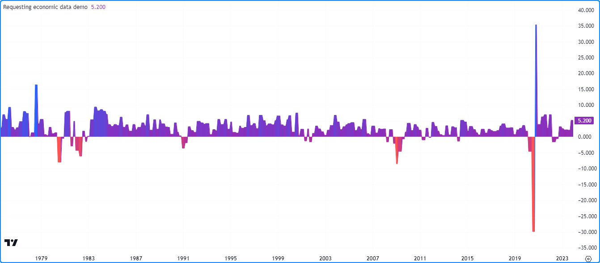

.. code-block:: pine

    //@version=5
    indicator("Requesting economic data demo")

    //@variable The GDP growth rate for the US economy.
    float gdpqq = request.economic("US", "GDPQQ")

    //@variable The all-time maximum growth rate.
    float maxRate = ta.max(gdpqq)
    //@variable The all-time minimum growth rate.
    float minRate = ta.min(gdpqq)

    //@variable The color of the `gdpqq` plot.
    color rateColor = switch
        gdpqq >= 0 => color.from_gradient(gdpqq, 0, maxRate, color.purple, color.blue)
        =>            color.from_gradient(gdpqq, minRate, 0, color.red, color.purple)

    // Plot the results.
    plot(gdpqq, "US GDP Growth Rate", rateColor, style = plot.style_area)

Note that:
 - This example does not include a ``gaps`` argument in the 
   `request.economic() <https://www.tradingview.com/pine-script-reference/v5/#fun_request.economic>`__ call, so the function 
   uses the default `barmerge.gaps_off <https://www.tradingview.com/pine-script-reference/v5/#var_barmerge.gaps_off>`__. 
   In other words, it returns the last retrieved value when new data isn't yet available.

.. note::
   The tables in the sections below are rather large, as there are numerous ``country_code`` and ``field`` arguments available. 
   Use the **"Click to show/hide"** option above each table to toggle its visibility. 

.. _PageOtherTimeframesAndData_RequestEconomic_CountryRegionCodes:

Country/region codes
^^^^^^^^^^^^^^^^^^^^

The table in this section lists all country/region codes available for use with 
`request.economic() <https://www.tradingview.com/pine-script-reference/v5/#fun_request.economic>`__. The first column 
of the table contains the "string" values that represent the country or region code, and the second column contains 
the corresponding country/region names.

It's important to note that the value used as the ``country_code`` argument determines which 
:ref:`field codes <PageOtherTimeframesAndData_RequestEconomic_FieldCodes>` are accessible to the function.

.. raw:: html

   

   
<a>Click to show/hide</a>

+------------------+-------------------------------+
| ``country_code`` | Country/region name           |
+==================+===============================+
| AF               | Afghanistan                   |
+------------------+-------------------------------+
| AL               | Albania                       |
+------------------+-------------------------------+
| DZ               | Algeria                       | 
+------------------+-------------------------------+
| AD               | Andorra                       | 
+------------------+-------------------------------+
| AO               | Angola                        | 
+------------------+-------------------------------+
| AG               | Antigua and Barbuda           |
+------------------+-------------------------------+
| AR               | Argentina                     |
+------------------+-------------------------------+
| AM               | Armenia                       |
+------------------+-------------------------------+
| AW               | Aruba                         |
+------------------+-------------------------------+
| AU               | Australia                     |
+------------------+-------------------------------+
| AT               | Austria                       |
+------------------+-------------------------------+
| AZ               | Azerbaijan                    |
+------------------+-------------------------------+
| BS               | Bahamas                       |
+------------------+-------------------------------+
| BH               | Bahrain                       |
+------------------+-------------------------------+
| BD               | Bangladesh                    |
+------------------+-------------------------------+
| BB               | Barbados                      |
+------------------+-------------------------------+
| BY               | Belarus                       |
+------------------+-------------------------------+
| BE               | Belgium                       |
+------------------+-------------------------------+
| BZ               | Belize                        |
+------------------+-------------------------------+
| BJ               | Benin                         |
+------------------+-------------------------------+
| BM               | Bermuda                       |
+------------------+-------------------------------+
| BT               | Bhutan                        |
+------------------+-------------------------------+
| BO               | Bolivia                       |
+------------------+-------------------------------+
| BA               | Bosnia and Herzegovina        |
+------------------+-------------------------------+
| BW               | Botswana                      |
+------------------+-------------------------------+
| BR               | Brazil                        |
+------------------+-------------------------------+
| BN               | Brunei                        |
+------------------+-------------------------------+
| BG               | Bulgaria                      |
+------------------+-------------------------------+
| BF               | Burkina Faso                  |
+------------------+-------------------------------+
| BI               | Burundi                       |
+------------------+-------------------------------+
| KH               | Cambodia                      |
+------------------+-------------------------------+
| CM               | Cameroon                      |
+------------------+-------------------------------+
| CA               | Canada                        |
+------------------+-------------------------------+
| CV               | Cape Verde                    |
+------------------+-------------------------------+
| KY               | Cayman Islands                |
+------------------+-------------------------------+
| CF               | Central African Republic      |
+------------------+-------------------------------+
| TD               | Chad                          |
+------------------+-------------------------------+
| CL               | Chile                         |
+------------------+-------------------------------+
| CN               | China                         |
+------------------+-------------------------------+
| CO               | Colombia                      |
+------------------+-------------------------------+
| KM               | Comoros                       |
+------------------+-------------------------------+
| CG               | Congo                         |
+------------------+-------------------------------+
| CR               | Costa Rica                    |
+------------------+-------------------------------+
| HR               | Croatia                       |
+------------------+-------------------------------+
| CU               | Cuba                          |
+------------------+-------------------------------+
| CY               | Cyprus                        |
+------------------+-------------------------------+
| CZ               | Czech Republic                |
+------------------+-------------------------------+
| DK               | Denmark                       |
+------------------+-------------------------------+
| DJ               | Djibouti                      |
+------------------+-------------------------------+
| DM               | Dominica                      |
+------------------+-------------------------------+
| DO               | Dominican Republic            |
+------------------+-------------------------------+
| TL               | East Timor                    |
+------------------+-------------------------------+
| EC               | Ecuador                       |
+------------------+-------------------------------+
| EG               | Egypt                         |
+------------------+-------------------------------+
| SV               | El Salvador                   |
+------------------+-------------------------------+
| GQ               | Equatorial Guinea             |
+------------------+-------------------------------+
| ER               | Eritrea                       |
+------------------+-------------------------------+
| EE               | Estonia                       |
+------------------+-------------------------------+
| ET               | Ethiopia                      |
+------------------+-------------------------------+
| EU               | Euro area                     |
+------------------+-------------------------------+
| FO               | Faroe Islands                 |
+------------------+-------------------------------+
| FJ               | Fiji                          |
+------------------+-------------------------------+
| FI               | Finland                       |
+------------------+-------------------------------+
| FR               | France                        |
+------------------+-------------------------------+
| GA               | Gabon                         |
+------------------+-------------------------------+
| GM               | Gambia                        |
+------------------+-------------------------------+
| GE               | Georgia                       |
+------------------+-------------------------------+
| DE               | Germany                       |
+------------------+-------------------------------+
| GH               | Ghana                         |
+------------------+-------------------------------+
| GR               | Greece                        |
+------------------+-------------------------------+
| GL               | Greenland                     |
+------------------+-------------------------------+
| GD               | Grenada                       |
+------------------+-------------------------------+
| GT               | Guatemala                     |
+------------------+-------------------------------+
| GN               | Guinea                        |
+------------------+-------------------------------+
| GW               | Guinea Bissau                 |
+------------------+-------------------------------+
| GY               | Guyana                        |
+------------------+-------------------------------+
| HT               | Haiti                         |
+------------------+-------------------------------+
| HN               | Honduras                      |
+------------------+-------------------------------+
| HK               | Hong Kong                     |
+------------------+-------------------------------+
| HU               | Hungary                       |
+------------------+-------------------------------+
| IS               | Iceland                       |
+------------------+-------------------------------+
| IN               | India                         |
+------------------+-------------------------------+
| ID               | Indonesia                     |
+------------------+-------------------------------+
| IR               | Iran                          |
+------------------+-------------------------------+
| IQ               | Iraq                          |
+------------------+-------------------------------+
| IE               | Ireland                       |
+------------------+-------------------------------+
| IM               | Isle of Man                   |
+------------------+-------------------------------+
| IL               | Israel                        |
+------------------+-------------------------------+
| IT               | Italy                         |
+------------------+-------------------------------+
| CI               | Ivory Coast                   |
+------------------+-------------------------------+
| JM               | Jamaica                       |
+------------------+-------------------------------+
| JP               | Japan                         |
+------------------+-------------------------------+
| JO               | Jordan                        |
+------------------+-------------------------------+
| KZ               | Kazakhstan                    |
+------------------+-------------------------------+
| KE               | Kenya                         |
+------------------+-------------------------------+
| KI               | Kiribati                      |
+------------------+-------------------------------+
| XK               | Kosovo                        |
+------------------+-------------------------------+
| KW               | Kuwait                        |
+------------------+-------------------------------+
| KG               | Kyrgyzstan                    |
+------------------+-------------------------------+
| LA               | Laos                          |
+------------------+-------------------------------+
| LV               | Latvia                        |
+------------------+-------------------------------+
| LB               | Lebanon                       |
+------------------+-------------------------------+
| LS               | Lesotho                       |
+------------------+-------------------------------+
| LR               | Liberia                       |
+------------------+-------------------------------+
| LY               | Libya                         |
+------------------+-------------------------------+
| LI               | Liechtenstein                 |
+------------------+-------------------------------+
| LT               | Lithuania                     |
+------------------+-------------------------------+
| LU               | Luxembourg                    |
+------------------+-------------------------------+
| MO               | Macau                         |
+------------------+-------------------------------+
| MK               | Macedonia                     |
+------------------+-------------------------------+
| MG               | Madagascar                    |
+------------------+-------------------------------+
| MW               | Malawi                        |
+------------------+-------------------------------+
| MY               | Malaysia                      |
+------------------+-------------------------------+
| MV               | Maldives                      |
+------------------+-------------------------------+
| ML               | Mali                          |
+------------------+-------------------------------+
| MT               | Malta                         |
+------------------+-------------------------------+
| MR               | Mauritania                    |
+------------------+-------------------------------+
| MU               | Mauritius                     |
+------------------+-------------------------------+
| MX               | Mexico                        |
+------------------+-------------------------------+
| MD               | Moldova                       |
+------------------+-------------------------------+
| MC               | Monaco                        |
+------------------+-------------------------------+
| MN               | Mongolia                      |
+------------------+-------------------------------+
| ME               | Montenegro                    |
+------------------+-------------------------------+
| MA               | Morocco                       |
+------------------+-------------------------------+
| MZ               | Mozambique                    |
+------------------+-------------------------------+
| MM               | Myanmar                       |
+------------------+-------------------------------+
| NA               | Namibia                       |
+------------------+-------------------------------+
| NP               | Nepal                         |
+------------------+-------------------------------+
| NL               | Netherlands                   |
+------------------+-------------------------------+
| NC               | New Caledonia                 |
+------------------+-------------------------------+
| NZ               | New Zealand                   |
+------------------+-------------------------------+
| NI               | Nicaragua                     |
+------------------+-------------------------------+
| NE               | Niger                         |
+------------------+-------------------------------+
| NG               | Nigeria                       |
+------------------+-------------------------------+
| KP               | North Korea                   |
+------------------+-------------------------------+
| NO               | Norway                        |
+------------------+-------------------------------+
| OM               | Oman                          |
+------------------+-------------------------------+
| PK               | Pakistan                      |
+------------------+-------------------------------+
| PS               | Palestine                     |
+------------------+-------------------------------+
| PA               | Panama                        |
+------------------+-------------------------------+
| PG               | Papua New Guinea              |
+------------------+-------------------------------+
| PY               | Paraguay                      |
+------------------+-------------------------------+
| PE               | Peru                          |
+------------------+-------------------------------+
| PH               | Philippines                   |
+------------------+-------------------------------+
| PL               | Poland                        |
+------------------+-------------------------------+
| PT               | Portugal                      |
+------------------+-------------------------------+
| PR               | Puerto Rico                   |
+------------------+-------------------------------+
| QA               | Qatar                         |
+------------------+-------------------------------+
| CD               | Republic of the Congo         |
+------------------+-------------------------------+
| RO               | Romania                       |
+------------------+-------------------------------+
| RU               | Russia                        |
+------------------+-------------------------------+
| RW               | Rwanda                        |
+------------------+-------------------------------+
| WS               | Samoa                         |
+------------------+-------------------------------+
| SM               | San Marino                    |
+------------------+-------------------------------+
| ST               | Sao Tome and Principe         |
+------------------+-------------------------------+
| SA               | Saudi Arabia                  |
+------------------+-------------------------------+
| SN               | Senegal                       |
+------------------+-------------------------------+
| RS               | Serbia                        |
+------------------+-------------------------------+
| SC               | Seychelles                    |
+------------------+-------------------------------+
| SL               | Sierra Leone                  |
+------------------+-------------------------------+
| SG               | Singapore                     |
+------------------+-------------------------------+
| SK               | Slovakia                      |
+------------------+-------------------------------+
| SI               | Slovenia                      |
+------------------+-------------------------------+
| SB               | Solomon Islands               |
+------------------+-------------------------------+
| SO               | Somalia                       |
+------------------+-------------------------------+
| ZA               | South Africa                  |
+------------------+-------------------------------+
| KR               | South Korea                   |
+------------------+-------------------------------+
| SS               | South Sudan                   |
+------------------+-------------------------------+
| ES               | Spain                         |
+------------------+-------------------------------+
| LK               | Sri Lanka                     |
+------------------+-------------------------------+
| LC               | St Lucia                      |
+------------------+-------------------------------+
| VC               | St Vincent and the Grenadines |
+------------------+-------------------------------+
| SD               | Sudan                         |
+------------------+-------------------------------+
| SR               | Suriname                      |
+------------------+-------------------------------+
| SZ               | Swaziland                     |
+------------------+-------------------------------+
| SE               | Sweden                        |
+------------------+-------------------------------+
| CH               | Switzerland                   |
+------------------+-------------------------------+
| SY               | Syria                         |
+------------------+-------------------------------+
| TW               | Taiwan                        |
+------------------+-------------------------------+
| TJ               | Tajikistan                    |
+------------------+-------------------------------+
| TZ               | Tanzania                      |
+------------------+-------------------------------+
| TH               | Thailand                      |
+------------------+-------------------------------+
| TG               | Togo                          |
+------------------+-------------------------------+
| TO               | Tonga                         |
+------------------+-------------------------------+
| TT               | Trinidad and Tobago           |
+------------------+-------------------------------+
| TN               | Tunisia                       |
+------------------+-------------------------------+
| TR               | Turkey                        |
+------------------+-------------------------------+
| TM               | Turkmenistan                  |
+------------------+-------------------------------+
| UG               | Uganda                        |
+------------------+-------------------------------+
| UA               | Ukraine                       |
+------------------+-------------------------------+
| AE               | United Arab Emirates          |
+------------------+-------------------------------+
| GB               | United Kingdom                |
+------------------+-------------------------------+
| US               | United States                 |
+------------------+-------------------------------+
| UY               | Uruguay                       |
+------------------+-------------------------------+
| UZ               | Uzbekistan                    |
+------------------+-------------------------------+
| VU               | Vanuatu                       |
+------------------+-------------------------------+
| VE               | Venezuela                     |
+------------------+-------------------------------+
| VN               | Vietnam                       |
+------------------+-------------------------------+
| YE               | Yemen                         |
+------------------+-------------------------------+
| ZM               | Zambia                        |
+------------------+-------------------------------+
| ZW               | Zimbabwe                      |
+------------------+-------------------------------+

.. raw:: html

   

.. _PageOtherTimeframesAndData_RequestEconomic_FieldCodes:

Field codes
^^^^^^^^^^^

The table in this section lists the field codes available for use with 
`request.economic() <https://www.tradingview.com/pine-script-reference/v5/#fun_request.economic>`__. The first column 
contains the "string" values used as the ``field`` argument, and the second column contains names of each metric and 
links to our Help Center with additional information, including the countries/regions they're available for.

.. raw:: html

   

   
<a>Click to show/hide</a>

+-----------+-------------------------------------------------------------------------------------------------------------------------+
| ``field`` | Metric                                                                                                                  |
+===========+=========================================================================================================================+
| AA        | `Asylum Applications <https://www.tradingview.com/support/solutions/43000650926>`__                                     |
+-----------+-------------------------------------------------------------------------------------------------------------------------+
| ACR       | `API Crude Runs <https://www.tradingview.com/support/solutions/43000650920>`__                                          |
+-----------+-------------------------------------------------------------------------------------------------------------------------+
| AE        | `Auto Exports <https://www.tradingview.com/support/solutions/43000650927>`__                                            |
+-----------+-------------------------------------------------------------------------------------------------------------------------+
| AHE       | `Average Hourly Earnings <https://www.tradingview.com/support/solutions/43000650928>`__                                 |
+-----------+-------------------------------------------------------------------------------------------------------------------------+
| AHO       | `API Heating Oil <https://www.tradingview.com/support/solutions/43000650924>`__                                         |
+-----------+-------------------------------------------------------------------------------------------------------------------------+
| AWH       | `Average Weekly Hours <https://www.tradingview.com/support/solutions/43000650929>`__                                    |
+-----------+-------------------------------------------------------------------------------------------------------------------------+
| BBS       | `Banks Balance Sheet <https://www.tradingview.com/support/solutions/43000650932>`__                                     |
+-----------+-------------------------------------------------------------------------------------------------------------------------+
| BCLI      | `Business Climate Indicator <https://www.tradingview.com/support/solutions/43000650935>`__                              |
+-----------+-------------------------------------------------------------------------------------------------------------------------+
| BCOI      | `Business Confidence Index <https://www.tradingview.com/support/solutions/43000650936>`__                               |
+-----------+-------------------------------------------------------------------------------------------------------------------------+
| BI        | `Business Inventories <https://www.tradingview.com/support/solutions/43000650937>`__                                    |
+-----------+-------------------------------------------------------------------------------------------------------------------------+
| BLR       | `Bank Lending Rate <https://www.tradingview.com/support/solutions/43000650933>`__                                       |
+-----------+-------------------------------------------------------------------------------------------------------------------------+
| BOI       | `NFIB Business Optimism Index <https://www.tradingview.com/support/solutions/43000651133>`__                            |
+-----------+-------------------------------------------------------------------------------------------------------------------------+
| BOT       | `Balance Of Trade <https://www.tradingview.com/support/solutions/43000650930>`__                                        |
+-----------+-------------------------------------------------------------------------------------------------------------------------+
| BP        | `Building Permits <https://www.tradingview.com/support/solutions/43000650934>`__                                        |
+-----------+-------------------------------------------------------------------------------------------------------------------------+
| BR        | `Bankruptcies <https://www.tradingview.com/support/solutions/43000650931>`__                                            |
+-----------+-------------------------------------------------------------------------------------------------------------------------+
| CA        | `Current Account <https://www.tradingview.com/support/solutions/43000650988>`__                                         |
+-----------+-------------------------------------------------------------------------------------------------------------------------+
| CAG       | `Current Account To GDP <https://www.tradingview.com/support/solutions/43000650987>`__                                  |
+-----------+-------------------------------------------------------------------------------------------------------------------------+
| CAP       | `Car Production <https://www.tradingview.com/support/solutions/43000650945>`__                                          |
+-----------+-------------------------------------------------------------------------------------------------------------------------+
| CAR       | `Car Registrations <https://www.tradingview.com/support/solutions/43000650946>`__                                       |
+-----------+-------------------------------------------------------------------------------------------------------------------------+
| CBBS      | `Central Bank Balance Sheet <https://www.tradingview.com/support/solutions/43000650952>`__                              |
+-----------+-------------------------------------------------------------------------------------------------------------------------+
| CCC       | `Claimant Count Change <https://www.tradingview.com/support/solutions/43000650959>`__                                   |
+-----------+-------------------------------------------------------------------------------------------------------------------------+
| CCI       | `Consumer Confidence Index <https://www.tradingview.com/support/solutions/43000650966>`__                               |
+-----------+-------------------------------------------------------------------------------------------------------------------------+
| CCOS      | `Cushing Crude Oil Stocks <https://www.tradingview.com/support/solutions/43000650989>`__                                |
+-----------+-------------------------------------------------------------------------------------------------------------------------+
| CCP       | `Core Consumer Prices <https://www.tradingview.com/support/solutions/43000650974>`__                                    |
+-----------+-------------------------------------------------------------------------------------------------------------------------+
| CCPI      | `Core CPI <https://www.tradingview.com/support/solutions/43000650973>`__                                                |
+-----------+-------------------------------------------------------------------------------------------------------------------------+
| CCPT      | `Consumer Confidence Price Trends <https://www.tradingview.com/support/solutions/43000650967>`__                        |
+-----------+-------------------------------------------------------------------------------------------------------------------------+
| CCR       | `Consumer Credit <https://www.tradingview.com/support/solutions/43000650968>`__                                         |
+-----------+-------------------------------------------------------------------------------------------------------------------------+
| CCS       | `Credit Card Spending <https://www.tradingview.com/support/solutions/43000650982>`__                                    |
+-----------+-------------------------------------------------------------------------------------------------------------------------+
| CEP       | `Cement Production <https://www.tradingview.com/support/solutions/43000650951>`__                                       |
+-----------+-------------------------------------------------------------------------------------------------------------------------+
| CF        | `Capital Flows <https://www.tradingview.com/support/solutions/43000650944>`__                                           |
+-----------+-------------------------------------------------------------------------------------------------------------------------+
| CFNAI     | `Chicago Fed National Activity Index <https://www.tradingview.com/support/solutions/43000650957>`__                     |
+-----------+-------------------------------------------------------------------------------------------------------------------------+
| CI        | `API Crude Imports <https://www.tradingview.com/support/solutions/43000650918>`__                                       |
+-----------+-------------------------------------------------------------------------------------------------------------------------+
| CIND      | `Coincident Index <https://www.tradingview.com/support/solutions/43000650960>`__                                        |
+-----------+-------------------------------------------------------------------------------------------------------------------------+
| CIR       | `Core Inflation Rate, YoY <https://www.tradingview.com/support/solutions/43000650975>`__                                |
+-----------+-------------------------------------------------------------------------------------------------------------------------+
| CJC       | `Continuing Jobless Claims <https://www.tradingview.com/support/solutions/43000650971>`__                               |
+-----------+-------------------------------------------------------------------------------------------------------------------------+
| CN        | `API Cushing Number <https://www.tradingview.com/support/solutions/43000650921>`__                                      |
+-----------+-------------------------------------------------------------------------------------------------------------------------+
| COI       | `Crude Oil Imports <https://www.tradingview.com/support/solutions/43000650983>`__                                       |
+-----------+-------------------------------------------------------------------------------------------------------------------------+
| COIR      | `Crude Oil Imports from Russia <https://www.tradingview.com/support/solutions/43000679670>`__                           |
+-----------+-------------------------------------------------------------------------------------------------------------------------+
| CONSTS    | `Construction Spending <https://www.tradingview.com/support/solutions/43000650965>`__                                   |
+-----------+-------------------------------------------------------------------------------------------------------------------------+
| COP       | `Crude Oil Production <https://www.tradingview.com/support/solutions/43000650984>`__                                    |
+-----------+-------------------------------------------------------------------------------------------------------------------------+
| COR       | `Crude Oil Rigs <https://www.tradingview.com/support/solutions/43000650985>`__                                          |
+-----------+-------------------------------------------------------------------------------------------------------------------------+
| CORD      | `Construction Orders, YoY <https://www.tradingview.com/support/solutions/43000650963>`__                                |
+-----------+-------------------------------------------------------------------------------------------------------------------------+
| CORPI     | `Corruption Index <https://www.tradingview.com/support/solutions/43000650980>`__                                        |
+-----------+-------------------------------------------------------------------------------------------------------------------------+
| CORR      | `Corruption Rank <https://www.tradingview.com/support/solutions/43000650981>`__                                         |
+-----------+-------------------------------------------------------------------------------------------------------------------------+
| COSC      | `Crude Oil Stocks Change <https://www.tradingview.com/support/solutions/43000650986>`__                                 |
+-----------+-------------------------------------------------------------------------------------------------------------------------+
| COUT      | `Construction Output, YoY <https://www.tradingview.com/support/solutions/43000650964>`__                                |
+-----------+-------------------------------------------------------------------------------------------------------------------------+
| CP        | `Copper Production <https://www.tradingview.com/support/solutions/43000650972>`__                                       |
+-----------+-------------------------------------------------------------------------------------------------------------------------+
| CPCEPI    | `Core PCE Price Index <https://www.tradingview.com/support/solutions/43000650976>`__                                    |
+-----------+-------------------------------------------------------------------------------------------------------------------------+
| CPI       | `Consumer Price Index <https://www.tradingview.com/support/solutions/43000650969>`__                                    |
+-----------+-------------------------------------------------------------------------------------------------------------------------+
| CPIHU     | `CPI Housing Utilities <https://www.tradingview.com/support/solutions/43000650939>`__                                   |
+-----------+-------------------------------------------------------------------------------------------------------------------------+
| CPIM      | `CPI Median <https://www.tradingview.com/support/solutions/43000650940>`__                                              |
+-----------+-------------------------------------------------------------------------------------------------------------------------+
| CPIT      | `CPI Transportation <https://www.tradingview.com/support/solutions/43000650941>`__                                      |
+-----------+-------------------------------------------------------------------------------------------------------------------------+
| CPITM     | `CPI Trimmed Mean <https://www.tradingview.com/support/solutions/43000650942>`__                                        |
+-----------+-------------------------------------------------------------------------------------------------------------------------+
| CPMI      | `Chicago PMI <https://www.tradingview.com/support/solutions/43000650958>`__                                             |
+-----------+-------------------------------------------------------------------------------------------------------------------------+
| CPPI      | `Core Producer Price Index <https://www.tradingview.com/support/solutions/43000650977>`__                               |
+-----------+-------------------------------------------------------------------------------------------------------------------------+
| CPR       | `Corporate Profits <https://www.tradingview.com/support/solutions/43000650978>`__                                       |
+-----------+-------------------------------------------------------------------------------------------------------------------------+
| CRLPI     | `Cereals Price Index <https://www.tradingview.com/support/solutions/43000679669>`__                                     |
+-----------+-------------------------------------------------------------------------------------------------------------------------+
| CRR       | `Cash Reserve Ratio <https://www.tradingview.com/support/solutions/43000650950>`__                                      |
+-----------+-------------------------------------------------------------------------------------------------------------------------+
| CS        | `Consumer Spending <https://www.tradingview.com/support/solutions/43000650970>`__                                       |
+-----------+-------------------------------------------------------------------------------------------------------------------------+
| CSC       | `API Crude Oil Stock Change <https://www.tradingview.com/support/solutions/43000650919>`__                              |
+-----------+-------------------------------------------------------------------------------------------------------------------------+
| CSHPI     | `Case Shiller Home Price Index <https://www.tradingview.com/support/solutions/43000650947>`__                           |
+-----------+-------------------------------------------------------------------------------------------------------------------------+
| CSHPIMM   | `Case Shiller Home Price Index, MoM <https://www.tradingview.com/support/solutions/43000650948>`__                      |
+-----------+-------------------------------------------------------------------------------------------------------------------------+
| CSHPIYY   | `Case Shiller Home Price Index, YoY <https://www.tradingview.com/support/solutions/43000650949>`__                      |
+-----------+-------------------------------------------------------------------------------------------------------------------------+
| CSS       | `Chain Store Sales <https://www.tradingview.com/support/solutions/43000650954>`__                                       |
+-----------+-------------------------------------------------------------------------------------------------------------------------+
| CTR       | `Corporate Tax Rate <https://www.tradingview.com/support/solutions/43000650979>`__                                      |
+-----------+-------------------------------------------------------------------------------------------------------------------------+
| CU        | `Capacity Utilization <https://www.tradingview.com/support/solutions/43000650943>`__                                    |
+-----------+-------------------------------------------------------------------------------------------------------------------------+
| DFMI      | `Dallas Fed Manufacturing Index <https://www.tradingview.com/support/solutions/43000650990>`__                          |
+-----------+-------------------------------------------------------------------------------------------------------------------------+
| DFP       | `Distillate Fuel Production <https://www.tradingview.com/support/solutions/43000650996>`__                              |
+-----------+-------------------------------------------------------------------------------------------------------------------------+
| DFS       | `Distillate Stocks <https://www.tradingview.com/support/solutions/43000650997>`__                                       |
+-----------+-------------------------------------------------------------------------------------------------------------------------+
| DFSI      | `Dallas Fed Services Index <https://www.tradingview.com/support/solutions/43000650991>`__                               |
+-----------+-------------------------------------------------------------------------------------------------------------------------+
| DFSRI     | `Dallas Fed Services Revenues Index <https://www.tradingview.com/support/solutions/43000650992>`__                      |
+-----------+-------------------------------------------------------------------------------------------------------------------------+
| DG        | `Deposit Growth <https://www.tradingview.com/support/solutions/43000650993>`__                                          |
+-----------+-------------------------------------------------------------------------------------------------------------------------+
| DGO       | `Durable Goods Orders <https://www.tradingview.com/support/solutions/43000651000>`__                                    |
+-----------+-------------------------------------------------------------------------------------------------------------------------+
| DGOED     | `Durable Goods Orders Excluding Defense <https://www.tradingview.com/support/solutions/43000650998>`__                  |
+-----------+-------------------------------------------------------------------------------------------------------------------------+
| DGOET     | `Durable Goods Orders Excluding Transportation <https://www.tradingview.com/support/solutions/43000650999>`__           |
+-----------+-------------------------------------------------------------------------------------------------------------------------+
| DIR       | `Deposit Interest Rate <https://www.tradingview.com/support/solutions/43000650994>`__                                   |
+-----------+-------------------------------------------------------------------------------------------------------------------------+
| DPI       | `Disposable Personal Income <https://www.tradingview.com/support/solutions/43000650995>`__                              |
+-----------+-------------------------------------------------------------------------------------------------------------------------+
| DRPI      | `Dairy Price Index <https://www.tradingview.com/support/solutions/43000679668>`__                                       |
+-----------+-------------------------------------------------------------------------------------------------------------------------+
| DS        | `API Distillate Stocks <https://www.tradingview.com/support/solutions/43000650922>`__                                   |
+-----------+-------------------------------------------------------------------------------------------------------------------------+
| DT        | `CBI Distributive Trades <https://www.tradingview.com/support/solutions/43000650938>`__                                 |
+-----------+-------------------------------------------------------------------------------------------------------------------------+
| EC        | `ADP Employment Change <https://www.tradingview.com/support/solutions/43000650917>`__                                   |
+-----------+-------------------------------------------------------------------------------------------------------------------------+
| ED        | `External Debt <https://www.tradingview.com/support/solutions/43000651012>`__                                           |
+-----------+-------------------------------------------------------------------------------------------------------------------------+
| EDBR      | `Ease Of Doing Business Ranking <https://www.tradingview.com/support/solutions/43000651001>`__                          |
+-----------+-------------------------------------------------------------------------------------------------------------------------+
| EHS       | `Existing Home Sales <https://www.tradingview.com/support/solutions/43000651009>`__                                     |
+-----------+-------------------------------------------------------------------------------------------------------------------------+
| ELP       | `Electricity Production <https://www.tradingview.com/support/solutions/43000651004>`__                                  |
+-----------+-------------------------------------------------------------------------------------------------------------------------+
| EMC       | `Employment Change <https://www.tradingview.com/support/solutions/43000651006>`__                                       |
+-----------+-------------------------------------------------------------------------------------------------------------------------+
| EMCI      | `Employment Cost Index <https://www.tradingview.com/support/solutions/43000651007>`__                                   |
+-----------+-------------------------------------------------------------------------------------------------------------------------+
| EMP       | `Employed Persons <https://www.tradingview.com/support/solutions/43000651005>`__                                        |
+-----------+-------------------------------------------------------------------------------------------------------------------------+
| EMR       | `Employment Rate <https://www.tradingview.com/support/solutions/43000651008>`__                                         |
+-----------+-------------------------------------------------------------------------------------------------------------------------+
| EOI       | `Economic Optimism Index <https://www.tradingview.com/support/solutions/43000651002>`__                                 |
+-----------+-------------------------------------------------------------------------------------------------------------------------+
| EP        | `Export Prices <https://www.tradingview.com/support/solutions/43000651011>`__                                           |
+-----------+-------------------------------------------------------------------------------------------------------------------------+
| ESI       | `ZEW Economic Sentiment Index <https://www.tradingview.com/support/solutions/43000651213>`__                            |
+-----------+-------------------------------------------------------------------------------------------------------------------------+
| EWS       | `Economy Watchers Survey <https://www.tradingview.com/support/solutions/43000651003>`__                                 |
+-----------+-------------------------------------------------------------------------------------------------------------------------+
| EXP       | `Exports <https://www.tradingview.com/support/solutions/43000651010>`__                                                 |
+-----------+-------------------------------------------------------------------------------------------------------------------------+
| EXPYY     | `Exports, YoY <https://www.tradingview.com/support/solutions/43000679671>`__                                            |
+-----------+-------------------------------------------------------------------------------------------------------------------------+
| FAI       | `Fixed Asset Investment <https://www.tradingview.com/support/solutions/43000651016>`__                                  |
+-----------+-------------------------------------------------------------------------------------------------------------------------+
| FBI       | `Foreign Bond Investment <https://www.tradingview.com/support/solutions/43000651018>`__                                 |
+-----------+-------------------------------------------------------------------------------------------------------------------------+
| FDI       | `Foreign Direct Investment <https://www.tradingview.com/support/solutions/43000651019>`__                               |
+-----------+-------------------------------------------------------------------------------------------------------------------------+
| FE        | `Fiscal Expenditure <https://www.tradingview.com/support/solutions/43000651015>`__                                      |
+-----------+-------------------------------------------------------------------------------------------------------------------------+
| FER       | `Foreign Exchange Reserves <https://www.tradingview.com/support/solutions/43000651020>`__                               |
+-----------+-------------------------------------------------------------------------------------------------------------------------+
| FI        | `Food Inflation, YoY <https://www.tradingview.com/support/solutions/43000651017>`__                                     |
+-----------+-------------------------------------------------------------------------------------------------------------------------+
| FO        | `Factory Orders <https://www.tradingview.com/support/solutions/43000651014>`__                                          |
+-----------+-------------------------------------------------------------------------------------------------------------------------+
| FOET      | `Factory Orders Excluding Transportation <https://www.tradingview.com/support/solutions/43000651013>`__                 |
+-----------+-------------------------------------------------------------------------------------------------------------------------+
| FPI       | `Food Price Index <https://www.tradingview.com/support/solutions/43000679667>`__                                        |
+-----------+-------------------------------------------------------------------------------------------------------------------------+
| FSI       | `Foreign Stock Investment <https://www.tradingview.com/support/solutions/43000651021>`__                                |
+-----------+-------------------------------------------------------------------------------------------------------------------------+
| FTE       | `Full Time Employment <https://www.tradingview.com/support/solutions/43000651022>`__                                    |
+-----------+-------------------------------------------------------------------------------------------------------------------------+
| FYGDPG    | `Full Year GDP Growth <https://www.tradingview.com/support/solutions/43000679672>`__                                    |
+-----------+-------------------------------------------------------------------------------------------------------------------------+
| GASP      | `Gasoline Prices <https://www.tradingview.com/support/solutions/43000651040>`__                                         |
+-----------+-------------------------------------------------------------------------------------------------------------------------+
| GBP       | `Government Budget <https://www.tradingview.com/support/solutions/43000651050>`__                                       |
+-----------+-------------------------------------------------------------------------------------------------------------------------+
| GBV       | `Government Budget Value <https://www.tradingview.com/support/solutions/43000651049>`__                                 |
+-----------+-------------------------------------------------------------------------------------------------------------------------+
| GCI       | `Competitiveness Index <https://www.tradingview.com/support/solutions/43000650961>`__                                   |
+-----------+-------------------------------------------------------------------------------------------------------------------------+
| GCR       | `Competitiveness Rank <https://www.tradingview.com/support/solutions/43000650962>`__                                    |
+-----------+-------------------------------------------------------------------------------------------------------------------------+
| GD        | `Government Debt <https://www.tradingview.com/support/solutions/43000651052>`__                                         |
+-----------+-------------------------------------------------------------------------------------------------------------------------+
| GDG       | `Government Debt To GDP <https://www.tradingview.com/support/solutions/43000651051>`__                                  |
+-----------+-------------------------------------------------------------------------------------------------------------------------+
| GDP       | `Gross Domestic Product <https://www.tradingview.com/support/solutions/43000651038>`__                                  |
+-----------+-------------------------------------------------------------------------------------------------------------------------+
| GDPA      | `GDP From Agriculture <https://www.tradingview.com/support/solutions/43000651025>`__                                    |
+-----------+-------------------------------------------------------------------------------------------------------------------------+
| GDPC      | `GDP From Construction <https://www.tradingview.com/support/solutions/43000651026>`__                                   |
+-----------+-------------------------------------------------------------------------------------------------------------------------+
| GDPCP     | `GDP Constant Prices <https://www.tradingview.com/support/solutions/43000651023>`__                                     |
+-----------+-------------------------------------------------------------------------------------------------------------------------+
| GDPD      | `GDP Deflator <https://www.tradingview.com/support/solutions/43000651024>`__                                            |
+-----------+-------------------------------------------------------------------------------------------------------------------------+
| GDPGA     | `GDP Growth Annualized <https://www.tradingview.com/support/solutions/43000651033>`__                                   |
+-----------+-------------------------------------------------------------------------------------------------------------------------+
| GDPMAN    | `GDP From Manufacturing <https://www.tradingview.com/support/solutions/43000651027>`__                                  |
+-----------+-------------------------------------------------------------------------------------------------------------------------+
| GDPMIN    | `GDP From Mining <https://www.tradingview.com/support/solutions/43000651028>`__                                         |
+-----------+-------------------------------------------------------------------------------------------------------------------------+
| GDPPA     | `GDP From Public Administration <https://www.tradingview.com/support/solutions/43000651029>`__                          |
+-----------+-------------------------------------------------------------------------------------------------------------------------+
| GDPPC     | `GDP Per Capita <https://www.tradingview.com/support/solutions/43000651035>`__                                          |
+-----------+-------------------------------------------------------------------------------------------------------------------------+
| GDPPCP    | `GDP Per Capita, PPP <https://www.tradingview.com/support/solutions/43000651036>`__                                     |
+-----------+-------------------------------------------------------------------------------------------------------------------------+
| GDPQQ     | `GDP Growth Rate <https://www.tradingview.com/support/solutions/43000651034>`__                                         |
+-----------+-------------------------------------------------------------------------------------------------------------------------+
| GDPS      | `GDP From Services <https://www.tradingview.com/support/solutions/43000651030>`__                                       |
+-----------+-------------------------------------------------------------------------------------------------------------------------+
| GDPSA     | `GDP Sales <https://www.tradingview.com/support/solutions/43000651037>`__                                               |
+-----------+-------------------------------------------------------------------------------------------------------------------------+
| GDPT      | `GDP From Transport <https://www.tradingview.com/support/solutions/43000651031>`__                                      |
+-----------+-------------------------------------------------------------------------------------------------------------------------+
| GDPU      | `GDP From Utilities <https://www.tradingview.com/support/solutions/43000651032>`__                                      |
+-----------+-------------------------------------------------------------------------------------------------------------------------+
| GDPYY     | `GDP, YoY <https://www.tradingview.com/support/solutions/43000651039>`__                                                |
+-----------+-------------------------------------------------------------------------------------------------------------------------+
| GDTPI     | `Global Dairy Trade Price Index <https://www.tradingview.com/support/solutions/43000651043>`__                          |
+-----------+-------------------------------------------------------------------------------------------------------------------------+
| GFCF      | `Gross Fixed Capital Formation <https://www.tradingview.com/support/solutions/43000651060>`__                           |
+-----------+-------------------------------------------------------------------------------------------------------------------------+
| GNP       | `Gross National Product <https://www.tradingview.com/support/solutions/43000651061>`__                                  |
+-----------+-------------------------------------------------------------------------------------------------------------------------+
| GP        | `Gold Production <https://www.tradingview.com/support/solutions/43000651044>`__                                         |
+-----------+-------------------------------------------------------------------------------------------------------------------------+
| GPA       | `Government Payrolls <https://www.tradingview.com/support/solutions/43000651053>`__                                     |
+-----------+-------------------------------------------------------------------------------------------------------------------------+
| GPRO      | `Gasoline Production <https://www.tradingview.com/support/solutions/43000651041>`__                                     |
+-----------+-------------------------------------------------------------------------------------------------------------------------+
| GR        | `Government Revenues <https://www.tradingview.com/support/solutions/43000651054>`__                                     |
+-----------+-------------------------------------------------------------------------------------------------------------------------+
| GRES      | `Gold Reserves <https://www.tradingview.com/support/solutions/43000651045>`__                                           |
+-----------+-------------------------------------------------------------------------------------------------------------------------+
| GS        | `API Gasoline Stocks <https://www.tradingview.com/support/solutions/43000650923>`__                                     |
+-----------+-------------------------------------------------------------------------------------------------------------------------+
| GSC       | `Grain Stocks Corn <https://www.tradingview.com/support/solutions/43000651057>`__                                       |
+-----------+-------------------------------------------------------------------------------------------------------------------------+
| GSCH      | `Gasoline Stocks Change <https://www.tradingview.com/support/solutions/43000651042>`__                                  |
+-----------+-------------------------------------------------------------------------------------------------------------------------+
| GSG       | `Government Spending To GDP <https://www.tradingview.com/support/solutions/43000651055>`__                              |
+-----------+-------------------------------------------------------------------------------------------------------------------------+
| GSP       | `Government Spending <https://www.tradingview.com/support/solutions/43000651056>`__                                     |
+-----------+-------------------------------------------------------------------------------------------------------------------------+
| GSS       | `Grain Stocks Soy <https://www.tradingview.com/support/solutions/43000651058>`__                                        |
+-----------+-------------------------------------------------------------------------------------------------------------------------+
| GSW       | `Grain Stocks Wheat <https://www.tradingview.com/support/solutions/43000651059>`__                                      |
+-----------+-------------------------------------------------------------------------------------------------------------------------+
| GTB       | `Goods Trade Balance <https://www.tradingview.com/support/solutions/43000651046>`__                                     |
+-----------+-------------------------------------------------------------------------------------------------------------------------+
| HB        | `Hospital Beds <https://www.tradingview.com/support/solutions/43000651067>`__                                           |
+-----------+-------------------------------------------------------------------------------------------------------------------------+
| HDG       | `Households Debt To GDP <https://www.tradingview.com/support/solutions/43000651068>`__                                  |
+-----------+-------------------------------------------------------------------------------------------------------------------------+
| HDI       | `Households Debt To Income <https://www.tradingview.com/support/solutions/43000651069>`__                               |
+-----------+-------------------------------------------------------------------------------------------------------------------------+
| HICP      | `Harmonised Index of Consumer Prices <https://www.tradingview.com/support/solutions/43000651062>`__                     |
+-----------+-------------------------------------------------------------------------------------------------------------------------+
| HIRMM     | `Harmonised Inflation Rate, MoM <https://www.tradingview.com/support/solutions/43000679673>`__                          |
+-----------+-------------------------------------------------------------------------------------------------------------------------+
| HIRYY     | `Harmonised Inflation Rate, YoY <https://www.tradingview.com/support/solutions/43000679674>`__                          |
+-----------+-------------------------------------------------------------------------------------------------------------------------+
| HMI       | `NAHB Housing Market Index <https://www.tradingview.com/support/solutions/43000651132>`__                               |
+-----------+-------------------------------------------------------------------------------------------------------------------------+
| HOR       | `Home Ownership Rate <https://www.tradingview.com/support/solutions/43000651065>`__                                     |
+-----------+-------------------------------------------------------------------------------------------------------------------------+
| HOS       | `Heating Oil Stocks <https://www.tradingview.com/support/solutions/43000651063>`__                                      |
+-----------+-------------------------------------------------------------------------------------------------------------------------+
| HOSP      | `Hospitals <https://www.tradingview.com/support/solutions/43000651066>`__                                               |
+-----------+-------------------------------------------------------------------------------------------------------------------------+
| HPI       | `House Price Index <https://www.tradingview.com/support/solutions/43000651071>`__                                       |
+-----------+-------------------------------------------------------------------------------------------------------------------------+
| HPIMM     | `House Price Index, MoM <https://www.tradingview.com/support/solutions/43000679678>`__                                  |
+-----------+-------------------------------------------------------------------------------------------------------------------------+
| HPIYY     | `House Price Index, YoY <https://www.tradingview.com/support/solutions/43000679679>`__                                  |
+-----------+-------------------------------------------------------------------------------------------------------------------------+
| HS        | `Home Loans <https://www.tradingview.com/support/solutions/43000651064>`__                                              |
+-----------+-------------------------------------------------------------------------------------------------------------------------+
| HSP       | `Household Spending <https://www.tradingview.com/support/solutions/43000651070>`__                                      |
+-----------+-------------------------------------------------------------------------------------------------------------------------+
| HST       | `Housing Starts <https://www.tradingview.com/support/solutions/43000651072>`__                                          |
+-----------+-------------------------------------------------------------------------------------------------------------------------+
| IC        | `Changes In Inventories <https://www.tradingview.com/support/solutions/43000650956>`__                                  |
+-----------+-------------------------------------------------------------------------------------------------------------------------+
| ICUB      | `ICU Beds <https://www.tradingview.com/support/solutions/43000651073>`__                                                |
+-----------+-------------------------------------------------------------------------------------------------------------------------+
| IE        | `Inflation Expectations <https://www.tradingview.com/support/solutions/43000651081>`__                                  |
+-----------+-------------------------------------------------------------------------------------------------------------------------+
| IFOCC     | `IFO Assessment Of The Business Situation <https://www.tradingview.com/support/solutions/43000651074>`__                |
+-----------+-------------------------------------------------------------------------------------------------------------------------+
| IFOE      | `IFO Business Developments Expectations <https://www.tradingview.com/support/solutions/43000651075>`__                  |
+-----------+-------------------------------------------------------------------------------------------------------------------------+
| IJC       | `Initial Jobless Claims <https://www.tradingview.com/support/solutions/43000651084>`__                                  |
+-----------+-------------------------------------------------------------------------------------------------------------------------+
| IMP       | `Imports <https://www.tradingview.com/support/solutions/43000651076>`__                                                 |
+-----------+-------------------------------------------------------------------------------------------------------------------------+
| IMPYY     | `Imports, YoY <https://www.tradingview.com/support/solutions/43000679681>`__                                            |
+-----------+-------------------------------------------------------------------------------------------------------------------------+
| INBR      | `Interbank Rate <https://www.tradingview.com/support/solutions/43000651085>`__                                          |
+-----------+-------------------------------------------------------------------------------------------------------------------------+
| INTR      | `Interest Rate <https://www.tradingview.com/support/solutions/43000651086>`__                                           |
+-----------+-------------------------------------------------------------------------------------------------------------------------+
| IPA       | `IP Addresses <https://www.tradingview.com/support/solutions/43000651088>`__                                            |
+-----------+-------------------------------------------------------------------------------------------------------------------------+
| IPMM      | `Industrial Production, MoM <https://www.tradingview.com/support/solutions/43000651078>`__                              |
+-----------+-------------------------------------------------------------------------------------------------------------------------+
| IPRI      | `Import Prices <https://www.tradingview.com/support/solutions/43000651077>`__                                           |
+-----------+-------------------------------------------------------------------------------------------------------------------------+
| IPYY      | `Industrial Production, YoY <https://www.tradingview.com/support/solutions/43000651079>`__                              |
+-----------+-------------------------------------------------------------------------------------------------------------------------+
| IRMM      | `Inflation Rate, MoM <https://www.tradingview.com/support/solutions/43000651082>`__                                     |
+-----------+-------------------------------------------------------------------------------------------------------------------------+
| IRYY      | `Inflation Rate, YoY <https://www.tradingview.com/support/solutions/43000651083>`__                                     |
+-----------+-------------------------------------------------------------------------------------------------------------------------+
| IS        | `Industrial Sentiment <https://www.tradingview.com/support/solutions/43000651080>`__                                    |
+-----------+-------------------------------------------------------------------------------------------------------------------------+
| ISP       | `Internet Speed <https://www.tradingview.com/support/solutions/43000651087>`__                                          |
+-----------+-------------------------------------------------------------------------------------------------------------------------+
| JA        | `Job Advertisements <https://www.tradingview.com/support/solutions/43000651091>`__                                      |
+-----------+-------------------------------------------------------------------------------------------------------------------------+
| JAR       | `Jobs To Applications Ratio <https://www.tradingview.com/support/solutions/43000651090>`__                              |
+-----------+-------------------------------------------------------------------------------------------------------------------------+
| JC        | `Challenger Job Cuts <https://www.tradingview.com/support/solutions/43000650955>`__                                     |
+-----------+-------------------------------------------------------------------------------------------------------------------------+
| JC4W      | `Jobless Claims, 4-Week Average <https://www.tradingview.com/support/solutions/43000651089>`__                          |
+-----------+-------------------------------------------------------------------------------------------------------------------------+
| JO        | `Job Offers <https://www.tradingview.com/support/solutions/43000651092>`__                                              |
+-----------+-------------------------------------------------------------------------------------------------------------------------+
| JV        | `Job Vacancies <https://www.tradingview.com/support/solutions/43000651093>`__                                           |
+-----------+-------------------------------------------------------------------------------------------------------------------------+
| KFMI      | `Kansas Fed Manufacturing Index <https://www.tradingview.com/support/solutions/43000651094>`__                          |
+-----------+-------------------------------------------------------------------------------------------------------------------------+
| LB        | `Loans To Banks <https://www.tradingview.com/support/solutions/43000651104>`__                                          |
+-----------+-------------------------------------------------------------------------------------------------------------------------+
| LC        | `Labor Costs <https://www.tradingview.com/support/solutions/43000651101>`__                                             |
+-----------+-------------------------------------------------------------------------------------------------------------------------+
| LEI       | `Leading Economic Index <https://www.tradingview.com/support/solutions/43000651102>`__                                  |
+-----------+-------------------------------------------------------------------------------------------------------------------------+
| LFPR      | `Labor Force Participation Rate <https://www.tradingview.com/support/solutions/43000651100>`__                          |
+-----------+-------------------------------------------------------------------------------------------------------------------------+
| LG        | `Loan Growth, YoY <https://www.tradingview.com/support/solutions/43000651106>`__                                        |
+-----------+-------------------------------------------------------------------------------------------------------------------------+
| LIVRR     | `Liquidity Injections Via Reverse Repo <https://www.tradingview.com/support/solutions/43000651103>`__                   |
+-----------+-------------------------------------------------------------------------------------------------------------------------+
| LMIC      | `LMI Logistics Managers Index Current <https://www.tradingview.com/support/solutions/43000651096>`__                    |
+-----------+-------------------------------------------------------------------------------------------------------------------------+
| LMICI     | `LMI Inventory Costs <https://www.tradingview.com/support/solutions/43000651095>`__                                     |
+-----------+-------------------------------------------------------------------------------------------------------------------------+
| LMIF      | `LMI Logistics Managers Index Future <https://www.tradingview.com/support/solutions/43000651097>`__                     |
+-----------+-------------------------------------------------------------------------------------------------------------------------+
| LMITP     | `LMI Transportation Prices <https://www.tradingview.com/support/solutions/43000651098>`__                               |
+-----------+-------------------------------------------------------------------------------------------------------------------------+
| LMIWP     | `LMI Warehouse Prices <https://www.tradingview.com/support/solutions/43000651099>`__                                    |
+-----------+-------------------------------------------------------------------------------------------------------------------------+
| LPS       | `Loans To Private Sector <https://www.tradingview.com/support/solutions/43000651105>`__                                 |
+-----------+-------------------------------------------------------------------------------------------------------------------------+
| LR        | `Central Bank Lending Rate <https://www.tradingview.com/support/solutions/43000650953>`__                               |
+-----------+-------------------------------------------------------------------------------------------------------------------------+
| LTUR      | `Long Term Unemployment Rate <https://www.tradingview.com/support/solutions/43000651107>`__                             |
+-----------+-------------------------------------------------------------------------------------------------------------------------+
| LWF       | `Living Wage Family <https://www.tradingview.com/support/solutions/43000679691>`__                                      |
+-----------+-------------------------------------------------------------------------------------------------------------------------+
| LWI       | `Living Wage Individual <https://www.tradingview.com/support/solutions/43000679702>`__                                  |
+-----------+-------------------------------------------------------------------------------------------------------------------------+
| M0        | `Money Supply M0 <https://www.tradingview.com/support/solutions/43000651125>`__                                         |
+-----------+-------------------------------------------------------------------------------------------------------------------------+
| M1        | `Money Supply M1 <https://www.tradingview.com/support/solutions/43000651126>`__                                         |
+-----------+-------------------------------------------------------------------------------------------------------------------------+
| M2        | `Money Supply M2 <https://www.tradingview.com/support/solutions/43000651127>`__                                         |
+-----------+-------------------------------------------------------------------------------------------------------------------------+
| M3        | `Money Supply M3 <https://www.tradingview.com/support/solutions/43000651128>`__                                         |
+-----------+-------------------------------------------------------------------------------------------------------------------------+
| MA        | `Mortgage Approvals <https://www.tradingview.com/support/solutions/43000651130>`__                                      |
+-----------+-------------------------------------------------------------------------------------------------------------------------+
| MAPL      | `Mortgage Applications <https://www.tradingview.com/support/solutions/43000651129>`__                                   |
+-----------+-------------------------------------------------------------------------------------------------------------------------+
| MCE       | `Michigan Consumer Expectations <https://www.tradingview.com/support/solutions/43000651119>`__                          |
+-----------+-------------------------------------------------------------------------------------------------------------------------+
| MCEC      | `Michigan Current Economic Conditions <https://www.tradingview.com/support/solutions/43000651120>`__                    |
+-----------+-------------------------------------------------------------------------------------------------------------------------+
| MD        | `Medical Doctors <https://www.tradingview.com/support/solutions/43000651117>`__                                         |
+-----------+-------------------------------------------------------------------------------------------------------------------------+
| ME        | `Military Expenditure <https://www.tradingview.com/support/solutions/43000651122>`__                                    |
+-----------+-------------------------------------------------------------------------------------------------------------------------+
| MGDPYY    | `Monthly GDP, YoY <https://www.tradingview.com/support/solutions/43000679714>`__                                        |
+-----------+-------------------------------------------------------------------------------------------------------------------------+
| MIE1Y     | `Michigan Inflation Expectations <https://www.tradingview.com/support/solutions/43000651121>`__                         |
+-----------+-------------------------------------------------------------------------------------------------------------------------+
| MIE5Y     | `Michigan 5 Year Inflation Expectations <https://www.tradingview.com/support/solutions/43000651118>`__                  |
+-----------+-------------------------------------------------------------------------------------------------------------------------+
| MIP       | `Mining Production, YoY <https://www.tradingview.com/support/solutions/43000651124>`__                                  |
+-----------+-------------------------------------------------------------------------------------------------------------------------+
| MMI       | `MBA Mortgage Market Index <https://www.tradingview.com/support/solutions/43000651108>`__                               |
+-----------+-------------------------------------------------------------------------------------------------------------------------+
| MO        | `Machinery Orders <https://www.tradingview.com/support/solutions/43000651111>`__                                        |
+-----------+-------------------------------------------------------------------------------------------------------------------------+
| MP        | `Manufacturing Payrolls <https://www.tradingview.com/support/solutions/43000651113>`__                                  |
+-----------+-------------------------------------------------------------------------------------------------------------------------+
| MPI       | `Meat Price Index <https://www.tradingview.com/support/solutions/43000679666>`__                                        |
+-----------+-------------------------------------------------------------------------------------------------------------------------+
| MPRMM     | `Manufacturing Production, MoM <https://www.tradingview.com/support/solutions/43000651114>`__                           |
+-----------+-------------------------------------------------------------------------------------------------------------------------+
| MPRYY     | `Manufacturing Production, YoY <https://www.tradingview.com/support/solutions/43000651115>`__                           |
+-----------+-------------------------------------------------------------------------------------------------------------------------+
| MR        | `Mortgage Rate <https://www.tradingview.com/support/solutions/43000651131>`__                                           |
+-----------+-------------------------------------------------------------------------------------------------------------------------+
| MRI       | `MBA Mortgage Refinance Index <https://www.tradingview.com/support/solutions/43000651109>`__                            |
+-----------+-------------------------------------------------------------------------------------------------------------------------+
| MS        | `Manufacturing Sales <https://www.tradingview.com/support/solutions/43000651116>`__                                     |
+-----------+-------------------------------------------------------------------------------------------------------------------------+
| MTO       | `Machine Tool Orders <https://www.tradingview.com/support/solutions/43000651112>`__                                     |
+-----------+-------------------------------------------------------------------------------------------------------------------------+
| MW        | `Minimum Wages <https://www.tradingview.com/support/solutions/43000651123>`__                                           |
+-----------+-------------------------------------------------------------------------------------------------------------------------+
| NDCGOEA   | `Orders For Non-defense Capital Goods Excluding Aircraft <https://www.tradingview.com/support/solutions/43000651148>`__ |
+-----------+-------------------------------------------------------------------------------------------------------------------------+
| NEGTB     | `Goods Trade Deficit With Non-EU Countries <https://www.tradingview.com/support/solutions/43000651047>`__               |
+-----------+-------------------------------------------------------------------------------------------------------------------------+
| NFP       | `Nonfarm Payrolls <https://www.tradingview.com/support/solutions/43000651141>`__                                        |
+-----------+-------------------------------------------------------------------------------------------------------------------------+
| NGI       | `Natural Gas Imports <https://www.tradingview.com/support/solutions/43000679719>`__                                     |
+-----------+-------------------------------------------------------------------------------------------------------------------------+
| NGIR      | `Natural Gas Imports from Russia <https://www.tradingview.com/support/solutions/43000679721>`__                         |
+-----------+-------------------------------------------------------------------------------------------------------------------------+
| NGSC      | `Natural Gas Stocks Change <https://www.tradingview.com/support/solutions/43000651136>`__                               |
+-----------+-------------------------------------------------------------------------------------------------------------------------+
| NHPI      | `Nationwide House Price Index <https://www.tradingview.com/support/solutions/43000651135>`__                            |
+-----------+-------------------------------------------------------------------------------------------------------------------------+
| NHS       | `New Home Sales <https://www.tradingview.com/support/solutions/43000651137>`__                                          |
+-----------+-------------------------------------------------------------------------------------------------------------------------+
| NHSMM     | `New Home Sales, MoM <https://www.tradingview.com/support/solutions/43000651138>`__                                     |
+-----------+-------------------------------------------------------------------------------------------------------------------------+
| NMPMI     | `Non-Manufacturing PMI <https://www.tradingview.com/support/solutions/43000651143>`__                                   |
+-----------+-------------------------------------------------------------------------------------------------------------------------+
| NO        | `New Orders <https://www.tradingview.com/support/solutions/43000651139>`__                                              |
+-----------+-------------------------------------------------------------------------------------------------------------------------+
| NODXMM    | `Non-Oil Domestic Exports, MoM <https://www.tradingview.com/support/solutions/43000651144>`__                           |
+-----------+-------------------------------------------------------------------------------------------------------------------------+
| NODXYY    | `Non-Oil Domestic Exports, YoY <https://www.tradingview.com/support/solutions/43000651145>`__                           |
+-----------+-------------------------------------------------------------------------------------------------------------------------+
| NOE       | `Non-Oil Exports <https://www.tradingview.com/support/solutions/43000651142>`__                                         |
+-----------+-------------------------------------------------------------------------------------------------------------------------+
| NPP       | `Nonfarm Payrolls Private <https://www.tradingview.com/support/solutions/43000651140>`__                                |
+-----------+-------------------------------------------------------------------------------------------------------------------------+
| NURS      | `Nurses <https://www.tradingview.com/support/solutions/43000651146>`__                                                  |
+-----------+-------------------------------------------------------------------------------------------------------------------------+
| NYESMI    | `NY Empire State Manufacturing Index <https://www.tradingview.com/support/solutions/43000651134>`__                     |
+-----------+-------------------------------------------------------------------------------------------------------------------------+
| OE        | `Oil Exports <https://www.tradingview.com/support/solutions/43000651147>`__                                             |
+-----------+-------------------------------------------------------------------------------------------------------------------------+
| OPI       | `Oils Price Index <https://www.tradingview.com/support/solutions/43000679665>`__                                        |
+-----------+-------------------------------------------------------------------------------------------------------------------------+
| PCEPI     | `PCE Price Index <https://www.tradingview.com/support/solutions/43000651149>`__                                         |
+-----------+-------------------------------------------------------------------------------------------------------------------------+
| PDG       | `Private Debt To GDP <https://www.tradingview.com/support/solutions/43000651160>`__                                     |
+-----------+-------------------------------------------------------------------------------------------------------------------------+
| PFMI      | `Philadelphia Fed Manufacturing Index <https://www.tradingview.com/support/solutions/43000651158>`__                    |
+-----------+-------------------------------------------------------------------------------------------------------------------------+
| PHSIMM    | `Pending Home Sales Index, MoM <https://www.tradingview.com/support/solutions/43000651152>`__                           |
+-----------+-------------------------------------------------------------------------------------------------------------------------+
| PHSIYY    | `Pending Home Sales Index, YoY <https://www.tradingview.com/support/solutions/43000651153>`__                           |
+-----------+-------------------------------------------------------------------------------------------------------------------------+
| PI        | `Personal Income <https://www.tradingview.com/support/solutions/43000651155>`__                                         |
+-----------+-------------------------------------------------------------------------------------------------------------------------+
| PIN       | `Private Investment <https://www.tradingview.com/support/solutions/43000651161>`__                                      |
+-----------+-------------------------------------------------------------------------------------------------------------------------+
| PIND      | `MBA Purchase Index <https://www.tradingview.com/support/solutions/43000651110>`__                                      |
+-----------+-------------------------------------------------------------------------------------------------------------------------+
| PITR      | `Personal Income Tax Rate <https://www.tradingview.com/support/solutions/43000651154>`__                                |
+-----------+-------------------------------------------------------------------------------------------------------------------------+
| POP       | `Population <https://www.tradingview.com/support/solutions/43000651159>`__                                              |
+-----------+-------------------------------------------------------------------------------------------------------------------------+
| PPI       | `Producer Price Index <https://www.tradingview.com/support/solutions/43000651165>`__                                    |
+-----------+-------------------------------------------------------------------------------------------------------------------------+
| PPII      | `Producer Price Index Input <https://www.tradingview.com/support/solutions/43000651164>`__                              |
+-----------+-------------------------------------------------------------------------------------------------------------------------+
| PPIMM     | `Producer Price Inflation, MoM <https://www.tradingview.com/support/solutions/43000679724>`__                           |
+-----------+-------------------------------------------------------------------------------------------------------------------------+
| PPIYY     | `Producer Prices Index, YoY <https://www.tradingview.com/support/solutions/43000651163>`__                              |
+-----------+-------------------------------------------------------------------------------------------------------------------------+
| PRI       | `API Product Imports <https://www.tradingview.com/support/solutions/43000650925>`__                                     |
+-----------+-------------------------------------------------------------------------------------------------------------------------+
| PROD      | `Productivity <https://www.tradingview.com/support/solutions/43000651166>`__                                            |
+-----------+-------------------------------------------------------------------------------------------------------------------------+
| PS        | `Personal Savings <https://www.tradingview.com/support/solutions/43000651156>`__                                        |
+-----------+-------------------------------------------------------------------------------------------------------------------------+
| PSC       | `Private Sector Credit <https://www.tradingview.com/support/solutions/43000651162>`__                                   |
+-----------+-------------------------------------------------------------------------------------------------------------------------+
| PSP       | `Personal Spending <https://www.tradingview.com/support/solutions/43000651157>`__                                       |
+-----------+-------------------------------------------------------------------------------------------------------------------------+
| PTE       | `Part Time Employment <https://www.tradingview.com/support/solutions/43000651151>`__                                    |
+-----------+-------------------------------------------------------------------------------------------------------------------------+
| PUAC      | `Pandemic Unemployment Assistance Claims <https://www.tradingview.com/support/solutions/43000651150>`__                 |
+-----------+-------------------------------------------------------------------------------------------------------------------------+
| RAM       | `Retirement Age Men <https://www.tradingview.com/support/solutions/43000651177>`__                                      |
+-----------+-------------------------------------------------------------------------------------------------------------------------+
| RAW       | `Retirement Age Women <https://www.tradingview.com/support/solutions/43000651178>`__                                    |
+-----------+-------------------------------------------------------------------------------------------------------------------------+
| RCR       | `Refinery Crude Runs <https://www.tradingview.com/support/solutions/43000651168>`__                                     |
+-----------+-------------------------------------------------------------------------------------------------------------------------+
| REM       | `Remittances <https://www.tradingview.com/support/solutions/43000651169>`__                                             |
+-----------+-------------------------------------------------------------------------------------------------------------------------+
| RFMI      | `Richmond Fed Manufacturing Index <https://www.tradingview.com/support/solutions/43000651181>`__                        |
+-----------+-------------------------------------------------------------------------------------------------------------------------+
| RFMSI     | `Richmond Fed Manufacturing Shipments Index <https://www.tradingview.com/support/solutions/43000651182>`__              |
+-----------+-------------------------------------------------------------------------------------------------------------------------+
| RFSI      | `Richmond Fed Services Index <https://www.tradingview.com/support/solutions/43000651183>`__                             |
+-----------+-------------------------------------------------------------------------------------------------------------------------+
| RI        | `Redbook Index <https://www.tradingview.com/support/solutions/43000651167>`__                                           |
+-----------+-------------------------------------------------------------------------------------------------------------------------+
| RIEA      | `Retail Inventories Excluding Autos <https://www.tradingview.com/support/solutions/43000651171>`__                      |
+-----------+-------------------------------------------------------------------------------------------------------------------------+
| RPI       | `Retail Price Index <https://www.tradingview.com/support/solutions/43000651172>`__                                      |
+-----------+-------------------------------------------------------------------------------------------------------------------------+
| RR        | `Repo Rate <https://www.tradingview.com/support/solutions/43000651170>`__                                               |
+-----------+-------------------------------------------------------------------------------------------------------------------------+
| RRR       | `Reverse Repo Rate <https://www.tradingview.com/support/solutions/43000651180>`__                                       |
+-----------+-------------------------------------------------------------------------------------------------------------------------+
| RSEA      | `Retail Sales Excluding Autos <https://www.tradingview.com/support/solutions/43000651173>`__                            |
+-----------+-------------------------------------------------------------------------------------------------------------------------+
| RSEF      | `Retail Sales Excluding Fuel <https://www.tradingview.com/support/solutions/43000651174>`__                             |
+-----------+-------------------------------------------------------------------------------------------------------------------------+
| RSMM      | `Retail Sales, MoM <https://www.tradingview.com/support/solutions/43000651175>`__                                       |
+-----------+-------------------------------------------------------------------------------------------------------------------------+
| RSYY      | `Retail Sales, YoY <https://www.tradingview.com/support/solutions/43000651176>`__                                       |
+-----------+-------------------------------------------------------------------------------------------------------------------------+
| RTI       | `Reuters Tankan Index <https://www.tradingview.com/support/solutions/43000651179>`__                                    |
+-----------+-------------------------------------------------------------------------------------------------------------------------+
| SBSI      | `Small Business Sentiment Index <https://www.tradingview.com/support/solutions/43000651187>`__                          |
+-----------+-------------------------------------------------------------------------------------------------------------------------+
| SFHP      | `Single Family Home Prices <https://www.tradingview.com/support/solutions/43000651186>`__                               |
+-----------+-------------------------------------------------------------------------------------------------------------------------+
| SP        | `Steel Production <https://www.tradingview.com/support/solutions/43000651191>`__                                        |
+-----------+-------------------------------------------------------------------------------------------------------------------------+
| SPI       | `Sugar Price Index <https://www.tradingview.com/support/solutions/43000679563>`__                                       |
+-----------+-------------------------------------------------------------------------------------------------------------------------+
| SS        | `Services Sentiment <https://www.tradingview.com/support/solutions/43000651185>`__                                      |
+-----------+-------------------------------------------------------------------------------------------------------------------------+
| SSR       | `Social Security Rate <https://www.tradingview.com/support/solutions/43000651190>`__                                    |
+-----------+-------------------------------------------------------------------------------------------------------------------------+
| SSRC      | `Social Security Rate For Companies <https://www.tradingview.com/support/solutions/43000651188>`__                      |
+-----------+-------------------------------------------------------------------------------------------------------------------------+
| SSRE      | `Social Security Rate For Employees <https://www.tradingview.com/support/solutions/43000651189>`__                      |
+-----------+-------------------------------------------------------------------------------------------------------------------------+
| STR       | `Sales Tax Rate <https://www.tradingview.com/support/solutions/43000651184>`__                                          |
+-----------+-------------------------------------------------------------------------------------------------------------------------+
| TA        | `Tourist Arrivals <https://www.tradingview.com/support/solutions/43000651199>`__                                        |
+-----------+-------------------------------------------------------------------------------------------------------------------------+
| TAXR      | `Tax Revenue <https://www.tradingview.com/support/solutions/43000651192>`__                                             |
+-----------+-------------------------------------------------------------------------------------------------------------------------+
| TCB       | `Treasury Cash Balance <https://www.tradingview.com/support/solutions/43000651200>`__                                   |
+-----------+-------------------------------------------------------------------------------------------------------------------------+
| TCPI      | `Tokyo CPI <https://www.tradingview.com/support/solutions/43000651196>`__                                               |
+-----------+-------------------------------------------------------------------------------------------------------------------------+
| TI        | `Terrorism Index <https://www.tradingview.com/support/solutions/43000651194>`__                                         |
+-----------+-------------------------------------------------------------------------------------------------------------------------+
| TII       | `Tertiary Industry Index <https://www.tradingview.com/support/solutions/43000651195>`__                                 |
+-----------+-------------------------------------------------------------------------------------------------------------------------+
| TOT       | `Terms Of Trade <https://www.tradingview.com/support/solutions/43000651193>`__                                          |
+-----------+-------------------------------------------------------------------------------------------------------------------------+
| TR        | `Tourism Revenues <https://www.tradingview.com/support/solutions/43000651198>`__                                        |
+-----------+-------------------------------------------------------------------------------------------------------------------------+
| TVS       | `Total Vehicle Sales <https://www.tradingview.com/support/solutions/43000651197>`__                                     |
+-----------+-------------------------------------------------------------------------------------------------------------------------+
| UC        | `Unemployment Change <https://www.tradingview.com/support/solutions/43000651202>`__                                     |
+-----------+-------------------------------------------------------------------------------------------------------------------------+
| UP        | `Unemployed Persons <https://www.tradingview.com/support/solutions/43000651201>`__                                      |
+-----------+-------------------------------------------------------------------------------------------------------------------------+
| UR        | `Unemployment Rate <https://www.tradingview.com/support/solutions/43000651203>`__                                       |
+-----------+-------------------------------------------------------------------------------------------------------------------------+
| WAG       | `Wages <https://www.tradingview.com/support/solutions/43000651205>`__                                                   |
+-----------+-------------------------------------------------------------------------------------------------------------------------+
| WES       | `Weapons Sales <https://www.tradingview.com/support/solutions/43000651207>`__                                           |
+-----------+-------------------------------------------------------------------------------------------------------------------------+
| WG        | `Wage Growth, YoY <https://www.tradingview.com/support/solutions/43000651206>`__                                        |
+-----------+-------------------------------------------------------------------------------------------------------------------------+
| WHS       | `Wages High Skilled <https://www.tradingview.com/support/solutions/43000679725>`__                                      |
+-----------+-------------------------------------------------------------------------------------------------------------------------+
| WI        | `Wholesale Inventories <https://www.tradingview.com/support/solutions/43000651208>`__                                   |
+-----------+-------------------------------------------------------------------------------------------------------------------------+
| WLS       | `Wages Low Skilled <https://www.tradingview.com/support/solutions/43000679727>`__                                       |
+-----------+-------------------------------------------------------------------------------------------------------------------------+
| WM        | `Wages In Manufacturing <https://www.tradingview.com/support/solutions/43000651204>`__                                  |
+-----------+-------------------------------------------------------------------------------------------------------------------------+
| WPI       | `Wholesale Price Index <https://www.tradingview.com/support/solutions/43000651209>`__                                   |
+-----------+-------------------------------------------------------------------------------------------------------------------------+
| WS        | `Wholesale Sales <https://www.tradingview.com/support/solutions/43000651210>`__                                         |
+-----------+-------------------------------------------------------------------------------------------------------------------------+
| YUR       | `Youth Unemployment Rate <https://www.tradingview.com/support/solutions/43000651211>`__                                 |
+-----------+-------------------------------------------------------------------------------------------------------------------------+
| ZCC       | `ZEW Current Conditions <https://www.tradingview.com/support/solutions/43000651212>`__                                  |
+-----------+-------------------------------------------------------------------------------------------------------------------------+

.. raw:: html

   

.. _PageOtherTimeframesAndData_RequestSeed:

\`request.seed()\`
------------------

TradingView aggregates a vast amount of data from its many providers, including price and volume information on tradable instruments, 
financials, economic data, and more, which users can retrieve in Pine Script™ using the functions discussed in the sections above, as 
well as multiple built-in variables. 

To further expand the horizons of possible data one can analyze on TradingView, we have 
`Pine Seeds <https://github.com/tradingview-pine-seeds/docs>`__, which allows users to supply custom *user-maintained* 
EOD data feeds via GitHub for use on TradingView charts and within Pine Script™ code. 

.. note::
   This section contains only a *brief* overview of Pine Seeds. For in-depth information about Pine Seeds functionality, setting up a repo, 
   data formats, and more, consult the documentation `here <https://github.com/tradingview-pine-seeds/docs/blob/main/README.md>`__. 

To retrieve data from a Pine Seeds data feed within a script, one can use the 
`request.seed() <https://www.tradingview.com/pine-script-reference/v5/#fun_request.seed>`__ function. 

Below is the function's signature:

.. code-block:: text

    request.seed(source, symbol, expression, ignore_invalid_symbol) → series <type>

The ``source`` parameter specifies the unique name of the user-maintained GitHub repository that contains the data feed. For details on 
creating a repo, see `this page <https://github.com/tradingview-pine-seeds/docs/blob/main/repo.md>`__.

The ``symbol`` parameter represents the file name from the "data/" directory of the ``source`` repository, excluding the ".csv" file 
extension. See `this page <https://github.com/tradingview-pine-seeds/docs/blob/main/data.md>`__ for information about the structure 
of the data stored in repositories.

The ``expression`` parameter is the series to evaluate using data extracted from the requested context. It is similar to the equivalent 
in `request.security() <https://www.tradingview.com/pine-script-reference/v5/#fun_request.security>`__ and 
`request.security_lower_tf() <https://www.tradingview.com/pine-script-reference/v5/#fun_request.security_lower_tf>`__. Data feeds stored 
in user-maintained repos contain `time <https://www.tradingview.com/pine-script-reference/v5/#var_time>`__, 
`open <https://www.tradingview.com/pine-script-reference/v5/#var_open>`__, `high <https://www.tradingview.com/pine-script-reference/v5/#var_high>`__, 
`low <https://www.tradingview.com/pine-script-reference/v5/#var_low>`__, `close <https://www.tradingview.com/pine-script-reference/v5/#var_close>`__, 
and `volume <https://www.tradingview.com/pine-script-reference/v5/#var_volume>`__ information, meaning expressions used as the ``expression`` 
argument can use the corresponding built-in variables, including variables derived from them (e.g., 
`bar_index <https://www.tradingview.com/pine-script-reference/v5/#var_bar_index>`__, `ohlc4 <https://www.tradingview.com/pine-script-reference/v5/#var_ohlc4>`__, 
etc.) to request their values from the context of the custom data.

.. note::
   As with `request.security() <https://www.tradingview.com/pine-script-reference/v5/#fun_request.security>`__ and 
   `request.security_lower_tf() <https://www.tradingview.com/pine-script-reference/v5/#fun_request.security_lower_tf>`__, 
   `request.seed() <https://www.tradingview.com/pine-script-reference/v5/#fun_request.seed>`__ duplicates the scopes necessary to 
   evaluate its ``expression`` in another context, which contributes toward compilation limits and script memory demands. See the 
   :ref:`Limitations <PageLimitations>` page's section on :ref:`scope count <PageLimitations_ScriptSizeAndMemory_ScopeCount>` limits 
   for more information.

The script below visualizes sample data from the `seed_crypto_santiment <https://github.com/tradingview-pine-seeds/seed_crypto_santiment>`__ 
demo repo. It uses two calls to `request.seed() <https://www.tradingview.com/pine-script-reference/v5/#fun_request.seed>`__ to retrieve the 
`close <https://www.tradingview.com/pine-script-reference/v5/#var_close>`__ values from the repo's 
`BTC_SENTIMENT_POSITIVE_TOTAL <https://github.com/tradingview-pine-seeds/seed_crypto_santiment/blob/master/data/BTC_SENTIMENT_POSITIVE_TOTAL.csv>`__ 
and `BTC_SENTIMENT_NEGATIVE_TOTAL <https://github.com/tradingview-pine-seeds/seed_crypto_santiment/blob/master/data/BTC_SENTIMENT_NEGATIVE_TOTAL.csv>`__ 
data feeds and :ref:`plots <PagePlots>` the results on the chart as 
`step lines <https://www.tradingview.com/pine-script-reference/v5/#var_plot.style_stepline>`__:

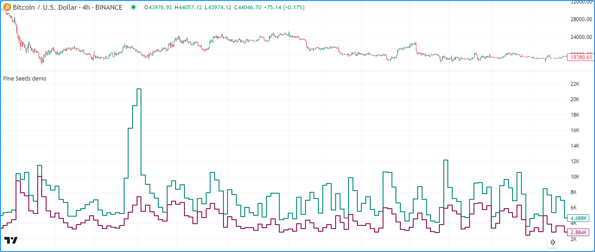

.. code-block:: pine

    //@version=5
    indicator("Pine Seeds demo", format=format.volume)

    //@variable The total positive sentiment for BTC extracted from the "seed_crypto_santiment" repository.
    float positiveTotal = request.seed("seed_crypto_santiment", "BTC_SENTIMENT_POSITIVE_TOTAL", close)
    //@variable The total negative sentiment for BTC extracted from the "seed_crypto_santiment" repository.
    float negativeTotal = request.seed("seed_crypto_santiment", "BTC_SENTIMENT_NEGATIVE_TOTAL", close)

    // Plot the data.
    plot(positiveTotal, "Positive sentiment", color.teal, 2, plot.style_stepline)
    plot(negativeTotal, "Negative sentiment", color.maroon, 2, plot.style_stepline)

Note that:
 - This example requests data from the repo highlighted in the `Pine Seeds documentation <https://github.com/tradingview-pine-seeds/docs/blob/main/README.md>`__. 
   It exists solely for example purposes, and its data *does not* update on a regular basis.
 - Unlike most other ``request.*()`` functions, `request.seed() <https://www.tradingview.com/pine-script-reference/v5/#fun_request.seed>`__ does not 
   have a ``gaps`` parameter. It will always return `na <https://www.tradingview.com/pine-script-reference/v5/#var_na>`__ values when no new data exists.
 - Pine Seeds data is searchable from the chart's symbol search bar. To load a data feed on the chart, enter the *"Repo:File" pair*, similar to 
   searching for an "Exchange:Symbol" pair. 

.. image:: /images/logo/TradingView_Logo_Block.svg
    :width: 200px
    :align: center
    :target: https://www.tradingview.com/
