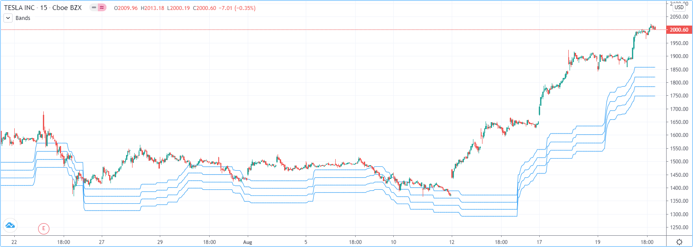
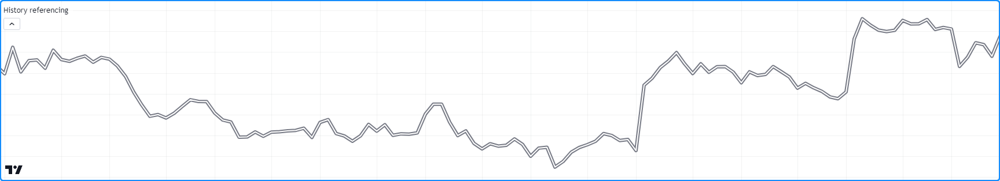
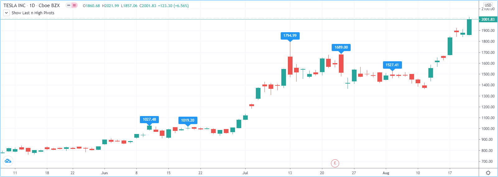
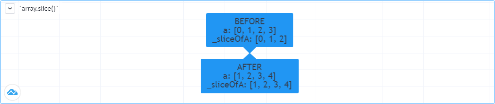

.. |AdvancedLogo| image:: /images/logo/Advanced_logo.svg
   :alt: Advanced logo
   :width: 100
   :height: 100
   :align: bottom

.. figure:: /images/logo/Pine_Script_logo.svg
   :target: https://www.tradingview.com/pine-script-docs/en/v5/Introduction.html
   :figwidth: 50 %
   :align: right
   :width: 100
   :height: 100

   ..

|AdvancedLogo|

.. _PageArrays:

Arrays
======

.. contents:: :local:
    :depth: 3

.. note::
   This page contains advanced material. If you are a beginning Pine Script™ programmer, we recommend 
   you become familiar with other, more accessible Pine Script™ features before you venture here. 

Introduction
------------

Pine Script™ Arrays are one-dimensional collections that can hold multiple value references. Think of them as a better way to handle 
cases where one would otherwise need to explicitly declare a set of similar variables (e.g., ``price00``, ``price01``, ``price02``, ...). 

All elements within an array must be of the same type, which can be a 
`built-in <https://www.tradingview.com/pine-script-docs/en/v5/language/Type_system.html#id2>`__ or a 
:ref:`user-defined type <PageTypeSystem_UserDefinedTypes>`, always qualified as "series". 
Scripts reference arrays using an array ID similar to the IDs of lines, labels, and other special types. 
Pine Script™ does not use an indexing operator to reference individual array elements. 
Instead, functions including `array.get() <https://www.tradingview.com/pine-script-reference/v5/#fun_array{dot}get>`__ 
and `array.set() <https://www.tradingview.com/pine-script-reference/v5/#fun_array{dot}set>`__ read and write the values of array elements. 
We can use array values in expressions and functions that allow "series" values.

Scripts reference the elements of an array using an *index*, which starts at 0 and extends to the number of elements in the array minus one. 
Arrays in Pine Script™ can have a dynamic size that varies across bars, as one can change the number of elements in an array on 
each iteration of a script. Scripts can contain multiple array instances. The size of arrays is limited to 100,000 elements.

.. note::
   We will use *beginning* of an array to designate index 0, and *end* of an array to designate the array's element with the 
   highest index value. We will also extend the meaning of *array* to include array IDs, for the sake of brevity.

.. _PageArrays_DeclaringArrays:

Declaring arrays
----------------

Pine Script™ uses the following syntax to declare arrays:

.. code-block:: text

    [var/varip ][array<type>/<type[]> ]<identifier> = <expression>

Where ``<type>`` is a :ref:`type template <PageTypeSystem_TypeTemplates>` for the array that declares the type 
of values it will contain, and the ``<expression>`` returns either an array of the specified type or ``na``.

When declaring a variable as an array, we can use the `array <https://www.tradingview.com/pine-script-reference/v5/#type_array>`__
keyword followed by a :ref:`type template <PageTypeSystem_TypeTemplates>`. Alternatively, we can use the ``type`` name followed 
by the ``[]`` modifier (not to be confused with the `[] <https://www.tradingview.com/pine-script-reference/v5/#op_[]>`__ *history-referencing operator*).

Since Pine always uses type-specific functions to create arrays, the ``array<type>/type[]`` part of the declaration is redundant, 
except when declaring an array variable assigned to ``na``. Even when not required, explicitly declaring the array type helps clearly 
state the intention to readers.

This line of code declares an array variable named ``prices`` that points to ``na``. 
In this case, we must specify the type to declare that the variable can reference arrays containing "float" values:

.. code-block:: pine

    array<float> prices = na

We can also write the above example in this form:

.. code-block:: pine

    float[] prices = na

When declaring an array and the ``<expression>`` is not ``na``, use one of the following functions: 
`array.new<type>(size, initial_value) <https://www.tradingview.com/pine-script-reference/v5/#fun_array.new%3Ctype%3E>`__, 
`array.from() <https://www.tradingview.com/pine-script-reference/v5/#fun_array{dot}from>`__, 
or `array.copy() <https://www.tradingview.com/pine-script-reference/v5/#fun_array{dot}copy>`__. 
For ``array.new<type>(size, initial_value)`` functions, the arguments of the ``size`` and ``initial_value`` parameters can be "series" to allow dynamic sizing and initialization of array elements.
The following example creates an array containing zero "float" elements, 
and this time, the array ID returned by the `array.new<float>() <https://www.tradingview.com/pine-script-reference/v5/#fun_array.new%3Ctype%3E>`__
function call is assigned to ``prices``:

.. code-block:: pine

    prices = array.new<float>(0)

.. note::
   The ``array.*`` namespace also contains type-specific functions for creating arrays, including 
   `array.new_int() <https://www.tradingview.com/pine-script-reference/v5/#fun_array{dot}new_int>`__,
   `array.new_float() <https://www.tradingview.com/pine-script-reference/v5/#fun_array{dot}new_float>`__,
   `array.new_bool() <https://www.tradingview.com/pine-script-reference/v5/#fun_array{dot}new_bool>`__, 
   `array.new_color() <https://www.tradingview.com/pine-script-reference/v5/#fun_array{dot}new_color>`__,
   `array.new_string() <https://www.tradingview.com/pine-script-reference/v5/#fun_array{dot}new_string>`__,
   `array.new_line() <https://www.tradingview.com/pine-script-reference/v5/#fun_array{dot}new_line>`__,
   `array.new_linefill() <https://www.tradingview.com/pine-script-reference/v5/#fun_array{dot}new_linefill>`__,
   `array.new_label() <https://www.tradingview.com/pine-script-reference/v5/#fun_array{dot}new_label>`__, 
   `array.new_box() <https://www.tradingview.com/pine-script-reference/v5/#fun_array{dot}new_box>`__ and  
   `array.new_table() <https://www.tradingview.com/pine-script-reference/v5/#fun_array{dot}new_table>`__.
   The `array.new<type>() <https://www.tradingview.com/pine-script-reference/v5/#fun_array.new%3Ctype%3E>`__ function 
   can create an array of any type, including :ref:`user-defined types <PageTypeSystem_UserDefinedTypes>`. 

The ``initial_value`` parameter of ``array.new*`` functions allows users to set all elements in the array to a specified value.
If no argument is provided for ``initial_value``, the array is filled with ``na`` values. 

This line declares an array ID named ``prices`` pointing to an array containing two elements, each assigned to the bar's 
``close`` value:

.. code-block:: pine

    prices = array.new<float>(2, close)

To create an array and initialize its elements with different values, use 
`array.from() <https://www.tradingview.com/pine-script-reference/v5/#fun_array{dot}from>`__. This function infers the array's size and the 
type of elements it will hold from the arguments in the function call. As with ``array.new*`` functions, it accepts "series" arguments. All values 
supplied to the function must be of the same type.

For example, all three of these lines of code will create identical "bool" arrays with the same two elements:

.. code-block:: pine

    statesArray = array.from(close > open, high != close)
    bool[] statesArray = array.from(close > open, high != close)
    array<bool> statesArray = array.from(close > open, high != close)

.. _PageArrays_DeclaringArrays_UsingVarAndVaripKeywords:

Using \`var\` and \`varip\` keywords
^^^^^^^^^^^^^^^^^^^^^^^^^^^^^^^^^^^^

Users can utilize `var <https://www.tradingview.com/pine-script-reference/v5/#kw_var>`__ and 
`varip <https://www.tradingview.com/pine-script-reference/v5/#kw_varip>`__ keywords to instruct a script to declare an array 
variable only once on the first iteration of the script on the first chart bar. Array variables declared using these keywords 
point to the same array instances until explicitly reassigned, allowing an array and its element references to persist 
across bars. 

When declaring an array variable using these keywords and pushing a new value to the end of the referenced array on each bar, the array will 
grow by one on each bar and be of size ``bar_index + 1`` (`bar_index <https://www.tradingview.com/pine-script-reference/v5/#var_bar_index>`__ 
starts at zero) by the time the script executes on the last bar, as this code demonstrates:

.. code-block:: pine

    //@version=5
    indicator("Using `var`")
    //@variable An array that expands its size by 1 on each bar.
    var a = array.new<float>(0)
    array.push(a, close)

    if barstate.islast
        //@variable A string containing the size of `a` and the current `bar_index` value.
        string labelText = "Array size: " + str.tostring(a.size()) + "\nbar_index: " + str.tostring(bar_index)
        // Display the `labelText`.
        label.new(bar_index, 0, labelText, size = size.large)

The same code without the `var <https://www.tradingview.com/pine-script-reference/v5/#kw_var>`__ keyword would re-declare the array on each bar. 
In this case, after execution of the `array.push() <https://www.tradingview.com/pine-script-reference/v5/#fun_array{dot}push>`__ call, the 
`a.size() <https://www.tradingview.com/pine-script-reference/v5/#fun_array{dot}size>`__ call would return a value of 1.

.. note::
   Array variables declared using `varip <https://www.tradingview.com/pine-script-reference/v5/#kw_varip>`__ 
   behave as ones using `var <https://www.tradingview.com/pine-script-reference/v5/#kw_var>`__ on historical data, 
   but they update their values for realtime bars (i.e., the bars since the script's last compilation) 
   on each new price tick. Arrays assigned to `varip <https://www.tradingview.com/pine-script-reference/v5/#kw_varip>`__ 
   variables can only hold `int <https://www.tradingview.com/pine-script-reference/v5/#type_int>`__, 
   `float <https://www.tradingview.com/pine-script-reference/v5/#type_float>`__, 
   `bool <https://www.tradingview.com/pine-script-reference/v5/#type_bool>`__, 
   `color <https://www.tradingview.com/pine-script-reference/v5/#type_color>`__, or 
   `string <https://www.tradingview.com/pine-script-reference/v5/#type_string>`__ types or 
   :ref:`user-defined types <PageTypeSystem_UserDefinedTypes>` that exclusively contain within their fields these types 
   or collections (arrays, :ref:`matrices <PageMatrices>`, or :ref:`maps <PageMaps>`) of these types.

.. _PageArrays_ReadingAndWritingArrayElements:

Reading and writing array elements
----------------------------------

Scripts can write values to existing individual array elements using 
`array.set(id, index, value) <https://www.tradingview.com/pine-script-reference/v5/#fun_array{dot}set>`__, 
and read using `array.get(id, index) <https://www.tradingview.com/pine-script-reference/v5/#fun_array{dot}get>`__. 
When using these functions, it is imperative that the ``index`` in the function call is always less than or equal to 
the array's size (because array indices start at zero). To get the size of an array, use the 
`array.size(id) <https://www.tradingview.com/pine-script-reference/v5/#fun_array{dot}size>`__ function.

The following example uses the `set() <https://www.tradingview.com/pine-script-reference/v5/#fun_array{dot}set>`__ method 
to populate a ``fillColors`` array with instances of one base color using different transparency levels. 
It then uses `array.get() <https://www.tradingview.com/pine-script-reference/v5/#fun_array{dot}get>`__ to retrieve one of the colors 
from the array based on the location of the bar with the highest price within the last ``lookbackInput`` bars:

.. image:: images/Arrays-ReadingAndWriting-DistanceFromHigh.png

.. code-block:: pine

    //@version=5
    indicator("Distance from high", "", true)
    lookbackInput = input.int(100)
    FILL_COLOR = color.green
    // Declare array and set its values on the first bar only.
    var fillColors = array.new<color>(5)
    if barstate.isfirst
        // Initialize the array elements with progressively lighter shades of the fill color.
        fillColors.set(0, color.new(FILL_COLOR, 70))
        fillColors.set(1, color.new(FILL_COLOR, 75))
        fillColors.set(2, color.new(FILL_COLOR, 80))
        fillColors.set(3, color.new(FILL_COLOR, 85))
        fillColors.set(4, color.new(FILL_COLOR, 90))

    // Find the offset to highest high. Change its sign because the function returns a negative value.
    lastHiBar = - ta.highestbars(high, lookbackInput)
    // Convert the offset to an array index, capping it to 4 to avoid a runtime error.
    // The index used by `array.get()` will be the equivalent of `floor(fillNo)`.
    fillNo = math.min(lastHiBar / (lookbackInput / 5), 4)
    // Set background to a progressively lighter fill with increasing distance from location of highest high.
    bgcolor(array.get(fillColors, fillNo))
    // Plot key values to the Data Window for debugging.
    plotchar(lastHiBar, "lastHiBar", "", location.top, size = size.tiny)
    plotchar(fillNo, "fillNo", "", location.top, size = size.tiny)

Another technique for initializing the elements in an array is to create an *empty array* (an array with no elements), 
then use `array.push() <https://www.tradingview.com/pine-script-reference/v5/#fun_array{dot}push>`__ to append **new** 
elements to the end of the array, increasing the size of the array by one on each call. 
The following code is functionally identical to the initialization section from the preceding script:

.. code-block:: pine

    // Declare array and set its values on the first bar only.
    var fillColors = array.new<color>(0)
    if barstate.isfirst
        // Initialize the array elements with progressively lighter shades of the fill color.
        array.push(fillColors, color.new(FILL_COLOR, 70))
        array.push(fillColors, color.new(FILL_COLOR, 75))
        array.push(fillColors, color.new(FILL_COLOR, 80))
        array.push(fillColors, color.new(FILL_COLOR, 85))
        array.push(fillColors, color.new(FILL_COLOR, 90))
    
This code is equivalent to the one above, but it uses `array.unshift() <https://www.tradingview.com/pine-script-reference/v5/#fun_array{dot}unshift>`__ 
to insert new elements at the *beginning* of the ``fillColors`` array:

.. code-block:: pine
    
    // Declare array and set its values on the first bar only.
    var fillColors = array.new<color>(0)
    if barstate.isfirst
        // Initialize the array elements with progressively lighter shades of the fill color.
        array.unshift(fillColors, color.new(FILL_COLOR, 90))
        array.unshift(fillColors, color.new(FILL_COLOR, 85))
        array.unshift(fillColors, color.new(FILL_COLOR, 80))
        array.unshift(fillColors, color.new(FILL_COLOR, 75))
        array.unshift(fillColors, color.new(FILL_COLOR, 70))

We can also use `array.from() <https://www.tradingview.com/pine-script-reference/v5/#fun_array{dot}from>`__ to create the 
same ``fillColors`` array with a single function call:

.. code-block:: pine

    //@version=5
    indicator("Using `var`")
    FILL_COLOR = color.green
    var array<color> fillColors = array.from(
         color.new(FILL_COLOR, 70),
         color.new(FILL_COLOR, 75),
         color.new(FILL_COLOR, 80),
         color.new(FILL_COLOR, 85),
         color.new(FILL_COLOR, 90)
     )
    // Cycle background through the array's colors.
    bgcolor(array.get(fillColors, bar_index % (fillColors.size())))

The `array.fill(id, value, index_from, index_to) <https://www.tradingview.com/pine-script-reference/v5/#fun_array{dot}fill>`__ 
function points all array elements, or the elements within the ``index_from`` to ``index_to`` range, to a specified ``value``.
Without the last two optional parameters, the function fills the whole array, so:

.. code-block:: pine

    a = array.new<float>(10, close)

and:

.. code-block:: pine

    a = array.new<float>(10)
    a.fill(close)

are equivalent, but:

.. code-block:: pine

    a = array.new<float>(10)
    a.fill(close, 1, 3)

only fills the second and third elements (at index 1 and 2) of the array with ``close``. 
Note how `array.fill() <https://www.tradingview.com/pine-script-reference/v5/#fun_array{dot}fill>`__'s 
last parameter, ``index_to``, must be one greater than the last index the function will fill. 
The remaining elements will hold ``na`` values, as the 
`array.new() <https://www.tradingview.com/pine-script-reference/v5/#fun_array.new%3Ctype%3E>`__ function call 
does not contain an ``initial_value`` argument.

.. _PageArrays_Looping:

Looping through array elements
------------------------------

When looping through an array's element indices and the array's size is unknown, one can use the 
`array.size() <https://www.tradingview.com/pine-script-reference/v5/#fun_array{dot}size>`__ function to 
get the maximum index value. For example:

.. code-block:: pine

    //@version=5
    indicator("Protected `for` loop", overlay = true)
    //@variable An array of `close` prices from the 1-minute timeframe.
    array<float> a = request.security_lower_tf(syminfo.tickerid, "1", close)

    //@variable A string representation of the elements in `a`.
    string labelText = ""
    for i = 0 to (array.size(a) == 0 ? na : array.size(a) - 1)
        labelText += str.tostring(array.get(a, i)) + "\n"

    label.new(bar_index, high, text = labelText)

Note that:
   - We use the `request.security_lower_tf() <https://www.tradingview.com/pine-script-reference/v5/#fun_request{dot}security_lower_tf>`__ function
     which returns an array of `close <https://www.tradingview.com/pine-script-reference/v5/#var_close>`__ prices at the ``1 minute`` timeframe. 
   - This code example will throw an error if you use it on a chart timeframe smaller than ``1 minute``.
   - `for <https://www.tradingview.com/pine-script-reference/v5/#kw_for>`__ loops do not execute if the ``to`` expression is 
     `na <https://www.tradingview.com/pine-script-reference/v5/#var_na>`__. Note that the ``to`` value is only evaluated once upon entry.

An alternative method to loop through an array is to use a 
`for...in <https://www.tradingview.com/pine-script-reference/v5/#op_for{dot}{dot}{dot}in>`__ loop. 
This approach is a variation of the standard for loop that can iterate over the value references and indices in an array.
Here is an example of how we can write the code example from above using a ``for...in`` loop:

.. code-block:: pine

    //@version=5
    indicator("`for...in` loop", overlay = true)
    //@variable An array of `close` prices from the 1-minute timeframe.
    array<float> a = request.security_lower_tf(syminfo.tickerid, "1", close)

    //@variable A string representation of the elements in `a`.
    string labelText = ""
    for price in a
        labelText += str.tostring(price) + "\n"

    label.new(bar_index, high, text = labelText)

Note that:
 - `for...in <https://www.tradingview.com/pine-script-reference/v5/#op_for{dot}{dot}{dot}in>`__ 
   loops can return a tuple containing each index and corresponding element. For example, 
   ``for [i, price] in a`` returns the ``i`` index and ``price`` value for each element in ``a``. 

A `while <https://www.tradingview.com/pine-script-reference/v5/#kw_while>`__ loop statement can also be used:

.. code-block:: pine

    //@version=5
    indicator("`while` loop", overlay = true)
    array<float> a = request.security_lower_tf(syminfo.tickerid, "1", close)

    string labelText = ""
    int i = 0
    while i < array.size(a)
        labelText += str.tostring(array.get(a, i)) + "\n"
        i += 1

    label.new(bar_index, high, text = labelText)

 
Scope
-----

Users can declare arrays within the global scope of a script, as well as the local scopes of :ref:`functions <PageUserDefinedFunctions>`, 
:ref:`methods <PageMethods>`, and :ref:`conditional structures <PageConditionalStructures>`.
Unlike some of the other built-in types, namely *fundamental* types, scripts can modify globally-assigned arrays from within local scopes, allowing 
users to implement global variables that any function in the script can directly interact with. 
We use the functionality here to calculate progressively lower or higher price levels:

.. code-block:: pine

    //@version=5
    indicator("Bands", "", true)
    //@variable The distance ratio between plotted price levels.
    factorInput = 1 + (input.float(-2., "Step %") / 100)
    //@variable A single-value array holding the lowest `ohlc4` value within a 50 bar window from 10 bars back.
    level = array.new<float>(1, ta.lowest(ohlc4, 50)[10])

    nextLevel(val) =>
        newLevel = level.get(0) * val
        // Write new level to the global `level` array so we can use it as the base in the next function call.
        level.set(0, newLevel)
        newLevel

    plot(nextLevel(1))
    plot(nextLevel(factorInput))
    plot(nextLevel(factorInput))
    plot(nextLevel(factorInput))

.. _PageArrays_HistoryReferencing:

History referencing
-------------------

Pine Script™'s history-referencing operator `[ ] <https://www.tradingview.com/pine-script-reference/v5/#op_[]>`__ 
can access the history of array variables, allowing scripts to interact with past array instances previously assigned 
to a variable. 

To illustrate this, let's create a simple example to show how one can fetch the previous bar's ``close`` value in 
two equivalent ways. This script uses the `[ ] <https://www.tradingview.com/pine-script-reference/v5/#op_[]>`__ operator to 
get the array instance assigned to ``a`` on the previous bar, then uses the `get() <https://www.tradingview.com/pine-script-reference/v5/#fun_array.get>`__ 
method to retrieve the value of the first element (``previousClose1``). For ``previousClose2``, we use the history-referencing operator on the ``close`` 
variable directly to retrieve the value. As we see from the plots, ``previousClose1`` and ``previousClose2`` both return the same value:

.. code-block:: pine

    //@version=5
    indicator("History referencing")

    //@variable A single-value array declared on each bar.
    a = array.new<float>(1)
    // Set the value of the only element in `a` to `close`.
    array.set(a, 0, close)

    //@variable The array instance assigned to `a` on the previous bar.
    previous = a[1]

    previousClose1 = na(previous) ? na : previous.get(0)
    previousClose2 = close[1]

    plot(previousClose1, "previousClose1", color.gray, 6)
    plot(previousClose2, "previousClose2", color.white, 2)

.. _PageArrays_InsertingAndRemovingArrayElements:

Inserting and removing array elements
-------------------------------------

.. _PageArrays_InsertingAndRemovingArrayElements_Inserting:

Inserting
^^^^^^^^^

The following three functions can insert new elements into an array.

`array.unshift() <https://www.tradingview.com/pine-script-reference/v5/#fun_array{dot}unshift>`__ 
inserts a new element at the beginning of an array (index 0) and increases the index values of any existing elements by one.

`array.insert() <https://www.tradingview.com/pine-script-reference/v5/#fun_array{dot}insert>`__ 
inserts a new element at the specified ``index`` and increases the index of existing elements at or 
after the ``index`` by one.

.. image:: images/Arrays-InsertingAndRemovingArrayElements-Insert.png

.. code-block:: pine

    //@version=5
    indicator("`array.insert()`")
    a = array.new<float>(5, 0)
    for i = 0 to 4
        array.set(a, i, i + 1)
    if barstate.islast
        label.new(bar_index, 0, "BEFORE\na: " + str.tostring(a), size = size.large)
        array.insert(a, 2, 999)    
        label.new(bar_index, 0, "AFTER\na: " + str.tostring(a), style = label.style_label_up, size = size.large)

`array.push() <https://www.tradingview.com/pine-script-reference/v5/#fun_array{dot}push>`__ 
adds a new element at the end of an array.

.. _PageArrays_InsertingAndRemovingArrayElements_Removing:

Removing
^^^^^^^^

These four functions remove elements from an array. The first three also return the value of the removed element.

`array.remove() <https://www.tradingview.com/pine-script-reference/v5/#fun_array{dot}remove>`__ 
removes the element at the specified ``index`` and returns that element's value.

`array.shift() <https://www.tradingview.com/pine-script-reference/v5/#fun_array{dot}shift>`__ 
removes the first element from an array and returns its value.

`array.pop() <https://www.tradingview.com/pine-script-reference/v5/#fun_array{dot}pop>`__ 
removes the last element of an array and returns its value.

`array.clear() <https://www.tradingview.com/pine-script-reference/v5/#fun_array{dot}clear>`__ 
removes all elements from an array. Note that clearing an array won't delete any objects its elements referenced. 
See the example below that illustrates how this works:

.. code-block:: pine

    //@version=5
    indicator("`array.clear()` example", overlay = true)

    // Create a label array and add a label to the array on each new bar.
    var a = array.new<label>()
    label lbl = label.new(bar_index, high, "Text", color = color.red)
    array.push(a, lbl)

    var table t = table.new(position.top_right, 1, 1)
    // Clear the array on the last bar. This doesn't remove the labels from the chart. 
    if barstate.islast
        array.clear(a)
        table.cell(t, 0, 0, "Array elements count: " + str.tostring(array.size(a)), bgcolor = color.yellow)

.. _PageArrays_InsertingAndRemovingArrayElements_UsingAnArrayAsAStack:

Using an array as a stack
^^^^^^^^^^^^^^^^^^^^^^^^^

Stacks are LIFO (last in, first out) constructions. They behave somewhat like a vertical pile of books to which books can only be added or removed one at a time,
always from the top. Pine Script™ arrays can be used as a stack, in which case we use the 
`array.push() <https://www.tradingview.com/pine-script-reference/v5/#fun_array{dot}push>`__ and 
`array.pop() <https://www.tradingview.com/pine-script-reference/v5/#fun_array{dot}pop>`__ 
functions to add and remove elements at the end of the array.

``array.push(prices, close)`` will add a new element to the end of the ``prices`` array, increasing the array's size by one.

``array.pop(prices)`` will remove the end element from the ``prices`` array, return its value and decrease the array's size by one.

See how the functions are used here to track successive lows in rallies:

.. image:: images/Arrays-InsertingAndRemovingArrayElements-LowsFromNewHighs.png

.. code-block:: pine

    //@version=5
    indicator("Lows from new highs", "", true)
    var lows = array.new<float>(0)
    flushLows = false
    
    // Remove last element from the stack when `_cond` is true.
    array_pop(id, cond) => cond and array.size(id) > 0 ? array.pop(id) : float(na)
    
    if ta.rising(high, 1)
        // Rising highs; push a new low on the stack.
        lows.push(low)
        // Force the return type of this `if` block to be the same as that of the next block.
        bool(na)
    else if lows.size() >= 4 or low < array.min(lows)
        // We have at least 4 lows or price has breached the lowest low;
        // sort lows and set flag indicating we will plot and flush the levels.
        array.sort(lows, order.ascending)
        flushLows := true
    
    // If needed, plot and flush lows.
    lowLevel = array_pop(lows, flushLows)
    plot(lowLevel, "Low 1", low > lowLevel ? color.silver : color.purple, 2, plot.style_linebr)
    lowLevel := array_pop(lows, flushLows)
    plot(lowLevel, "Low 2", low > lowLevel ? color.silver : color.purple, 3, plot.style_linebr)
    lowLevel := array_pop(lows, flushLows)
    plot(lowLevel, "Low 3", low > lowLevel ? color.silver : color.purple, 4, plot.style_linebr)
    lowLevel := array_pop(lows, flushLows)
    plot(lowLevel, "Low 4", low > lowLevel ? color.silver : color.purple, 5, plot.style_linebr)
    
    if flushLows
        // Clear remaining levels after the last 4 have been plotted.
        lows.clear()

.. _PageArrays_InsertingAndRemovingArrayElements_UsingAnArrayAsAQueue:

Using an array as a queue
^^^^^^^^^^^^^^^^^^^^^^^^^

Queues are FIFO (first in, first out) constructions. They behave somewhat like cars arriving at a red light. 
New cars are queued at the end of the line, and the first car to leave will be the first one that arrived to the red light. 

In the following code example, we let users decide through the script's inputs how many labels they want to have on their chart.
We use that quantity to determine the size of the array of labels we then create, initializing the array's elements to ``na``.

When a new pivot is detected, we create a label for it, saving the label's ID in the ``pLabel`` variable. 
We then queue the ID of that label by 
using `array.push() <https://www.tradingview.com/pine-script-reference/v5/#fun_array{dot}push>`__ 
to append the new label's ID to the end of the array, making our array size one greater than the maximum number of labels to keep on the chart.

Lastly, we de-queue the oldest label by removing the array's first element using 
`array.shift() <https://www.tradingview.com/pine-script-reference/v5/#fun_array{dot}shift>`__ and deleting the label referenced by that array element's value. 
As we have now de-queued an element from our queue, the array contains ``pivotCountInput`` elements once again. 
Note that on the dataset's first bars we will be deleting ``na`` label IDs until the maximum number of labels has been created, 
but this does not cause runtime errors. Let's look at our code:

    
.. code-block:: pine

    //@version=5
    MAX_LABELS = 100
    indicator("Show Last n High Pivots", "", true, max_labels_count = MAX_LABELS)
    
    pivotCountInput = input.int(5, "How many pivots to show", minval = 0, maxval = MAX_LABELS)
    pivotLegsInput  = input.int(3, "Pivot legs", minval = 1, maxval = 5)
    
    // Create an array containing the user-selected max count of label IDs.
    var labelIds = array.new<label>(pivotCountInput)
    
    pHi = ta.pivothigh(pivotLegsInput, pivotLegsInput)
    if not na(pHi)
        // New pivot found; plot its label `i_pivotLegs` bars back.
        pLabel = label.new(bar_index[pivotLegsInput], pHi, str.tostring(pHi, format.mintick), textcolor = color.white)
        // Queue the new label's ID by appending it to the end of the array.
        array.push(labelIds, pLabel)
        // De-queue the oldest label ID from the queue and delete the corresponding label.
        label.delete(array.shift(labelIds))

.. _PageArrays_CalculationsOnArrays:

Calculations on arrays
----------------------

While series variables can be viewed as a horizontal set of values stretching back in time, 
Pine Script™'s one-dimensional arrays can be viewed as vertical structures 
residing on each bar. As an array's set of elements is not a :ref:`time series <PageTypeSystem_TimeSeries>`, 
Pine Script™'s usual mathematical functions are not allowed on them. 
Special-purpose functions must be used to operate on all of an array's values. The available functions are: 
`array.abs() <https://www.tradingview.com/pine-script-reference/v5/#fun_array{dot}abs>`__, 
`array.avg() <https://www.tradingview.com/pine-script-reference/v5/#fun_array{dot}avg>`__, 
`array.covariance() <https://www.tradingview.com/pine-script-reference/v5/#fun_array{dot}covariance>`__,
`array.min() <https://www.tradingview.com/pine-script-reference/v5/#fun_array{dot}min>`__, 
`array.max() <https://www.tradingview.com/pine-script-reference/v5/#fun_array{dot}max>`__, 
`array.median() <https://www.tradingview.com/pine-script-reference/v5/#fun_array{dot}median>`__, 
`array.mode() <https://www.tradingview.com/pine-script-reference/v5/#fun_array{dot}mode>`__, 
`array.percentile_linear_interpolation() <https://www.tradingview.com/pine-script-reference/v5/#fun_array{dot}percentile_linear_interpolation>`__, 
`array.percentile_nearest_rank() <https://www.tradingview.com/pine-script-reference/v5/#fun_array{dot}percentile_nearest_rank>`__, 
`array.percentrank() <https://www.tradingview.com/pine-script-reference/v5/#fun_array{dot}percentrank>`__, 
`array.range() <https://www.tradingview.com/pine-script-reference/v5/#fun_array{dot}range>`__,
`array.standardize() <https://www.tradingview.com/pine-script-reference/v5/#fun_array{dot}standardize>`__, 
`array.stdev() <https://www.tradingview.com/pine-script-reference/v5/#fun_array{dot}stdev>`__, 
`array.sum() <https://www.tradingview.com/pine-script-reference/v5/#fun_array{dot}sum>`__, 
`array.variance() <https://www.tradingview.com/pine-script-reference/v5/#fun_array{dot}variance>`__.

Note that contrary to the usual mathematical functions in Pine Script™, those used on arrays do not return ``na`` when some of the values they 
calculate on have ``na`` values. There are a few exceptions to this rule:

- When all array elements have ``na`` value or the array contains no elements, ``na`` is returned. ``array.standardize()`` however, will return an empty array.
- ``array.mode()`` will return ``na`` when no mode is found.

.. _PageArrays_ManipulatingArrays:

Manipulating arrays
-------------------

.. _PageArrays_ManipulatingArrays_Concatenation:

Concatenation
^^^^^^^^^^^^^

Two arrays can be merged—or concatenated—using `array.concat() <https://www.tradingview.com/pine-script-reference/v5/#fun_array{dot}concat>`__. 
When arrays are concatenated, the second array is appended to the end of the first, 
so the first array is modified while the second one remains intact. The function returns the array ID of the first array:

.. image:: images/Arrays-ManipulatingArrays-Concat.png

.. code-block:: pine

    //@version=5
    indicator("`array.concat()`")
    a = array.new<float>(0)
    b = array.new<float>(0)
    array.push(a, 0)
    array.push(a, 1)
    array.push(b, 2)
    array.push(b, 3)
    if barstate.islast
        label.new(bar_index, 0, "BEFORE\na: " + str.tostring(a) + "\nb: " + str.tostring(b), size = size.large)
        c = array.concat(a, b)
        array.push(c, 4)
        label.new(bar_index, 0, "AFTER\na: " + str.tostring(a) + "\nb: " + str.tostring(b) + "\nc: " + str.tostring(c), style = label.style_label_up, size = size.large)

.. _PageArrays_ManipulatingArrays_Copying:

Copying
^^^^^^^

You can copy an array using `array.copy() <https://www.tradingview.com/pine-script-reference/v5/#fun_array{dot}copy>`__. 
Here we copy the array ``a`` to a new array named ``_b``:

.. image:: images/Arrays-ManipulatingArrays-Copy.png

.. code-block:: pine

    //@version=5
    indicator("`array.copy()`")
    a = array.new<float>(0)
    array.push(a, 0)
    array.push(a, 1)
    if barstate.islast
        b = array.copy(a)
        array.push(b, 2)
        label.new(bar_index, 0, "a: " + str.tostring(a) + "\nb: " + str.tostring(b), size = size.large)

Note that simply using ``_b = a`` in the previous example would not have copied the array, but only its ID. 
From thereon, both variables would point to the same array, so using either one would affect the same array.

.. _PageArrays_ManipulatingArrays_Joining:

Joining
^^^^^^^

Use `array.join() <https://www.tradingview.com/pine-script-reference/v5/#fun_array{dot}join>`__ to concatenate all of the elements in the array into a string and separate these elements with the specified separator:

.. code-block:: pine

    //@version=5
    indicator("")
    v1 = array.new<string>(10, "test")
    v2 = array.new<string>(10, "test")
    array.push(v2, "test1")
    v3 = array.new_float(5, 5)
    v4 = array.new_int(5, 5)
    l1 = label.new(bar_index, close, array.join(v1))
    l2 = label.new(bar_index, close, array.join(v2, ","))
    l3 = label.new(bar_index, close, array.join(v3, ","))
    l4 = label.new(bar_index, close, array.join(v4, ","))

.. _PageArrays_ManipulatingArrays_Sorting:

Sorting
^^^^^^^

Arrays containing "int" or "float" elements can be sorted in either ascending or descending order using 
`array.sort() <https://www.tradingview.com/pine-script-reference/v5/#fun_array{dot}sort>`__. 
The ``order`` parameter is optional and defaults to `order.ascending <https://www.tradingview.com/pine-script-reference/v5/#const_order{dot}ascending>`__. 
As all ``array.*()`` function arguments, it is qualified as "series", so can be determined at runtime, as is done here. 
Note that in the example, which array is sorted is also determined at runtime:

.. image:: images/Arrays-ManipulatingArrays-Sort.png

.. code-block:: pine

    //@version=5
    indicator("`array.sort()`")
    a = array.new<float>(0)
    b = array.new<float>(0)
    array.push(a, 2)
    array.push(a, 0)
    array.push(a, 1)
    array.push(b, 4)
    array.push(b, 3)
    array.push(b, 5)
    if barstate.islast
        barUp = close > open
        array.sort(barUp ? a : b, barUp ? order.ascending : order.descending)
        label.new(bar_index, 0, 
          "a " + (barUp ? "is sorted ▲: "   : "is not sorted: ") + str.tostring(a) + "\n\n" +
          "b " + (barUp ? "is not sorted: " : "is sorted ▼: ")   + str.tostring(b), size = size.large)

Another useful option for sorting arrays is to use the 
`array.sort_indices() <https://www.tradingview.com/pine-script-reference/v5/#fun_array{dot}sort_indices>`__ 
function, which takes a reference to the original array and returns an array containing the indices from the original array. 
Please note that this function won't modify the original array. The ``order`` parameter is optional and defaults to 
`order.ascending <https://www.tradingview.com/pine-script-reference/v5/#const_order{dot}ascending>`__. 

.. _PageArrays_ManipulatingArrays_Reversing:

Reversing
^^^^^^^^^

Use `array.reverse() <https://www.tradingview.com/pine-script-reference/v5/#fun_array{dot}reverse>`__  to reverse an array:

.. code-block:: pine

    //@version=5
    indicator("`array.reverse()`")
    a = array.new<float>(0)
    array.push(a, 0)
    array.push(a, 1)
    array.push(a, 2)
    if barstate.islast
        array.reverse(a)
        label.new(bar_index, 0, "a: " + str.tostring(a))

.. _PageArrays_ManipulatingArrays_Slicing:

Slicing
^^^^^^^

Slicing an array using `array.slice() <https://www.tradingview.com/pine-script-reference/v5/#fun_array{dot}slice>`__ 
creates a shallow copy of a subset of the parent array. 
You determine the size of the subset to slice using the ``index_from`` and ``index_to`` parameters. 
The ``index_to`` argument must be one greater than the end of the subset you want to slice. 

The shallow copy created by the slice acts like a window on the parent array's content. 
The indices used for the slice define the window's position and size over the parent array. 
If, as in the example below, a slice is created from the first three elements of an array (indices 0 to 2),
then regardless of changes made to the parent array, and as long as it contains at least three elements, 
the shallow copy will always contain the parent array's first three elements.

Additionally, once the shallow copy is created, operations on the copy are mirrored on the parent array. 
Adding an element to the end of the shallow copy, as is done in the following example, 
will widen the window by one element and also insert that element in the parent array at index 3.
In this example, to slice the subset from index 0 to index 2 of array ``a``, we must use ``_sliceOfA = array.slice(a, 0, 3)``:

.. code-block:: pine

    //@version=5
    indicator("`array.slice()`")
    a = array.new<float>(0)
    array.push(a, 0)
    array.push(a, 1)
    array.push(a, 2)
    array.push(a, 3)
    if barstate.islast
        // Create a shadow of elements at index 1 and 2 from array `a`.
        sliceOfA = array.slice(a, 0, 3)
        label.new(bar_index, 0, "BEFORE\na: " + str.tostring(a) + "\nsliceOfA: " + str.tostring(sliceOfA))
        // Remove first element of parent array `a`.
        array.remove(a, 0)
        // Add a new element at the end of the shallow copy, thus also affecting the original array `a`.
        array.push(sliceOfA, 4)
        label.new(bar_index, 0, "AFTER\na: " + str.tostring(a) + "\nsliceOfA: " + str.tostring(sliceOfA), style = label.style_label_up)

.. _PageArrays_SearchingArrays:

Searching arrays
----------------

We can test if a value is part of an array with the 
`array.includes() <https://www.tradingview.com/pine-script-reference/v5/#fun_array{dot}includes>`__ function, 
which returns true if the element is found.
We can find the first occurrence of a value in an array by using the 
`array.indexof() <https://www.tradingview.com/pine-script-reference/v5/#fun_array{dot}indexof>`__ function. 
The first occurence is the one with the lowest index.
We can also find the last occurrence of a value with 
`array.lastindexof() <https://www.tradingview.com/pine-script-reference/v5/#fun_array{dot}lastindexof>`__:

.. code-block:: pine

    //@version=5
    indicator("Searching in arrays")
    valueInput = input.int(1)
    a = array.new<float>(0)
    array.push(a, 0)
    array.push(a, 1)
    array.push(a, 2)
    array.push(a, 1)
    if barstate.islast
        valueFound      = array.includes(a, valueInput)
        firstIndexFound = array.indexof(a, valueInput)
        lastIndexFound  = array.lastindexof(a, valueInput)
        label.new(bar_index, 0, "a: " + str.tostring(a) + 
          "\nFirst " + str.tostring(valueInput) + (firstIndexFound != -1 ? " value was found at index: " + str.tostring(firstIndexFound) : " value was not found.") +
          "\nLast " + str.tostring(valueInput)  + (lastIndexFound  != -1 ? " value was found at index: " + str.tostring(lastIndexFound) : " value was not found."))

We can also perform a binary search on an array but note that performing a binary search on an array 
means that the array will first need to be sorted in ascending order only. 
The `array.binary_search() <https://www.tradingview.com/pine-script-reference/v5/#fun_array{dot}binary_search>`__ 
function will return the value's index if it was found or -1 if it wasn't. 
If we want to always return an existing index from the array even if our chosen value wasn't found, 
then we can use one of the other binary search functions available. 
The `array.binary_search_leftmost() <https://www.tradingview.com/pine-script-reference/v5/#fun_array{dot}binary_search_leftmost>`__ 
function, which returns an index if the value was found or the first index to the left where the value would be found. 
The `array.binary_search_rightmost() <https://www.tradingview.com/pine-script-reference/v5/#fun_array{dot}binary_search_rightmost>`__ 
function is almost identical and returns an index if the value was found or the first index to the right where the value would be found. 

.. _PageArrays_ErrorHandling:

Error handling
--------------

Malformed ``array.*()`` call syntax in Pine scripts will cause the usual **compiler** error messages to appear in Pine Editor's console, 
at the bottom of the window, when you save a script. Refer to the Pine Script™ `v5 Reference Manual <https://www.tradingview.com/pine-script-reference/v5/>`__ 
when in doubt regarding the exact syntax of function calls.

Scripts using arrays can also throw **runtime** errors, which appear as an exclamation mark next to the indicator's name on the chart. 
We discuss those runtime errors in this section.

.. _PageArrays_ErrorHandling_IndexIsOutOfBounds:

Index xx is out of bounds. Array size is yy
^^^^^^^^^^^^^^^^^^^^^^^^^^^^^^^^^^^^^^^^^^^

This will most probably be the most frequent error you encounter. It will happen when you reference an nonexistent array index. 
The "xx" value will be the value of the faulty index you tried to use, and "yy" will be the size of the array. 
Recall that array indices start at zero—not one—and end at the array's size, minus one. An array of size 3's last valid index is thus ``2``.

To avoid this error, you must make provisions in your code logic to prevent using an index lying outside of the array's index boundaries. 
This code will generate the error because the last index we use in the loop is outside the valid index range for the array:

.. code-block:: pine

    //@version=5
    indicator("Out of bounds index")
    a = array.new<float>(3)
    for i = 1 to 3
        array.set(a, i, i)
    plot(array.pop(a))

The correct ``for`` statement is:

.. code-block:: pine

    for i = 0 to 2

To loop on all array elements in an array of unknown size, use: 

.. code-block:: pine

    //@version=5
    indicator("Protected `for` loop")
    sizeInput = input.int(0, "Array size", minval = 0, maxval = 100000)
    a = array.new<float>(sizeInput)
    for i = 0 to (array.size(a) == 0 ? na : array.size(a) - 1)
        array.set(a, i, i)
    plot(array.pop(a))

When you size arrays dynamically using a field in your script's *Settings/Inputs* tab, protect the boundaries of that value using 
`input.int() <https://www.tradingview.com/pine-script-reference/v5/#fun_input{dot}int>`__'s ``minval`` and ``maxval`` parameters:

.. code-block:: pine

    //@version=5
    indicator("Protected array size")
    sizeInput = input.int(10, "Array size", minval = 1, maxval = 100000)
    a = array.new<float>(sizeInput)
    for i = 0 to sizeInput - 1
        array.set(a, i, i)
    plot(array.size(a))

See the :ref:`Looping <PageArrays_Looping>` section of this page for more information.

.. _PageArrays_ErrorHandling_CannotCallMethodsWhenArrayIsNa:

Cannot call array methods when ID of array is 'na'
^^^^^^^^^^^^^^^^^^^^^^^^^^^^^^^^^^^^^^^^^^^^^^^^^^

When an array ID is initialized to ``na``, operations on it are not allowed, since no array exists. 
All that exists at that point is an array variable containing the ``na`` value rather that a valid array ID pointing to an existing array. 
Note that an array created with no elements in it, as you do when you use ``a = array.new_int(0)``, has a valid ID nonetheless. 
This code will throw the error we are discussing:

.. code-block:: pine

    //@version=5
    indicator("Out of bounds index")
    array<int> a = na
    array.push(a, 111)
    label.new(bar_index, 0, "a: " + str.tostring(a))

To avoid it, create an array with size zero using:

.. code-block:: pine

    array<int> a = array.new_int(0)

or:

.. code-block:: pine

    a = array.new_int(0)

.. _PageArrays_ErrorHandling_ArrayIsTooLarge:

Array is too large. Maximum size is 100000
^^^^^^^^^^^^^^^^^^^^^^^^^^^^^^^^^^^^^^^^^^

This error will appear if your code attempts to declare an array with a size greater than 100,000. 
It will also occur if, while dynamically appending elements to an array, a new element would increase the array's size past the maximum.

.. _PageArrays_ErrorHandling_CannotCreateArrayWithNegativeSize:

Cannot create an array with a negative size
^^^^^^^^^^^^^^^^^^^^^^^^^^^^^^^^^^^^^^^^^^^

We haven't found any use for arrays of negative size yet, but if you ever do, we may allow them :)

.. _PageArrays_ErrorHandling_CannotUseShiftIfArrayIsEmpty:

Cannot use shift() if array is empty.
^^^^^^^^^^^^^^^^^^^^^^^^^^^^^^^^^^^^^^^

This error will occur if `array.shift() <https://www.tradingview.com/pine-script-reference/v5/#fun_array{dot}shift>`__ 
is called to remove the first element of an empty array.

.. _PageArrays_ErrorHandling_CannotUsePopIfArrayIsEmpty:

Cannot use pop() if array is empty.
^^^^^^^^^^^^^^^^^^^^^^^^^^^^^^^^^^^^^

This error will occur if `array.pop() <https://www.tradingview.com/pine-script-reference/v5/#fun_array{dot}pop>`__ 
is called to remove the last element of an empty array.

.. _PageArrays_ErrorHandling_IndexFromShouldBeLessThanIndexTo:

Index 'from' should be less than index 'to'
^^^^^^^^^^^^^^^^^^^^^^^^^^^^^^^^^^^^^^^^^^^

When two indices are used in functions such as `array.slice() <https://www.tradingview.com/pine-script-reference/v5/#fun_array{dot}slice>`__, 
the first index must always be smaller than the second one.

.. _PageArrays_ErrorHandling_SliceIsOutOfBounds:

Slice is out of bounds of the parent array
^^^^^^^^^^^^^^^^^^^^^^^^^^^^^^^^^^^^^^^^^^

This message occurs whenever the parent array's size is modified in such a way that it makes the shallow copy 
created by a slice point outside the boundaries of the parent array. This code will reproduce it because after creating a slice 
from index 3 to 4 (the last two elements of our five-element parent array), we remove the parent's first element, 
making its size four and its last index 3. From that moment on, the shallow copy which is still poiting to the "window" at 
the parent array's indices 3 to 4, is pointing out of the parent array's boundaries:

.. code-block:: pine

    //@version=5
    indicator("Slice out of bounds")
    a = array.new<float>(5, 0)
    b = array.slice(a, 3, 5)
    array.remove(a, 0)
    c = array.indexof(b, 2)
    plot(c)

.. image:: /images/logo/TradingView_Logo_Block.svg
    :width: 200px
    :align: center
    :target: https://www.tradingview.com/
