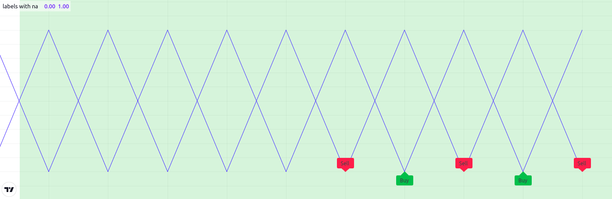
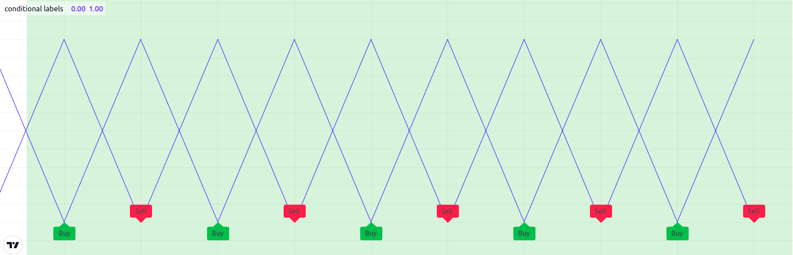

.. image:: /images/logo/Pine_Script_logo.svg
   :alt: Pine Script™ logo
   :target: https://www.tradingview.com/pine-script-docs/en/v5/Introduction.html
   :align: right
   :width: 100
   :height: 100

.. _PageLimitations:

Limitations
===========

.. contents:: :local:
    :depth: 3

Introduction
------------

As is mentioned in our :ref:`Welcome <PageWelcomeToPine>` page:

  *Because each script uses computational resources in the cloud, we must impose limits in order to share these resources fairly among our users. 
  We strive to set as few limits as possible, but will of course have to implement as many as needed for the platform to run smoothly. 
  Limitations apply to the amount of data requested from additional symbols, execution time, memory usage and script size.*

If you develop complex scripts using Pine Script™, sooner or later you will run into some of the limitations we impose.
This section provides you with an overview of the limitations that you may encounter.
There are currently no means for Pine Script™ programmers to get data on the resources consumed by their scripts.
We hope this will change in the future.

In the meantime, when you are considering large projects, it is safest to make a proof of concept 
in order to assess the probability of your script running into limitations later in your project.

Below, we describe the limits imposed in the Pine Script™ environment. 

.. _PageLimitations_Time:

Time
----

.. _PageLimitations_Time_ScriptCompilation:

Script compilation
^^^^^^^^^^^^^^^^^^

Scripts must compile before they are executed on charts. Compilation occurs when you save a script from the Pine Editor or when you add a script to the chart.
A two-minute limit is imposed on compilation time, which will depend on the size and complexity of your script, 
and whether or not a cached version of a previous compilation is available.
When a compile exceeds the two-minute limit, a warning is issued. 
Heed that warning by shortening your script because after three consecutives warnings a one-hour ban on compilation attempts is enforced.
The first thing to consider when optimizing code is to avoid repetitions by using functions to encapsulate oft-used segments, 
and call functions instead of repeating code.

.. _PageLimitations_Time_ScriptExecution:

Script execution
^^^^^^^^^^^^^^^^

Once a script is compiled it can be executed. 
See the :ref:`Events triggering the execution of a script <PageExecutionModel_Events>` for a list of the events triggering the execution of a script.
The time allotted for the script to execute on all bars of a dataset varies with account types. The limit is 20 seconds for basic accounts, 40 for others.

.. _PageLimitations_Time_LoopExecution:

Loop execution
^^^^^^^^^^^^^^

The execution time for any loop on any single bar is limited to 500 milliseconds. 
The outer loop of embedded loops counts as one loop, so it will time out first. 
Keep in mind that even though a loop may execute under the 500 ms time limit on a given bar, 
the time it takes to execute on all the dataset's bars may nonetheless cause your script to exceed the total execution time limit. 
For example, the limit on total execution time will make it impossible for you script to execute a 400 ms loop on each bar of a 20,000-bar dataset
because your script would then need 8000 seconds to execute.

.. _PageLimitations_ChartVisuals:

Chart visuals
-------------

.. _PageLimitations_ChartVisuals_PlotLimits:

Plot limits
^^^^^^^^^^^

A maximum of 64 plot counts are allowed per script. The functions that generate plot counts are:

- `plot() <https://www.tradingview.com/pine-script-reference/v5/#fun_plot>`__
- `plotarrow() <https://www.tradingview.com/pine-script-reference/v5/#fun_plotarrow>`__
- `plotbar() <https://www.tradingview.com/pine-script-reference/v5/#fun_plotbar>`__
- `plotcandle() <https://www.tradingview.com/pine-script-reference/v5/#fun_plotcandle>`__
- `plotchar() <https://www.tradingview.com/pine-script-reference/v5/#fun_plotchar>`__
- `plotshape() <https://www.tradingview.com/pine-script-reference/v5/#fun_plotshape>`__
- `alertcondition() <https://www.tradingview.com/pine-script-reference/v5/#fun_alertcondition>`__
- `bgcolor() <https://www.tradingview.com/pine-script-reference/v5/#fun_bgcolor>`__
- `fill() <https://www.tradingview.com/pine-script-reference/v5/#fun_fill>`__, but only if its ``color`` is of the `series <https://www.tradingview.com/pine-script-reference/v5/#type_series>`__ form.

The following functions do not generate plot counts:

- `hline() <https://www.tradingview.com/pine-script-reference/v5/#fun_hline>`__
- `line.new() <https://www.tradingview.com/pine-script-reference/v5/#fun_line{dot}new>`__
- `label.new() <https://www.tradingview.com/pine-script-reference/v5/#fun_label{dot}new>`__
- `table.new() <https://www.tradingview.com/pine-script-reference/v5/#fun_table{dot}new>`__
- `box.new() <https://www.tradingview.com/pine-script-reference/v5/#fun_box{dot}new>`__

One function call can generate up to seven plot counts, depending on the function and how it is called. 
When your script exceeds the maximum of 64 plot counts, the runtime error message will display the plot count generated by your script. 
Once you reach that point, you can determine how many plot counts a function call generates by commenting it out in a script. 
As long as your script still throws an error, you will be able to see how the actual plot count decreases after you have commented out a line.

The following example shows different function calls and the number of plot counts each one will generate:

.. code-block:: pine

    //@version=5
    indicator("Plot count example")

    bool isUp = close > open
    color isUpColor = isUp ? color.green : color.red
    bool isDn = not isUp
    color isDnColor = isDn ? color.red : color.green

    // Uses one plot count each.
    p1 = plot(close, color = color.white)
    p2 = plot(open, color = na)

    // Uses two plot counts for the `close` and `color` series.
    plot(close, color = isUpColor)

    // Uses one plot count for the `close` series.
    plotarrow(close, colorup = color.green, colordown = color.red)

    // Uses two plot counts for the `close` and `colorup` series.
    plotarrow(close, colorup = isUpColor)

    // Uses three plot counts for the `close`, `colorup`, and the `colordown` series.
    plotarrow(close - open, colorup = isUpColor, colordown = isDnColor)

    // Uses four plot counts for the `open`, `high`, `low`, and `close` series.
    plotbar(open, high, low, close, color = color.white)

    // Uses five plot counts for the `open`, `high`, `low`, `close`, and `color` series.
    plotbar(open, high, low, close, color = isUpColor)

    // Uses four plot counts for the `open`, `high`, `low`, and `close` series.
    plotcandle(open, high, low, close, color = color.white, wickcolor = color.white, bordercolor = color.purple)

    // Uses five plot counts for the `open`, `high`, `low`, `close`, and `color` series.
    plotcandle(open, high, low, close, color = isUpColor, wickcolor = color.white, bordercolor = color.purple)

    // Uses six plot counts for the `open`, `high`, `low`, `close`, `color`, and `wickcolor` series.
    plotcandle(open, high, low, close, color = isUpColor, wickcolor = isUpColor , bordercolor = color.purple)

    // Uses seven plot counts for the `open`, `high`, `low`, `close`, `color`, `wickcolor`, and `bordercolor` series.
    plotcandle(open, high, low, close, color = isUpColor, wickcolor = isUpColor , bordercolor = isUp ? color.lime : color.maroon)

    // Uses one plot count for the `close` series.
    plotchar(close, color = color.white, text = "|", textcolor = color.white)

    // Uses two plot counts for the `close`` and `color` series.
    plotchar(close, color = isUpColor, text = "—", textcolor = color.white)

    // Uses three plot counts for the `close`, `color`, and `textcolor` series.
    plotchar(close, color = isUpColor, text = "O", textcolor = isUp ? color.yellow : color.white)

    // Uses one plot count for the `close` series.
    plotshape(close, color = color.white, textcolor = color.white)

    // Uses two plot counts for the `close` and `color` series.
    plotshape(close, color = isUpColor, textcolor = color.white)

    // Uses three plot counts for the `close`, `color`, and `textcolor` series.
    plotshape(close, color = isUpColor, textcolor = isUp ? color.yellow : color.white)

    // Uses one plot count.
    alertcondition(close > open, "close > open", "Up bar alert")

    // Uses one plot count.
    bgcolor(isUp ? color.yellow : color.white)

    // Uses one plot count for the `color` series.
    fill(p1, p2, color = isUpColor)

This example generates a plot count of 56. If we were to add two more instances of the last call to 
`plotcandle() <https://www.tradingview.com/pine-script-reference/v5/#fun_plotcandle>`__, 
the script would throw an error stating that the script now uses 70 plot counts, as each additional call to 
`plotcandle() <https://www.tradingview.com/pine-script-reference/v5/#fun_plotcandle>`__ 
generates seven plot counts, and 56 + (7 * 2) is 70.

.. _PageLimitations_ChartVisuals_LineBoxPolylineAndLabelLimits:

Line, box, polyline, and label limits
^^^^^^^^^^^^^^^^^^^^^^^^^^^^^^^^^^^^^

Contrary to :ref:`plots <PagePlots>`, which can cover the chart's entire dataset, scripts will only show the last 50 
:ref:`lines <PageLinesAndBoxes_Lines>`, :ref:`boxes <PageLinesAndBoxes_Boxes>`, :ref:`polylines <PageLinesAndBoxes_Polylines>`, 
and :ref:`labels <PageTextAndShapes_Labels>` on the chart by default. One can increase the maximum number for each of these 
:ref:`drawing types <PageTypeSystem_Types_DrawingTypes>` via the ``max_lines_count``, ``max_boxes_count``, ``max_polylines_count``, 
and ``max_labels_count`` parameters of the script's 
`indicator() <https://www.tradingview.com/pine-script-reference/v5/#fun_indicator>`__ or 
`strategy() <https://www.tradingview.com/pine-script-reference/v5/#fun_strategy>`__ declaration statement. The maximum number of 
`line <https://www.tradingview.com/pine-script-reference/v5/#type_line>`__, 
`box <https://www.tradingview.com/pine-script-reference/v5/#type_box>`__, and 
`label <https://www.tradingview.com/pine-script-reference/v5/#type_label>`__ IDs is 500, and the maximum number of 
`polyline <https://www.tradingview.com/pine-script-reference/v5/#type_polyline>`__ IDs is 100.

In this example, we set the maximum number of recent labels shown on the chart to 100:

.. code-block:: pine

    //@version=5
    indicator("Label limits example", max_labels_count = 100, overlay = true)
    label.new(bar_index, high, str.tostring(high, format.mintick))

It's important to note when setting any of a drawing object's properties to 
`na <https://www.tradingview.com/pine-script-reference/v5/#var_na>`__ that its ID still exists and thus contributes to a 
script's drawing totals. To demonstrate this behavior, the following script draws a "Buy" and "Sell" 
`label <https://www.tradingview.com/pine-script-reference/v5/#type_label>`__ on each bar, with ``x`` values determined by the 
``longCondition`` and ``shortCondition`` variables.

The "Buy" label's ``x`` value is `na <https://www.tradingview.com/pine-script-reference/v5/#var_na>`__ when the bar index is even, 
and the "Sell" label's ``x`` value is `na <https://www.tradingview.com/pine-script-reference/v5/#var_na>`__ when the bar index is odd.
Although the ``max_labels_count`` is 10 in this example, we can see that the script displays fewer than 10 :ref:`labels <PageTextAndShapes_Labels>` 
on the chart since the ones with `na <https://www.tradingview.com/pine-script-reference/v5/#var_na>`__ values also count toward the total:

.. code-block:: pine

    //@version=5

    // Approximate maximum number of label drawings
    MAX_LABELS = 10

    indicator("labels with na", overlay = false, max_labels_count = MAX_LABELS)

    // Add background color for the last MAX_LABELS bars.
    bgcolor(bar_index > last_bar_index - MAX_LABELS ? color.new(color.green, 80) : na)

    longCondition =  bar_index % 2 != 0
    shortCondition = bar_index % 2 == 0

    // Add "Buy" and "Sell" labels on each new bar.
    label.new(longCondition ? bar_index : na,  0, text = "Buy", color = color.new(color.green, 0), style = label.style_label_up)
    label.new(shortCondition ? bar_index : na, 0, text = "Sell", color = color.new(color.red, 0), style = label.style_label_down)

    plot(longCondition  ? 1 : 0)
    plot(shortCondition ? 1 : 0)

To display the desired number of labels, we must eliminate label drawings we don't want to show rather than setting their properties to 
`na <https://www.tradingview.com/pine-script-reference/v5/#var_na>`__. The example below uses an 
`if <https://www.tradingview.com/pine-script-reference/v5/#kw_if>`__ structure to conditionally draw the "Buy" and "Sell" labels, 
preventing the script from creating new label IDs when it isn't necessary:

.. code-block:: pine

    //@version=5

    // Approximate maximum number of label drawings
    MAX_LABELS = 10

    indicator("conditional labels", overlay = false, max_labels_count = MAX_LABELS)

    // Add background color for the last MAX_LABELS bars.
    bgcolor(bar_index > last_bar_index - MAX_LABELS ? color.new(color.green, 80) : na)

    longCondition =  bar_index % 2 != 0
    shortCondition = bar_index % 2 == 0

    // Add a "Buy" label when `longCondition` is true.
    if longCondition
        label.new(bar_index,  0, text = "Buy", color = color.new(color.green, 0), style = label.style_label_up)
    // Add a "Sell" label when `shortCondition` is true.
    if shortCondition
        label.new(bar_index, 0, text = "Sell", color = color.new(color.red, 0), style = label.style_label_down)

    plot(longCondition  ? 1 : 0)
    plot(shortCondition ? 1 : 0)

.. _PageLimitations_ChartVisuals_TableLimits:

Table limits
^^^^^^^^^^^^

Scripts can display a maximum of nine :ref:`tables <PageTables>` on the chart, one for each of the possible locations: 
`position.bottom_center <https://www.tradingview.com/pine-script-reference/v5/#const_position{dot}bottom_center>`__, 
`position.bottom_left <https://www.tradingview.com/pine-script-reference/v5/#const_position{dot}bottom_left>`__, 
`position.bottom_right <https://www.tradingview.com/pine-script-reference/v5/#const_position{dot}bottom_right>`__, 
`position.middle_center <https://www.tradingview.com/pine-script-reference/v5/#const_position{dot}middle_center>`__, 
`position.middle_left <https://www.tradingview.com/pine-script-reference/v5/#const_position{dot}middle_left>`__, 
`position.middle_right <https://www.tradingview.com/pine-script-reference/v5/#const_position{dot}middle_right>`__, 
`position.top_center <https://www.tradingview.com/pine-script-reference/v5/#const_position{dot}top_center>`__, 
`position.top_left <https://www.tradingview.com/pine-script-reference/v5/#const_position{dot}top_left>`__, 
and `position.top_right <https://www.tradingview.com/pine-script-reference/v5/#const_position{dot}top_right>`__. 
When attempting to place two tables in the same location, only the newest instance will show on the chart.

.. _PageLimitations_RequestCalls:

\`request.*()\` calls
---------------------

.. _PageLimitations_RequestCalls_NumberOfCalls:

Number of calls
^^^^^^^^^^^^^^^

A script cannot contain more than 40 calls to functions in the ``request.()`` namespace. All instances of these 
functions count toward this limit, even when contained within local blocks of :ref:`user-defined functions <PageUserDefinedFunctions>` 
that aren't utilized by the script's main logic. This limitation applies to all functions discussed in the 
:ref:`Other timeframes and data <PageOtherTimeframesAndData>` page, including:

- `request.security() <https://www.tradingview.com/pine-script-reference/v5/#fun_request.security>`__
- `request.security_lower_tf() <https://www.tradingview.com/pine-script-reference/v5/#fun_request.security_lower_tf>`__
- `request.currency_rate() <https://www.tradingview.com/pine-script-reference/v5/#fun_request.currency_rate>`__
- `request.dividends() <https://www.tradingview.com/pine-script-reference/v5/#fun_request.dividends>`__
- `request.splits() <https://www.tradingview.com/pine-script-reference/v5/#fun_request.splits>`__
- `request.earnings() <https://www.tradingview.com/pine-script-reference/v5/#fun_request.earnings>`__
- `request.quandl() <https://www.tradingview.com/pine-script-reference/v5/#fun_request.quandl>`__
- `request.financial() <https://www.tradingview.com/pine-script-reference/v5/#fun_request.financial>`__
- `request.economic() <https://www.tradingview.com/pine-script-reference/v5/#fun_request.economic>`__
- `request.seed() <https://www.tradingview.com/pine-script-reference/v5/#fun_request.seed>`__

.. _PageLimitations_RequestCalls_Intrabars:

Intrabars
^^^^^^^^^

Scripts can retrieve up to the most recent 100,000 *intrabars* (lower-timeframe bars) via the 
`request.security() <https://www.tradingview.com/pine-script-reference/v5/#fun_request.security>`__ or 
`request.security_lower_tf() <https://www.tradingview.com/pine-script-reference/v5/#fun_request.security_lower_tf>`__ 
functions.

The number of bars on the chart's timeframe covered by 100,000 intrabars varies with the number of 
intrabars each chart bar contains. For example, requesting data from the 1-minute timeframe while running 
the script on a 60-minute chart means each chart bar can contain up to 60 intrabars. In this case, 
the minimum number of chart bars covered by the intrabar request is 1,666, as 100,000 / 60 = 1,666.67. 
It's important to note, however, that a provider may not report data for *every* minute within an hour. 
Therefore, such a request may cover more chart bars, depending on the available data. 

.. _PageLimitations_RequestCalls_TupleElementLimit:

Tuple element limit
^^^^^^^^^^^^^^^^^^^

All the ``request.*()`` function calls in a script taken together cannot return more than 127 tuple elements. 
When the combined tuple size of all ``request.*()`` calls will exceed 127 elements, one can instead utilize 
:ref:`user-defined types (UDTs) <PageTypeSystem_UserDefinedTypes>` to request a greater number of values.

The example below outlines this limitation and the way to work around it. The first 
`request.security() <https://www.tradingview.com/pine-script-reference/v5/#fun_request.security>`__ call represents 
using a tuple with 128 elements as the ``expression`` argument. Since the number of elements is greater than 127, 
it would result in an error. 

To avoid the error, we can use those same values as *fields* within an 
:ref:`object <PageObjects>` of a :ref:`UDT <PageTypeSystem_UserDefinedTypes>` and pass its ID to the 
``expression`` instead:

.. code-block:: pine

    //@version=5
    indicator("Tuple element limit")

    s1 = close
    s2 = close * 2
    ...
    s128 = close * 128

    // Causes an error. 
    [v1, v2, v3, ..., v128] = request.security(syminfo.tickerid, "1D", [s1, s2, s3, ..., s128])

    // Works fine:
    type myType
        float v1
        float v2
        float v3
        ...
        float v128

    myObj = request.security(syminfo.tickerid, "1D", myType.new(s1, s2, s3, ..., s128))

Note that:
 - This example outlines a scenario where the script tries to evaluate 128 tuple elements in a single 
   `request.security() <https://www.tradingview.com/pine-script-reference/v5/#fun_request.security>`__ call. 
   The same limitation applies if we were to split the tuple request across *multiple* calls. For example, 
   two `request.security() <https://www.tradingview.com/pine-script-reference/v5/#fun_request.security>`__ calls 
   that each retrieve a tuple with 64 elements will also cause an error.

.. _PageLimitations_ScriptSizeAndMemory:

Script size and memory
----------------------

.. _PageLimitations_ScriptSizeAndMemory_CompiledTokens:

Compiled tokens
^^^^^^^^^^^^^^^

Before the execution of a script, the compiler translates it into a tokenized *Intermediate Language* (IL). 
Using an IL allows Pine Script™ to accommodate larger scripts by applying various memory and performance optimizations. 
The compiler determines the size of a script based on the *number of tokens* in its IL form, **not** the number of 
characters or lines in the code viewable in the Pine Editor. 

The compiled form of each indicator, strategy, and library script is limited to 68,000 tokens. When a script imports libraries, 
the total number of tokens from all imported libraries cannot exceed 1 million. There is no way to inspect a script's compiled form, 
nor its IL token count. As such, you will only know your script exceeds the size limit when the compiler reaches it. 

In most cases, a script's compiled size will likely not reach the limit. However, if a compiled script does reach the token limit, 
the most effective ways to decrease compiled tokens are to reduce repetitive code, encapsulate redundant calls within functions, 
and utilize :ref:`libraries <PageLibraries>` when possible. 

It's important to note that the compilation process omits any *unused* variables, functions, types, etc. from 
the final IL form, where "unused" refers to anything that *does not* affect the script's outputs. 
This optimization prevents superfluous elements in the code from contributing to the script's IL token count. 

For example, the script below declares a :ref:`user-defined type <PageTypeSystem_UserDefinedTypes>` and a 
:ref:`user-defined method <PageMethods_UserDefinedMethods>` and defines a sequence of calls using them:

.. code-block:: pine

    //@version=5
    indicator("My Script")
    plot(close)

    type myType
        float field = 10.0

    method m(array<myType> a, myType v) =>
        a.push(v)
    
    var arr = array.new<myType>()
    arr.push(myType.new(25))
    arr.m(myType.new())

Despite the inclusion of `array.new<myType>() <https://www.tradingview.com/pine-script-reference/v5/#fun_array.new%3Ctype%3E>`__, 
``myType.new()``, and ``arr.m()`` calls in the script, the only thing actually **output** by the script is ``plot(close)``. 
The rest of the code does not affect the output. Therefore, the compiled form of this script will have the *same* number of tokens as:

.. code-block:: pine

    //@version=5
    indicator("My Script")
    plot(close)

.. _PageLimitations_ScriptSizeAndMemory_VariablesPerScope:

Variables per scope
^^^^^^^^^^^^^^^^^^^

Scripts can contain up to 1,000 variables in each of its scopes. Pine scripts always contain one global scope, 
represented by non-indented code, and they may contain zero or more local scopes. Local scopes are sections of 
indented code representing procedures executed within :ref:`functions <PageUserDefinedFunctions>` and 
:ref:`methods <PageMethods_UserDefinedMethods>`, as well as 
`if <https://www.tradingview.com/pine-script-reference/v5/#kw_if>`__, 
`switch <https://www.tradingview.com/pine-script-reference/v5/#kw_switch>`__, 
`for <https://www.tradingview.com/pine-script-reference/v5/#kw_for>`__, 
`for...in <https://www.tradingview.com/pine-script-reference/v5/#kw_for...in>`__, and 
`while <https://www.tradingview.com/pine-script-reference/v5/#kw_while>`__ structures, which allow for one or more 
local blocks. Each local block counts as one local scope. 

The branches of a conditional expression using the 
`?: <https://www.tradingview.com/pine-script-reference/v5/#op_{question}{colon}>`__ ternary operator do not count as local blocks.

.. _PageLimitations_ScriptSizeAndMemory_ScopeCount:

Scope count
^^^^^^^^^^^

The total number of scopes in a script, including its global scope and each local scope 
from the :ref:`user-defined functions <PageUserDefinedFunctions>`, :ref:`methods <PageMethods_UserDefinedMethods>`, 
:ref:`conditional structures <PageConditionalStructures>`, or :ref:`loops <PageLoops>` it uses, cannot exceed 500.

It's important to note that the `request.security() <https://www.tradingview.com/pine-script-reference/v5/#fun_request.security>`__, 
`request.security_lower_tf() <https://www.tradingview.com/pine-script-reference/v5/#fun_request.security_lower_tf>`__, and 
`request.seed() <https://www.tradingview.com/pine-script-reference/v5/#fun_request.seed>`__ functions 
*duplicate* the scopes required to evaluate the values of their ``expression`` argument in another context. 
The scopes produced by each call to these ``request.*()`` functions also count toward the script's scope limit.

For example, suppose we created a script with a global variable that depends on the local scopes of 250 
`if <https://www.tradingview.com/pine-script-reference/v5/#kw_if>`__ structures. The total scope count for this script is 
*251* (1 global scope + 250 local scopes):

.. code-block:: pine

    //@version=5
    indicator("Scopes demo")

    var x = 0
    
    if close > 0
        x += 0
    if close > 1
        x += 1
    // ... Repeat this `if close > n` pattern until `n = 249`.
    if close > 249
        x += 249
    
    plot(x)

Since the total number of scopes is within the limit, it will compile successfully.
Now, suppose we call `request.security() <https://www.tradingview.com/pine-script-reference/v5/#fun_request.security>`__ 
to evaluate the value of ``x`` from another context and :ref:`plot <PagePlots>` its value as well. In this case, 
it will effectively *double* the script's scope count since the value of ``x`` depends on *all* the script's scopes:

.. code-block:: pine

    //@version=5
    indicator("Scopes demo")

    var x = 0
    
    if close > 0
        x += 0
    if close > 1
        x += 1
    // ... Repeat this `if close > n` pattern until `n = 249`.
    if close > 249
        x += 249
    
    plot(x)
    plot(request.security(syminfo.tickerid, "1D", x) // Causes compilation error since the scope count is now 502.

We can resolve this issue by encapsulating the `if <https://www.tradingview.com/pine-script-reference/v5/#kw_if>`__ blocks 
within a :ref:`user-defined function <PageUserDefinedFunctions>`, as the scope of a function counts as one embedded 
scope:

.. code-block:: pine

    //@version=5
    indicator("Scopes demo")

    f() =>
        var x = 0
        
        if close > 0
            x += 0
        if close > 1
            x += 1
        // ... Repeat this `if close > n` pattern until `n = 249`.
        if close > 249
            x += 249
    
    plot(f())
    plot(request.security(syminfo.tickerid, "1D", f()) // No compilation error.

.. _PageLimitations_ScriptSizeAndMemory_Collections:

Collections
^^^^^^^^^^^

Pine Script™ collections (:ref:`arrays <PageArrays>`, :ref:`matrices <PageMatrices>`, 
and :ref:`maps <PageMaps>`) can have a maximum of 100,000 elements. Each key-value pair in a map 
contains two elements, meaning :ref:`maps <PageMaps>` can contain a maximum of 50,000 key-value pairs. 

.. _PageLimitations_OtherLimitations:

Other limitations
-----------------

.. _PageLimitations_OtherLimitations_MaximumBarsBack:

Maximum bars back
^^^^^^^^^^^^^^^^^

References to past values using the 
`[] <https://www.tradingview.com/pine-script-reference/v5/#op_op_[]>`__ 
history-referencing operator are dependent on the size of the historical buffer maintained by the Pine Script™ runtime, which is limited to a maximum of 5000 bars. 
`This Help Center page <https://www.tradingview.com/support/solutions/43000587849>`__ 
discusses the historical buffer and how to change its size using either the ``max_bars_back`` parameter or the 
`max_bars_back() <https://www.tradingview.com/pine-script-reference/v5/#fun_max_bars_back>`__ function.

.. _PageLimitations_OtherLimitations_MaximumBarsForward:

Maximum bars forward
^^^^^^^^^^^^^^^^^^^^

When positioning drawings using ``xloc.bar_index``, it is possible to use bar index values greater than that of the current bar as *x* coordinates. 
A maximum of 500 bars in the future can be referenced.

This example shows how we use the `maxval` parameter in our 
`input.int() <https://www.tradingview.com/pine-script-reference/v5/#fun_input{dot}int>`__ 
function call to cap the user-defined number of bars forward we draw a projection line so that it never exceeds the limit:

.. code-block:: pine

    //@version=5
    indicator("Max bars forward example", overlay = true)
    
    // This function draws a `line` using bar index x-coordinates.
    drawLine(bar1, y1, bar2, y2) =>
        // Only execute this code on the last bar.
        if barstate.islast
            // Create the line only the first time this function is executed on the last bar.
            var line lin = line.new(bar1, y1, bar2, y2, xloc.bar_index)
            // Change the line's properties on all script executions on the last bar.
            line.set_xy1(lin, bar1, y1)
            line.set_xy2(lin, bar2, y2)
        
    // Input determining how many bars forward we draw the `line`.
    int forwardBarsInput = input.int(10, "Forward Bars to Display", minval = 1, maxval = 500)
    
    // Calculate the line's left and right points.
    int   leftBar  = bar_index[2]
    float leftY    = high[2]
    int   rightBar = leftBar + forwardBarsInput
    float rightY   = leftY + (ta.change(high)[1] * forwardBarsInput)
    
    // This function call is executed on all bars, but it only draws the `line` on the last bar.
    drawLine(leftBar, leftY, rightBar, rightY)

.. _PageLimitations_OtherLimitations_ChartBars:

Chart bars
^^^^^^^^^^

The number of bars appearing on charts is dependent on the amount of historical data available for the chart's symbol and timeframe, 
and on the type of account you hold. When the required historical date is available, the minimum number of chart bars is:

 - 20,000 bars for the Premium plan.
 - 10,000 bars for Pro and Pro+ plans.
 - 5000 bars for other plans.

.. _PageLimitations_OtherLimitations_TradeOrdersInBacktesting:

Trade orders in backtesting
^^^^^^^^^^^^^^^^^^^^^^^^^^^

A maximum of 9000 orders can be placed when backtesting strategies. 
When using Deep Backtesting, the limit is 200,000.

.. image:: /images/logo/TradingView_Logo_Block.svg
    :width: 200px
    :align: center
    :target: https://www.tradingview.com/
